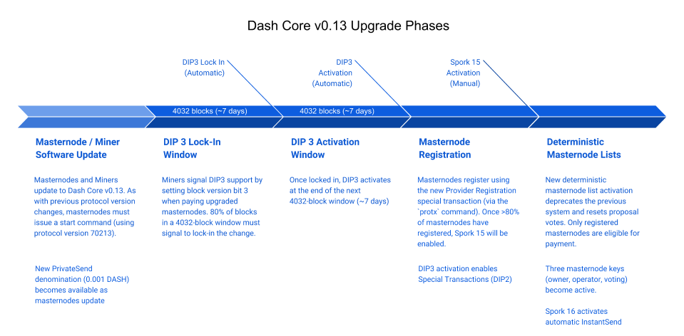

.. meta::
   :description: The upgrade to Dash 0.13.0 involves changes to signature formats as defined in DIP3. This documentation highlights the upgrade steps and progress.
   :keywords: dash, cryptocurrency, masternode, miners, pools, exchanges, wallets, maintenance, dip3, upgrade, deterministic, dmt

.. include:: <isopub.txt>

.. _dip3-dev-upgrade:

=============================
Dash 0.13 Upgrade Information
=============================

**Official binaries are available at** https://github.com/dashpay/dash/releases/tag/v0.13.3.0

Dash Core v0.13.0 is intended to serve as the foundation for Dash
Evolution, a broadly scoped update to our network intended to facilitate
and enable new payment methods and technologies. Please see the `Dash
Core v0.13.0 Product Brief <https://blog.dash.org/product-brief-dash-core-release-v0-13-0-5d7fddffb7ef>`__
for an overview of new features. The upgrade will take place in phases,
as shown in the following diagram:

Installation notes
==================

Dash Core v0.13.0.0 will automatically activate `DIP002
<https://github.com/dashpay/dips/blob/master/dip-0002.md>`__, `DIP003
<https://github.com/dashpay/dips/blob/master/dip-0003.md>`__ and `DIP004
<https://github.com/dashpay/dips/blob/master/dip-0004.md>`__ once 80% of
the network has upgraded. Mining pools must mine an upgraded block and
pay an upgraded masternode to successfully signal the upgrade in a
block, and 80% of blocks in a window must signal in order to lock in the
upgrade. Please confirm the status of network uptake before proceeding
as the upgrade path differs slightly depending on on your timing.

- Activation status can be tracked in the image below or at `this site 
  <http://178.254.23.111/~pub/Dash/Dash_Info.html>`__.

.. figure:: http://178.254.23.111/~pub/13_adoption.png

   Dash v0.13.0.0 adoption by miners

- Masternode upgrade status can be tracked at `Dash Ninja <https://www.dashninja.pl/masternodes.html>`__

- If you are updating to Dash Core v0.13.0.0 **prior** to this 80%
  threshold  you should be able to simply shut down the daemon and
  replace it with  the updated binary.

- If you are updating to Dash Core v0.13.0.0 **after** this 80%
  threshold is reached please note that you will need to re-index the
  chainstate using the “-reindex-chainstate” command.

Dependencies
============

Please note that Dash Core v0.13.0.0 requires a one-time upgrade to all
related software and libraries to ensure continued compatibility.

- `DIP002: Special Transactions <https://github.com/dashpay/dips/blob/master/dip-0002.md#compatibility>`__ 
  contains more information on backwards compatibility.

- Please refer to the `Transaction Type Integration Guide <https://github.com/dashpay/docs/raw/master/binary/integration/Integration-Resources-Dash-v0.13.0-Transaction-Types.pdf>`__ 
  for information on the implementation of Special Transactions and for
  examples of this new format.

- Contact the `Support Desk <https://support.dash.org/en/support/home>`__ 
  with any compatibility questions or for help upgrading.

Please see the official `Release Notes <https://github.com/dashpay/dash/blob/v0.13.0.0/doc/release-notes.md#rpc-changes>`__ 
for a complete listing of RPC improvements, in summary:

- **Mining:** ``getBlockTemplate`` now returns an array for masternode 
  payments instead of a single object.

- **InstantSend**: instantlock status is now included in
  ``getrawmempool``,   ``getmempoolancestors``, 
  ``getmempooldescendants``, ``getmempoolentry``, ``getrawtransaction``, 
  ``decoderawtransaction``, ``gettransaction``, ``listtransactions``, 
  ``listsinceblock``.

Libraries and APIs
==================

The following lists the current upgrade status for libraries:

+------------------------------------------------------------+---------------------+-----------+
| Name                                                       | Platform            | Upgraded? |
+============================================================+=====================+===========+
| `DashJ <https://github.com/dashevo/dashj>`__               | Android             |           |
+------------------------------------------------------------+---------------------+-----------+
| `Dash-Sync <https://github.com/dashevo/dashsync-iOS/>`__   | iOS                 | |check|   |
+------------------------------------------------------------+---------------------+-----------+
| `Dashcore-Lib <https://github.com/dashevo/dashcore-lib>`__ | JavaScript / NodeJS | |check|   |
+------------------------------------------------------------+---------------------+-----------+
| `NBitcoin <https://github.com/MetacoSA/NBitcoin>`__        | .Net                | |check|   |
+------------------------------------------------------------+---------------------+-----------+
| `Bitcoin-PHP <https://github.com/Bit-Wasp/bitcoin-php>`__  | PHP                 |           |
+------------------------------------------------------------+---------------------+-----------+
| `PyCoin <https://github.com/DeltaEngine/pycoin>`__         | Python              | |check|   |
+------------------------------------------------------------+---------------------+-----------+
 
.. The following lists the current upgrade status for APIs
