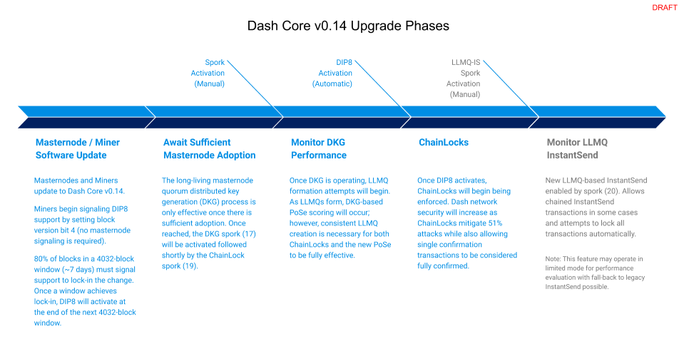

.. meta::
   :description: The upgrade to Dash 0.14.0 involves the introduction of Long-Living Masternode Quourums as defined in DIP8. This documentation highlights the upgrade steps and progress.
   :keywords: dash, cryptocurrency, masternode, miners, pools, exchanges, wallets, maintenance, dip8, upgrade

.. include:: <isopub.txt>

.. _dip8-dev-upgrade:

=============================
Dash 0.14 Upgrade Information
=============================

**Official binaries are available at** https://github.com/dashpay/dash/releases/tag/v0.14.0.5

Dash Core v0.14.0 is intended to serve as the foundation for Dash
Evolution, a broadly scoped update to our network intended to facilitate
and enable new payment methods and technologies. Please see the `Dash
Core v0.14.0 Product Brief <https://blog.dash.org/product-brief-dash-core-release-v0-14-0-now-on-testnet-8f5f4ad45c96>`__
for an overview of new features. The upgrade will take place in phases, as
shown in the following diagram:

Installation notes
==================

Dash Core v0.14.0.0 will automatically activate `DIP0008
<https://github.com/dashpay/dips/blob/master/dip-0008.md>`__ once 80% of
the network has upgraded. Mining pools must mine an upgraded block to
successfully signal the upgrade in a block, and 80% of blocks in a window
must signal in order to lock in the upgrade.

- Activation status can be tracked in the image below or at `this site
  <http://178.254.23.111/~pub/Dash/Dash_Info.html>`__.

.. figure:: http://178.254.23.111/~pub/14_adoption.png

   Dash v0.14.0.0 adoption by miners

- Masternode upgrade status can be tracked at `Dash Ninja <https://www.dashninja.pl/masternodes.html>`__

- If you are updating to Dash Core v0.14.0.0 from version 0.13.x you
  should be able to simply shut down the daemon and replace it with
  the updated binary.

- If you are updating to Dash Core v0.14.0.0 from version < 0.13 please
  note that you will also need to re-index the chainstate using the
  “-reindex-chainstate” command.

Dependencies
============

- `DIP0006: Long-Living Masternode Quorums <https://github.com/dashpay/dips/blob/master/dip-0006.md>`__
  contains more information on Long-Living Masternode Quorums.

- `DIP0007: LLMQ Signing Requests / Sessions <https://github.com/dashpay/dips/blob/master/dip-0007.md>`__
  contains more information on the signing request / session process
  that supports the use of LLMQs.

- `DIP0008: ChainLocks <https://github.com/dashpay/dips/blob/master/dip-0008.md>`__
  contains more information on ChainLocks.

- `DIP0010: LLMQ InstantSend <https://github.com/dashpay/dips/blob/master/dip-0010.md>`__
  contains more information on the updated LLMQ-based InstantSend system.

- Please refer to the `ChainLocks Integration Guide <https://github.com/dashpay/docs/blob/master/binary/integration/Integration-Resources-Dash-v0.14-ChainLocks.pdf>`__
  for information on the implementation of ChainLocks and for examples
  of this new format.

- Contact the `Support Desk <https://support.dash.org/en/support/home>`__
  with any compatibility questions or for help upgrading.

Please see the official `Release Notes <https://github.com/dashpay/dash/blob/v0.14.0.0/doc/release-notes.md#rpc-changes>`__
for a complete listing of RPC improvements, in summary:

- **ChainLocks**: chainlock status is now included in
  ``getrawtransaction``, ``decoderawtransaction``, ``gettransaction``,
  ``listtransactions``, ``listsinceblock``. ``getblock``
