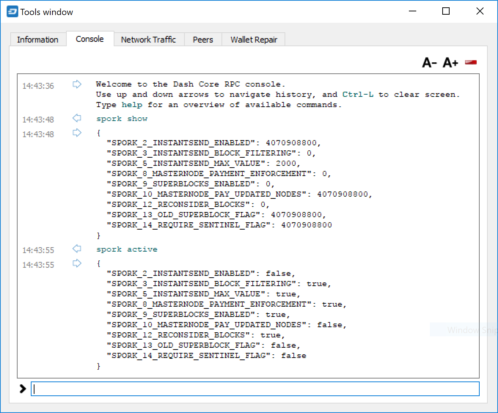

.. meta::
   :description: Developers guide and information about sporks and Dash version history
   :keywords: dash, developers, sporks, version history

.. _developers:

==========
Developers
==========

The `Dash Platform Developer Documentation <https://dashplatform.readme.io/>` 
contains technical documentation intended to help developers quickly and
easily get started with Dash Platform. The `Dash Core Developer
Documentation <https://dashcore.readme.io/>` provides detailed
documentation on the Dash Core code base, and serves as a reference for
experienced developers. These documentation portals can help developers
to quickly and efficiently integrate external applications with the Dash
ecosystem. Anyone can contribute to the documentation by suggesting
edits in the documentation system.

The Dash Core Team also maintains the `Dash Roadmap
<https://www.dash.org/roadmap/>`_, which sets out delivery milestones for
future releases of Dash and includes specific technical details
describing how the development team plans to realise each challenge. The
Dash Roadmap is complemented by the `Dash Improvement Proposals
<https://github.com/dashpay/dips>`_, which contain detailed technical
explanations of proposed changes to the Dash protocol itself.

The Dash community organise discussion and development of Dash apps
using the following resources:

- `Awesome Dash Platform <https://dashdevs.org/>`__
- `Dash Dapp Devs Discord <https://chat.dashdevs.org>`__
- `Dash Bounty Board <https://trello.com/invite/b/FPJzDcok/ea9fc798043d35d61aa8a5df0917cba7/dash-bounty-board>`__

The remaining sections available below describe practical steps to
carry out common development tasks in Dash.

.. toctree::
   :maxdepth: 1

   integration.rst
   dip3-upgrade.rst
   dip8-upgrade.rst
   v016-upgrade.rst
   translating.rst
   compiling.rst
   testnet.rst
   insight.rst

.. _understanding-sporks:

Sporks
======

A multi-phased fork, colloquially known as a "spork", is a mechanism
unique to Dash used to safely deploy new features to the network through
network-level variables to avoid the risk of unintended network forking
during upgrades. It can also be used to disable certain features if a
security vulnerability is discovered - see :ref:`here <sporks>` for a
brief introduction to sporks. This documentation describes the meaning
of each spork currently existing on the network, and how to check their
respective statuses.

Spork functions
---------------

Sporks are set using integer values. Many sporks may be set to a
particular epoch datetime (number of seconds that have elapsed since
January 1, 1970) to specify the time at which they will active. Enabled
sporks are set to 0 (seconds until activation). This function is often
used to set a spork enable date so far in the future that it is
effectively disabled until changed. The following sporks currently exist
on the network and serve functions as described below:

SPORK_2_INSTANTSEND_ENABLED
  Governs the ability of Dash clients to use InstantSend functionality.

SPORK_3_INSTANTSEND_BLOCK_FILTERING
  If enabled, masternodes will reject blocks containing transactions in
  conflict with locked but unconfirmed InstantSend transactions.

SPORK_6_NEW_SIGS
  Enables a new signature format for Dash-specific network messages
  introduced in Dash 12.3. For more information, see `here
  <https://github.com/dashpay/dash/pull/1936>`__ and `here
  <https://github.com/dashpay/dash/pull/1937>`__.

SPORK_9_SUPERBLOCKS_ENABLED
  If enabled, superblocks are verified and issued to pay proposal
  winners.

SPORK_15_DETERMINISTIC_MNS_ENABLED
  Controls whether `deterministic masternodes
  <https://github.com/dashpay/dips/blob/master/dip-0003.md>`_ are
  required. When activated, the legacy masternode list logic will no
  longer run and non-updated masternodes will not be eligible for
  payment.

SPORK_16_INSTANTSEND_AUTOLOCKS
  Enables automatic transaction locking for transactions with less than
  a specified number of inputs, and removes the legacy InstantSend fee.
  Allows any node to request the transaction lock, not just the sending
  node.

SPORK_17_QUORUM_DKG_ENABLED 
  Enables the `DKG process to create LLMQ quorums
  <https://github.com/dashpay/dips/blob/master/dip-0006.md>`_. This
  spork will be turned on once 80% masternodes are upgraded to v0.14,
  which will enable DKG and DKG-based PoSe.

SPORK_19_CHAINLOCKS_ENABLED
  Enables :ref:`ChainLocks <chainlocks>`, a mechanism of preventing the
  risk to payments introduced by blockchain reorganization events. 
  ChainLocks are described in `DIP0008 ChainLocks <https://github.com/dashpay/dips/blob/master/dip-0008.md>`__.

SPORK_20_INSTANTSEND_LLMQ_BASED
  When enabled, legacy InstantSend is superseded by LLMQ-based
  InstantSend, as described in `DIP0010 LLMQ-based InstantSend
  <https://github.com/dashpay/dips/blob/master/dip-0010.md>`__.

Viewing spork status
--------------------

The ``spork show`` and ``spork active`` commands issued in the debug
window (or from ``dash-cli`` on a masternode) allow you to interact with
sporks. You can open the debug window by selecting **Tools > Debug
console**.

   spork show and spork active output in the Dash Core debug console

Version History
===============

Full release notes and the version history of Dash are available here:

- https://github.com/dashpay/dash/blob/master/doc/release-notes.md
