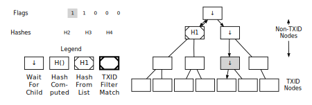

```{eval-rst}
.. meta::
  :title: Parsing a MerkleBlock
  :description: In this section we will parse a merkle block after having retrieved it from the network.
```

# Parsing a MerkleBlock

In the section above, we retrieved a [merkle block](../resources/glossary.md#merkle-block) from the network; now we will parse it. Most of the [block header](../resources/glossary.md#block-header) has been omitted. For a more complete hexdump, see the example in the [`merkleblock` message section](../reference/p2p-network-data-messages.md#merkleblock).

``` text
7f16c5962e8bd963659c793ce370d95f
093bc7e367117b3c30c1f8fdd0d97287 ... Merkle root

07000000 ........................... Transaction count: 7
04 ................................. Hash count: 4

3612262624047ee87660be1a707519a4
43b1c1ce3d248cbfc6c15870f6c5daa2 ... Hash #1
019f5b01d4195ecbc9398fbf3c3b1fa9
bb3183301d7a1fb3bd174fcfa40a2b65 ... Hash #2
41ed70551dd7e841883ab8f0b16bf041
76b7d1480e4f0af9f3d4c3595768d068 ... Hash #3
20d2a7bc994987302e5b1ac80fc425fe
25f8b63169ea78e68fbaaefa59379bbf ... Hash #4

01 ................................. Flag bytes: 1
1d ................................. Flags: 1 0 1 1 1 0 0 0
```

We parse the above [`merkleblock` message](../reference/p2p-network-data-messages.md#merkleblock) using the following instructions.  Each illustration is described in the paragraph below it.


We start by building the structure of a [merkle tree](../resources/glossary.md#merkle-tree) based on the number of [transactions](../resources/glossary.md#transaction) in the [block](../resources/glossary.md#block).


The first flag is a 1 and the [merkle root](../resources/glossary.md#merkle-root) is (as always) a non-TXID node, so we will need to compute the hash later based on this node's children. Accordingly, we descend into the merkle root's left child and look at the next flag for instructions.


The next flag in the example is a 0 and this is also a non-TXID node, so we apply the first hash from the [`merkleblock` message](../reference/p2p-network-data-messages.md#merkleblock) to this node. We also don't process any child nodes---according to the peer which created the [`merkleblock` message](../reference/p2p-network-data-messages.md#merkleblock), none of those nodes will lead to [TXIDs](../resources/glossary.md#transaction-identifiers) of transactions that match our filter, so we don't need them. We go back up to the merkle root and then descend into its right child and look at the next (third) flag for instructions.


The third flag in the example is another 1 on another non-TXID node, so we descend into its left child.



The fourth flag is also a 1 on another non-TXID node, so we descend again---we will always continue descending until we reach a TXID node or a non-TXID node with a 0 flag (or we finish filling out the tree).


Finally, on the fifth flag in the example (a 1), we reach a TXID node. The 1 flag indicates this TXID's transaction matches our filter and that we should take the next (second) hash and use it as this node's TXID.


The sixth flag also applies to a TXID, but it's a 0 flag, so this TXID's transaction doesn't match our filter; still, we take the next (third) hash and use it as this node's TXID.


We now have enough information to compute the hash for the fourth node we encountered---it's the hash of the concatenated hashes of the two TXIDs we filled out.


Moving to the right child of the third node we encountered, we fill it out using the seventh flag and final hash---and discover there are no more child nodes to process.


We hash as appropriate to fill out the tree.  Note that the eighth flag is not used---this is acceptable as it was required to pad out a flag byte.

The final steps would be to ensure the computed [merkle root](../resources/glossary.md#merkle-root) is identical to the merkle root in the [header](../resources/glossary.md#header) and check the other steps of the parsing checklist in the [`merkleblock` message](../reference/p2p-network-data-messages.md#merkleblock) section.
