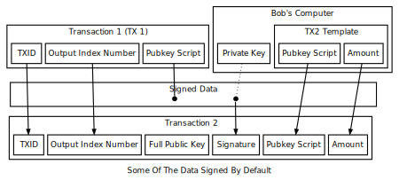

```{eval-rst}
.. meta::
  :title: Offline Signing
  :description: The example in this section demonstrates offline signing of a transaction, including spending an unconfirmed output, without sending it to the local node.
```

# Offline Signing

We will now spend the [transaction](../resources/glossary.md#transaction) created in the [Complex Raw Transaction subsection](../examples/transaction-tutorial-complex-raw-transaction.md) without sending it to the local [node](../resources/glossary.md#node) first. This is the same basic process used by [wallet](../resources/glossary.md#wallet) programs for offline signing---which generally means signing a transaction without access to the current UTXO set.

Offline signing is safe. However, in this example we will also be spending an [output](../resources/glossary.md#output) which is not part of the [block chain](../resources/glossary.md#block-chain) because the transaction containing it has never been broadcast. That can be unsafe:

:::{warning}
Transactions which spend outputs from unconfirmed transactions are vulnerable to transaction
malleability. Be sure to read about transaction malleability and adopt good practices before
spending unconfirmed transactions on mainnet.
:::

Put the previously signed (but not sent) transaction into a shell variable.

``` shell
OLD_SIGNED_RAW_TX=0100000002843d61e81058f0e682313b9e6f45ce67464b41fd8bb0\
f84678135aa56d596dea00000000494830450221009f7f356c0cc2d3337b5f76dfc6de9f\
9be7c8c5ac2074cbeeba4815b90329602002207790f23361480e2a5a2d1fa6e293ccd5cd\
01279ad301176f091b84d6dd8e8f6501ffffffff30d100f7762956100a2396403c60e13e\
7a13520167acc6d38978ec33ada44cf8000000006a47304402207867e88e3fe2c926df29\
376d77eba81daf9f4a557344d4f02e9c7dcee96a51e4022076274c2365dc069e7ef797c9\
5c75ab6e01ca3757342f3e6f21a3d9d01086efb7012102ff9005f79aa4c22ac48fa93d9b\
7f40f321db1c13cd70cf08bdab3e23c8d19620ffffffff02f04c3ba40b0000001976a914\
ec73fe6129b249617bb5f20c8760708055fb6fdb88ac00ca9a3b000000001976a914cb7a\
56b046479f8c247875d672d3e1aed18c33f488ac00000000
```

## 1. Decode signed transaction

Decode the signed [raw transaction](../resources/glossary.md#raw-transaction) so we can get its [TXID](../resources/glossary.md#transaction-identifiers). Also, choose a specific one of its UTXOs to spend and save that UTXO's [output index](../resources/glossary.md#output-index) number (vout) and hex [pubkey script](../resources/glossary.md#pubkey-script) (scriptPubKey) into shell variables.

``` shell
dash-cli -regtest decoderawtransaction $OLD_SIGNED_RAW_TX
```

``` json
{
  "txid": "5efd61cf24c9644d79646627c4d1e192e9b2a760a5c720db8f4a9f76cb781077",
  "size": 339,
  "version": 1,
  "locktime": 0,
  "vin": [
    {
      "txid": "ea6d596da55a137846f8b08bfd414b4667ce456f9e3b3182e6f05810e86\
                13d84",
      "vout": 0,
      "scriptSig": {
        "asm": "30450221009f7f356c0cc2d3337b5f76dfc6de9f9be7c8c5ac2074cbee\
                ba4815b90329602002207790f23361480e2a5a2d1fa6e293ccd5cd0127\
                9ad301176f091b84d6dd8e8f65[ALL]",
        "hex": "4830450221009f7f356c0cc2d3337b5f76dfc6de9f9be7c8c5ac2074cb\
                eeba4815b90329602002207790f23361480e2a5a2d1fa6e293ccd5cd01\
                279ad301176f091b84d6dd8e8f6501"
      },
      "sequence": 4294967295
    },
    {
      "txid": "f84ca4ad33ec7889d3c6ac670152137a3ee1603c4096230a10562976f70\
                0d130",
      "vout": 0,
      "scriptSig": {
        "asm": "304402207867e88e3fe2c926df29376d77eba81daf9f4a557344d4f02e\
                9c7dcee96a51e4022076274c2365dc069e7ef797c95c75ab6e01ca3757\
                342f3e6f21a3d9d01086efb7[ALL] 02ff9005f79aa4c22ac48fa93d9b\
                7f40f321db1c13cd70cf08bdab3e23c8d19620",
        "hex": "47304402207867e88e3fe2c926df29376d77eba81daf9f4a557344d4f0\
                2e9c7dcee96a51e4022076274c2365dc069e7ef797c95c75ab6e01ca37\
                57342f3e6f21a3d9d01086efb7012102ff9005f79aa4c22ac48fa93d9b\
                7f40f321db1c13cd70cf08bdab3e23c8d19620"
      },
      "sequence": 4294967295
    }
  ],
  "vout": [
    {
      "value": 499.99990000,
      "valueSat": 49999990000,
      "n": 0,
      "scriptPubKey": {
        "asm": "OP_DUP OP_HASH160 ec73fe6129b249617bb5f20c8760708055fb6fdb\
                OP_EQUALVERIFY OP_CHECKSIG",
        "hex": "76a914ec73fe6129b249617bb5f20c8760708055fb6fdb88ac",
        "reqSigs": 1,
        "type": "pubkeyhash",
        "addresses": [
          "yhshGrdbh3rWt9EPaSi7xSGRFMvFdzTZ8n"
        ]
      }
    },
    {
      "value": 10.00000000,
      "valueSat": 1000000000,
      "n": 1,
      "scriptPubKey": {
        "asm": "OP_DUP OP_HASH160 cb7a56b046479f8c247875d672d3e1aed18c33f4\
                OP_EQUALVERIFY OP_CHECKSIG",
        "hex": "76a914cb7a56b046479f8c247875d672d3e1aed18c33f488ac",
        "reqSigs": 1,
        "type": "pubkeyhash",
        "addresses": [
          "yesLaP5XFTaLZiWAo2zK8mFfUCtV8rRhKw"
        ]
      }
    }
  ]
}
```

``` bash

> UTXO_TXID=5efd61cf24c9644d79646627c4d1e192e9b2a760a5c720db8f4a9f76cb781077
> UTXO_VOUT=1
> UTXO_OUTPUT_SCRIPT=76a914cb7a56b046479f8c247875d672d3e1aed18c33f488ac
```

## 2. Get new address

Get a new [address](../resources/glossary.md#address) to spend the [duffs](../resources/glossary.md#duffs) to.

``` bash
> dash-cli -regtest getnewaddress
yfijhy7gYY34J2U77xFKdMwfA8k5mVnSRa

> NEW_ADDRESS=yfijhy7gYY34J2U77xFKdMwfA8k5mVnSRa
```

## 3. Create raw transaction

Create the raw transaction the same way we've done in the previous subsections.

``` bash
## Outputs - inputs = transaction fee, so always double-check your math!
> dash-cli -regtest createrawtransaction '''
    [
      {
        "txid": "'$UTXO_TXID'",
        "vout": '$UTXO_VOUT'
      }
    ]
    ''' '''
    {
      "'$NEW_ADDRESS'": 9.9999
    }'''
0100000001771078cb769f4a8fdb20c7a560a7b2e992e1d1c4276664794d64c9\
24cf61fd5e0100000000ffffffff01f0a29a3b000000001976a914d4d2078580\
a9eea0ca9368d1c99c097279b8081f88ac00000000

> RAW_TX=0100000001771078cb769f4a8fdb20c7a560a7b2e992e1d1c427666[...]
```

## 4. Sign raw transaction

Attempt to sign the [raw transaction](../resources/glossary.md#raw-transaction) without any special arguments, the way we successfully signed the the raw transaction in the [Simple Raw Transaction subsection](../examples/transaction-tutorial-simple-raw-transaction.md). If you've read the [Transaction section](../guide/transactions.md) of the guide, you may know why the call fails and leaves the raw transaction hex unchanged.



As illustrated above, the data that gets signed includes the [TXID](../resources/glossary.md#transaction-identifiers) and vout from the previous transaction.  That information is included in the `createrawtransaction` raw transaction.  But the data that gets signed also includes the [pubkey script](../resources/glossary.md#pubkey-script) from the previous transaction, even though it doesn't appear in either the unsigned or signed transaction.

In the other raw transaction subsections above, the previous [output](../resources/glossary.md#output) was part of the UTXO set known to the wallet, so the wallet was able to use the TXID and [output index](../resources/glossary.md#output-index) number to find the previous [pubkey script](../resources/glossary.md#pubkey-script) and insert it automatically.

### 4a. Without Pubkey Script

:::{note}
This step demonstrates the error returned when an unknown output is referenced.
:::

In this case, you're spending an [output](../resources/glossary.md#output) which is unknown to the wallet, so it can't automatically insert the previous pubkey script.

``` bash
> dash-cli -regtest signrawtransactionwithwallet $RAW_TX
```

``` json
{
  "hex": "0100000001771078cb769f4a8fdb20c7a560a7b2e992e1d1c4276664794d64c9\
          24cf61fd5e0100000000ffffffff01f0a29a3b000000001976a914d4d2078580\
          a9eea0ca9368d1c99c097279b8081f88ac00000000",
  "complete": false,
  "errors": [
    {
      "txid": "5efd61cf24c9644d79646627c4d1e192e9b2a760a5c720db8f4a9f76cb7\
                81077",
      "vout": 1,
      "scriptSig": "",
      "sequence": 4294967295,
      "error": "Input not found or already spent"
    }
  ]
}
```

### 4b. With Pubkey Script

Successfully sign the transaction by providing the previous pubkey script and other required input data.

This specific operation is typically what offline signing wallets do. The online wallet creates the raw transaction and gets the previous pubkey scripts for all the inputs. The user brings this information to the offline wallet. After displaying the transaction details to the user, the offline wallet signs the transaction as we did above. The user takes the signed transaction back to the online wallet, which broadcasts it.

``` bash
> dash-cli -regtest signrawtransactionwithwallet $RAW_TX '''
    [
      {
        "txid": "'$UTXO_TXID'",
        "vout": '$UTXO_VOUT',
        "scriptPubKey": "'$UTXO_OUTPUT_SCRIPT'"
      }
    ]'''
```

``` json
{
  "hex": "0100000001771078cb769f4a8fdb20c7a560a7b2e992e1d1c4276664794d64c9\
          24cf61fd5e010000006a47304402204ee3aae064dccedb511a84fcade3f35f2d\
          95119283e2e9f23659d91ce799cb6d02203a4cecbd7c154de8394b9505814f1e\
          c842e890980e7c4c20ed182f09a71d65f3012103b0b12fb25b6382b0680ce4b0\
          379bc201c4cbb391d3c0e171181f24c9a5df1468ffffffff01f0a29a3b000000\
          001976a914d4d2078580a9eea0ca9368d1c99c097279b8081f88ac00000000",
  "complete": true
}
```

``` bash

> SIGNED_RAW_TX=0100000001771078cb769f4a8fdb20c7a560a7b2e992e1d1[...]
```

## 5. Send raw transaction

### 5a. Second transaction

Attempt to broadcast the second transaction before we've broadcast the first transaction.  The [node](../resources/glossary.md#node) rejects this attempt because the second transaction spends an [output](../resources/glossary.md#output) which is not a UTXO the node knows about.

``` bash
> dash-cli -regtest sendrawtransaction $SIGNED_RAW_TX
```

``` bash
error code: -25
error message:
Missing inputs

error: {"code":-22,"message":"TX rejected"}
```

### 5b. First transaction

Broadcast the first transaction, which succeeds, and then broadcast the second transaction---which also now succeeds because the node now sees the UTXO.

``` bash
> dash-cli -regtest sendrawtransaction $OLD_SIGNED_RAW_TX
5efd61cf24c9644d79646627c4d1e192e9b2a760a5c720db8f4a9f76cb781077
> dash-cli -regtest sendrawtransaction $SIGNED_RAW_TX
f89deefb927fbd03c5acab194de2ba8f98ab160b9c4b3f57bde63073c4b5f060
```

## 6. Check mempool

We have once again not generated an additional block, so the transactions above have not yet become part of the regtest block chain.  However, they are part of the local node's memory pool.

``` bash
> dash-cli -regtest getrawmempool
```

``` json
[
  "f89deefb927fbd03c5acab194de2ba8f98ab160b9c4b3f57bde63073c4b5f060",
  "5efd61cf24c9644d79646627c4d1e192e9b2a760a5c720db8f4a9f76cb781077"
]
```

Remove old shell variables.

``` bash
> unset OLD_SIGNED_RAW_TX SIGNED_RAW_TX RAW_TX [...]
```
