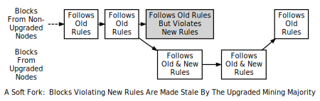

```{eval-rst}
.. meta::
  :title: Consensus Rule Changes
  :description: To preserve consensus, all Dash nodes validate blocks using the same conensus rules, which can occasionally be changed to add new features or prevent misuse.
```

# Consensus Rule Changes

To maintain [consensus](../resources/glossary.md#consensus), all full [nodes](../resources/glossary.md#node) validate [blocks](../resources/glossary.md#block) using the same [consensus rules](../resources/glossary.md#consensus-rules). However, sometimes the consensus rules are changed to introduce new features or prevent network abuse. When the new rules are implemented, there will likely be a period of time when non-upgraded nodes follow the old rules and upgraded nodes follow the new rules, creating two possible ways consensus can break:

1. A block following the new consensus rules is accepted by upgraded nodes but rejected by non-upgraded nodes. For example, a new transaction feature is used within a block: upgraded nodes understand the feature and accept it, but non-upgraded nodes reject it because it violates the old rules.

2. A block violating the new consensus rules is rejected by upgraded nodes but accepted by non-upgraded nodes. For example, an abusive transaction feature is used within a block: upgraded nodes reject it because it violates the new rules, but non-upgraded nodes accept it because it follows the old rules.

In the first case, rejection by non-upgraded nodes, mining software which gets [block chain](../resources/glossary.md#block-chain) data from those non-upgraded nodes refuses to build on the same chain as mining software getting data from upgraded nodes. This creates permanently divergent chains---one for non-upgraded nodes and one for upgraded nodes---called a [hard fork](../resources/glossary.md#hard-fork).


In the second case, rejection by upgraded nodes, it's possible to keep the block chain from permanently diverging if upgraded nodes control a majority of the hash rate. That's because, in this case, non-upgraded nodes will accept as valid all the same blocks as upgraded nodes, so the upgraded nodes can build a stronger chain that the non-upgraded nodes will accept as the best valid block chain. This is called a [soft fork](../resources/glossary.md#soft-fork).



Although a fork is an actual divergence in block chains, changes to the consensus rules are often described by their potential to create either a hard or soft fork. For example, "increasing the block size requires a hard fork." In this example, an actual block chain fork is not required---but it is a possible outcome.

Consensus rule changes may be activated in various ways. During Bitcoin's first two years, Satoshi Nakamoto performed several soft forks by just releasing the backwards-compatible change in a client that began immediately enforcing the new rule. Multiple soft forks such as [BIP30](https://github.com/bitcoin/bips/blob/master/bip-0030.mediawiki) have been activated via a flag day where the new rule began to be enforced at a preset time or block height. Such a fork activated via a flag day is known as a [User Activated Soft Fork](../resources/glossary.md#user-activated-soft-fork) (UASF) as it is dependent on having sufficient users (nodes) to enforce the new rules after the flag day.

Later soft forks waited for a majority of hash rate (typically 75% or 95%) to signal their readiness for enforcing the new consensus rules. Once the signaling threshold has been passed, all nodes will begin enforcing the new rules. Such a fork is known as a [Miner Activated Soft Fork](../resources/glossary.md#miner-activated-soft-fork) (MASF) as it is dependent on miners for activation.

**Resources:** [BIP16](https://github.com/bitcoin/bips/blob/master/bip-0016.mediawiki), [BIP30](https://github.com/bitcoin/bips/blob/master/bip-0030.mediawiki), and [BIP34](https://github.com/bitcoin/bips/blob/master/bip-0034.mediawiki) were implemented as changes which might have lead to soft forks. [BIP50](https://github.com/bitcoin/bips/blob/master/bip-0050.mediawiki) describes both an accidental hard fork, resolved by temporary downgrading the capabilities of upgraded nodes, and an intentional hard fork when the temporary downgrade was removed. A document from Gavin Andresen outlines [how future rule changes may be implemented](https://gist.github.com/gavinandresen/2355445).

## Detecting Forks

Non-upgraded nodes may use and distribute incorrect information during both types of forks, creating several situations which could lead to financial loss. In particular, non-upgraded nodes may relay and accept transactions that are considered invalid by upgraded nodes and so will never become part of the universally-recognized best block chain. Non-upgraded nodes may also refuse to relay blocks or transactions which have already been added to the best block chain, or soon will be, and so provide incomplete information.

Dash Core includes code that detects a hard fork by looking at block chain [proof of work](../resources/glossary.md#proof-of-work). If a non-upgraded node receives block chain headers demonstrating at least six blocks more proof of work than the best chain it considers valid, the node reports a warning in the [`getnetworkinfo` RPC](../api/remote-procedure-calls-network.md#getnetworkinfo) results and runs the `-alertnotify` command if set.  This warns the operator that the non-upgraded node can't switch to what is likely the best block chain.

Full nodes can also check block and [transaction version number](../resources/glossary.md#transaction-version-number). If the block or transaction version numbers seen in several recent blocks are higher than the version numbers the node uses, it can assume it doesn't use the current consensus rules. Dash Core reports this situation through the [`getnetworkinfo` RPC](../api/remote-procedure-calls-network.md#getnetworkinfo) and `-alertnotify` command if set.

In either case, block and transaction data should not be relied upon if it comes from a node that apparently isn't using the current consensus rules.

SPV clients which connect to full nodes can detect a likely hard fork by connecting to several full nodes and ensuring that they're all on the same chain with the same [block height](../resources/glossary.md#block-height), plus or minus several blocks to account for transmission delays and stale blocks.  If there's a divergence, the client can disconnect from nodes with weaker chains.

SPV clients should also monitor for block and transaction version number increases to ensure they process received transactions and create new transactions using the current consensus rules.
