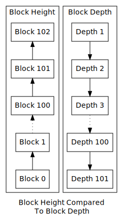

```{eval-rst}
.. meta::
  :title: Dash Full Node
  :description: A 'full node' is a computer in Dash's peer-to-peer network which hosts and synchronises a copy of the entire Dash blockchain.  
```

# Full Node

The first and most secure model is the one followed by Dash Core, also known as a “thick” or “full chain” client. This security model assures the validity of the [block chain](../resources/glossary.md#block-chain) by downloading and validating [blocks](../resources/glossary.md#block) from the [genesis block](../resources/glossary.md#genesis-block) all the way to the most recently discovered block. This is known as using the *height* of a particular block to verify the client’s view of the network.

For a client to be fooled, an adversary would need to give a complete alternative block chain history that is of greater difficulty than the current “true” chain, which is computationally expensive (if not impossible) due to the fact that the chain with the most cumulative [proof of work](../resources/glossary.md#proof-of-work) is by definition the "true" chain. Due to the computational difficulty required to generate a new block at the tip of the chain, the ability to fool a full node becomes very expensive after 6 [confirmations](../resources/glossary.md#confirmations). This form of verification is highly resistant to Sybil attacks---only a single honest [network](../resources/glossary.md#network) [peer](../resources/glossary.md#peer) is required in order to receive and verify the complete state of the "true" block chain.


