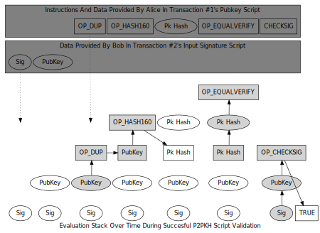

```{eval-rst}
.. meta::
  :title: P2PKH Script Validation
  :description: In a Dash P2PKH transaction, a spender’s signature script contains an secp256k1 signature (sig) and full public key (pubkey). Checkout the full structure in this section.
```

# P2PKH Script Validation

The validation procedure requires evaluation of the [signature script](../resources/glossary.md#signature-script) and [pubkey script](../resources/glossary.md#pubkey-script). In a [P2PKH](../resources/glossary.md#pay-to-pubkey-hash) [output](../resources/glossary.md#output), the pubkey script is:

```
OP_DUP OP_HASH160 <PubkeyHash> OP_EQUALVERIFY OP_CHECKSIG
```

The spender's signature script is evaluated and prefixed to the beginning of the script. In a P2PKH transaction, the signature script contains an secp256k1 signature (sig) and full public key (pubkey), creating the following concatenation:

```
<Sig> <PubKey> OP_DUP OP_HASH160 <PubkeyHash> OP_EQUALVERIFY OP_CHECKSIG
```

The script language is a [Forth-like](https://en.wikipedia.org/wiki/Forth_%28programming_language%29) stack-based language deliberately designed to be stateless and not Turing complete. Statelessness ensures that once a [transaction](../resources/glossary.md#transaction) is added to the [block chain](../resources/glossary.md#block-chain), there is no condition which renders it permanently unspendable. Turing-incompleteness (specifically, a lack of loops or gotos) makes the script language less flexible and more predictable, greatly simplifying the security model.

To test whether the transaction is valid, signature script and pubkey script operations are executed one item at a time, starting with Bob's signature script and continuing to the end of Alice's pubkey script. The figure below shows the evaluation of a standard P2PKH pubkey script; below the figure is a description of the process.



* The [signature](../resources/glossary.md#signature) (from Bob's signature script) is added (pushed) to an empty stack. Because it's just data, nothing is done except adding it to the stack. The [public key](../resources/glossary.md#public-key) (also from the signature script) is pushed on top of the signature.

* From Alice's pubkey script, the `OP_DUP` operation is executed. `OP_DUP` pushes onto the stack a copy of the data currently at the top of it---in this case creating a copy of the public key Bob provided.

* The operation executed next, `OP_HASH160`, pushes onto the stack a hash of the data currently on top of it---in this case, Bob's public key. This creates a hash of Bob's public key.

* Alice's pubkey script then pushes the pubkey hash that Bob gave her for the first transaction.  At this point, there should be two copies of Bob's pubkey hash at the top of the stack.

* Now it gets interesting: Alice's pubkey script executes `OP_EQUALVERIFY`. `OP_EQUALVERIFY` is equivalent to executing `OP_EQUAL` followed by `OP_VERIFY` (not shown).

    `OP_EQUAL` (not shown) checks the two values at the top of the stack; in this case, it checks whether the pubkey hash generated from the full public key Bob provided equals the pubkey hash Alice provided when she created transaction #1. `OP_EQUAL` pops (removes from the top of the stack) the two values it compared, and replaces them with the result of that comparison: zero (*false*) or one (*true*).

    `OP_VERIFY` (not shown) checks the value at the top of the stack. If the value is *false* it immediately terminates evaluation and the transaction validation fails. Otherwise it pops the *true* value off the stack.

* Finally, Alice's pubkey script executes `OP_CHECKSIG`, which checks the signature Bob provided against the now-authenticated public key he also provided. If the signature matches the public key and was generated using all of the data required to be signed, `OP_CHECKSIG` pushes the value *true* onto the top of the stack.

If *false* is not at the top of the stack after the pubkey script has been evaluated, the transaction is valid (provided there are no other problems with it).
