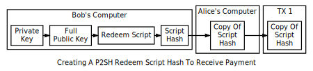
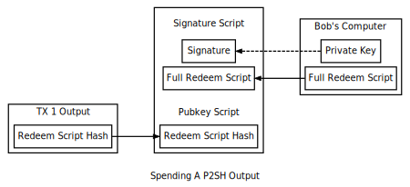

```{eval-rst}
.. meta::
  :title: P2SH Scripts
  :description: P2SH (Pay-to-Script-Hash) is a Dash transaction type that enhances flexibility in script creation and execution.
```

# P2SH Scripts

Pubkey scripts are created by spenders who have little interest what that script does. Receivers do care about the script conditions and, if they want, they can ask spenders to use a particular [pubkey script](../resources/glossary.md#pubkey-script). Unfortunately, custom pubkey scripts are less convenient than short Dash [addresses](../resources/glossary.md#address) and there was no standard way to communicate them between programs prior to widespread implementation of the BIP70 Payment Protocol discussed later.

To solve these problems, pay-to-script-hash ([P2SH](../resources/glossary.md#pay-to-script-hash)) transactions were created in 2012 to let a spender create a pubkey script containing a hash of a second script, the [redeem script](../resources/glossary.md#redeem-script).

The basic P2SH workflow, illustrated below, looks almost identical to the [P2PKH](../resources/glossary.md#pay-to-pubkey-hash) workflow. Bob creates a redeem script with whatever script he wants, hashes the redeem script, and provides the [redeem script](../resources/glossary.md#redeem-script) hash to Alice. Alice creates a P2SH-style [output](../resources/glossary.md#output) containing Bob's redeem script hash.



When Bob wants to spend the [output](../resources/glossary.md#output), he provides his [signature](../resources/glossary.md#signature) along with the full (serialized) redeem script in the [signature script](../resources/glossary.md#signature-script). The peer-to-peer [network](../resources/glossary.md#network) ensures the full redeem script hashes to the same value as the script hash Alice put in her output; it then processes the redeem script exactly as it would if it were the primary pubkey script, letting Bob spend the output if the redeem script does not return false.



The hash of the redeem script has the same properties as a pubkey hash---so it can be transformed into the standard Dash address format with only one small change to differentiate it from a standard address. This makes collecting a P2SH-style address as simple as collecting a P2PKH-style address. The hash also obfuscates any public keys in the redeem script, so P2SH scripts are as secure as P2PKH pubkey hashes.
