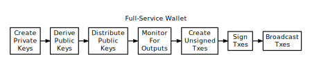
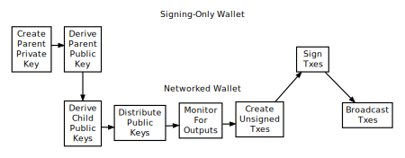
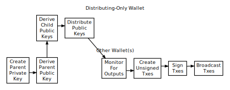

```{eval-rst}
.. meta::
  :title: Dash Wallet Programs
  :description: Dash wallet programs consist of three essential components: public key distribution, transaction signing, and network interaction.
```

# Wallet Programs

Permitting receiving and spending of [duffs](../resources/glossary.md#duffs) is the only essential feature of [wallet](../resources/glossary.md#wallet) software---but a particular wallet program doesn't need to do both things.  Two wallet programs can work together, one program distributing [public keys](../resources/glossary.md#public-key) in order to receive duffs and another program signing [transactions](../resources/glossary.md#transaction) spending those duffs.

Wallet programs also need to interact with the peer-to-peer [network](../resources/glossary.md#network) to get information from the [block chain](../resources/glossary.md#block-chain) and to broadcast new transactions. However, the programs which distribute public keys or sign transactions don't need to interact with the peer-to-peer network themselves.

This leaves us with three necessary, but separable, parts of a wallet system: a public key distribution program, a signing program, and a networked program.  In the subsections below, we will describe common combinations of these parts.

:::{note}
We speak about distributing public keys generically. In many cases, P2PKH or P2SH hashes will be distributed instead of public keys, with the actual public keys only being distributed when the outputs they control are spent.
:::

## Full-Service Wallets

The simplest wallet is a program which performs all three functions: it generates [private keys](../resources/glossary.md#private-key), derives the corresponding [public keys](../resources/glossary.md#public-key), helps distribute those public keys as necessary, monitors for outputs spent to those public keys, creates and signs transactions spending those outputs, and broadcasts the signed transactions.



As of this writing, almost all popular wallets can be used as full-service wallets.

The main advantage of full-service wallets is that they are easy to use. A single program does everything the user needs to receive and spend duffs.

The main disadvantage of full-service wallets is that they store the private keys on a device connected to the Internet.  The compromise of such devices is a common occurrence, and an Internet connection makes it easy to transmit private keys from a compromised device to an attacker.

To help protect against theft, many wallet programs offer users the option of encrypting the wallet files which contain the private keys. This protects the private keys when they aren't being used, but it cannot protect against an attack designed to capture the encryption key or to read the decrypted keys from memory.

## Signing-Only Wallets

To increase security, private keys can be generated and stored by a separate wallet program operating in a more secure environment. These signing-only wallets work in conjunction with a networked wallet which interacts with the peer-to-peer network.

Signing-only wallets programs typically use deterministic key creation (described in a [later subsection](../guide/wallets-wallet-files.md#hierarchical-deterministic-key-creation)) to create parent private and public keys which can create child private and public keys.



When first run, the signing-only wallet creates a [parent private key](../resources/glossary.md#parent-private-key) and transfers the corresponding [parent public key](../resources/glossary.md#parent-public-key) to the networked wallet.

The networked wallet uses the parent public key to derive each [child public key](../resources/glossary.md#child-public-key), optionally helps distribute them, monitors for outputs spent to those public keys, creates unsigned transactions spending those outputs, and transfers the unsigned transactions to the signing-only wallet.

Often, users are given a chance to review the unsigned transactions' details (particularly the output details) using the signing-only wallet.

After the optional review step, the signing-only wallet uses the parent private key to derive each appropriate [child private key](../resources/glossary.md#child-private-key) and signs the transactions, giving the signed transactions back to the networked wallet.

The networked wallet then broadcasts the signed transactions to the peer-to-peer [network](../resources/glossary.md#network).

The following subsections describe the two most common variants of signing-only wallets: offline wallets and hardware wallets.

### Offline Wallets

Several full-service wallets programs will also operate as two separate wallets: one program instance acting as a signing-only wallet (often called an "offline wallet") and the other program instance acting as the networked wallet (often called an "online wallet" or "watching-only wallet").

The offline wallet is so named because it is intended to be run on a device which does not connect to any network, greatly reducing the number of attack vectors. If this is the case, it is usually up to the user to handle all data transfer using removable media such as USB drives.  The user's workflow is something like:

1. (Offline) Disable all network connections on a device and install the wallet software. Start the wallet software in offline mode to create the parent private and public keys.  Copy the parent public key to removable media.

2. (Online) Install the wallet software on another device, this one connected to the Internet, and import the parent public key from the removable media. As you would with a full-service wallet, distribute public keys to receive payment. When ready to spend duffs, fill in the output details and save the unsigned transaction generated by the wallet to removable media.

3. (Offline) Open the unsigned transaction in the offline instance, review the output details to make sure they spend the correct amount to the correct address. This prevents malware on the online wallet from tricking the user into signing a transaction which pays an attacker. After review, sign the transaction and save it to removable media.

4. (Online) Open the signed transaction in the online instance so it can broadcast it to the peer-to-peer network.

The primary advantage of offline wallets is their possibility for greatly improved security over full-service wallets.  As long as the offline wallet is not compromised (or flawed) and the user reviews all outgoing transactions before signing, the user's duffs are safe even if the online wallet is compromised.

The primary disadvantage of offline wallets is hassle. For maximum security, they require the user dedicate a device to only offline tasks. The offline device must be booted up whenever funds are to be spent, and the user must physically copy data from the online device to the offline device and back.

### Hardware Wallets

Hardware wallets are devices dedicated to running a signing-only wallet. Their dedication lets them eliminate many of the vulnerabilities present in operating systems designed for general use, allowing them to safely communicate directly with other devices so users don't need to transfer data manually.  The user's workflow is something like:

1. (Hardware) Create parent private and public keys. Connect hardware wallet to a networked device so it can get the parent public key.

2. (Networked) As you would with a full-service wallet, distribute public keys to receive payment. When ready to spend duffs, fill in the transaction details, connect the hardware wallet, and click Spend.  The networked wallet will automatically send the transaction details to the hardware wallet.

3. (Hardware) Review the transaction details on the hardware wallet's screen. Some hardware wallets may prompt for a passphrase or PIN number. The hardware wallet signs the transaction and uploads it to the networked wallet.

4. (Networked) The networked wallet receives the signed transaction from the hardware wallet and broadcasts it to the network.

The primary advantage of hardware wallets is their possibility for greatly improved security over full-service wallets with much less hassle than offline wallets.

The primary disadvantage of hardware wallets is their hassle. Even though the hassle is less than that of offline wallets, the user must still purchase a hardware wallet device and carry it with them whenever they need to make a transaction using the signing-only wallet. An additional disadvantage is that not all wallet programs support hardware wallets.

## Distributing-Only Wallets

Wallet programs which run in difficult-to-secure environments, such as webservers, can be designed to distribute public keys (including P2PKH or P2SH addresses) and nothing more.  There are two common ways to design these minimalist wallets:



* Pre-populate a database with a number of public keys or addresses, and then distribute on request a pubkey script or address using one of the database entries. To [avoid key reuse](../guide/transactions-avoiding-key-reuse.md), webservers should keep track of used keys and never run out of public keys. This can be made easier by using parent public keys as suggested in the next method.

* Use a parent public key to create child public keys. To avoid key reuse, a method must be used to ensure the same public key isn't distributed twice. This can be a database entry for each key distributed or an incrementing pointer to the key index number.

Neither method adds a significant amount of overhead, especially if a database is used anyway to associate each incoming payment with a separate public key for payment tracking.
