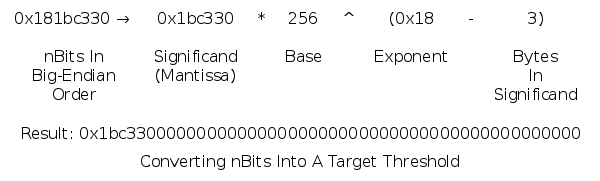
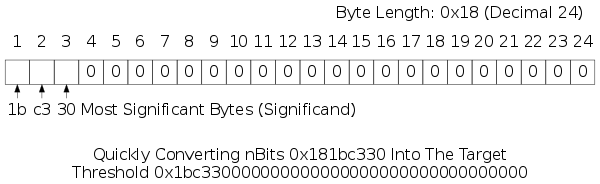

```{eval-rst}
.. meta::
  :title: Dash Block Headers
  :description: Describes the structure of Dash block headers and provides related details on block versions, merkle trees, and mining difficulty.
```

# Block Headers

[Block headers](../resources/glossary.md#block-header) are serialized in the 80-byte format described below and then hashed as part of the proof-of-work algorithm, making the serialized header format part of the [consensus rules](../resources/glossary.md#consensus-rules).

| Bytes | Name                | Data Type | Description
|-------|---------------------|-----------|----------------
| 4     | version             |  int32_t  | The [block](../resources/glossary.md#block) version number indicates which set of block validation rules to follow. See the list of block versions below.
| 32    | previous block header hash | char[32]  | An X11() hash in internal byte order of the previous block's header.  This ensures no previous block can be changed without also changing this block's header.
| 32    | merkle root hash    | char[32]  | A SHA256(SHA256()) hash in internal byte order. The merkle root is derived from the hashes of all transactions included in this block, ensuring that none of those transactions can be modified without modifying the header.  See the [merkle trees section](#merkle-trees) below.
| 4     | time                | uint32_t  | The block time is a Unix epoch time when the miner started hashing the header (according to the miner).  Must be strictly greater than the median time of the previous 11 blocks.  Full nodes will not accept blocks with headers more than two hours in the future according to their clock.
| 4     | nBits               | uint32_t  | An encoded version of the target threshold this block's header hash must be less than or equal to.  See the nBits format described below.
| 4     | nonce               | uint32_t  | An arbitrary number miners change to modify the header hash in order to produce a hash less than or equal to the target threshold.  If all 32-bit values are tested, the time can be updated or the coinbase transaction can be changed and the merkle root updated.

The hashes are in [internal byte order](../resources/glossary.md#internal-byte-order); the other values are all in little-endian order.

An example [header](../resources/glossary.md#header) in hex:

``` text
02000000 ........................... Block version: 2

b6ff0b1b1680a2862a30ca44d346d9e8
910d334beb48ca0c0000000000000000 ... Hash of previous block's header
9d10aa52ee949386ca9385695f04ede2
70dda20810decd12bc9b048aaab31471 ... Merkle root

24d95a54 ........................... Unix time: 1415239972
30c31b18 ........................... Target: 0x1bc330 * 256**(0x18-3)
fe9f0864 ........................... Nonce
```

## Block Versions

* **Version 1** was used by Dash for the [genesis block](../resources/glossary.md#genesis-block) only.

* **Version 2** was introduced with the first block following the [genesis block](../resources/glossary.md#genesis-block) (January 2014). As described in [BIP34](https://github.com/bitcoin/bips/blob/master/bip-0034.mediawiki), valid version 2 blocks require a [block height](../resources/glossary.md#block-height) parameter in the coinbase.

* **Version 3** blocks were introduced in Dash Core 0.11.2 (March 2015) as a
  soft fork (Block 244,834 was the first version 3 block).

  When the [fork](../resources/glossary.md#fork) reached full enforcement, it required strict [DER encoding](https://en.wikipedia.org/wiki/X.690#DER_encoding) of all [ECDSA signatures](../resources/glossary.md#ecdsa-signatures) in new blocks as described in [BIP66](https://github.com/bitcoin/bips/blob/master/bip-0066.mediawiki). Transactions that do not use strict DER encoding had previously been non-standard since Dash Core 0.8.0.

* **Version 4** blocks specified in [BIP65](https://github.com/bitcoin/bips/blob/master/bip-0065.mediawiki) and introduced in Bitcoin Core 0.11.2 (November 2015) as a [soft fork](../resources/glossary.md#soft-fork) became active in December 2015.  These blocks now support the new `OP_CHECKLOCKTIMEVERIFY` [opcode](../resources/glossary.md#opcode) described in that BIP.

The mechanism used for the version 2, 3, and 4 upgrades is commonly called IsSuperMajority() after the function added to Dash Core to manage those soft forking changes. See [BIP34](https://github.com/bitcoin/bips/blob/master/bip-0034.mediawiki) for a full description of this method.

As of this writing, a newer method called *version bits* is being designed to manage future soft forking changes, although it's not known whether version 4 will be the last soft fork to use the IsSuperMajority() function. Draft [BIP9](https://github.com/bitcoin/bips/blob/master/bip-0009.mediawiki) describes the version bits design as of this writing, although it is still being actively edited and may substantially change while in the draft state.

## Merkle Trees

The [merkle root](../resources/glossary.md#merkle-root) is constructed using all the [TXIDs](../resources/glossary.md#transaction-identifiers) of transactions in this block, but first the TXIDs are placed in order as required by the [consensus rules](../resources/glossary.md#consensus-rules):

* The [coinbase transaction](../resources/glossary.md#coinbase-transaction)'s [TXID](../resources/glossary.md#transaction-identifiers) is always placed first.

* Any [input](../resources/glossary.md#input) within this block can spend an [output](../resources/glossary.md#output) which also appears in this block (assuming the spend is otherwise valid). However, the TXID corresponding to the output must be placed at some point before the TXID corresponding to the input. This ensures that any program parsing block chain transactions linearly will encounter each output before it is used as an input.

If a [block](../resources/glossary.md#block) only has a coinbase transaction, the coinbase TXID is used as the merkle root hash.

If a block only has a coinbase transaction and one other transaction, the TXIDs of those two transactions are placed in order, concatenated as 64 raw bytes, and then SHA256(SHA256()) hashed together to form the merkle root.

If a block has three or more transactions, intermediate [merkle tree](../resources/glossary.md#merkle-tree) rows are formed. The TXIDs are placed in order and paired, starting with the coinbase transaction's TXID. Each pair is concatenated together as 64 raw bytes and SHA256(SHA256()) hashed to form a second row of hashes. If there are an odd (non-even) number of TXIDs, the last TXID is concatenated with a copy of itself and hashed. If there are more than two hashes in the second row, the process is repeated to create a third row (and, if necessary, repeated further to create additional rows). Once a row is obtained with only two hashes, those hashes are concatenated and hashed to produce the merkle root.


TXIDs and intermediate hashes are always in [internal byte order](../resources/glossary.md#internal-byte-order) when they're concatenated, and the resulting merkle root is also in internal byte order when it's placed in the [block header](../resources/glossary.md#block-header).

## Target nBits

The [target threshold](../resources/glossary.md#target) is a 256-bit unsigned integer which a [header](../resources/glossary.md#header) hash must be equal to or below in order for that header to be a valid part of the [block chain](../resources/glossary.md#block-chain). However, the header field *[nBits](../resources/glossary.md#nbits)* provides only 32 bits of space, so the [target](../resources/glossary.md#target) number uses a less precise format called "compact" which works like a base-256 version of scientific notation:



As a base-256 number, nBits can be quickly parsed as bytes the same way you might parse a decimal number in base-10 scientific notation:



Although the target threshold should be an unsigned integer, the original nBits implementation inherits properties from a signed data class, allowing the target threshold to be negative if the high bit of the significand is set. This is useless---the header hash is treated as an unsigned number, so it can never be equal to or lower than a negative target threshold. Dash Core deals with this in two ways:

* When parsing nBits, Dash Core converts a negative target threshold into a target of zero, which the header hash can equal (in theory, at least).

* When creating a value for nBits, Dash Core checks to see if it will produce an nBits which will be interpreted as negative; if so, it divides the significand by 256 and increases the exponent by 1 to   produce the same number with a different encoding.

Some examples taken from the Dash Core test cases:

| nBits      |  Target          | Notes
|------------|------------------|----------------
| 0x01003456 | &nbsp;0x00       |
| 0x01123456 | &nbsp;0x12       |
| 0x02008000 | &nbsp;0x80       |
| 0x05009234 | &nbsp;0x92340000 |
| 0x04923456 | -0x12345600      | High bit set (0x80 in 0x92).
| 0x04123456 | &nbsp;0x12345600 | Inverse of above; no high bit.

Difficulty 1, the minimum allowed [difficulty](../resources/glossary.md#difficulty), is represented on [mainnet](../resources/glossary.md#mainnet) and the current [testnet](../resources/glossary.md#testnet) by the nBits value 0x1e0ffff0. Regtest mode uses a different difficulty 1 value---0x207fffff, the highest possible value below uint32_max which can be encoded; this allows near-instant building of blocks in [regression test mode](../resources/glossary.md#regression-test-mode).
