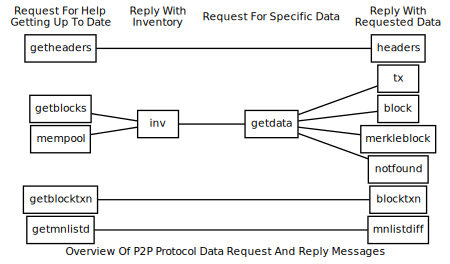
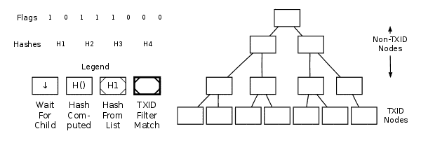
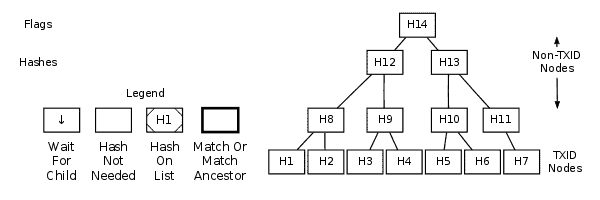

```{eval-rst}
.. meta::
  :title: Data Messages
  :description: Network messages related to transactions and blocks utilize inventories as unique identifiers, which have a simple 36-byte structure.
```

# Data Messages

The following network messages all request or provide data related to transactions and blocks.



Many of the data messages use [inventories](../resources/glossary.md#inventory) as unique identifiers for [transactions](../resources/glossary.md#transaction) and [blocks](../resources/glossary.md#block).  Inventories have a simple 36-byte structure:

| Bytes | Name            | Data Type | Description
|-------|-----------------|-----------|-------------
| 4     | type identifier | uint32_t  | The type of object which was hashed.  See list of type identifiers below.
| 32    | hash            | char[32]  | SHA256(SHA256()) hash of the object in internal byte order.

The currently-available type identifiers are:

| Type Identifier | Name                            | Description
|-----------------|---------------------------------|------------
| 1               | MSG_TX                          | The hash is a TXID.
| 2               | MSG_BLOCK                       | The hash is of a block header.
| 3               | MSG_FILTERED_BLOCK              | The hash is of a block header; identical to `MSG_BLOCK`. When used in a [`getdata` message](../reference/p2p-network-data-messages.md#getdata), this indicates the response should be a [`merkleblock` message](../reference/p2p-network-data-messages.md#merkleblock) rather than a [`block` message](../reference/p2p-network-data-messages.md#block) (but this only works if a bloom filter was previously configured).  **Only for use in [`getdata` messages](../reference/p2p-network-data-messages.md#getdata).**
| 6               | MSG_SPORK                       | The hash is Spork ID.
| 16              | MSG_DSTX                        | The hash is CoinJoin Broadcast TX.
| 17              | MSG_GOVERNANCE_OBJECT           | The hash is a Governance Object.
| 18              | MSG_GOVERNANCE_OBJECT_VOTE      | The hash is a Governance Object Vote.
| 20              | MSG_CMPCT_BLOCK                 | The hash is of a block header; identical to `MSG_BLOCK`. When used in a [`getdata` message](../reference/p2p-network-data-messages.md#getdata), this indicates the response should be a [`cmpctblock` message](../reference/p2p-network-data-messages.md#cmpctblock). **Only for use in [`getdata` messages](../reference/p2p-network-data-messages.md#getdata).**
| 21              | MSG_QUORUM_FINAL_COMMITMENT     | The hash is a long-living masternode quorum final commitment.<br>_Added in 0.13.0_
| 23              | MSG_QUORUM_CONTRIB              | The hash is a long-living masternode quorum contribution.<br>_Added in 0.14.0_
| 24              | MSG_QUORUM_COMPLAINT            | The hash is a long-living masternode quorum complaint.<br>_Added in 0.14.0_
| 25              | MSG_QUORUM_JUSTIFICATION        | The hash is a long-living masternode quorum justification.<br>_Added in 0.14.0_
| 26              | MSG_QUORUM_PREMATURE_COMMITMENT | The hash is a long-living masternode quorum premature commitment.<br>_Added in 0.14.0_
| 28              | MSG_QUORUM_RECOVERED_SIG        | The hash is a long-living masternode quorum recovered signature. <br><br>**Note**: Only relayed to other masternodes in the same quorum and nodes that have sent a [`qwatch` message](../reference/p2p-network-quorum-messages.md#qwatch) as of Dash Core 0.17.0<br>_Added in 0.14.0_
| 29              | MSG_CLSIG                       | The hash is a ChainLock signature.<br>_Added in 0.14.0_
| 31              | MSG_ISDLOCK                     | The hash is an LLMQ-based deterministic InstantSend lock ([DIP22](https://github.com/dashpay/dips/blob/master/dip-0022.md)).<br>_Added in 18.0_
| 32              | MSG_DSQ                         | The hash of a CoinJoin [dsq message](./p2p-network-privatesend-messages.md#dsq).<br>**Added in 22.0.0**

**Deprecated Type Identifiers**

The following type identifiers have been deprecated recently. To see type identifiers removed longer ago, please see the [previous version of documentation](https://docs.dash.org/projects/core/en/19.0.0/docs/reference/p2p-network-data-messages.html).

| Type Identifier | Name                            | Description
|-----------------|---------------------------------|------------
| 4               | MSG_LEGACY_TXLOCK_REQUEST       | **Deprecated in 20.0.0**<br>`MSG_TXLOCK_REQUEST` prior to Dash Core 0.15.0. The hash is an InstantSend transaction lock request. Transactions received this way are automatically converted to a standard [`tx` message](../reference/p2p-network-data-messages.md#tx) as of Dash Core 0.15.0.
| 5               | MSG_TXLOCK_VOTE                 | **Deprecated in 0.15.0**<br>The hash is an InstantSend transaction vote.
| 30              | MSG_ISLOCK                      | **Deprecated in 20.1.0**<br>The hash is an LLMQ-based InstantSend lock ([DIP10](https://github.com/dashpay/dips/blob/master/dip-0010.md)).<br>_Added in 0.14.0_

Type identifier zero and type identifiers greater than those shown in the table above are reserved for future implementations. Dash Core ignores all inventories with one of these unknown types.

## block

The [`block` message](../reference/p2p-network-data-messages.md#block) transmits a single [serialized block](../resources/glossary.md#serialized-block) in the format described in the [serialized blocks section](../reference/block-chain-serialized-blocks.md). See that section for an example hexdump.  It can be sent for two different reasons:

1. **GetData Response:** Nodes will always send it in response to a [`getdata` message](../reference/p2p-network-data-messages.md#getdata) that requests the block with an [inventory](../resources/glossary.md#inventory) type of `MSG_BLOCK` (provided the node has that block available for relay).

2. **Unsolicited:** Some miners will send unsolicited [`block` messages](../reference/p2p-network-data-messages.md#block) broadcasting their newly-mined blocks to all of their [peers](../resources/glossary.md#peer). Many [mining](../resources/glossary.md#mining) pools do the same thing, although some may be misconfigured to send the block from multiple nodes, possibly sending the same block to some peers more than once.

## blocktxn

_Added in protocol version 70209 of Dash Core as described by BIP152_

The [`blocktxn` message](../reference/p2p-network-data-messages.md#blocktxn) sends requested [block](../resources/glossary.md#block) [transactions](../resources/glossary.md#transaction) to a node which previously requested them with a [`getblocktxn` message](../reference/p2p-network-data-messages.md#getblocktxn). It is defined as a message containing a serialized `BlockTransactions` message.

Upon receipt of a properly-formatted requested [`blocktxn` message](../reference/p2p-network-data-messages.md#blocktxn), [nodes](../resources/glossary.md#node) should:

1. Attempt to reconstruct the full block by taking the prefilledtxn transactions from the original [`cmpctblock` message](../reference/p2p-network-data-messages.md#cmpctblock) and placing them in the marked positions
2. For each short transaction ID from the original [`cmpctblock` message](../reference/p2p-network-data-messages.md#cmpctblock), in order, find the corresponding transaction (from either the [`blocktxn` message](../reference/p2p-network-data-messages.md#blocktxn) or from other sources)
3. Place each short transaction ID in the first available position in the block
4. Once the block has been reconstructed, it shall be processed as normal.

**Short transaction IDs are expected to occasionally collide. Nodes must not be penalized for such collisions.**

The structure of `BlockTransactions` is defined below.

| Bytes    | Name                 | Data Type            | Encoding | Description|
|----------|----------------------|----------------------|----------|------------|
| 32       | blockhash            | Binary blob          | The output from a double-SHA256 of the block header, as used elsewhere | The blockhash of the block which the transactions being provided are in
| 1 or 3   | transactions<br>_length | CompactSize          | As used to encode array lengths elsewhere | The number of transactions provided
| _Varies_ | transactions         | List of transactions | As encoded in [`tx` messages](../reference/p2p-network-data-messages.md#tx) in response to `getdata MSG_TX` | The transactions provided

The following annotated hexdump shows a [`blocktxn` message](../reference/p2p-network-data-messages.md#blocktxn).  (The message header has been omitted.)

``` text
182327cb727da7d60541da793831fd0ab0509e79c8cd
3d654cdf3a0100000000 ....................... Block Hash

01 ......................................... Transactions Provided: 1

Transaction(s)
| Transaction 1
| | 01000000 ................................ Transaction Version: 1
| | 01 ...................................... Input count: 1
| |
| | Transaction input #1
| | |
| | | 0952617a516d956e2ecee71a6adc249f
| | | 4bb757adcc409452ab98c8e55c31e62a ..... Outpoint TXID
| | | 00000000 ............................. Outpoint index number: 0
| | |
| | | 6b ................................... Bytes in sig. script: 107
| | | 483045022100d10edf447252e1e69ff1
| | | 77330bb2c889a50be02e00cc5d79c0d0
| | | 79ae56518fc40220245d36905dc950fc
| | | d55694cfde8cde3109dc80b12aca3a6e
| | | 332033802ee36e1b01210272cc6e7660
| | | 2648831d8e80fca8eb24369cd0f23ff0
| | | 79cf20ae9d9beee05de6db ............... Secp256k1 signature
| | |
| | | ffffffff ............................. Sequence number: UINT32_MAX
| |
| | 02 ..................................... Number of outputs: 02
| |
| | Transaction output #1
| | | 0be0f50500000000 ..................... Duffs (0.99999755 Dash)
| | |
| | | 19 ................................... Bytes in pubkey script: 25
| | | | 76 ................................. OP_DUP
| | | | a9 ................................. OP_HASH160
| | | | 14 ................................. Push 20 bytes as data
| | | | | 923d91ed359f650eec6ea8b9030b340d
| | | | | ea63d590 ......................... PubKey hash
| | | | 88 ................................. OP_EQUALVERIFY
| | | | ac ................................. OP_CHECKSIG
| |
| | [...] .................................. 1 more tx output omitted
| |
| | 00000000 ............................... locktime: 0 (a block height)
```

## cfcheckpt

*Added in protocol version 70223 of Dash Core as described by [BIP 157](https://github.com/bitcoin/bips/blob/master/bip-0157.mediawiki).*

The [`cfcheckpt` message](../reference/p2p-network-data-messages.md#cfcheckpt)  is sent in response to the [`getcfcheckpt` message](../reference/p2p-network-data-messages.md#getcfcheckpt).  The filter headers included are the set of all filter headers on the requested chain where the height is a positive multiple of 1,000.

| Bytes    | Name                 | Data Type        | Description
|----------|----------------------|------------------|----------------
| 1 | filter_type | uint8_t | Filter type for which headers are requested. Should match the field in the [`getcfcheckpt` message](../reference/p2p-network-data-messages.md#getcfcheckpt) being responded to.
| 32 | stop_hash | uint256 | The hash of the last block in the requested range. Should match the field in the [`getcfcheckpt` message](../reference/p2p-network-data-messages.md#getcfcheckpt) being responded to.
| 1-3 | filter_headers<br>_length | CompactSize | The length of the following vector of filter headers
| `filter_headers`<br>`_length` * 32 | filter_hashes | [][32]byte | The filter headers at intervals of 1,000

## cfheaders

*Added in protocol version 70223 of Dash Core as described by [BIP 157](https://github.com/bitcoin/bips/blob/master/bip-0157.mediawiki).*

The [`cfheaders` message](../reference/p2p-network-data-messages.md#cfheaders)  is sent in response to the [`getcfheaders` message](../reference/p2p-network-data-messages.md#getcfheaders). Instead of including the filter headers themselves, the response includes one filter header and a sequence of filter hashes, from which the headers can be derived. This has the benefit that the client can verify the binding links between the headers.

| Bytes    | Name                 | Data Type        | Description
|----------|----------------------|------------------|----------------
| 1 | filter_type | uint8_t | Filter type for which headers are requested. Should match the field in the [`getcfheaders` message](../reference/p2p-network-data-messages.md#getcfheaders) being responded to.
| 32 | stop_hash | uint256 | The hash of the last block in the requested range. Should match the field in the [`getcfheaders` message](../reference/p2p-network-data-messages.md#getcfheaders) being responded to.
| 32 | previous_filter<br>_header | uint256 | The filter header preceding the first block in the requested range
| 1-3 | filter_hashes<br>_length | CompactSize | The length of the following vector of filter hashes. Must not be > 2000.
| `filter_hashes`<br>`_length` * 32 | filter_hashes | [][32]byte | The filter hashes for each block in the requested range

## cfilter

*Added in protocol version 70223 of Dash Core as described by [BIP 157](https://github.com/bitcoin/bips/blob/master/bip-0157.mediawiki).*

The [`cfilter` message](../reference/p2p-network-data-messages.md#cfilter)  is sent in response to the [`getcfilters` message](../reference/p2p-network-data-messages.md#getcfilters), one for each block in the requested range.

| Bytes    | Name                 | Data Type        | Description
|----------|----------------------|------------------|----------------
| 1 | filter_type | uint8_t | Filter type for which headers are requested. Should match the field in the [`getcfilters` message](../reference/p2p-network-data-messages.md#getcfilters) being responded to.
| 32 | block_hash | uint256 | Block hash of the block for which the filter is being returned. Must correspond to a block that is an ancestor of the request's `stop_hash` with a height >= `start_height`.
| 1-5 | num_filter_bytes | CompactSize | A variable length integer representing the size of the filter in the following field
| `num_filter_bytes` | filter_bytes |  []bytes | The  serialized compact filter for this block

## cmpctblock

_Added in protocol version 70209 of Dash Core as described by BIP152_

The [`cmpctblock` message](../reference/p2p-network-data-messages.md#cmpctblock) is a reply to a [`getdata` message](../reference/p2p-network-data-messages.md#getdata) which requested a [block](../resources/glossary.md#block) using the [inventory](../resources/glossary.md#inventory) type `MSG_CMPCT_BLOCK`. If the requested block was recently announced and is close to the tip of the best chain of the receiver and after having sent the requesting [peer](../resources/glossary.md#peer) a [`sendcmpct` message](../reference/p2p-network-control-messages.md#sendcmpct), nodes respond with a [`cmpctblock` message](../reference/p2p-network-data-messages.md#cmpctblock) containing data for the block.

**If the requested block is too old, the node responds with a _full non-compact block_**

Upon receipt of a [`cmpctblock` message](../reference/p2p-network-data-messages.md#cmpctblock), after sending a [`sendcmpct` message](../reference/p2p-network-control-messages.md#sendcmpct), nodes should calculate the short transaction ID for each [unconfirmed transaction](../resources/glossary.md#unconfirmed-transaction) they have available (i.e. in their mempool) and compare each to each short transaction ID in the [`cmpctblock` message](../reference/p2p-network-data-messages.md#cmpctblock). After finding already-available transactions, nodes which do not have all transactions available to reconstruct the full block should request the missing transactions using a [`getblocktxn` message](../reference/p2p-network-data-messages.md#getblocktxn).

A node must not send a [`cmpctblock` message](../reference/p2p-network-data-messages.md#cmpctblock) unless they are able to respond to a [`getblocktxn` message](../reference/p2p-network-data-messages.md#getblocktxn) which requests every transaction in the block. A node must not send a [`cmpctblock` message](../reference/p2p-network-data-messages.md#cmpctblock) without having validated that the [header](../resources/glossary.md#header) properly commits to each transaction in the block, and properly builds on top of the existing, fully-validated chain with a valid proof-of-work either as a part of the current most-work valid chain, or building directly on top of it. A node may send a [`cmpctblock` message](../reference/p2p-network-data-messages.md#cmpctblock) before validating that each transaction in the block validly spends existing UTXO set entries.

The [`cmpctblock` message](../reference/p2p-network-data-messages.md#cmpctblock) contains a vector of `PrefilledTransaction` whose structure is defined below. A `PrefilledTransaction` is used in `HeaderAndShortIDs` to provide a list of a few transactions explicitly.

| Bytes    | Name                 | Data Type            | Encoding | Description|
|----------|----------------------|----------------------|----------|------------|
| 1 or 3   | index                | CompactSize          | Compact Size, differentially encoded since the last PrefilledTransaction in a list | The index into the block at which this transaction is
| _Varies_ | tx                   | Transaction          | As encoded in [`tx` messages](../reference/p2p-network-data-messages.md#tx) sent in response to `getdata MSG_TX` | Transaction which is in the block at index `index`

The [`cmpctblock` message](../reference/p2p-network-data-messages.md#cmpctblock) is compromised of a serialized `HeaderAndShortIDs` structure which is defined below. A `HeaderAndShortIDs` structure is used to relay a block header, the short transactions IDs used for matching already-available transactions, and a select few transactions which we expect a peer may be missing.

| Bytes    | Name                 | Data Type            | Encoding | Description|
|----------|----------------------|----------------------|----------|------------|
| 80       | header               | Block header         | First 80 bytes of the block as defined by the encoding used by [`block` messages](../reference/p2p-network-data-messages.md#block) | The header of the block being provided
| 8        | nonce                | uint64_t             | Little Endian | A nonce for use in short transaction ID calculations
| 1 or 3   | shortids_<br>length  | CompactSize          | As used to encode array lengths elsewhere | The number of short transaction IDs in `shortids` (i.e. block tx count - `prefilledtxn`<br>`_length`)
| _Varies_ | shortids  | List of 6-byte integers | Little Endian | The short transaction IDs calculated from the transactions which were not provided explicitly in `prefilledtxn`
| 1 or 3   | prefilledtxn<br>_length | CompactSize       | As used to encode array lengths elsewhere | The number of prefilled transactions in `prefilledtxn` (i.e. block tx count - `shortids`<br>`_length`)
| _Varies_ | prefilledtxn     | List of Prefilled<br>Transactions | As defined by `Prefilled`<br>`Transaction` definition below | Used to provide the coinbase transaction and a select few which we expect a peer may be missing

### **Short Transaction ID calculation**

Short transaction IDs are used to represent a transaction without sending a full 256-bit hash. They are calculated as follows,

* A single-SHA256 hashing the [block header](../resources/glossary.md#block-header) with the nonce appended (in little-endian)
* Running SipHash-2-4 with the input being the transaction ID and the keys (k0/k1) set to the first two little-endian 64-bit integers from the above hash, respectively.
* Dropping the 2 most significant bytes from the SipHash output to make it 6 bytes.

The following annotated hexdump shows a [`cmpctblock` message](../reference/p2p-network-data-messages.md#cmpctblock). (The message header has been omitted.)

``` text
00000020981178a4342cec6316296b2ad84c9b7cdf9f
2688e5d0fe1a0003cd0000000000f64870f52a3d0125
1336c9464961216732b25fbf288a51f25a0e81bffb20
e9600194d85a64a50d1cc02b0181 ................ Block Header

3151b67e5b418b9d ............................ Nonce

01 .......................................... Short IDs Length: 1
483edcd3c799 ................................ Short IDs

01 .......................................... Prefilled Transaction Length: 1

Prefilled Transactions
| 00 ........................................ Index: 0
|
| Transaction 1 (Coinbase)
| | 01000000 ................................ Transaction Version: 1
| | 01 ...................................... Input count: 1
| |
| | Transaction input #1
| | |
| | | 00000000000000000000000000000000
| | | 00000000000000000000000000000000 ..... Outpoint TXID
| | | ffffffff ............................. Outpoint index number: UINT32_MAX
| | |
| | | 13 ................................... Bytes in sig. script: 19
| | | 03daaf010e2f5032506f6f6c2d74444153482f Secp256k1 signature
| | |
| | | ffffffff ............................. Sequence number: UINT32_MAX
| |
| | 04 ..................................... Number of outputs: 04
| |
| | Transaction output #1
| | | ffe5654200000000 ..................... Duffs (11.13974271 Dash)
| | |
| | | 19 ................................... Bytes in pubkey script: 25
| | | | 76 ................................. OP_DUP
| | | | a9 ................................. OP_HASH160
| | | | 14 ................................. Push 20 bytes as data
| | | | | b885cb21ad12e593c1a46d814df47ccb
| | | | | 450a7d84 ......................... PubKey hash
| | | | 88 ................................. OP_EQUALVERIFY
| | | | ac ................................. OP_CHECKSIG
| |
| | [...] .................................. 3 more tx outputs omitted
| |
| | 00000000 ............................... locktime: 0 (a block height)
```

## getblocks

The [`getblocks` message](../reference/p2p-network-data-messages.md#getblocks) requests an [`inv` message](../reference/p2p-network-data-messages.md#inv) that provides [block header](../resources/glossary.md#block-header) hashes starting from a particular point in the [block chain](../resources/glossary.md#block-chain). It allows a [peer](../resources/glossary.md#peer) which has been disconnected or started for the first time to get the data it needs to request the blocks it hasn't seen.

Peers which have been disconnected may have [stale blocks](../resources/glossary.md#stale-block) in their locally-stored block chain, so the [`getblocks` message](../reference/p2p-network-data-messages.md#getblocks) allows the requesting peer to provide the receiving peer with multiple [header](../resources/glossary.md#header) hashes at heights on their local chain. This allows the receiving peer to find, within that list, the last header hash they had in common and reply with all subsequent header hashes.

**Note:** the receiving peer itself may respond with an [`inv` message](../reference/p2p-network-data-messages.md#inv) containing header hashes of stale blocks.  It is up to the requesting peer to poll all of its peers to find the best block chain.

If the receiving peer does not find a common header hash within the list, it will assume the last common block was the [genesis block](../resources/glossary.md#genesis-block) (block zero), so it will reply with in [`inv` message](../reference/p2p-network-data-messages.md#inv) containing header hashes starting with block one (the first block after the genesis block).

| Bytes    | Name                 | Data Type        | Description
|----------|----------------------|------------------|----------------
| 4        | version              | uint32_t         | The protocol version number; the same as sent in the [`version` message](../reference/p2p-network-control-messages.md#version).
| _Varies_ | hash count           | compactSize uint | The number of header hashes provided not including the stop hash.  There is no limit except that the byte size of the entire message must be below the [`MAX_SIZE`](https://github.com/dashpay/dash/blob/v0.15.x/src/serialize.h#L29) limit; typically from 1 to 200 hashes are sent.
| _Varies_ | block header hashes  | char[32]         | One or more block header hashes (32 bytes each) in internal byte order.  Hashes should be provided in reverse order of block height, so highest-height hashes are listed first and lowest-height hashes are listed last.
| 32       | stop hash            | char[32]         | The header hash of the last header hash being requested; set to all zeroes to request an [`inv` message](../reference/p2p-network-data-messages.md#inv) with all subsequent header hashes (a maximum of 500 will be sent as a reply to this message; if you need more than 500, you will need to send another [`getblocks` message](../reference/p2p-network-data-messages.md#getblocks) with a higher-height header hash as the first entry in block header hash field).

The following annotated hexdump shows a [`getblocks` message](../reference/p2p-network-data-messages.md#getblocks).  (The message header has been omitted.)

``` text
71110100 ........................... Protocol version: 70001
02 ................................. Hash count: 2

d39f608a7775b537729884d4e6633bb2
105e55a16a14d31b0000000000000000 ... Hash #1

5c3e6403d40837110a2e8afb602b1c01
714bda7ce23bea0a0000000000000000 ... Hash #2

00000000000000000000000000000000
00000000000000000000000000000000 ... Stop hash
```

## getblocktxn

_Added in protocol version 70209 of Dash Core as described by BIP152_

The [`getblocktxn` message](../reference/p2p-network-data-messages.md#getblocktxn) requests a [`blocktxn` message](../reference/p2p-network-data-messages.md#blocktxn) for any transactions that it has not seen after a compact block is received. It is defined as a message containing a serialized `BlockTransactionsRequest` message. Upon receipt of a properly-formatted [`getblocktxn` message](../reference/p2p-network-data-messages.md#getblocktxn), [nodes](../resources/glossary.md#node) which recently provided the sender of such a message with a [`cmpctblock` message](../reference/p2p-network-data-messages.md#cmpctblock) for the block hash identified in this message must respond with either an appropriate [`blocktxn` message](../reference/p2p-network-data-messages.md#blocktxn), or a full block message.

A [`blocktxn` message](../reference/p2p-network-data-messages.md#blocktxn) response must contain exactly and only each transaction which is present in the appropriate block at the index specified in the [`getblocktxn` message](../reference/p2p-network-data-messages.md#getblocktxn) indexes list, in the order requested.

The structure of `BlockTransactionsRequest` is defined below.

| Bytes    | Name            | Data Type            | Description|
|----------|-----------------|----------------------|----------|------|
| 32       | blockhash       | Binary blob          | The output from a double-SHA256 of the block header, as used elsewhere | The blockhash of the block which the transactions being requested are in
| _Varies_ | indexes_length  | CompactSize uint     | As used to encode array lengths elsewhere | The number of transactions requested
| _Varies_ | indexes         | CompactSize uint[]   | Differentially encoded | Vector of compactSize containing the indexes of the transactions being requested in the block.

The following annotated hexdump shows a [`getblocktxn` message](../reference/p2p-network-data-messages.md#getblocktxn).  (The message header has been omitted.)

``` text
182327cb727da7d60541da793831fd0a
b0509e79c8cd3d654cdf3a0100000000 ... Block Hash

01 ................................. Index length: 1
01 ................................. Index: 1
```

## getcfcheckpt

*Added in protocol version 70223 of Dash Core as described by [BIP 157](https://github.com/bitcoin/bips/blob/master/bip-0157.mediawiki).*

The [`getcfcheckpt` message](../reference/p2p-network-data-messages.md#getcfcheckpt) requests verifiable filter headers for a range of blocks. The response to this message is a [`cfcheckpt` message](../reference/p2p-network-data-messages.md#cfcheckpt).

| Bytes    | Name                 | Data Type        | Description
|----------|----------------------|------------------|----------------
| 1 | filter_type | uint8_t | Filter type for which headers are requested
| 32 | stop_hash | uint256 | The hash of the last block in the requested range

## getcfheaders

*Added in protocol version 70223 of Dash Core as described by [BIP 157](https://github.com/bitcoin/bips/blob/master/bip-0157.mediawiki).*

The [`getcfheaders` message](../reference/p2p-network-data-messages.md#getcfheaders) requests verifiable filter headers for a range of blocks. The response to this message is a [`cfheaders` message](../reference/p2p-network-data-messages.md#cfheaders).

| Bytes    | Name                 | Data Type        | Description
|----------|----------------------|------------------|----------------
| 1 | filter_type | uint8_t | Filter type for which headers are requested
| 4 | start_height | uint32_t | The height of the first block in the requested range
| 32 | stop_hash | uint256 | The hash of the last block in the requested range. Must be >= `start_height` and the difference between them must be less than 2000.

## getcfilters

*Added in protocol version 70223 of Dash Core as described by [BIP 157](https://github.com/bitcoin/bips/blob/master/bip-0157.mediawiki).*

The [`getcfilters` message](../reference/p2p-network-data-messages.md#getcfilters) requests compact filters of a particular type for a particular range of blocks. The response to this message is a [`cfilter` message](../reference/p2p-network-data-messages.md#cfilter).

| Bytes    | Name                 | Data Type        | Description
|----------|----------------------|------------------|----------------
| 1 | filter_type | uint8_t | Filter type for which headers are requested
| 4 | start_height | uint32_t | The height of the first block in the requested range
| 32 | stop_hash | uint256 | The hash of the last block in the requested range

## getdata

The [`getdata` message](../reference/p2p-network-data-messages.md#getdata) requests one or more data objects from another [node](../resources/glossary.md#node). The objects are requested by an inventory, which the requesting node typically previously received by way of an [`inv` message](../reference/p2p-network-data-messages.md#inv).

The response to a [`getdata` message](../reference/p2p-network-data-messages.md#getdata) can be a [`tx` message](../reference/p2p-network-data-messages.md#tx), [`block` message](../reference/p2p-network-data-messages.md#block), [`merkleblock` message](../reference/p2p-network-data-messages.md#merkleblock), [`dstx` message](../reference/p2p-network-privatesend-messages.md#dstx), [`govobj` message](../reference/p2p-network-governance-messages.md#govobj), [`govobjvote` message](../reference/p2p-network-governance-messages.md#govobjvote), [`notfound` message](../reference/p2p-network-data-messages.md#notfound), [`cmpctblock` message](../reference/p2p-network-data-messages.md#cmpctblock), or any other messages that are exchanged by way of [`inv` messages](../reference/p2p-network-data-messages.md#inv).

This message cannot be used to request arbitrary data, such as historic transactions no longer in the memory pool or relay set. Full nodes may not even be able to provide older [blocks](../resources/glossary.md#block) if they've pruned old transactions from their block database. For this reason, the [`getdata` message](../reference/p2p-network-data-messages.md#getdata) should usually only be used to request data from a node which previously advertised it had that data by sending an [`inv` message](../reference/p2p-network-data-messages.md#inv).

The format and maximum size limitations of the [`getdata` message](../reference/p2p-network-data-messages.md#getdata) are identical to the [`inv` message](../reference/p2p-network-data-messages.md#inv); only the message header differs.

## getheaders

_Added in protocol version 70077._

The [`getheaders` message](../reference/p2p-network-data-messages.md#getheaders) requests a [`headers` message](../reference/p2p-network-data-messages.md#headers) that provides block headers starting from a particular point in the [block chain](../resources/glossary.md#block-chain). It allows a [peer](../resources/glossary.md#peer) which has been disconnected or started for the first time to get the [headers](../resources/glossary.md#header) it hasn’t seen yet.

The [`getheaders` message](../reference/p2p-network-data-messages.md#getheaders) is nearly identical to the [`getblocks` message](../reference/p2p-network-data-messages.md#getblocks), with one minor difference: the `inv` reply to the [`getblocks` message](../reference/p2p-network-data-messages.md#getblocks) will include no more than 500 [block header](../resources/glossary.md#block-header) hashes; the `headers` reply to the [`getheaders` message](../reference/p2p-network-data-messages.md#getheaders) will include as many as 2,000 block headers.

| Bytes    | Name                 | Data Type        | Description
|----------|----------------------|------------------|----------------
| 4        | version              | uint32_t         | The protocol version number; the same as sent in the [`version` message](../reference/p2p-network-control-messages.md#version).
| _Varies_ | hash count           | compactSize uint | The number of header hashes provided not including the stop hash.
| _Varies_ | block header hashes  | char[32]         | One or more block header hashes (32 bytes each) in internal byte order.  Hashes should be provided in reverse order of block height, so highest-height hashes are listed first and lowest-height hashes are listed last.
| 32       | stop hash            | char[32]         | The header hash of the last header hash being requested; set to all zeroes to request as many blocks as possible (2000).

## getheaders2

:::{versionchanged} 70235
Protocol version 70235 (Dash Core 22.0.0) expanded the maximum number of headers that this message
can request to 8000.
:::

_Added in protocol version 70223 of Dash Core._

The [`getheaders2` message](../reference/p2p-network-data-messages.md#getheaders2) requests a [`headers2` message](../reference/p2p-network-data-messages.md#headers2) that provides block headers starting from a particular point in the [block chain](../resources/glossary.md#block-chain). It allows a [peer](../resources/glossary.md#peer) which has been disconnected or started for the first time to get the [headers](../resources/glossary.md#header) it hasn’t seen yet.

The [`getheaders2` message](../reference/p2p-network-data-messages.md#getheaders2) contains the same fields as the [`getheaders` message](../reference/p2p-network-data-messages.md#getheaders). Since protocol version 70235, up to 8,000 headers can be requested at a time.

## getmnlistd

_Added in protocol version 70213_

The [`getmnlistd` message](../reference/p2p-network-data-messages.md#getmnlistd) requests a [`mnlistdiff` message](../reference/p2p-network-data-messages.md#mnlistdiff) that provides either:

  1. A full [masternode](../resources/glossary.md#masternode) list (if `baseBlockHash` is all-zero)
  2. An update to a previously requested masternode list

| Bytes | Name | Data type | Required | Description |
| ---------- | ----------- | --------- | -------- | -------- |
| 32 | baseBlockHash | uint256 | Required | Hash of a block the requester already has a valid masternode list of.<br>_Note: Can be all-zero to indicate that a full masternode list is requested._
| 32 | blockHash | uint256 | Required | Hash of the block for which the masternode list diff is requested

The following annotated hexdump shows a [`getmnlistd` message](../reference/p2p-network-data-messages.md#getmnlistd). (The message header has been omitted.)

``` text
000001ee5108348a2c59396da29dc576
9b2a9bb303d7577aee9cd95136c49b9b ........... Base block hash

0000030f51f12e7069a7aa5f1bc9085d
db3fe368976296fd3b6d73fdaf898cc0 ........... Block hash
```

## getqrinfo

_Added in protocol version 70222 of Dash Core._

The `getqrinfo` message requests a [`qrinfo` message](../reference/p2p-network-data-messages.md#qrinfo) that provides the information required to verify quorum details for quorums formed using the quorum rotation process.

| Bytes | Name | Data type | Required | Description |
| ---------- | ----------- | --------- | -------- | -------- |
| 4 | baseBlockHashesNb | uint32 | Required | Number of masternode lists the light client already knows (up to 4)
| Varies | baseBlockHashes | uint256[] | Required | Array of base block hashes for the masternode lists the light client already knows
| 32 | blockRequestHash | uint256 | Required | Hash of the block for which the masternode list diff is requested
| 1 | extraShare | bool | Optional | Flag to indicate if an extra share is requested |

The following annotated hexdump shows a [`getqrinfo` message](../reference/p2p-network-data-messages.md#getqrinfo). (The message header has been omitted.)

``` text
05 ................................. Number of base block hashes: 5


cb6f9b4f2145f2e3fcf270737ad34d7e
51cdb9e98f2580927c52b35f62010000 ... Base block hash 1
8cfa868eb5adfdfb6ae333b790980f2d
0737c64ccd716ce6b63969f481010000 ... Base block hash 2
41e452b5187bc71a1e92c42c8e38f04b
8c83b12415f7a73b292f5c79c9000000 ... Base block hash 3
0387850f96fb9888bb445cce15b56603
019df551c246e237ff3a6107e8020000 ... Base block hash 4
7ab87c8f16f60fdba20102d348a0af08
2a6590759c6535aa48941e807e020000 ... Base block hash 5

d7b9d67da4a3016c62fcc37157032126
46d11c2b3c533ccf9bb56f7540000000 ... Block request hash

00 ................................. Extra share: false
```

## headers

_Added in protocol version 31800 (of Bitcoin)._

The [`headers` message](../reference/p2p-network-data-messages.md#headers) sends block headers to a [node](../resources/glossary.md#node) which previously requested certain [headers](../resources/glossary.md#header) with a [`getheaders` message](../reference/p2p-network-data-messages.md#getheaders). A headers message can be empty.

| Bytes    | Name    | Data Type        | Description
|----------|---------|------------------|-----------------
| _Varies_ | count   | compactSize uint | Number of block headers up to a maximum of 2,000.  Note: headers-first sync assumes the sending node will send the maximum number of headers whenever possible.
| _Varies_ | headers | block_header     | Block headers: each 80-byte block header is in the format described in the [block headers section](../reference/block-chain-block-headers.md) with an additional 0x00 suffixed.  This 0x00 is called the transaction count, but because the headers message doesn't include any transactions, the transaction count is always zero.

The following annotated hexdump shows a [`headers` message](../reference/p2p-network-data-messages.md#headers).  (The message header has been omitted.)

``` text
01 ................................. Header count: 1

02000000 ........................... Block version: 2
b6ff0b1b1680a2862a30ca44d346d9e8
910d334beb48ca0c0000000000000000 ... Hash of previous block's header
9d10aa52ee949386ca9385695f04ede2
70dda20810decd12bc9b048aaab31471 ... Merkle root
24d95a54 ........................... Unix time: 1415239972
30c31b18 ........................... Target (bits)
fe9f0864 ........................... Nonce

00 ................................. Transaction count (0x00)
```

## headers2

:::{versionchanged} 70235
Protocol version 70235 (Dash Core 22.0.0) expanded the maximum number of headers that this message
can send to 8000.
:::

_Added in protocol version 70223 of Dash Core._


The [`headers2` message](../reference/p2p-network-data-messages.md#headers2) sends compressed block headers to a [node](../resources/glossary.md#node) which previously requested certain [headers](../resources/glossary.md#header) with a [`getheaders2` message](../reference/p2p-network-data-messages.md#getheaders) or indicated it wants to receive them by signaling with a [`sendheaders2` message](../reference/p2p-network-control-messages.md#sendheaders2).

| Bytes    | Name    | Data Type        | Description
|----------|---------|------------------|-----------------
| _Varies_ | count   | compactSize uint | Number of block headers up to a maximum of 8,000.  Prior to protocol version 70235 (Dash Core 22.0.0), only 2,000 headers could be requested at a time. Note: headers-first sync assumes the sending node will send the maximum number of headers whenever possible.
| _Varies_ | headers | block_header2     | Block headers in the [`block_header2`](https://github.com/thephez/dips/blob/compressed-headers/compressed-headers.md#block_header2-data-type) format<br>**Note**: the first header will always be uncompressed.

The following annotated hexdump shows a [`headers2` message](../reference/p2p-network-data-messages.md#headers2).  (The message header has been omitted.)

``` text
fdd007 ............................. Header count: 2000 (0x07d0)

Header 1 (uncompressed)
| 38 ............................... Bitfield (0x00100110)
| 02000000 ......................... Block version
| 2cbcf83b62913d56f605c0e581a48872
| 839428c92e5eb76cd7ad94bcaf0b0000 . Hash of previous block's header
| 7f11dcce14075520e8f74cc4ddf092b4
| e26ebd23b8d8665a1ae5bfc41b58fdb4 . Merkle root
| c3a95e53 ......................... Unix time: 1398712771
| ffff0f1e ......................... Target (bits)
| f37a0000 ......................... Nonce

Header 2 (previous header and time compressed)
| 20 ............................... Bitfield (0x00100000)
| 02000000 ......................... Block version
| .................................. Hash of previous block's header (compressed)
| 4d29e4f9b2e05a9ac97dd5ae4128b3c0
| 104bdc95aabaa566cc8eeb682e336d0d . Merkle root
| 0100 ............................. Unix time (compressed)
| f0ff0f1e ......................... Target (bits)
| 7b190000 ......................... Nonce

Header 3 (block version, previous header, time, and bits compressed)
| 01 ............................... Bitfield (0x00000001)
| .................................. Block version (compressed)
| .................................. Hash of previous block's header (compressed)
| 58968247522cc488db01996de610d6f3
| b8c348e748198dc528a305941211c71c . Merkle root
| 0200 ............................. Unix time (compressed)
| .................................. Target (bits) (compressed)
| 7b190000 ......................... Nonce

... Remaining headers truncated
```

## inv

The [`inv` message](../reference/p2p-network-data-messages.md#inv) (inventory message) transmits one or more [inventories](../resources/glossary.md#inventory) of objects known to the transmitting [peer](../resources/glossary.md#peer).  It can be sent unsolicited to announce new [transactions](../resources/glossary.md#transaction) or [blocks](../resources/glossary.md#block), or it can be sent in reply to a [`getblocks` message](../reference/p2p-network-data-messages.md#getblocks) or [`mempool` message](../reference/p2p-network-data-messages.md#mempool).

The receiving peer can compare the inventories from an [`inv` message](../reference/p2p-network-data-messages.md#inv) against the inventories it has already seen, and then use a follow-up message to request unseen objects.

| Bytes    | Name      | Data Type             | Description
|----------|-----------|-----------------------|-----------------
| _Varies_ | count     | compactSize uint      | The number of inventory entries.
| _Varies_ | inventory | inventory             | One or more inventory entries up to a maximum of 50,000 entries.

The following annotated hexdump shows an [`inv` message](../reference/p2p-network-data-messages.md#inv) with two inventory entries.  (The message header has been omitted.)

``` text
02 ................................. Count: 2

0f000000 ........................... Type: MSG_MASTERNODE_PING
dd6cc6c11211793b239c2e311f1496e2
2281b200b35233eaae465d2aa3c9d537 ... Hash (mnp)

05000000 ........................... Type: MSG_TXLOCK_VOTE
afc5b2f418f8c06c477a7d071240f5ee
ab17057f9ce4b50c2aef4fadf3729a2e ... Hash (txlvote)
```

## mempool

_Added in protocol version 60002 (of Bitcoin)._

The [`mempool` message](../reference/p2p-network-data-messages.md#mempool) requests the [TXIDs](../resources/glossary.md#transaction-identifiers) of transactions that the receiving [node](../resources/glossary.md#node) has verified as valid but which have not yet appeared in a [block](../resources/glossary.md#block). That is, transactions which are in the receiving node's memory pool. The response to the [`mempool` message](../reference/p2p-network-data-messages.md#mempool) is one or more [`inv` messages](../reference/p2p-network-data-messages.md#inv) containing the TXIDs in the usual [inventory](../resources/glossary.md#inventory) format.

Sending the [`mempool` message](../reference/p2p-network-data-messages.md#mempool) is mostly useful when a program first connects to the network. Full nodes can use it to quickly gather most or all of the unconfirmed transactions available on the network; this is especially useful for miners trying to gather transactions for their transaction fees. SPV clients can set a filter before sending a `mempool` to only receive transactions that match that filter; this allows a recently-started client to get most or all unconfirmed transactions related to its wallet.

:::{note}
Dash Core 0.15.0 expanded the mempool message to include syncing of [InstantSend Lock](../reference/p2p-network-deprecated-messages.md#islock) inventories. Additionally, nodes now attempt to sync their mempool with peers at startup by default (limited to peers using protocol version 70216 or higher). This allows nodes to more quickly detect any double-spend attempts as well as show InstantSend lock status correctly for transactions received while offline.

Dash Core 0.17.0 expanded the mempool message to include syncing of [ChainLock](../reference/p2p-network-instantsend-messages.md#clsig) inventories. This allows nodes to more quickly show ChainLock status correctly after being offline.
:::

The `inv` response to the [`mempool` message](../reference/p2p-network-data-messages.md#mempool) is, at best, one node's view of the network---not a complete list of every [unconfirmed transaction](../resources/glossary.md#unconfirmed-transaction) on the network. Here are some additional reasons the list might not be complete:

* The [`mempool` message](../reference/p2p-network-data-messages.md#mempool) is not currently fully compatible with the [`filterload` message](../reference/p2p-network-control-messages.md#filterload)'s `BLOOM_UPDATE_ALL` and `BLOOM_UPDATE_P2PUBKEY_ONLY` flags. Mempool transactions are not sorted like in-block transactions, so a transaction (tx2) spending an [output](../resources/glossary.md#output) can appear before the transaction (tx1) containing that output, which means the automatic filter update mechanism won't operate until the second-appearing transaction (tx1) is seen---missing the first-appearing transaction (tx2). It has been proposed in [Bitcoin Core issue #2381](https://github.com/bitcoin/bitcoin/issues/2381) that the transactions should be sorted before being processed by the filter.

There is no payload in a [`mempool` message](../reference/p2p-network-data-messages.md#mempool).  See the [message header section](../reference/p2p-network-message-headers.md) for an example of a message without a payload.

## merkleblock

_Added in protocol version 70001 as described by BIP37._

The [`merkleblock` message](../reference/p2p-network-data-messages.md#merkleblock) is a reply to a [`getdata` message](../reference/p2p-network-data-messages.md#getdata) which requested a [block](../resources/glossary.md#block) using the inventory type `MSG_MERKLEBLOCK`.  It is only part of the reply: if any matching transactions are found, they will be sent separately as [`tx` messages](../reference/p2p-network-data-messages.md#tx). As of Dash Core 18.0.0 [`isdlock` messages](../reference/p2p-network-instantsend-messages.md#isdlock) for matching transactions are sent if present.

:::{note}
The `isdlock` messages are currently dropped once a ChainLock is present so in most cases they will not actually be provided in response to a merkleblock request. Future updates may modify this behavior.
:::

If a filter has been previously set with the [`filterload` message](../reference/p2p-network-control-messages.md#filterload), the [`merkleblock` message](../reference/p2p-network-data-messages.md#merkleblock) will contain the [TXIDs](../resources/glossary.md#transaction-identifiers) of any transactions in the requested block that matched the filter, as well as any parts of the block's [merkle tree](../resources/glossary.md#merkle-tree) necessary to connect those transactions to the block header's [merkle root](../resources/glossary.md#merkle-root). The message also contains a complete copy of the [block header](../resources/glossary.md#block-header) to allow the client to hash it and confirm its [proof of work](../resources/glossary.md#proof-of-work).

| Bytes    | Name               | Data Type        | Description
|----------|--------------------|------------------|----------------
| 80       | block header       | block_header     | The block header in the format described in the [block header section](../reference/block-chain-block-headers.md).
| 4        | transaction count  | uint32_t         | The number of transactions in the block (including ones that don't match the filter).
| _Varies_ | hash count         | compactSize uint | The number of hashes in the following field.
| _Varies_ | hashes             | char[32]         | One or more hashes of both transactions and merkle nodes in internal byte order.  Each hash is 32 bytes.
| _Varies_ | flag byte count    | compactSize uint | The number of flag bytes in the following field.
| _Varies_ | flags              | byte[]           | A sequence of bits packed eight in a byte with the least significant bit first.  May be padded to the nearest byte boundary but must not contain any more bits than that.  Used to assign the hashes to particular nodes in the merkle tree as described below.

The annotated hexdump below shows a [`merkleblock` message](../reference/p2p-network-data-messages.md#merkleblock) which corresponds to the examples below.  (The message header has been omitted.)

``` text
01000000 ........................... Block version: 1
82bb869cf3a793432a66e826e05a6fc3
7469f8efb7421dc88067010000000000 ... Hash of previous block's header
7f16c5962e8bd963659c793ce370d95f
093bc7e367117b3c30c1f8fdd0d97287 ... Merkle root
76381b4d ........................... Time: 1293629558
4c86041b ........................... nBits: 0x04864c * 256**(0x1b-3)
554b8529 ........................... Nonce

07000000 ........................... Transaction count: 7
04 ................................. Hash count: 4

3612262624047ee87660be1a707519a4
43b1c1ce3d248cbfc6c15870f6c5daa2 ... Hash #1
019f5b01d4195ecbc9398fbf3c3b1fa9
bb3183301d7a1fb3bd174fcfa40a2b65 ... Hash #2
41ed70551dd7e841883ab8f0b16bf041
76b7d1480e4f0af9f3d4c3595768d068 ... Hash #3
20d2a7bc994987302e5b1ac80fc425fe
25f8b63169ea78e68fbaaefa59379bbf ... Hash #4

01 ................................. Flag bytes: 1
1d ................................. Flags: 1 0 1 1 1 0 0 0
```

Note: when fully decoded, the above [`merkleblock` message](../reference/p2p-network-data-messages.md#merkleblock) provided the TXID for a single transaction that matched the filter. In the [network](../resources/glossary.md#network) traffic dump this output was taken from, the full transaction belonging to that TXID was sent immediately after the [`merkleblock` message](../reference/p2p-network-data-messages.md#merkleblock) as a [`tx` message](../reference/p2p-network-data-messages.md#tx).

### Parsing A MerkleBlock Message

As seen in the annotated hexdump above, the [`merkleblock` message](../reference/p2p-network-data-messages.md#merkleblock) provides three special data types: a transaction count, a list of hashes, and a list of one-bit flags.

You can use the transaction count to construct an empty [merkle tree](../resources/glossary.md#merkle-tree). We'll call each entry in the tree a node; on the bottom are TXID nodes---the hashes for these nodes are [TXIDs](../resources/glossary.md#transaction-identifiers); the remaining nodes (including the [merkle root](../resources/glossary.md#merkle-root)) are non-TXID nodes---they may actually have the same hash as a TXID, but we treat them differently.



Keep the hashes and flags in the order they appear in the [`merkleblock` message](../reference/p2p-network-data-messages.md#merkleblock). When we say "next flag" or "next hash", we mean the next flag or hash on the list, even if it's the first one we've used so far.

Start with the merkle root node and the first flag. The table below describes how to evaluate a flag based on whether the node being processed is a TXID node or a non-TXID node. Once you apply a flag to a node, never apply another flag to that same node or reuse that same flag again.

| Flag  | TXID Node                                                                                | Non-TXID Node
|-------|------------------------------------------------------------------------------------------|----
| **0** | Use the next hash as this node's TXID, but this transaction didn't match the filter.     | Use the next hash as this node's hash.  Don't process any descendant nodes.
| **1** | Use the next hash as this node's TXID, and mark this transaction as matching the filter. | The hash needs to be computed.  Process the left child node to get its hash; process the right child node to get its hash; then concatenate the two hashes as 64 raw bytes and hash them to get this node's hash.

Any time you begin processing a node for the first time, evaluate the next flag. Never use a flag at any other time.

When processing a child node, you may need to process its children (the grandchildren of the original node) or further-descended nodes before returning to the parent node. This is expected---keep processing depth first until you reach a TXID node or a non-TXID node with a flag of 0.

After you process a TXID node or a non-TXID node with a flag of 0, stop processing flags and begin to ascend the tree. As you ascend, compute the hash of any nodes for which you now have both child hashes or for which you now have the sole child hash. See the [merkle tree section](../reference/block-chain-block-headers.md#merkle-trees) for hashing instructions. If you reach a node where only the left hash is known, descend into its right child (if present) and further descendants as necessary.

However, if you find a node whose left and right children both have the same hash, fail.  This is related to CVE-2012-2459.

Continue descending and ascending until you have enough information to obtain the hash of the merkle root node. If you run out of flags or hashes before that condition is reached, fail. Then perform the following checks (order doesn't matter):

* Fail if there are unused hashes in the hashes list.

* Fail if there are unused flag bits---except for the minimum number of bits necessary to pad up to the next full byte.

* Fail if the hash of the merkle root node is not identical to the merkle root in the [block header](../resources/glossary.md#block-header).

* Fail if the block header is invalid. Remember to ensure that the hash of the header is less than or equal to the [target threshold](../resources/glossary.md#target) encoded by the nBits header field. Your program should also, of course, attempt to ensure the header belongs to the best block chain and that the user knows how many confirmations this block has.

For a detailed example of parsing a [`merkleblock` message](../reference/p2p-network-data-messages.md#merkleblock), please see the corresponding [merkle block examples section](../examples/p2p-network-parsing-a-merkleblock.md).

### Creating A MerkleBlock Message

It's easier to understand how to create a [`merkleblock` message](../reference/p2p-network-data-messages.md#merkleblock) after you understand how to parse an already-created message, so we recommend you read the parsing section above first.

Create a complete merkle tree with [TXIDs](../resources/glossary.md#transaction-identifiers) on the bottom row and all the other hashes calculated up to the [merkle root](../resources/glossary.md#merkle-root) on the top row. For each transaction that matches the filter, track its TXID node and all of its ancestor nodes.



Start processing the tree with the [merkle root](../resources/glossary.md#merkle-root) node. The table below describes how to process both TXID nodes and non-TXID nodes based on whether the node is a match, a match ancestor, or neither a match nor a match ancestor.

|                                      | TXID Node                                                              | Non-TXID Node
|--------------------------------------|------------------------------------------------------------------------|----
| **Neither Match Nor Match Ancestor** | Append a 0 to the flag list; append this node's TXID to the hash list. | Append a 0 to the flag list; append this node's hash to the hash list.  Do not descend into its child nodes.
| **Match Or Match Ancestor**          | Append a 1 to the flag list; append this node's TXID to the hash list. | Append a 1 to the flag list; process the left child node.  Then, if the node has a right child, process the right child.  Do not append a hash to the hash list for this node.

Any time you begin processing a node for the first time, a flag should be appended to the flag list. Never put a flag on the list at any other time, except when processing is complete to pad out the flag list to a byte boundary.

When processing a child node, you may need to process its children (the grandchildren of the original node) or further-descended nodes before returning to the parent node. This is expected---keep processing depth first until you reach a TXID node or a node which is neither a TXID nor a match ancestor.

After you process a TXID node or a node which is neither a TXID nor a match ancestor, stop processing and begin to ascend the tree until you find a node with a right child you haven't processed yet. Descend into that right child and process it.

After you fully process the merkle root node according to the instructions in the table above, processing is complete.  Pad your flag list to a byte boundary and construct the [`merkleblock` message](../reference/p2p-network-data-messages.md#merkleblock) using the template near the beginning of this subsection.

## mnlistdiff

_Added in protocol version 70213_

The [`mnlistdiff` message](../reference/p2p-network-data-messages.md#mnlistdiff) is a reply to a [`getmnlistd` message](../reference/p2p-network-data-messages.md#getmnlistd) which requested either a full [masternode](../resources/glossary.md#masternode) list or a diff for a range of [blocks](../resources/glossary.md#block).

| Bytes | Name | Data<br>type | Required | Description |
| ---------- | ----------- | --------- | -------- | -------- |
| 2 | version | uint16_t | Required | **_Updated in protocol version 70229_**<br>Version of the message (currently `1`).<br>In protocol versions 70225 through 70228 this field was located between the `cbTx` and `deletedMNsCount` fields. |
| 32 | baseBlockHash | uint256 | Required | Hash of a block the requester already has a valid masternode list of. Can be all-zero to indicate that a full masternode list is requested.
| 32 | blockHash | uint256 | Required | Hash of the block for which the masternode list diff is requested
| 4 | totalTransactions | uint32_t  | Required | Number of total transactions in `blockHash`
| 1-9 | merkleHashes<br>Count | compactSize uint | Required | Number of Merkle hashes
| variable | merkleHashes | vector | Required | Merkle hashes in depth-first order
| 1-9 | merkleFlags<br>Count | compactSize uint | Required | Number of Merkle flag bytes
| variable | merkleFlags | vector<uint8_t> | Required | Merkle flag bits, packed per 8 in a byte, least significant bit first
| variable | cbTx | CTransaction | Required | The fully serialized coinbase transaction of `blockHash`
| 1-9 | deletedMNsCount | compactSize uint | Required | Number of ProRegTx hashes which were deleted after baseBlockHash
| variable | deletedMNs | vector | Required | A list of ProRegTx hashes for masternode which were deleted after `baseBlockHash`
| 1-9 | mnCount | compactSize uint | Required | Number of SML entries which were added or updated since baseBlockHash
| variable | mnList | vector | Required | The list of Simplified Masternode List (SML) entries which were added or updated since `baseBlockHash`
| 1-9 | deletedQuorums<br>Count | compactSize uint | Required | _Added in protocol version 70214_<br><br>Number of LLMQs which were deleted from the active set after `baseBlockHash` |
| variable | deletedQuorums | (uint8_t+uint256)[] | Required | _Added in protocol version 70214_<br><br>A list of LLMQ type and quorum hashes for LLMQs which were deleted after `baseBlockHash` |
| 1-9 | newQuorumsCount | compactSize uint | Required | _Added in protocol version 70214_<br><br>Number of new LLMQs which were added to the active set since `baseBlockHash` |
| variable | newQuorums | qfcommit[] | Required | _Added in protocol version 70214_<br><br>The list of LLMQ commitments for the LLMQs which were added since `baseBlockHash` |
|  1-9 | quorumsCLSigsCount | compactSize uint | Required | _Added in protocol version 70230_<br><br>Number of `quorumsCLSigs` elements |
| variable | quorumsCLSigs | quorumsCLSigsObject[] | Required | _Added in protocol version 70230_<br><br>ChainLock signature used to calculate members per quorum indexes (in `newQuorums`) |

Simplified Masternode List (SML) Entry

| Bytes | Name | Data type | Description |
| ---------- | ----------- | -------- | -------- |
| 2 | nVersion | uint_16 | **_Added in protocol version 70228_**<br>The version of the simplified masternode list
| 32 | proRegTxHash | uint256 | The hash of the ProRegTx that identifies the masternode
| 32 | confirmedHash | uint256 | The hash of the block at which the masternode got confirmed
| 16 | ipAddress | byte[] | IPv6 address in network byte order. Only IPv4 mapped addresses are allowed (to be extended in the future)
| 2 | port | uint_16 | Port (network byte order)
| 48 | pubKeyOperator | BLSPubKey | The operator public key<br>**Note**: serialization varies based on `nVersion`:<br>-  1 - legacy BLS scheme<br>- 2 - basic BLS scheme
| 20 |keyIDVoting | CKeyID | The public key hash used for voting.
| 1 | isValid | bool | True if a masternode is not PoSe-banned
| 0 or 2 | type | uint_16  | Masternode type:<br>0 - regular masternode<br>1 - Evolution masternode<br>**Note**: Only present after the Dash v19.0.0 hard fork. |
| 0 or 2 | platformHTTPPort | uint_16 | TCP port of Platform HTTP/API interface (network byte order).<br>**Note**: Only present when mnlistdiff `version` is 2 and `type` is 1. |
0 or 20 | platformNodeID | byte[] | Dash Platform P2P node ID, derived from P2P public key.<br>**Note**: Only present when mnlistdiff `version` is 2 and `type` is 1. |

The content of `quorumsCLSigsObject`:

| Bytes | Name | Data type | Description |
| - | - | - | - |
| 96 | signature | BLSSig | ChainLock signature |
| 1-9 | indexSetCount | compactSize uint | Number of quorum indexes using the same `signature` for their member calculation |
| uint16_t[] | indexSet | variable | Quorum indexes corresponding in `newQuorums` using `signature` for their member calculation |

The following annotated hexdump shows a Dash Core v20.0 [`mnlistdiff`
message](../reference/p2p-network-data-messages.md#mnlistdiff). (The message header has been
omitted.)

``` text Dash v20.0.0 mnlistdiff
0100 ....................................... Message version (1)

de524e1b726ad0d574a15206c24db7cd
6f4d293b3f1c65f3b11523a988020000 ........... Base block hash

4d25794f4e7601e349077d52138c12d3
7761061e83b38426763646d269000000 ........... Block hash

0b000000 ................................... Transactions: 11

05 ......................................... Merkle hash count: 5

a7d9e339ce9f4671c0d16cbfea4acaa5
43cf96f52145b18b447f386cbf7abd4f ........... Merkle hash 1
c71dd34648a0b7040f33b39823f90a96
80f1108d1f07fde1f385d5a91ee1e487 ........... Merkle hash 2
20ec215cf0420a0c5d3e894dc8c49d64
49ab46f1be37d2c7d4a2fed84706d33d ........... Merkle hash 3
51b0c2dbf57f45eb5d6a1341c6ceb199
d4cbf6a63d892a69364a4d254c120f20 ........... Merkle hash 4
72c3210f840aa0d827d63d98456dabf4
2906d0715214735871178b12af8a6eda ........... Merkle hash 5


02 ......................................... Merkle flag count: 2
1f ......................................... Flags: 0 0 0 1 1 1 1 1
00 ......................................... Flags: 0 0 0 0 0 0 0 0

[...]....................................... Coinbase Tx (Not shown)

00 ......................................... Deleted masternodes: 0

00 ......................................... Masternode list entries: 0

03 ......................................... Deleted quorums: 3

Deleted quorums
| 01 ....................................... Quorum type (1)
| e8d70272cb891e97e8302c41e6d72ca0
| c0743624b6797d85bebbc5d311000000 ......... Quorum hash
|
| 04 ....................................... Quorum type (4)
| 16c6383a1fc5a765bd93674c5b9b47cf
| e199589c4258e7b259464e4fea000000 ......... Quorum hash
|
| 06 ....................................... Quorum type (6)
| e8d70272cb891e97e8302c41e6d72ca0
| c0743624b6797d85bebbc5d311000000 ......... Quorum hash

03 ......................................... New quorums: 3

New quorums
| Quorum 1
| | 0300 ................................... Version (3)
| |
| | 01 ..................................... Quorum type (1)
| | 05beb3edd9207ede3a42a15bbd04d597
| | 744f6f9db9b9a68a025c7e5637000000........ Quorum hash
| |
| | 32 ..................................... Signers (50)
| | ffffffffffff03 ......................... Signers bitvector
| |
| | 32 ..................................... Valid members (50)
| | ffffffffffff03 ......................... Valid members bitvector
| |
| | 91e6dfd0d8f33e4306afe0483d7649cc
| | 68b5346f5c658206269083d49d2f1db7
| | 8eedd22eecf748404a1fe12e24f074e1 ....... Quorum public key (BLS)
| |
| | bc7da59621015e70e31310982e66acfe
| | 25468daede7142234e7f3bf3b3297b21 ....... Quorum verification vector hash
| |
| | Quorum threshold signature (BLS)
| | 99f4d8af79cf99ba49c8c9295cbc0827
| | b2b6611a905dc347eec9ecbe6ec6ec64
| | c167ca252f2fc0ff772394c696c58f0c
| | 0e00c4f556ab528e07d06d2e57391fd1
| | 0c57e0521e43f8dfcfc8448665d41eba
| | 7c103b915506476672b531b9ceca266f ....... BLS signature
| |
| | Aggregated signatures from all commitments (BLS)
| | 8f7bb2a10d4cbf6fe7c6cfc1ec52817f
| | 97f025ba9c4c52ac4cfa02ba1c28f3aa
| | fb83c2f4b246f730b5e4aac36e9479d5
| | 0d72db9055dbdc9e2c27dee6f876be66
| | 928abbdf636d1405c59a5e35d4775049
| | 97f0e3b5acd2c53448deaaf61fed9343 ....... BLS signature
|
| [...] .................................... Remaining quorums truncated

01 ......................................... ChainLock signature count
ChainLock signature object
| ae1ccf19235d06ae370f3538796525c1
| d8e404252b0a91109c031d60f7d0c740
| 7e5678b1ea4792ff32fffdafb061bf1d
| 0c7a53afa399e203719e73cee1c0640d
| ca24fb16f6950f7aba1b655f7fa195d8
| 0476e65b987bc51689d7946680b04dcf ......... ChainLock signature
| 
| 03 ....................................... Index set count (3)
|
| Index set
| | 0000 ................................... Quorum index (0)
| | 0100 ................................... Quorum index (1)
| | 0200 ................................... Quorum index (2)
```

## notfound

_Added in protocol version 70001._

The [`notfound` message](../reference/p2p-network-data-messages.md#notfound) is a reply to a [`getdata` message](../reference/p2p-network-data-messages.md#getdata) which requested an object the receiving [node](../resources/glossary.md#node) does not have available for relay. (Nodes are not expected to relay historic transactions which are no longer in the memory pool or relay set. Nodes may also have pruned spent transactions from older [blocks](../resources/glossary.md#block), making them unable to send those blocks.)

The format and maximum size limitations of the [`notfound` message](../reference/p2p-network-data-messages.md#notfound) are identical to the [`inv` message](../reference/p2p-network-data-messages.md#inv); only the message header differs.

## qrinfo

_Added in protocol version 70222 of Dash Core._

The `qrinfo` message sends quorum rotation information to a node which previously requested it with a [`getqrinfo` message](../reference/p2p-network-data-messages.md#getqrinfo).

Note: In the following fields, `c` refers to the quorum cycle length. This is synonymous with the DKG interval (`quorumDkgInterval`) as defined in [DIP6](https://github.com/dashpay/dips/blob/master/dip-0006.md#parametersvariables-of-a-llmq-and-dkg).

| Bytes | Name | Data type | Required | Description |
| ---------- | ----------- | --------- | -------- | -------- |
| Varies | quorumSnapshot<br>AtHMinusC | CQuorumSnapshot | Required | Quorum snapshot for height `h-c`
| Varies | quorumSnapshot<br>AtHMinus2C | CQuorumSnapshot | Required | Quorum snapshot for height `h-2c`
| Varies | quorumSnapshot<br>AtHMinus3C | CQuorumSnapshot | Required | Quorum snapshot for height `h-3c`
| Varies | mnListDiffTip | CSimplifiedMNListDiff<br>(see [`mnlistdiff`](#mnlistdiff)) | Required | Masternode list diff at height at the tip.
| Varies | mnListDiffH | CSimplifiedMNListDiff<br>(see [`mnlistdiff`](#mnlistdiff)) | Required | Masternode list diff at height `h`.
| Varies | mnListDiff<br>AtHMinusC | CSimplifiedMNListDiff<br>(see [`mnlistdiff`](#mnlistdiff)) | Required | Masternode list diff at height `h-c`
| Varies | mnListDiff<br>AtHMinus2C | CSimplifiedMNListDiff<br>(see [`mnlistdiff`](#mnlistdiff)) | Required | Masternode list diff at height `h-2c`
| Varies | mnListDiff<br>AtHMinus3C | CSimplifiedMNListDiff<br>(see [`mnlistdiff`](#mnlistdiff)) | Required | Masternode list diff at height `h-3c`
| 1 | extraShare | bool | Required | Flag to indicate if an extra share is requested |
| Varies | quorumSnapshot<br>AtHMinus4C | CQuorumSnapshot | Optional | Returned only if `extraShare` is on. See below for sub-message contents. |
| Varies | mnListDiff<br>AtHMinus4C | CSimplifiedMNListDiff | Optional | Returned only if `extraShare` is on. As in DIP-4.
| 1-9 | lastQuorumHashPer<br>IndexSize | compactSize uint | Required | Number of elements in `lastCommitmentPerIndex`
| 32 * `lastQuorum`<br>`HashPer`<br>`IndexSize`  | lastCommitment<br>PerIndex | uint256_t[] |  Required | Contains the most recent commitment for each quorumIndex. Ordered by quorumIndex.
| 1-9 | quorumSnapshot<br>ListSize | compactSize uint | Required | Number of elements in `quorumSnapshotList`
| Varies | quorumSnapshot<br>List | CQuorumSnapshot[] | Required | The snapshots required to reconstruct the quorums built at `h` in heightsLists. Ordered from oldest to newest
| 1-9 | mnListDiff<br>ListSize | compactSize uint | Required | Number of elements in `mnListDiffList`
| Varies | mnListDiffList | CSimplifiedMNListDiff[] | Required | The MNLISTDIFFs required to calculate older quorums. Ordered from oldest to newest

**CQuorumSnapshot**

Note: All fields are required

| Bytes | Name | Data type | Description |
| ---------- | ----------- | --------- | -------- |
| 4 | mnSkipListMode | int32_t |  Mode of the skip list
| 1-9 | activeQuorum<br>MembersSize | compactSize uint | Number of elements in `activeQuorumMembers`
| (`activeQuorum`<br>`MembersSize`) + 7)/8 | activeQuorumMembers | cbitset |  The bitset of nodes already in quarters at the start of cycle at height n
| 1-9 | mnSkipListSize | compactSize uint |  Number of elements in mnSkipList
| 4 * `mnSkipListSize` | mnSkipList | int32_t[] | Skiplist at height n

The following annotated hexdump shows a [`qrinfo` message](../reference/p2p-network-data-messages.md#qrinfo). (The message header has been omitted.)

``` text
Quorum snapshot (h-c)
| 01000000 ................................. Skiplist mode: 1
| 1f ....................................... Active quorum members: 31
| bbffff7f ................................. Active quorum members bitset
| 
| 01 ....................................... Skip list size: 1
| 
| Skip list
| | 0b000000 ............................... Masternode 11

Quorum snapshot (h-2c)
| 01000000 ................................. Skiplist mode: 1
| 1f ....................................... Active quorum members: 31
| f3ff6f7b ................................. Active quorum members bitset
|
| 06 ....................................... Skip list size: 6
| 
| Skip list
| | 05000000 ............................... Masternode 5
| | 03000000 ............................... Masternode 3
| | 04000000 ............................... Masternode 4
| | 06000000 ............................... Masternode 6
| | 07000000 ............................... Masternode 7
| | 08000000 ............................... Masternode 8

Quorum snapshot (h-3c) ..................... Not shown for brevity

MnListDiff (Tip)
| e173b01943fe7b8d2bf5a13c034eafed
| d2708a1a0f9e5104b86439382e050000 ......... Base block hash
| 847b42ae4509c82e8c8ba599f23f15c1
| e34c899a09e4ebf440f6e2ef4b000000 ......... Block hash
| 01000000 ................................. Transactions: 1
| 01 ....................................... Merkle hash count: 1
| c44c59fd87c816506d3890aaf0c8f7df
| bad10f4a9b3e2b43bc1e9c832e81b381 ......... Merkle hash 1
| 01 ....................................... Merkle flag count: 1
| 01 ....................................... Flags: 0 0 0 0 0 0 0 1
|
| [...]..................................... Coinbase Tx (Not shown)

MnListDiff (h) ............................. Not shown for brevity
MnListDiff (h-c) ........................... Not shown for brevity
MnListDiff (h-2c) .......................... Not shown for brevity
MnListDiff (h-3c) .......................... Not shown for brevity

01 ....................................... Extra share: true

Quorum snapshot (h-4c)
| 01000000 ................................. Skiplist mode: 1
| 1f ....................................... Active quorum members: 31
| ff7fdd5f ................................. Active quorum members bitset
|
| 01 ....................................... Skip list size: 1
|
| Skip list
| | 07000000 ............................... Masternode 7

MnListDiff (h-4c)

Last quorum hash per index
| 04 ....................................... Quorum hashes: 4
| c2e276c518b3f8484b237e300094e222
| 388a095f486c822585a67b1520010000 ......... Quorum hash 1
| bb4f0c5a3efb229bd5a4e4e45ca2228e
| b11f05c3a6e8fdf9d7d4f499b7010000 ......... Quorum hash 2
| aca22eb2c63daa5304cb9cbe6089afe3
| 99e335f73306735718355ad3d9000000 ......... Quorum hash 3
| 45bf29bada522857d6e3b2371e1fefc7
| c01fcef0b6578e7062fd571760010000 ......... Quorum hash 4

00 ......................................... Quorum snapshot list size: 0
00 ......................................... Masternode list diff list size: 0
```

## tx

The [`tx` message](../reference/p2p-network-data-messages.md#tx) transmits a single transaction in the [raw transaction](../resources/glossary.md#raw-transaction) format. It can be sent in a variety of situations;

* **Transaction Response:** Dash Core will send it in response to a [`getdata` message](../reference/p2p-network-data-messages.md#getdata) that requests the transaction with an [inventory](../resources/glossary.md#inventory)  type of `MSG_TX`.

* **MerkleBlock Response:** Dash Core will send it in response to a [`getdata` message](../reference/p2p-network-data-messages.md#getdata) that requests a [merkle block](../resources/glossary.md#merkle-block) with an [inventory](../resources/glossary.md#inventory) type of `MSG_MERKLEBLOCK`. (This is in addition to sending a [`merkleblock` message](../reference/p2p-network-data-messages.md#merkleblock).) Each [`tx` message](../reference/p2p-network-data-messages.md#tx) in this case provides a matched transaction from that [block](../resources/glossary.md#block).

For an example hexdump of the raw transaction format, see the [raw transaction section](../reference/transactions-raw-transaction-format.md).
