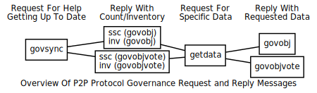

```{eval-rst}
.. meta::
  :title: Governance Messages
  :description: The network messages in this section facilitate the implementation of Dash's built-in Governance features.
```

# Governance Messages

The following [network](../resources/glossary.md#network) messages enable the Governance features built in to Dash. For additional details on the governance system, see this [Budget System page](https://docs.dash.org/en/stable/governance/index.html).



For additional details, refer to the Developer Guide [Governance section](../guide/dash-features-governance.md).

## govobj

The [`govobj` message](../reference/p2p-network-governance-messages.md#govobj) contains a governance object that is generally a proposal, contract, or setting. [Masternodes](../resources/glossary.md#masternode) ignore this request if they are not fully synced.

| Bytes | Name | Data type | Required | Description |
| ---------- | ----------- | --------- | -------- | -------- |
| 32 | nHashParent | uint256 | Required | Parent object (a hash of all zeros here indicates this is the root object, not a child object).
| 4 | nRevision | int | Required | Object revision in the system
| 8 | nTime | int64_t | Required | Time which this object was created
| 32 | nCollateralHash | uint256 | Required* | Hash of the collateral fee transaction for proposals.<br><br>Set to all zeros for Triggers.
| 0-16384 | strData | string | Required | Data field - can be used for anything (leading varint indicates size of data)
| 4 | nObjectType | int | Required | Type of governance object: <br>• `0` - Unknown<br>• `1` - Proposal<br>• `2` - Trigger
| 36 | masternode<br>OutPoint | outPoint | Required* | The unspent outpoint of the masternode (holding 1000 DASH) which is signing this object.<br><br>Set to all zeros for proposals since they can be created by non-masternodes.
| 97 | vchSig | char | Required* | BLS Signature of the masternode (Length (1 byte) + Signature (96 bytes))<br>**Note**: serialized using the basic BLS scheme after Dash 19.0 activation<br><br>Not required for proposals - they will have a length of 0x00 and no Signature.

Governance Object Types (defined by `src/governance-object.h`)

| Type | Name                    | Description
|------|-------------------------|------------
| 0 | `GOVERNANCE_OBJECT_UNKNOWN`  |
| 1 | `GOVERNANCE_OBJECT_PROPOSAL` | Submitted proposal (requires a collateral transaction - 1 Dash)
| 2 | `GOVERNANCE_OBJECT_TRIGGER`  | Masternode generated. Removed after activation/execution. Used for superblocks.

The following annotated hexdump shows a [`govobj` message](../reference/p2p-network-governance-messages.md#govobj) for a Proposal object. Notice the presence of a non-zero collateral hash, a masternodeOutPoint that is an empty Outpoint (hash of all zeros), and no vchSig. (The message header has been omitted.)

``` text
00000000000000000000000000000000
00000000000000000000000000000000 ..... Parent Hash (0 = root)
01000000 ............................. Revision: 1
c8dfd65900000000 ..................... Create timestamp: 2017-10-06 01:43:31 UTC
633611d2f3e7481325242f200c7f3485
e3a9b4b6301e7f7d18d87d8231f3880b ..... Collateral Hash

Data
| 3e02 ............................... Data length: 574
| 356235623232373 ... 376435643564 ... Data (truncated)

01000000 ............................. Object Type: GOVERNANCE_OBJECT_PROPOSAL (1)

Masternode Unspent Outpoint
| 00000000000000000000000000000000
| 00000000000000000000000000000000 ... Outpoint TXID
| ffffffff ........................... Outpoint index number: 0

00 ................................... Signature length: 0

| .................................... Masternode Signature (None required)
```

The following annotated hexdump shows a [`govobj` message](../reference/p2p-network-governance-messages.md#govobj) for a Trigger object. Notice the collateral hash of all zeros. (The message header has been omitted.)

``` text
00000000000000000000000000000000
00000000000000000000000000000000 ..... Parent Hash (0 = root)
01000000 ............................. Revision: 1
911ea85900000000 ..................... Create timestamp: 2017-08-31 14:34:57 UTC
00000000000000000000000000000000
00000000000000000000000000000000 ..... Collateral Hash (None required)

Data
| ae11 ............................... Data length: 4526
| fdae11356235623 ... 376435643564 ... Data (truncated)

02000000 ............................. Object Type: GOVERNANCE_OBJECT_TRIGGER (2)

Masternode Unspent Outpoint
| ffefbe4959085907bcd2ba29e357a441
| fa7b6e26e25896d8127332bba2419e97 ... Outpoint TXID
| 00000000 ........................... Outpoint index number: 0

60 ................................... Signature length: 96

06516fa3b38d29fca6194e5d2c929666
d59d2d105bbbc30a1e5d144e708a610a
2e0ab3c759988b13ff098ab3dbd4e01d
129827ef1e1996c211d6d5ecd5199f60
cf028b1cdb2f7240e33981b16d1270e9
d289fca20905fd453620238a505582fa ..... Masternode BLS Signature
```

## govobjvote

The [`govobjvote` message](../reference/p2p-network-governance-messages.md#govobjvote) is used to indicate the voting status of a governance object.  Voting status is comprised of the vote outcome (how the [masternode](../resources/glossary.md#masternode) voted) and the vote signal (the network support status). A sufficient number of yes votes results in the proposed funding being payed out in the next [superblock](../resources/glossary.md#superblock) (assuming their are sufficient funds available in the budget).

The initial [`govobjvote` message](../reference/p2p-network-governance-messages.md#govobjvote) is created by a masternode to vote on a governance object (proposal, etc.). When the masternode votes, it broadcasts the [`govobjvote` message](../reference/p2p-network-governance-messages.md#govobjvote) to all its peers.

When a [node](../resources/glossary.md#node) receives a valid, **new** [`govobjvote` message](../reference/p2p-network-governance-messages.md#govobjvote), it relays the message to all its connected [peers](../resources/glossary.md#peer) to propagate the vote.

Additionally, nodes can request [`govobjvote` messages](../reference/p2p-network-governance-messages.md#govobjvote) for specific governance objects via a [`govsync` message](../reference/p2p-network-governance-messages.md#govsync). Masternodes ignore requests for votes if they are not fully synced.

:::{note}
Dash Core limits how frequently a masternode can vote on a governance object.
:::

A masternode's vote will not be processed if it has been less than 60 minutes
since its last vote on that object. Additionally, invalid votes can result in
the node being banned.

| Bytes | Name | Data type | Required | Description |
| ---------- | ----------- | --------- | -------- | -------- |
| 36 | masternode<br>OutPoint | outPoint | Required | The unspent outpoint of the masternode (holding 1000 DASH) which is voting
| 32 | nParentHash | uint256 | Required | Object (`govobj`) being voted on (proposal, contract, setting or final budget)
| 4 | nVoteOutcome | int | Required | None (0), Yes (1), No (2), Abstain (3)
| 4 | nVoteSignal | int | Required |  None (0), Funding (1), Valid (2), Delete (3), Endorsed (4)
| 8 | nTime | int64_t | Required | Time the vote was created
| 97 | vchSig | char[] | Required | BLS Signature of the masternode (Length (1 byte) + Signature (96 bytes))<br>**Note**: serialized using the basic BLS scheme after Dash 19.0 activation

Governance Object Vote Signals (defined by `src/governance-object.h`)

| Value | Name | Description
| :------: | ------- | ------------
| 1 | Funding  | Minimum network support has been reached for this object to be funded (doesn't mean it will for sure though)
| 2 | Valid    | Minimum network support has been reached flagging this object as a valid and understood governance object (e.g, the serialized data is correct format, etc.)
| 3 | Delete   | Minimum network support has been reached saying this object should be deleted from the system entirely
| 4 | Endorsed | Minimum network support has been reached flagging this object as endorsed by an elected representative body

The following annotated hexdump shows a [`govobjvote` message](../reference/p2p-network-governance-messages.md#govobjvote). (The message header has been omitted.)

``` text
Masternode Unspent Outpoint
| 9425afd65ccce1d655d4dd461b8523b8
| 2577a8009c25604c65f3e78ea71d65df ... Outpoint TXID
| 01000000 ........................... Outpoint index number: 1

bc1bb26088161ff07dc09d873faa5573
9a2fd53121d315b2942f3b9db36cb475...... Parent Hash (0 = root)
01000000 ............................. Vote Outcome: VOTE_OUTCOME_NONE (1)
03000000 ............................. Vote Signal: VOTE_SIGNAL_DELETE (3)
ec3d235c00000000 ..................... Vote Create Time: 2018-12-26 08:38:04 UTC

60 ................................... Signature length: 96
06516fa3b38d29fca6194e5d2c929666
d59d2d105bbbc30a1e5d144e708a610a
2e0ab3c759988b13ff098ab3dbd4e01d
129827ef1e1996c211d6d5ecd5199f60
cf028b1cdb2f7240e33981b16d1270e9
d289fca20905fd453620238a505582fa ..... Masternode BLS Signature
```

## govsync

The [`govsync` message](../reference/p2p-network-governance-messages.md#govsync) is used to request syncing of governance objects (`govobj` message and [`govobjvote` message](../reference/p2p-network-governance-messages.md#govobjvote)) with peers. [Masternodes](../resources/glossary.md#masternode) ignore this request if they are not fully synced.

This message responds in one of two ways depending on the request:

1. Object Sync - When a masternode receives a [`govsync` message](../reference/p2p-network-governance-messages.md#govsync) with a hash of all zeros, it responds with a [`ssc` message](../reference/p2p-network-masternode-messages.md#ssc) for `govobj` objects. The masternode also sends an [`inv` message](../reference/p2p-network-data-messages.md#inv) (MSG_GOVERNANCE_OBJECT - 0x17) for all valid `govobj` governance objects. Do note that Dash limits how frequently object sync can be requested. Frequent requests will result in the node being banned.
*Governance object votes are excluded in this type of response.*

2. Vote Sync - When a masternode receives a [`govsync` message](../reference/p2p-network-governance-messages.md#govsync) with a specific hash, it responds with an [`ssc` message](../reference/p2p-network-masternode-messages.md#ssc) for `govobjvote` objects. The masternode also sends a `govobjvote` inventory messages (MSG_GOVERNANCE_OBJECT_VOTE - 0x18) for the object requested.

| Bytes | Name | Data type | Required | Description |
| ---------- | ----------- | --------- | -------- | -------- |
| 32 | nHash | uint256 | Required | Hash of governance object to request<br>Set to all zeros to request all objects (excludes votes)
| # | filter | CBloomFilter | Required | Can be set to all zeros.<br>Only supported since [protocol version 70206](../reference/p2p-network-protocol-versions.md)

The following annotated hexdump shows a [`govsync` message](../reference/p2p-network-governance-messages.md#govsync). (The message header has been omitted.)

``` text
2e46ea5418e097a3dbcccbee3cf2a911
6fb94ba635153f276dcb2123efcb73ff ..... Hash
00000000000000000000 ................. Bloom Filter
```
