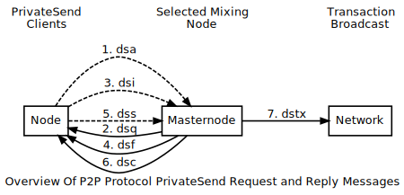

```{eval-rst}
.. meta::
  :title: CoinJoin Messages
  :description: The network messages in this section all help control the CoinJoin features built into Dash and facilitated by the masternode network.
```

# CoinJoin Messages

The following network messages all help control the CoinJoin features built into Dash and facilitated by the [masternode](../resources/glossary.md#masternode) network.

Since the messages are all related to a single process, this diagram shows them sequentially numbered. The [`dssu` message](../reference/p2p-network-privatesend-messages.md#dssu) (not shown) is sent by the masternode in conjunction with some responses. For additional details, refer to the Developer Guide [CoinJoin section](../guide/dash-features-coinjoin.md).



## dsa

The [`dsa` message](../reference/p2p-network-privatesend-messages.md#dsa) allows a [node](../resources/glossary.md#node) to join a CoinJoin pool. A collateral fee is required and may be forfeited if the client acts maliciously. The message operates in two ways:

1. When sent to a masternode without a current CoinJoin queue, it initiates the start of a new queue

2. When sent to a masternode with a current queue, it attempts to join the existing queue

Dash Core attempts to join an existing queue first and only requests a new one if no existing ones are available.

| Bytes | Name | Data type | Required | Description |
| ---------- | ----------- | --------- | -------- | -------- |
| 4 | nDenom | int | Required | Denomination that will be exclusively used when submitting inputs into the pool
| 216+ | txCollateral | [`tx` message](../reference/p2p-network-data-messages.md#tx) | Required | Collateral TX that will be charged if this client acts maliciously

The following annotated hexdump shows a [`dsa` message](../reference/p2p-network-privatesend-messages.md#dsa). (The message header has been omitted.) Note that the 'Required inputs' bytes will only be preset if [Spork](../resources/glossary.md#spork) 6 is active and protocol version => 70209.

``` text
02000000 ................................... Denomination: 1 Dash (2)

Collateral Transaction
| Previous Output
| |
| | 010000000183bd1980c71c38f035db9b
| | 14d7f934f7d595181b3436e362899026 ....... Outpoint TXID
| | 19f3f7d3 ............................... Outpoint index number: 3556242201
|
| 83 ....................................... Bytes in sig. script: 131
|
| 000000006b483045022100f4d8fa0ae4132235fe
| cd540a62715ccfb1c9a97f8698d066656e30bb1e
| 1e06b90220301b4cc93f38950a69396ed89dfcc0
| 8e72ec8e6e7169463592a0bf504946d98b812102
| fa4b9c0f9e76e06d57c75cab9c8368a62a1ce8db
| 6eb0c25c3e0719ddd9ab549cffffffff01e09304
| 00000000001976a914f895 ................... Secp256k1 signature: None
|
| 6a4eb0e5 ................................. Sequence number: 3853536874
```

## dsc

The [`dsc` message](../reference/p2p-network-privatesend-messages.md#dsc) indicates a CoinJoin session is complete.

| Bytes | Name | Data type | Required | Description |
| ---------- | ----------- | --------- | -------- | -------- |
| 4 | nSessionID | int | Required | ID of the session
| 4 | nMessageID | int | Required | ID of the message describing the result of the session

Reference the Message IDs table under the [`dssu` message](../reference/p2p-network-privatesend-messages.md#dssu) for descriptions of the Message ID values.

The following annotated hexdump shows a [`dsc` message](../reference/p2p-network-privatesend-messages.md#dsc). (The message header has been omitted.)

``` text
d9070700 ............................. Session ID: 791686
14000000 ............................. Message ID: MSG_SUCCESS (20)
```

## dsf

The [`dsf` message](../reference/p2p-network-privatesend-messages.md#dsf) is sent by the masternode as the final transaction in a CoinJoin session. The [masternode](../resources/glossary.md#masternode) expects [nodes](../resources/glossary.md#node) in the session to respond with a [`dss` message](../reference/p2p-network-privatesend-messages.md#dss).

| Bytes | Name | Data type | Required | Description |
| ---------- | ----------- | --------- | -------- | -------- |
| 4 | nSessionID | int | Required | ID of the session
| # | txFinal | [`tx` message](../reference/p2p-network-data-messages.md#tx) | Required |  Final transaction with unsigned inputs

The following annotated hexdump shows a [`dsf` message](../reference/p2p-network-privatesend-messages.md#dsf). (The message header has been omitted.) Transaction [inputs](../resources/glossary.md#input)/[outputs](../resources/glossary.md#output) are only shown for a single node (compare with the [`dsi` message](../reference/p2p-network-privatesend-messages.md#dsi) and [`dss` message](../reference/p2p-network-privatesend-messages.md#dss) hexdumps).

``` text
86140c00 ............................. Session ID: 791686

Transaction Message
| 01000000 ................................. Version: 1
|
| 0f ......................................... Number of inputs: 15
|
| [...] ...................................... 5 transaction inputs omitted
|
| Transaction input #6
| |
| | 36bdc3796c5630225f2c86c946e2221a
| | 9958378f5d08da380895c2656730b5c0 ......... Outpoint TXID
| | 02000000 ................................. Outpoint index number: 0
| |
| | 00 ....................................... Bytes in sig. script: 0
| | .......................................... Secp256k1 signature: None
| |
| | ffffffff ................................. Sequence number: UINT32_MAX
|
| Transaction input #7
| |
| | 36bdc3796c5630225f2c86c946e2221a
| | 9958378f5d08da380895c2656730b5c0 ......... Outpoint TXID
| | 0f000000 ................................. Outpoint index number: 15
| |
| | 00 ....................................... Bytes in sig. script: 0
| | .......................................... Secp256k1 signature: None
| |
| | ffffffff ................................. Sequence number: UINT32_MAX
|
| Transaction input #8
| |
| | 36bdc3796c5630225f2c86c946e2221a
| | 9958378f5d08da380895c2656730b5c0 ......... Outpoint TXID
| | 0d000000 ................................. Outpoint index number: 13
| |
| | 00 ....................................... Bytes in sig. script: 0
| | .......................................... Secp256k1 signature: None
| |
| | ffffffff ................................. Sequence number: UINT32_MAX
|
|
| [...] ...................................... 7 more transaction inputs omitted
|
|
| 0f ......................................... Number of outputs: 15
|
| Transaction output #1
| | e8e4f50500000000 ......................... Duffs (1.00001 Dash)
| |
| | 19 ....................................... Bytes in pubkey script: 25
| | | 76 ..................................... OP_DUP
| | | a9 ..................................... OP_HASH160
| | | 14 ..................................... Push 20 bytes as data
| | | | 14826d7ba05cf76588a5503c03951dc9
| | | | 14c91b6c ............................. PubKey hash
| | | 88 ..................................... OP_EQUALVERIFY
| | | ac ..................................... OP_CHECKSIG
|
|
| [...] ...................................... 3 transaction outputs omitted
|
|
| Transaction output #5
| | e8e4f50500000000 ......................... 100,001,000 Duffs (1.0001 Dash)
| |
| | 19 ....................................... Bytes in pubkey script: 25
| | | 76 ..................................... OP_DUP
| | | a9 ..................................... OP_HASH160
| | | 14 ..................................... Push 20 bytes as data
| | | | 426614716e94812d483bca32374f6ac8
| | | | cd121b0d ............................. PubKey hash
| | | 88 ..................................... OP_EQUALVERIFY
| | | ac ..................................... OP_CHECKSIG
|
|
| [...] ...................................... 9 transaction outputs omitted
|
|
| Transaction output #15
| | e8e4f50500000000 ......................... 100,001,000 Duffs (1.0001 Dash)
| |
| | 19 ....................................... Bytes in pubkey script: 25
| | | 76 ..................................... OP_DUP
| | | a9 ..................................... OP_HASH160
| | | 14 ..................................... Push 20 bytes as data
| | | | f01197177de2358928196a543b2bbd97
| | | | 3c2ab002 ............................. PubKey hash
| | | 88 ..................................... OP_EQUALVERIFY
| | | ac ..................................... OP_CHECKSIG
|
| 00000000 ................................... locktime: 0 (a block height)
```

## dsi

The [`dsi` message](../reference/p2p-network-privatesend-messages.md#dsi) replies to a [`dsq` message](../reference/p2p-network-privatesend-messages.md#dsq) that has the Ready field set to 0x01. The [`dsi` message](../reference/p2p-network-privatesend-messages.md#dsi) contains user [inputs](../resources/glossary.md#input) for processing along with the [outputs](../resources/glossary.md#output) and a collateral. Once the [masternode](../resources/glossary.md#masternode) receives [`dsi` messages](../reference/p2p-network-privatesend-messages.md#dsi) from all members of the pool, it responds with a [`dsf` message](../reference/p2p-network-privatesend-messages.md#dsf).

| Bytes | Name | Data type | Required | Description |
| ---------- | ----------- | --------- | -------- | -------- |
| ? | vecTxDSIn | CTxDSIn[] | Required | Vector of users inputs (CTxDSIn serialization is equal to CTxIn serialization)
| 216+ | txCollateral | [`tx` message](../reference/p2p-network-data-messages.md#tx) | Required | Collateral transaction which is used to prevent misbehavior and also to charge fees randomly
| ? | vecTxDSOut | CTxDSOut[] | Required | Vector of user outputs (CTxDSOut serialization is equal to CTxOut serialization)

The following annotated hexdump shows a [`dsi` message](../reference/p2p-network-privatesend-messages.md#dsi). (The message header has been omitted.)

``` text
User inputs
| 03 ......................................... Number of inputs: 3
|
| Transaction input #1
| |
| | 36bdc3796c5630225f2c86c946e2221a
| | 9958378f5d08da380895c2656730b5c0 ......... Outpoint TXID
| | 02000000 ................................. Outpoint index number: 2
| |
| | 00 ....................................... Bytes in sig. script: 0
| | .......................................... Secp256k1 signature: None
| |
| | ffffffff ................................. Sequence number: UINT32_MAX
|
| Transaction input #2
| |
| | 36bdc3796c5630225f2c86c946e2221a
| | 9958378f5d08da380895c2656730b5c0 ......... Outpoint TXID
| | 0f000000 ................................. Outpoint index number: 15
| |
| | 00 ....................................... Bytes in sig. script: 0
| | .......................................... Secp256k1 signature: None
| |
| | ffffffff ................................. Sequence number: UINT32_MAX
|
| Transaction input #3
| |
| | 36bdc3796c5630225f2c86c946e2221a
| | 9958378f5d08da380895c2656730b5c0 ......... Outpoint TXID
| | 0d000000 ................................. Outpoint index number: 13
| |
| | 00 ....................................... Bytes in sig. script: 0
| | .......................................... Secp256k1 signature: None
| |
| | ffffffff ................................. Sequence number: UINT32_MAX

Collateral Transaction
| 01000000 ................................... Version: 1
|
| 01 ......................................... Number of inputs: 1
|
| Previous Output
| |
| | 83bd1980c71c38f035db9b14d7f934f7
| | d595181b3436e36289902619f3f7d383 ......... Outpoint TXID
| | 00000000 ................................. Outpoint index number: 0
| |
| | 6b ....................................... Bytes in sig. script: 107
| |
| | 483045022100f4d8fa0ae4132235fecd540a
| | 62715ccfb1c9a97f8698d066656e30bb1e1e
| | 06b90220301b4cc93f38950a69396ed89dfc
| | c08e72ec8e6e7169463592a0bf504946d98b
| | 812102fa4b9c0f9e76e06d57c75cab9c8368
| | a62a1ce8db6eb0c25c3e0719ddd9ab549c ....... Secp256k1 signature
| |
| | ffffffff ................................. Sequence number: UINT32_MAX
|
| 01 ......................................... Number of outputs: 1
|
| | e093040000000000 ......................... 300,000 Duffs (0.003 Dash)
| |
| | 19 ....................................... Bytes in pubkey script: 25
| | | 76 ..................................... OP_DUP
| | | a9 ..................................... OP_HASH160
| | | 14 ..................................... Push 20 bytes as data
| | | | f8956a4eb0e53b05ee6b30edfd2770b5
| | | | 26c1f1bb ............................. PubKey hash
| | | 88 ..................................... OP_EQUALVERIFY
| | | ac ..................................... OP_CHECKSIG
|
| 00000000 ................................... locktime: 0 (a block height)

User outputs
| 03 ......................................... Number of outputs: 3
|
| Transaction output #1
| | e8e4f50500000000 ......................... 100,001,000 Duffs (1.0001 Dash)
| |
| | 19 ....................................... Bytes in pubkey script: 25
| | | 76 ..................................... OP_DUP
| | | a9 ..................................... OP_HASH160
| | | 14 ..................................... Push 20 bytes as data
| | | | 14826d7ba05cf76588a5503c03951dc9
| | | | 14c91b6c ............................. PubKey hash
| | | 88 ..................................... OP_EQUALVERIFY
| | | ac ..................................... OP_CHECKSIG
|
| Transaction output #2
| | e8e4f50500000000 ......................... 100,001,000 Duffs (1.0001 Dash)
| |
| | 19 ....................................... Bytes in pubkey script: 25
| | | 76 ..................................... OP_DUP
| | | a9 ..................................... OP_HASH160
| | | 14 ..................................... Push 20 bytes as data
| | | | f01197177de2358928196a543b2bbd97
| | | | 3c2ab002 ............................. PubKey hash
| | | 88 ..................................... OP_EQUALVERIFY
| | | ac ..................................... OP_CHECKSIG
|
| Transaction output #3
| | e8e4f50500000000 ......................... 100,001,000 Duffs (1.0001 Dash)
| |
| | 19 ....................................... Bytes in pubkey script: 25
| | | 76 ..................................... OP_DUP
| | | a9 ..................................... OP_HASH160
| | | 14 ..................................... Push 20 bytes as data
| | | | 426614716e94812d483bca32374f6ac8
| | | | cd121b0d ............................. PubKey hash
| | | 88 ..................................... OP_EQUALVERIFY
| | | ac ..................................... OP_CHECKSIG
```

## dsq

The [`dsq` message](../reference/p2p-network-privatesend-messages.md#dsq) provides [nodes](../resources/glossary.md#node) with queue details and notifies them when to sign final transaction messages.

If the message indicates the queue is not ready, the node verifies the message is valid. It also verifies that the [masternode](../resources/glossary.md#masternode) is not flooding the [network](../resources/glossary.md#network) with [`dsq` messages](../reference/p2p-network-privatesend-messages.md#dsq) in an attempt to dominate the queuing process. It then relays the message to its connected [peers](../resources/glossary.md#peer).

If the message indicates the queue is ready, the node responds with a [`dsi` message](../reference/p2p-network-privatesend-messages.md#dsi).

| Bytes | Name | Data type | Required | Description |
| ---------- | ----------- | --------- | -------- | -------- |
| 4 | nDenom | int | Required | Denomination allowed in this session
| 32 | proTxHash | uint256 | Required | The ProRegTx hash of the masternode which is hosting this session<br>**Replaced `masternodeOutPoint` in Dash Core 19.2.0.**
| 8 | nTime | int64_t | Required | Time this [`dsq` message](../reference/p2p-network-privatesend-messages.md#dsq) was created
| 1 | fReady | bool | Required | Indicates if the pool is ready to be executed
| 97 | vchSig | char[] | Required | BLS Signature of this message by masternode verifiable via pubKeyMasternode (Length (1 byte) + Signature (96 bytes))<br>**Note**: serialized using the basic BLS scheme after Dash 19.0 activation

Denominations (per [`src/coinjoin.cpp`](https://github.com/dashpay/dash/blob/v0.16.x/src/privatesend/privatesend.cpp#L316-L336))

| Value | Denomination
|------|--------------
| 1 | 10 Dash
| 2 | 1 Dash
| 4 | 0.1 Dash
| 8 | 0.01 Dash
| 16 | 0.001 Dash

The following annotated hexdump shows a [`dsq` message](../reference/p2p-network-privatesend-messages.md#dsq). (The message header has been omitted.) Note that the 'Required [inputs](../resources/glossary.md#input)' bytes will only be preset if [Spork](../resources/glossary.md#spork) 6 is active and protocol version => 70209.

``` text
01000000 ............................. Denomination: 10 Dash (1)

d28018e798ccbd797d0b2fc33513d64d
60d55c92f4b35f46db169332dae95f4d ..... Protx Hash

c93aa96500000000 ..................... Create Time: 2024-01-18 14:50:49 UTC

00 ................................... Ready: 0

60 ................................... Signature length: 96
a5d5ff37b8763059a464ec07a07f3e6a
1a53c6a327446badb054b507cf642e3f
956f0f758f80fd7a80416420c64ca015
11a9bb25490279844aecdae745d3dca0
12be868b6a15b25145d77bc8f5e2425b
e292e183a5a45310e12af6640ac621f1 ..... Masternode BLS Signature
```

## dss

The [`dss` message](../reference/p2p-network-privatesend-messages.md#dss) replies to a [`dsf` message](../reference/p2p-network-privatesend-messages.md#dsf) sent by the [masternode](../resources/glossary.md#masternode) managing the session.  The [`dsf` message](../reference/p2p-network-privatesend-messages.md#dsf) provides the unsigned transaction [inputs](../resources/glossary.md#input) for all members of the pool. Each [node](../resources/glossary.md#node) verifies that the final transaction matches what is expected. They then sign any transaction inputs belonging to them and then relay them to the masternode via this [`dss` message](../reference/p2p-network-privatesend-messages.md#dss).

Once the masternode receives and validates all [`dss` messages](../reference/p2p-network-privatesend-messages.md#dss), it issues a [`dsc` message](../reference/p2p-network-privatesend-messages.md#dsc). If a node does not respond to a [`dsf` message](../reference/p2p-network-privatesend-messages.md#dsf) with signed transaction inputs, it may forfeit the collateral it provided. This is to minimize malicious behavior.

| Bytes | Name | Data type | Required | Description |
| ---------- | ----------- | --------- | -------- | -------- |
| # | inputs | txIn[] | Required | Signed inputs for the session<br>**Note**: Inputs must be signed with the `SIGHASH_ALL \| SIGHASH_ANYONECANPAY` signature type

The following annotated hexdump shows a [`dss` message](../reference/p2p-network-privatesend-messages.md#dss). (The message header has been omitted.) Note that these will be the same transaction inputs that were supplied (unsiged) in the [`dsi` message](../reference/p2p-network-privatesend-messages.md#dsi).

``` text
User inputs
| 03 ......................................... Number of inputs: 3
|
| Transaction input #1
| |
| | 36bdc3796c5630225f2c86c946e2221a
| | 9958378f5d08da380895c2656730b5c0 ......... Outpoint TXID
| | 02000000 ................................. Outpoint index number: 2
| |
| | 6b ....................................... Bytes in sig. script: 107
| | 483045022100b3a861dca83463aabf5e4a14a286
| | 1b9c2e51e0dedd8a13552e118bf74eb4a68d0220
| | 4a91c416768d27e6bdcfa45d28129841dbcc728b
| | f0bbec9701cfc4e743d23adf812102cc4876c9da
| | 84417dec37924e0479205ce02529bb0ba88631d3
| | ccc9cfcdf00173 ........................... Secp256k1 signature
| |
| | ffffffff ................................. Sequence number: UINT32_MAX
|
| Transaction input #2
| |
| | 36bdc3796c5630225f2c86c946e2221a
| | 9958378f5d08da380895c2656730b5c0 ......... Outpoint TXID
| | 0f000000 ................................. Outpoint index number: 15
| |
| | 6a ....................................... Bytes in sig. script: 106
| | 4730440220268f3b7799ca4ec132e511a4756019
| | c56016f7771561dc0597d84e9b1fa9fc08022067
| | 5199b9b3f9a7eba69b7bbb4aa2a413d955762f9d
| | 68be5a9c02c6772c8078fd812103258925f0dbbf
| | 9d5aa20a675459fa2e86c9f9061dee82a00dca73
| | 9080f051d891 ............................. Secp256k1 signature
| |
| | ffffffff ................................. Sequence number: UINT32_MAX
|
| Transaction input #3
| |
| | 36bdc3796c5630225f2c86c946e2221a
| | 9958378f5d08da380895c2656730b5c0 ......... Outpoint TXID
| | 0d000000 ................................. Outpoint index number: 13
| |
| | 6a ....................................... Bytes in sig. script: 106
| | 4730440220404bb067e0c94a2bd75c6798c1af8c
| | 95e8b92f5e437cff2bcb4660f24a34d06d02203a
| | b707bd371a84a9e7bd1fbe3b0c939fd23e0a9165
| | de78809b9310372a4b3879812103a9a6c5204811
| | a8cab04b595ed622a1fed6efd3b2d888fadd0c97
| | 3737fcdf2bc7 ............................. Secp256k1 signature
| |
| | ffffffff ................................. Sequence number: UINT32_MAX
```

## dssu

The [`dssu` message](../reference/p2p-network-privatesend-messages.md#dssu) provides a pool status update.

| Bytes | Name | Data type | Required | Description |
| ---------- | ----------- | --------- | -------- | -------- |
| 4 | nMsgSessionID | int | Required | Session ID
| 4 | nMsgState | int | Required | Current state of processing
| 4 | nMsgStatusUpdate | int | Required | Update state and/or signal if entry was accepted or not
| 4 | nMsgMessageID | int | Required | ID of the typical masternode reply message

**Pool State**

| State | Description
|------|--------------
| 0 | `POOL_STATE_IDLE`
| 1 | `POOL_STATE_QUEUE`
| 2 | `POOL_STATE_ACCEPTING_ENTRIES`
| 3 | `POOL_STATE_SIGNING`
| 4 | `POOL_STATE_ERROR`

**Pool Status Update**

| Status | Description
|------|--------------
| 0 | `STATUS_REJECTED`
| 1 | `STATUS_ACCEPTED`

**Message IDs**

| Code | Description
|------|--------------
| 0x00 | `ERR_ALREADY_HAVE`
| 0x01 | `ERR_DENOM`
| 0x02 | `ERR_ENTRIES_FULL`
| 0x03 | `ERR_EXISTING_TX`
| 0x04 | `ERR_FEES`
| 0x05 | `ERR_INVALID_COLLATERAL`
| 0x06 | `ERR_INVALID_INPUT`
| 0x07 | `ERR_INVALID_SCRIPT`
| 0x08 | `ERR_INVALID_TX`
| 0x09 | `ERR_MAXIMUM`
| 0x0A (10) | `ERR_MN_LIST`
| 0x0B (11) | `ERR_MODE`
| 0x0C (12) | `ERR_NON_STANDARD_PUBKEY` (Not used)
| 0x0D (13) | `ERR_NOT_A_MN` (Not used)
| 0x0E (14) | `ERR_QUEUE_FULL`
| 0x0F (15) | `ERR_RECENT`
| 0x10 (16) | `ERR_SESSION`
| 0x11 (17) | `ERR_MISSING_TX`
| 0x12 (18) | `ERR_VERSION`
| 0x13 (19) | `MSG_NOERR`
| 0x14 (20) | `MSG_SUCCESS`
| 0x15 (21) | `MSG_ENTRIES_ADDED`
| 0x16 (22) | `ERR_SIZE_MISMATCH`

The following annotated hexdump shows a [`dssu` message](../reference/p2p-network-privatesend-messages.md#dssu). (The message header has been omitted.)

``` text
86140c00 ............................. Session ID: 791686
02000000 ............................. State: POOL_STATE_ACCEPTING_ENTRIES (2)
01000000 ............................. Status Update: STATUS_ACCEPTED (1)
13000000 ............................. Message ID: MSG_NOERR (0x13)
```

## dstx

The [`dstx` message](../reference/p2p-network-privatesend-messages.md#dstx) allows [masternodes](../resources/glossary.md#masternode) to broadcast subsidized transactions without fees (to provide security in processing).

| Bytes | Name | Data type | Required | Description |
| ---------- | ----------- | --------- | -------- | -------- |
| # | tx | [`tx` message](../reference/p2p-network-data-messages.md#tx) | Required | The transaction
| 32 | proTxHash | uint256 | Required | The ProRegTx hash of the masternode which is signing the message<br>**Replaced `masternodeOutPoint` in Dash Core 19.2.0.**
| 97 | vchSig | char[] | Required | BLS Signature of this message by masternode verifiable via pubKeyMasternode (Length (1 byte) + Signature (96 bytes))<br>**Note**: serialized using the basic BLS scheme after Dash 19.0 activation
| 8 | sigTime | int64_t | Require | Time this message was signed

The following annotated hexdump shows a [`dstx` message](../reference/p2p-network-privatesend-messages.md#dstx). (The message header has been omitted.)

``` text
Transaction Message
| 0200 ....................................... Version: 2
| 0000 ....................................... Type: 0 (Classical Tx)
|
| 05 ......................................... Number of inputs: 5
|
| Transaction input #1
| |
| | 0adb782b2170018eada54534be880e70
| | 74ed8307a566731119b1782362af43ad ......... Outpoint TXID
| | 05000000 ................................. Outpoint index number: 5
| |
| | 6b ....................................... Bytes in sig. script: 107
| | 483045022100b1243fcba562a0f1d7c4
| | cc3b320645dfa96c6412f368ccdbc1b7
| | acb6b0aa1db502201606c81b0d79f52f
| | 47bcb071b64c37f72dd1378efa67a2de
| | dd86c44d393668fa812102d6ff581270
| | 632f5e972b0418ee871867b5c04b6eae
| | 3458ad135ad8f1daaa4fc2 ................... Secp256k1 signature
| |
| | ffffffff ................................. Sequence number: UINT32_MAX
|
| [...] ...................................... 4 more transaction inputs omitted
|
|
| 05 ......................................... Number of outputs: 5
|
| Transaction output #1
| | 10f19a3b00000000 ......................... Duffs (10.0001000 Dash)
| |
| | 19 ....................................... Bytes in pubkey script: 25
| | | 76 ..................................... OP_DUP
| | | a9 ..................................... OP_HASH160
| | | 14 ..................................... Push 20 bytes as data
| | | | 3eb7ae776b096231de9eca42dd57a677
| | | | d3b05452 ............................. PubKey hash
| | | 88 ..................................... OP_EQUALVERIFY
| | | ac ..................................... OP_CHECKSIG
|
| [...] ...................................... 4 more transaction outputs omitted
|
|
| 00000000 ................................... locktime: 0 (a block height)

d28018e798ccbd797d0b2fc33513d64d
60d55c92f4b35f46db169332dae95f4d ........... Protx Hash

60 ......................................... Signature length: 96

94c8e427f448789f58cda17445e76c64
d0efa7c089addcb378f9b8d04b72f499
a4e8e616b5011886b9cffcce29e17fc1
10ad8609c3ee1a3207b882e7ff58400f
42d6e6544108b349da2cc5e716a5f266
4a2dc96b0f080effd5349f2ae06ac234 .......... Masternode Signature

59b4235c00000000 .......................... Sig Time: 2018-12-26 17:03:21 UTC
```
