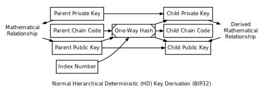

```{eval-rst}
.. meta::
  :title: Wallets
  :description: Dash has two deterministic wallet formats – single chain wallets and hierarchical deterministic (HD) wallets.
```

# Wallets

## Deterministic Wallet Formats

### Type 1: Single Chain Wallets

A Type 1 deterministic [wallet](../resources/glossary.md#wallet) is the simpler of the two, which can create a single series of keys from a single seed. A primary weakness is that if the seed is leaked, all funds are compromised, and wallet sharing is extremely limited.

### Type 2: Hierarchical Deterministic (HD) Wallets



For an overview of the [HD wallet](../resources/glossary.md#hd-wallet), please see the [developer guide section](../guide/wallets.md).  For details, please see [BIP32](https://github.com/bitcoin/bips/blob/master/bip-0032.mediawiki).
