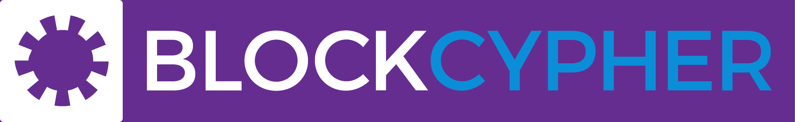

.. meta::
   :description: SDK resources for using Dash.
   :keywords: dash, merchants, payment processor, SDK, insight, instantsend, python, .NET, java, javascript, nodejs, php, objective-c

.. _sdk-resources:

SDK Resources
=============

SDKs (Software Development Kits) are used to accelerate the design and
development of a product for the Dash Network. These resources can
either be used to interface with an API provider or for the creation of
standalone applications by forming transactions and/or performing
various wallet functions.

Dash Developer Guide
--------------------

.. image:: img/dash-logo.png
   :width: 200px
   :align: right
   :target: https://docs.dash.org/core

https://docs.dash.org/core

The Dash Developer Portal aims to provide the information you need to
understand Dash and start building Dash-based applications. To make the
best use of this documentation, you may want to install the current
version of Dash Core and Dash Platform, either from source, from a
pre-compiled executable or from Docker Hub.

- Dash Core: https://docs.dash.org/core
- Dash Platform: https://dashplatform.readme.io/

NodeJS/JavaScript: Dashcore
---------------------------

.. image:: img/bitcore.png
   :width: 200px
   :align: right
   :target: https://bitcore.io

https://bitcore.io

Dashcore is a fork of Bitcore and operates as a full Dash node — your
apps run directly on the peer-to-peer network. For wallet application
development, additional indexes have been added into Dash for querying
address balances, transaction history, and unspent outputs.

- Platform: NodeJS / Javascript
- Documentation: https://github.com/dashpay/dashcore-lib/blob/master/README.md#documentation
- Repository lib: https://github.com/dashpay/dashcore-lib
- Repository node: https://github.com/dashpay/dashcore-node
- See also: `Insight API <https://github.com/dashpay/insight-api>`__

NodeJS/JavaScript: DashJS
-------------------------

DashJS allows you to transact on L1 or fetch/register documents on L2
within a single library, including management and signing of your
documents.

- Platform: NodeJS / Javascript
- Documentation: https://dashpay.github.io/platform/SDK/
- Repository: https://github.com/dashpay/platform/tree/master/packages/js-dash-sdk

PHP: Bitcoin-PHP
----------------

https://github.com/Bit-Wasp/bitcoin-php

Bitcoin-PHP is an implementation of Bitcoin with support for Dash using
mostly pure PHP.

- Platform: PHP
- Documentation: https://github.com/Bit-Wasp/bitcoin-php/blob/1.0/doc/documentation/Introduction.md
- Repository: https://github.com/snogcel/bitcoin-php

Python: PyCoin
--------------

https://github.com/richardkiss/pycoin

PyCoin is an implementation of a bunch of utility routines that may be
useful when dealing with Bitcoin and Dash. It has been tested
with Python 2.7, 3.6 and 3.7.

- Platform: Python
- Documentation: https://pycoin.readthedocs.io/en/latest/
- Repository: https://github.com/richardkiss/pycoin
- See also: `JSON-RPC Utilities <https://github.com/DeltaEngine/python-dashrpc>`__

Java: DashJ
-----------

.. image:: img/bitcoinj.png
   :width: 200px
   :align: right
   :target: https://github.com/dashpay/dashj

https://github.com/dashpay/dashj

DashJ is a library for working with the Dash protocol. It can maintain a
wallet, send/receive transactions (including InstantSend) without
needing a local copy of Dash Core, and has many other advanced features.
It's implemented in Java but can be used from any JVM compatible
language: examples in Python and JavaScript are included.

- Platform: Java
- Documentation: https://bitcoinj.org/getting-started
- Repository: https://github.com/dashpay/dashj
- Example application: https://github.com/tomasz-ludek/pocket-of-dash

Objective-C: Dash-Sync
----------------------

.. image:: img/dash-logo.png
   :width: 200px
   :align: right
   :target: https://github.com/dashpay/dashsync-iOS

https://github.com/dashpay/dashsync-iOS

Dash-Sync is an Objective-C Dash blockchain framework for iOS. It
implements all most relevant Bitcoin Improvement Proposals (BIPs) and
Dash Improvement Proposals (DIPs).

- Platform: iOS
- Repository: https://github.com/dashpay/dashsync-iOS

.NET: NBitcoin
--------------

.. image:: img/dash-logo.png
   :width: 200px
   :align: right
   :target: https://github.com/MetacoSA/NBitcoin

https://github.com/MetacoSA/NBitcoin

NBitcoin is the most complete Bitcoin library for the .NET platform and
has been patched to include support for Dash. It implements all most
relevant Bitcoin Improvement Proposals (BIPs) and Dash Improvement
Proposals (DIPs). It also provides low level access to Dash primitives
so you can easily build your application on top of it.

- Platform: .NET
- Documentation: https://programmingblockchain.gitbook.io/programmingblockchain/
- Repository: https://github.com/MetacoSA/NBitcoin
- See also: `JSON-RPC Utilities <https://github.com/cryptean/bitcoinlib>`__

BlockCypher
-----------

https://www.blockcypher.com

BlockCypher also offers client SDKs.

- Platform: Ruby, Python, Java, PHP, Go, NodeJS
- Repositories: https://www.blockcypher.com/dev/bitcoin/
