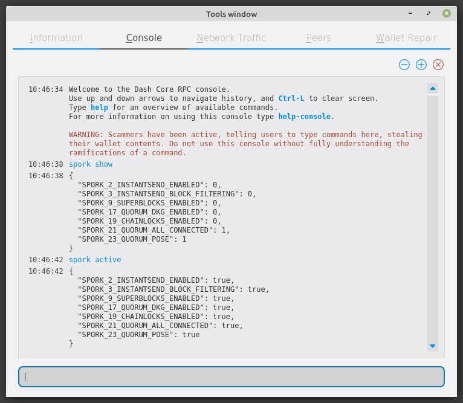

.. meta::
   :description: Information about sporks
   :keywords: dash, developers, sporks

.. _understanding-sporks:

Sporks
======

A multi-phased fork, colloquially known as a "spork", is a mechanism
unique to Dash used to safely deploy new features to the network through
network-level variables to avoid the risk of unintended network forking
during upgrades. It can also be used to disable certain features if a
security vulnerability is discovered - see :ref:`here <sporks>` for a
brief introduction to sporks. This documentation describes the meaning
of each spork currently existing on the network, and how to check their
respective statuses.

Spork functions
---------------

Sporks are set using integer values. Many sporks may be set to a
particular epoch datetime (number of seconds that have elapsed since
January 1, 1970) to specify the time at which they will active. Enabled
sporks are set to 0 (seconds until activation). This function is often
used to set a spork enable date so far in the future that it is
effectively disabled until changed. The following sporks currently exist
on the network and serve functions as described below:

SPORK_2_INSTANTSEND_ENABLED
  Governs the ability of Dash clients to use InstantSend functionality.
  InstantSend is described in `DIP0010 LLMQ-based InstantSend
  <https://github.com/dashpay/dips/blob/master/dip-0010.md>`__.

SPORK_3_INSTANTSEND_BLOCK_FILTERING
  If enabled, masternodes will reject blocks containing transactions in
  conflict with locked but unconfirmed InstantSend transactions.

SPORK_9_SUPERBLOCKS_ENABLED
  If enabled, superblocks are verified and issued to pay proposal
  winners.

SPORK_17_QUORUM_DKG_ENABLED 
  Enables the `DKG process to create LLMQ quorums
  <https://github.com/dashpay/dips/blob/master/dip-0006.md>`_. This
  spork will be turned on once 80% masternodes are upgraded to v0.14,
  which will enable DKG and DKG-based PoSe.

SPORK_19_CHAINLOCKS_ENABLED
  Enables :ref:`ChainLocks <chainlocks>`, a mechanism of preventing the
  risk to payments introduced by blockchain reorganization events. 
  ChainLocks are described in `DIP0008 ChainLocks <https://github.com/dashpay/dips/blob/master/dip-0008.md>`__.

SPORK_21_QUORUM_ALL_CONNECTED
  Enables connections between all masternodes in a quorum to optimize the
  signature recovery process.

SPORK_23_QUORUM_POSE
  Enforces Proof of Service requirements for masternodes to support a minimum
  protocol version and maintain open ports.

Viewing spork status
--------------------

The ``spork show`` and ``spork active`` commands issued in the debug
window (or from ``dash-cli`` on a masternode) allow you to interact with
sporks. You can open the debug window by selecting **Window > Console**.

   spork show and spork active output in the Dash Core debug console
