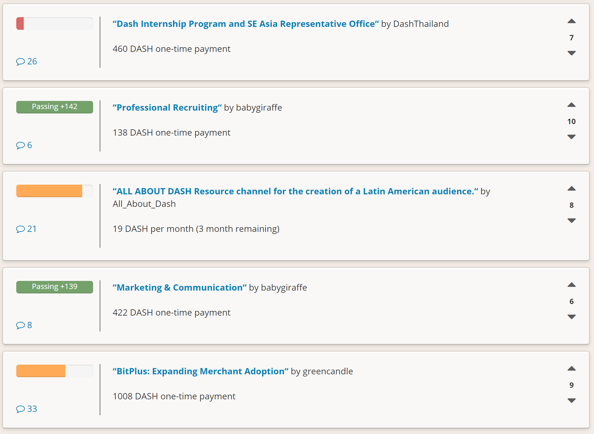
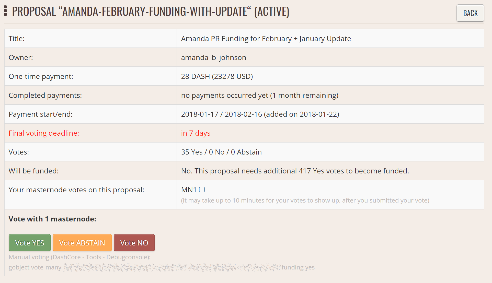
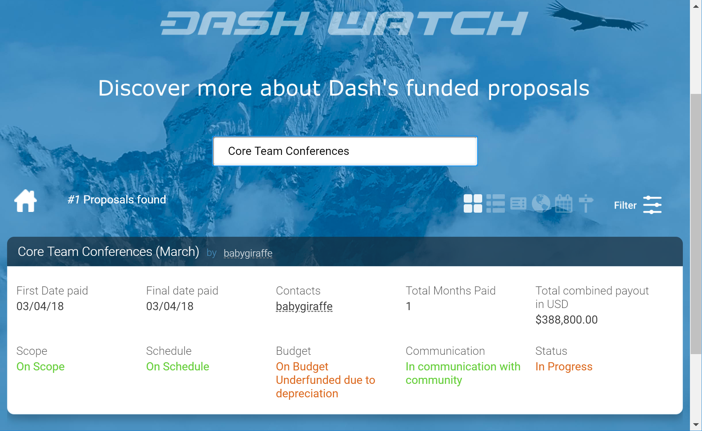

.. meta::
   :description: Discussion of theory and motivation behind the Dash governance system and treasury
   :keywords: dash, dao, governance, funding, voting, blockchain, development, block reward, treasury, budget

.. _understanding-governance:

=============================
Understanding Dash Governance
=============================

One of the greatest challenges of building a cryptocurrency platform is
ensuring you create a decentralized system of governance to manage,
fund, maintain and expand the project. This key element has been absent
in every major currency to date, so the natural response is to create a
not-for-profit foundation that is tasked with maintaining the core
protocol and promoting the coin, but is not really connected to the coin
holders in any meaningful way. This approach has a few issues that have
been made evident from the experience of older crypto currency
platforms.

Current crypto foundations are not related to the currency itself by any
mechanism that is included in the protocol and are not designed to
outlive early adopters when they lose interest. The foundation then
struggles to maintain funding until it implodes and core development of
the protocol is left scrambling for funding or depending on charity that
can’t be counted on and does not allow for proper budgeting and
planning. Donations are also unfair to donors because there are always
free riders that benefit from the effort done by others without
contributing. Other projects have financed themselves by premining coins
or running prelaunch sales, which is not a great solution either because
control of the funds is centralized and at that stage it is impossible
to quantify the future needs of the project.

Through the network of full nodes and the collateral requirement, Dash
already has a decentralized network of masternode operators that are
heavily invested in the future of the currency, and that as a group can
act as stewards of the core protocol development and promotion. We
propose a decentralized management system based on the masternode voting
mechanism. Masternode operators are not the only ones interested in the
success of Dash, but they are the most stable ones because, unlike
miners, they can’t reuse their asset for any other purpose or coin.

In the budget system, a portion of the block subsidy is held in escrow by
the network itself, in the name of the operators, to be executed in the
development and expansion of the ecosystem according to the vote of the
masternodes in different budget proposals. These funds are directed to
supporting development and promotion of the coin. Masternode operators
vote on specific budgets and projects to be funded, thus defining the
direction the coin is taking. This is done in a completely transparent
way through a public portal where new initiatives are proposed and
masternodes can vote on them. Functioning like a decentralized
Kickstarter or Lighthouse, the budget can be used for anything that
creates value within the ecosystem.

This is a 100% decentralized system powered by the masternodes, where
budgets are set and paid directly from the blockchain. The blockchain
hires core developers in this way and introduces a new concept of paid
blockchain contractors, where people work for and are directly
compensated by the network, through the decentralized votes of all
masternode operators. One advantage of this model is it can survive
early adopters. If early masternode operators sell their coins, the new
owner can set up a masternode and with it acquire the right to vote on
the budgets and projects. This guarantees there is a working system of
maintenance as people come and go, making the network capable of
sustaining itself on its own without depending on specific actors.

Budgets and masternode voting
=============================

The system works as a decentralized voting mechanism set up in the rules
governing the blockchain, where budgets for specific projects are
proposed, then the masternodes as a whole vote on them. Each project, if
it passes, is added to the total budget and paid directly from the
blockchain to the person doing the work. This allows Dash to hire core
developers and pay them directly after approval of the work in a
decentralized fashion.

A masternode votes on a proposal (technically a governance object on the
blockchain) using the example command “masternode vote yes”, “masternode
vote no” or “masternode vote abstain”. The votes then propagate across
the network, and are tallied according to instructions followed by the
network itself. Budgets under discussion and voting progress can be
viewed using the example command “masternode budget show”.

A well defined decentralized system of governance allows a
cryptocurrency network to endure and survive its original creators. In
this way, later generations of masternode operators have a clear way to
support the system as defined by the protocol itself, applying wisdom of
the crowd techniques and the bond of trust established by the masternode
collateral to create a decentralized management system. This creates
incredible value within the currency, allowing us to be more agile and
compete with other payment systems, such as Bitcoin and credit cards, on
a global scale.

As the system has developed, a strong team of productive contractors
paid from blockchain rewards has arisen and become established. This
includes the core development team, escrow providers, news and reporting
staff, experimental development labs, partnerships with universities,
hiring of marketing and PR firms and integrations with third party
exchanges and payment platforms. The market recognizes the value of the
stability of the network as a whole, and that the possibility of
reliable and sufficient funding results in faster and more coherent
implementation of the Dash roadmap and core Dash services.

Reward schedule
===============

To guarantee long term sustainability of the blockchain, the network
keeps a portion of the block subsidy back as new blocks are created,
with the masternode operators tasked to act as stewards and invest in
the maintenance and expansion of the network by voting. This results in
faster development and promotion, creating a virtuous cycle that
benefits all actors, including miners, masternode operators, investors
and users. More importantly, this gives the blockchain itself a self-
preservation mechanism that is beyond the control of any individual.

+-----+----------------------------------------+
| 80% | Mining and Masternode Reward           |
+-----+----------------------------------------+
| 20% | Decentralized Governance Budget        |
+-----+----------------------------------------+

Masternodes and miners split 80% of the mining subsidy per the distribution
found :ref:`here <block-reward-reallocation>`, at the time
it is created. The remaining 20% is disbursed monthly by the masternode
operators once the results of their votes are tallied, creating the
first self-sustaining decentralized cryptocurrency platform organized as
a Decentralized Autonomous Organization (DAO). The masternode operators
establish a social contract with the network they benefit from and are
bound to act as caretakers, dedicating their time, due diligence work
and a portion of the network rewards to furthering the ecosystem. This
has a ripple effect that benefits all parties involved - especially the
end users.

The value generated by work done implementing proposals is expected to
be greater than allocating 100% of rewards to mining because the network
has needs beyond only cryptographically securing the blockchain. The
expected result is greater net benefit not only for proposal winners,
but also masternode operators, miners and normal users. In fact, the
introduction of the decentralized governance budget itself was decided
by a masternode vote, making the first distributed decision the actual
creation of the system, similar to establishing a constitution.

This approach of distributing the normal block subsidy in a way that
considers all critical elements a cryptocurrency needs for its long term
viability, e.g. mining, full nodes, development and promotion, is
revolutionary as it is done without changing the emission or creating
any additional inflation for investors. The network simply distributes
the available resources in a way that is of greater net benefit to all
parties.

Contractors and proposals
=========================

Contractors of the blockchain can be developers, outreach professionals,
team leaders, attorneys or even people appointed to do specific tasks.
Proposals generally begin life as simple `pre-proposal forum posts
<https://www.dash.org/forum/topic/pre-budget-proposal-discussions.93/>`_
on the Dash Forum, where feedback and suggestions are solicited from the
general community. Once the proposal owner decides they have a
reasonable chance of passing their proposal, it is created as a
governance object on the blockchain. A fee of 1 DASH is associated with
this action to prevent spam and ensure only serious proposals make it to
this stage. Several tools exist to allow masternode operators to
comfortably review and vote on proposals. The net total of yes votes must
exceed 10% of the total masternode count at the time votes are tallied
in order to pass. If there are more passing proposals than the available
block subsidy can provide for, the proposals with the most yes votes will
pass first, creating a cut-off point for less popular proposals. The
same process is then repeated every month, and the total amount of Dash
available for proposals decreases by approximately 7.14% per year,
together with the overall block subsidy.

The following video by Tao of Satoshi includes advice for proposal
owners entering proposals during periods of high competition for the
available budget funds:

.. raw:: html

    

        <iframe src="https://www.youtube-nocookie.com/embed/MR_1BJNX2SE?modestbranding=1&rel=0" frameborder="0" allowfullscreen style="position: absolute; top: 0; left: 0; width: 100%; height: 100%;"></iframe>
    

Proposal websites
=================

The community has gathered around `DashCentral
<https://www.dashcentral.org>`__ as a website to facilitate discussion
and voting on proposals formally entered on the Dash blockchain. Other
websites like `Dash Ninja <https://www.dashninja.pl>`__ are available to 
monitor progress over time and gather more detailed statistics. 
`Dash Masternode Tool <https://github.com/Bertrand256/dash-masternode-tool/releases>`__ also
allows for voting without the need to share masternode private keys with
a third party service.

   A typical view of proposal discussion and voting on Dash Central

Each proposal includes a description of the proposal goals, details of
what work will be done and a breakdown of the requested budget. Many
proposals also link to their own website or the pre-proposal discussion,
or include a video to validate the identity and sincerity of the
proposal owner. Discussion on Dash Central occurs below this
information, and masternode owners have the option to verify their
ownership of a masternode and ability to cast a vote by signing a
message from the masternode collateral address. Masternodes can vote at
any time, and also change their vote at any time until the cutoff block
is mined and voting stops. This occurs 1662 blocks prior to the
superblock. After voting stops, the blockchain executes a decentralized
tally and validates all votes. Once consensus is reached, the results
are broadcast and the budget is allocated soon after in a superblock.

   Proposal details and voting buttons on Dash Central

Once passed, proposals are able to report back to the network on the
`Dash Forum <https://www.dash.org/forum/topic/approved-proposals-
updates-news.140/>`__ or via published public channels and social media.
Since it is possible to create proposals that pay out over several
months, it is also possible to revoke funding from a project by changing
the vote if development or spending of already allocated funds is
unsatisfactory. This encourages proposal owners to work honestly and
diligently to win the trust and approval of the network. Ongoing
discussion and gradual improvement over time results in a close bond
between the network and those working for the network in supporting
roles.

Voting on proposals is updated in real time via P2P messages and stored
by Dash in cache files, so current winning proposals and the total
allocation of the available budget are always open and visible to
everyone. `Dash Central <https://www.dashcentral.org/budget/>`__ is a popular 
site used for to view progress on proposal voting.

   Monitoring budget allocation on Dash Central

Finally, `Dash Watch <https://dashwatch.org>`__ (which was itself funded
through a budget proposal) exists to monitor the ability of blockchain
contractors to deliver on their promises with respect to delivery dates
and the total amounts of budget allocated over multiple voting periods.
A team of dedicated staff routinely interact with proposal owners to
track progress of the various projects and provide reports to voting
masternodes in a single location. While providing data on the
performance of your proposal to Dash Watch is optional, many masternode
owners take advantage of the data they make available to make their
voting decisions. The Dash Watch team may be contacted at
team@dashwatch.org email address or through their `website
<https://dashwatch.org>`__.

   Proposal monitoring on Dash Watch

Budget allocation
=================

The total budget of the network can be calculated by taking 20% of the
block subsidy over the period of time between two superblocks, which occur
every 16616 blocks or approximately 30.29 days. A voting cutoff occurs
1662 blocks before the superblock, and the final votes are tallied at
this point. A proposal must satisfy the condition ``(YES votes - NO
votes) > (Total Number of Masternodes / 10)`` in order to be considered
passing. Then, in the superblock, the winning proposals are awarded in
the order of the margin by which they are passing until either the
entire budget is allocated or no more passing proposals exist. This
allows for completely trustless and decentralized allocation of the
budget.

If a proposal has passed the voting threshold but insufficient funds
remain to pay the full amount requested, it will not receive partial
funding. Instead, any smaller proposals which have also passed the
threshold that will fit in the budget will be funded, even if they have
lower net approval than the larger proposal. Proposals requesting
payment over multiple budget periods will remain in the treasury system
for the duration of their validity, even if they do not pass the voting
threshold, and even if insufficient budget is available for funding as
described above. Any unallocated budget is simply never created in the
superblock, reducing unnecessary inflation.

Due to the decentralized nature of the masternode system, it is
sometimes necessary to form funded organisations, such as committees or
companies, to be responsible for some project or task. These are
submitted in the same way, but the committee itself receives the funds.
Another alternative is to place trusted escrow services between the
budget allocation event and the actual submitter of the proposal to
ensure that work is paid for in stages, as it is delivered. Some
oversight over blockchain contractors is sometimes needed. Each budgeted
item requires either a team manager or a committee responsible for
implementation of the work. Periodically, this manager is expected to
report on budget expenditure and completed work to show the value
created from the allocated funds. This allows repeat proposal submitters
to build up a reputation and gain trust from the community. Proposals
which do not provide regular reports and cannot answer questions about
their budget allocation will soon be defunded if it is part of a regular
monthly proposal cycle. The result is a kind of self-policing system.

Scaling and future uses
=======================

As the number of blockchain contractors increases, a point is reached
where masternode operators cannot be realistically expected to evaluate
the volume of proposals. At this point funding organizations can be
created to act as contractors for the distribution of funds to many
smaller decentralized projects, according to current needs. Dash Core
Group, Inc. is one example of such an organization.

The existence of the decentralized budget system puts the power of
determining where Dash goes in the future in the hands of the masternode
network itself. All core development and several peripheral developers
are already funded from the budget, and other projects not even
conceivable at this time will likely arise in the future. This decouples
the survival and value of the blockchain from the current userbase and
developers, making Dash the first blockchain designed to outlive its
original users, a self sustainable decentralized cryptocurrency network
that can still operate cohesively and bring added value services to end
users in a consistent way.

Conclusion
==========

Every masternode operator establishes a bond of trust and a social
contract with the network in which she is bound to contribute to the
development and maintenance of the ecosystem she benefits from. Under
this model, a portion of the funds that the operator is bound to receive
are in a sense allocated in custody, not in ownership, and are held in
escrow by the network to be executed by the operators for the benefit of
the ecosystem. Everyone contributes equally and proportionately to the
benefits they are receiving and the risks they are taking, there are no
privileges and no loopholes. This is complemented by the full node
voting mechanism that allows for a distributed group to vote on a
continuous basis on practical matters without the need to forfeit their
right to decide to others, every few years, like with traditional
governments or cooperative corporations.

We envision a future in which this model of transparent, unbreakable and
verifiable contribution to the common good, in combination with
continuous participation of the crowd through active voting, is utilized
to manage organizations that are owned or operated jointly by its
members, who share the benefits and responsibilities of those
collectives, like governments, cooperative corporations, unions, DAOs,
cryptocurrencies, etc. We call this model decentralized governance by
blockchain.
