.. meta::
   :description: Practical guide to using the Dash DAO governance system and treasury
   :keywords: dash, dao, governance, funding, voting, proposals, masternodes

.. _using-governance:

=====================
Using Dash Governance
=====================

Dash's Decentralized Autonomous Organization (DAO) is a novel voting
and funding platform. This documentation introduces and details the
theory and practice to use the system.

Understanding the process
=========================

Introduction
------------

- DAO consists of three components: Proposals, Votes, and Budgets
- Anyone can submit a proposal for a small fee
- Each valid masternode can vote for, against or abstain on proposals
- Approved proposals become budgets
- Budgets are paid directly from the blockchain to the proposal owner

Proposals
---------

- Proposals are a request to receive funds
- Proposals can be submitted by anyone for a fee of 1 Dash. The proposal
  fee is irreversibly destroyed on submission.
- Proposals cannot be altered once submitted

Votes
-----

- Votes are cast using the registered voting address
- The voting address can be delegated to a third party
- Votes can be changed once per hour
- A regular masternode's vote counts as one vote; an evonode's vote counts
  as four
- Votes are counted every 16616 blocks (approx. 30.29 days)

Budgets
-------

- Budgets are proposals which receive a net total of yes votes equal to
  or greater than 10% of the total eligible votes, rounded down, with a
  minimum of 10 votes on mainnet (for example, 448 out of 4480)
- Budgets can lose approval if vote totals (cast or re-cast) fall below
  the approval threshold
- Budgets are processed (paid) in order of yes minus no votes. More
  popular budgets get payment priority.
- The budget available for each cycle can be checked using the commands
  in :ref:`budget-cycles`, and decreases by approximately 7.14% every
  210240 blocks (approx. 383.25 days).

Object structure
----------------

The following information is required to create a proposal:

- proposal-name: a unique label, 40 characters or less
- url: a proposer-created webpage or forum post containing detailed
  proposal information
- payment-count: how many cycles the proposal is requesting payment
- block-start: the requested start of proposal payments
- dash-address: the address to receive proposal payments
- monthly-payment-dash: the requested payment amount

Persistence
-----------

- Proposals become fully accepted after the proposal fee transaction has
  six confirmations
- Proposals remain on the network until their payment period ends or
  masternodes vote to remove them
- Approval occurs when yes votes minus no votes meets the threshold
  described under Budgets
- Falling below the approval threshold does not remove a proposal
- The total eligible votes comes from registered masternodes that are
  not banned for failing to provide service. Regular masternodes count
  as one vote each, and evonodes count as four.

Templates
---------

The following two Microsoft Word templates are available from Dash Core
Group to help facilitate standardized proposal submission and updates.
Usage is recommended, but not required.

- `Project Proposal Template <https://github.com/dashpay/docs/raw/master/binary/Dash%20Project%20Proposal%20Template%20v2.0.docx>`_
- `Project Status Update Template <https://github.com/dashpay/docs/raw/master/binary/Dash%20Project%20Status%20Update%20Template%20v2.0.docx>`_

.. _budget-cycles:

Budget cycles
=============

When preparing a proposal, be aware of when the next cycle will occur
and plan accordingly. It is recommended to choose your proposal payment
start block at least one cycle in the future to allow time for
discussion and gathering support and votes. Vote at least 1662 blocks
(approximately 3 days) before the superblock. After this point, masternodes
begin choosing which proposals to pay, so later votes may not affect
the upcoming payment.

To find the next superblock height, run the following command in the
Dash Core wallet console::

  getgovernanceinfo

The ``nextsuperblock`` field gives the next superblock height. Subsequent
mainnet superblocks occur every 16616 blocks. To check the maximum budget
for a superblock, use that height in the following command::

  getsuperblockbudget <superblock-height>

.. _creating-proposals:

Creating proposals
==================

Once you have prepared the text of your proposal and set up a website or forum post, it is time to
submit your proposal to the network for voting. You can create a budget
proposal using the Dash Core wallet (:ref:`GUI <proposal-create-core-qt>` or
:ref:`console <proposal-create-core-console>`) or the :ref:`Dash Budget Proposal Generator
<dash-budget-proposal-generator>`.

.. _proposal-create-core-qt:

Dash Core Wallet
----------------

Dash Core Wallet includes a built-in graphical interface for creating governance proposals directly
from the Governance tab. This provides a user-friendly alternative to using external web tools or
manual console commands. To use this feature, your wallet must be unlocked and contain sufficient
balance to cover the 1 DASH proposal fee plus a small transaction fee.

Accessing the Governance tab
^^^^^^^^^^^^^^^^^^^^^^^^^^^^

Open your Dash Core Wallet and click on the **Governance** tab. This displays a list of existing
proposals and provides **Create Proposal** and **Resume Proposal** buttons.

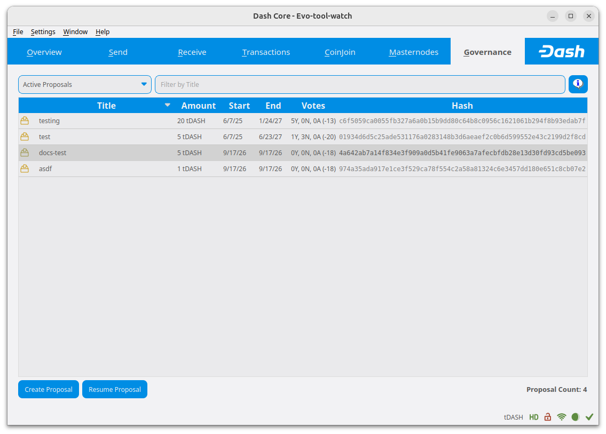

   The Governance tab showing existing proposals and the Create Proposal button

Creating a new proposal
^^^^^^^^^^^^^^^^^^^^^^^

Click the **Create Proposal** button to open the proposal creation dialog. Enter your proposal
details:

- **Proposal name**: A label of 40 characters or less
- **Description URL**: Link to detailed proposal information
- **Payment address**: The Dash address that will receive payments
- **Payment amount**: Amount requested per payment cycle
- **Payment date**: Select the first payment
- **Payments**: Number of payment cycles requested

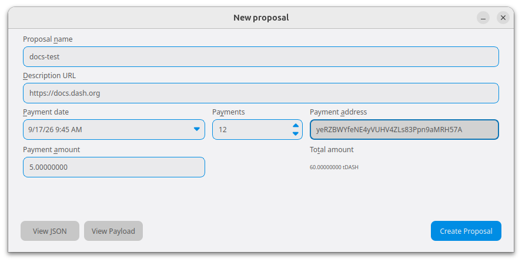

   Entering proposal details in the creation dialog

The dialog displays the total amount requested. Check your proposal details carefully before
proceeding. **View JSON** and **View Payload** let you inspect the data that will be submitted to
the network.

Then, click **Create Proposal**, unlock the wallet if prompted, and review the proposal confirmation
screen.

.. warning::

   Creating the proposal permanently spends the 1 DASH proposal fee, plus a transaction fee. The
   proposal fee cannot be refunded. Verify all proposal details before proceeding.

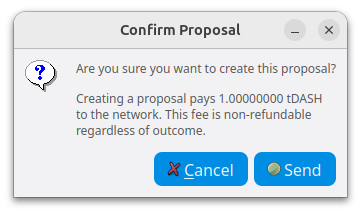

   Proposal create confirmation screen

Click **Send** on the confirmation dialog to broadcast the fee transaction.

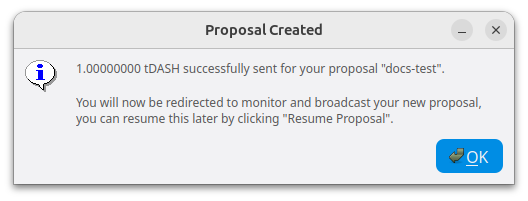

   Proposal created

After successful creation, the wallet opens a dialog to monitor and broadcast the proposal. You can
return to pending proposals later using **Resume Proposal** from the Governance tab.

Broadcasting the proposal
^^^^^^^^^^^^^^^^^^^^^^^^^

The proposal initially shows a **Pending** collateral status. After the fee transaction has one
confirmation, the status changes to **Ready** and the **Broadcast** button becomes available. Click
**Broadcast** to submit the proposal. A successful submission displays your proposal ID, which you
can use to track voting on the proposal.

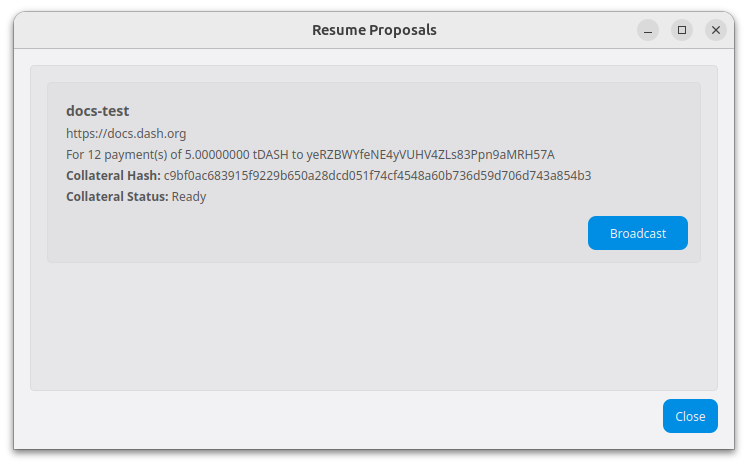

The proposal becomes fully accepted by the network after the fee payment has six confirmations.

.. note::

   You can use the proposal ID to identify your proposal on DashCentral. Consult the service's
   current instructions for claiming it.

.. _dash-budget-proposal-generator:

Dash Budget Proposal Generator
------------------------------

- https://proposal.dash.org

The `Dash Budget Proposal Generator <https://proposal.dash.org>`__
supports creating budget proposals on both mainnet and testnet. In the
first step, you must enter a short, clear and unique name for the
proposal as it will appear on the blockchain. Proposal names are limited
to 40 characters. You can then provide a link to the forum or
DashCentral where your proposal is described in more detail (use a `URL
shortening service <https://bitly.com>`_ if necessary), as well as
select the amount of payment you are requesting, how often the payment
should occur, and the superblock date on which you are requesting
payment. This allows you to control in which budget period your proposal
will appear, and gives you enough time to build support for your
proposal by familiarising voters with your project. Note that the
payment amount is fixed and cannot be modified after it has been
submitted to the blockchain.

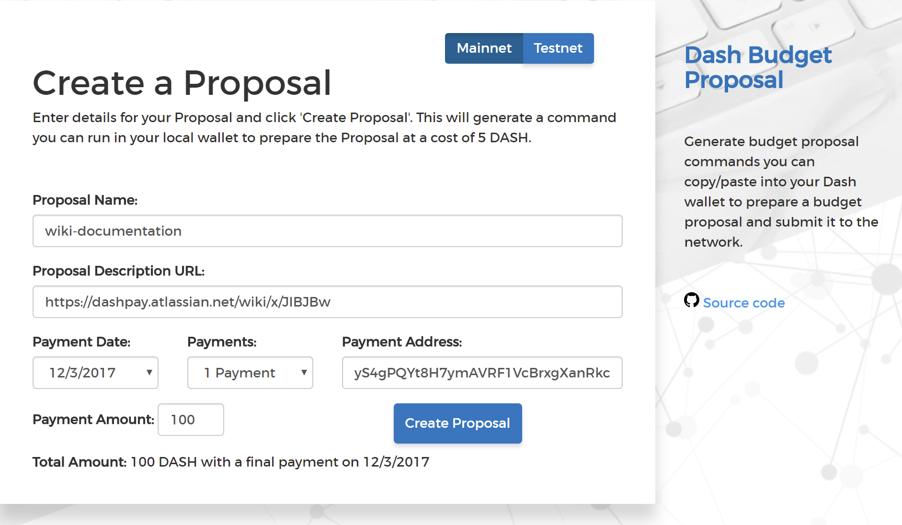

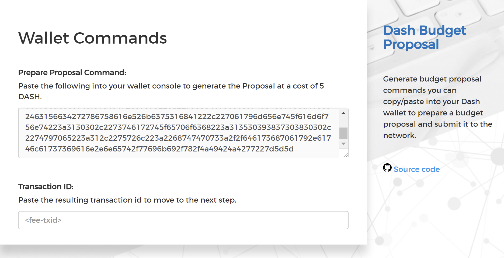

   Steps 1 & 2: Creating your proposal and preparing the command

Next, the proposal generator will provide you with a command to run from
the console of your Dash Core wallet to prepare your budget proposal
governance object. Running this command will cost you 1 DASH, which will
be "burnt" or permanently removed from circulation. This one-time fee
protects the governance system from becoming overwhelmed by spam, poorly
thought out proposals or users not acting in good faith. A small
transaction fee is charged as well, so make sure slightly more than 1
DASH is available in your wallet. Many budget proposals request
reimbursement of the 1 DASH fee.

First unlock your wallet by clicking **Settings > Unlock wallet**, then
open the console by clicking **Window > Console** and paste the
generated command. The transaction ID will appear. Copy and paste this
into the proposal generator response window. As soon as you do this, the
system will show a progress bar as it waits for 6 confirmations as
follows:

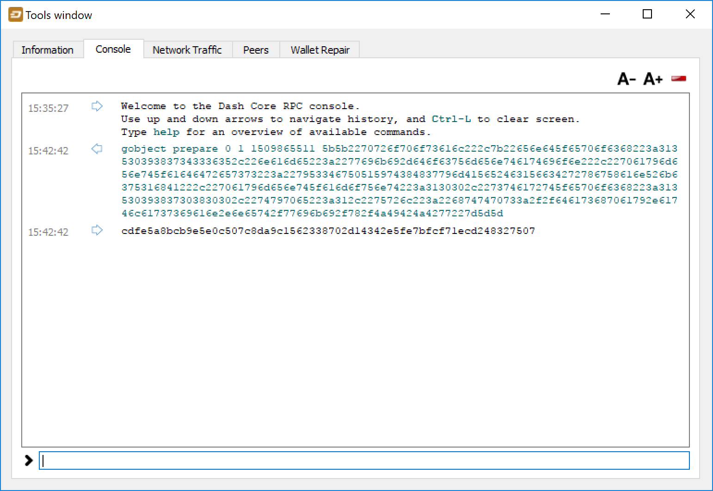

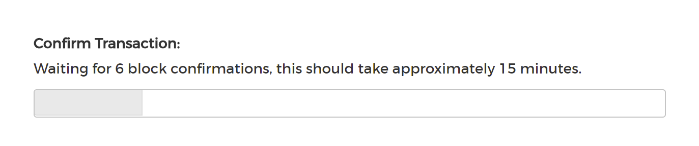

   Step 3: Creating the proposal transaction and waiting for 6 
   confirmations of the transaction ID

Once 6 block confirmations exist, another command will appear to submit
the prepared governance object to the network for voting. Copy and paste
this command, and your governance object ID will appear as follows:

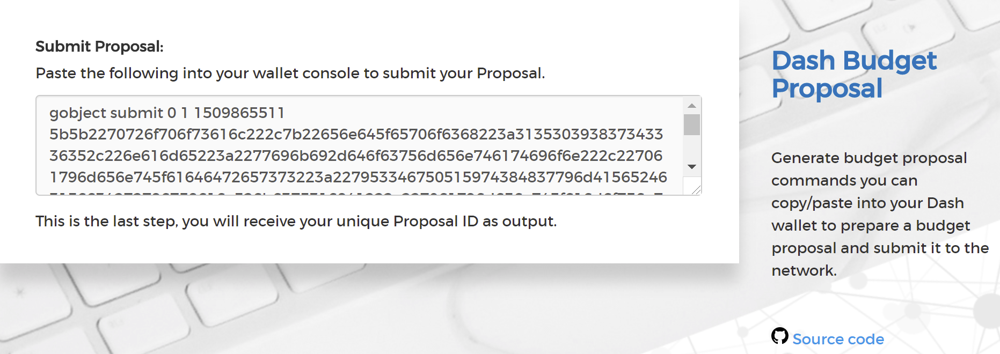

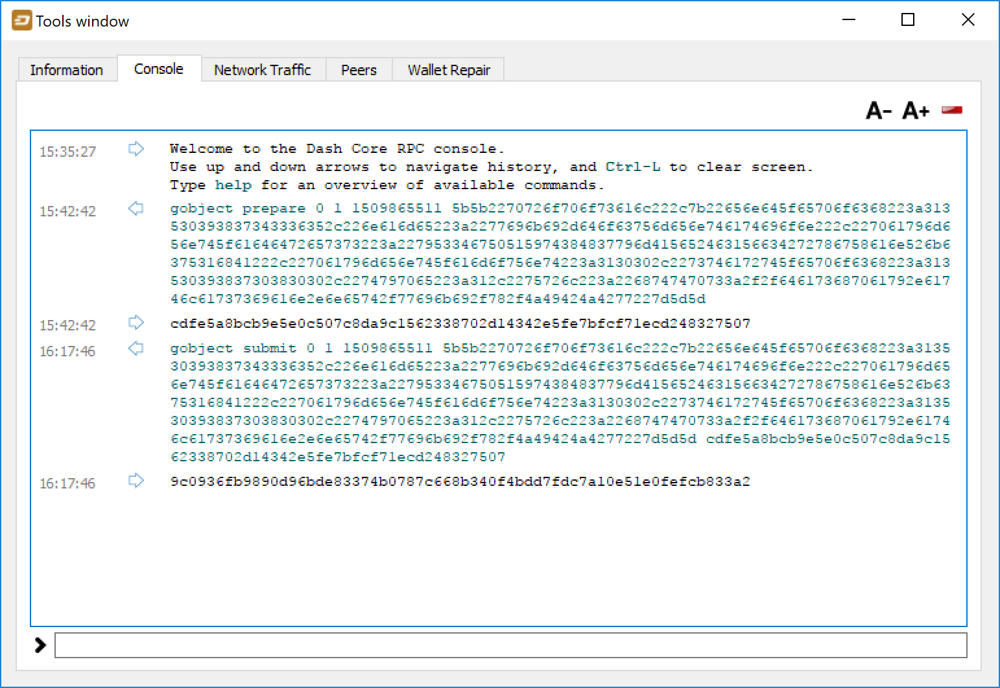

   Step 4: Submitting the governance object to the network

You can use this ID to track voting on the proposal until the budget
closes and you receive your payout. You can also submit the ID to
DashCentral to claim your proposal and enable simplified voting for
masternodes using DashCentral voting services.

.. _proposal-create-core-console:

Dash Core Wallet Console
------------------------

Creating a proposal using the wallet console follows the same process as using
the Dash budget proposal generator, but it requires several additional steps to
manually construct the proposal governance object.

Assemble the proposal data
^^^^^^^^^^^^^^^^^^^^^^^^^^

To prepare a proposal, put the proposal details such as name and payout address
into a JSON object similar to the example shown below. 

.. code-block:: json

  {
    "name": "Test-proposal_1",
    "payment_address": "yd5KMREs3GLMe6mTJYr3YrH1juwNwrFCfB",
    "payment_amount": 10,
    "url": "https://www.mydashtestproposal.com",
    "start_epoch": 1635750000,
    "end_epoch": 1636750000,
    "type": 1
  }  

Set the ``type`` field to ``1`` for all proposals.

The ``start_epoch`` and ``end_epoch`` fields are Unix epoch timestamps
indicating the time range in which the proposal can receive payments. Typically
you will set the ``start_epoch`` to approximately halfway between the superblock
where payment is first desired and the preceding one. Set ``end_epoch`` to
approximately 2 weeks after the superblock where the final payment is desired.
You can use a site like https://www.epochconverter.com/ to convert the start and
end dates to the epoch values for these fields.

Serialize the proposal data
^^^^^^^^^^^^^^^^^^^^^^^^^^^

The proposal information must be serialized to hex before it can be submitted to
the network. Remove all spaces from the JSON object::

  {"name":"Test-proposal_1","payment_address":"yd5KMREs3GLMe6mTJYr3YrH1juwNwrFCfB","payment_amount":10,"type":1,"url":"http://test.com","start_epoch":1635750000,"end_epoch":1636750000}

Convert the resulting JSON to its hex equivalent. Sites like
https://codebeautify.org/string-hex-converter provide an easy way to do this::

  7b226e616d65223a22546573742d70726f706f73616c5f31222c227061796d656e745f61646472657373223a227964354b4d52457333474c4d65366d544a597233597248316a75774e777246436642222c227061796d656e745f616d6f756e74223a31302c2274797065223a312c2275726c223a22687474703a2f2f746573742e636f6d222c2273746172745f65706f6368223a313633353735303030302c22656e645f65706f6368223a313633363735303030307d

Prepare the fee transaction
^^^^^^^^^^^^^^^^^^^^^^^^^^^

Finally, open your Dash Core wallet console and use the ``gobject prepare``
command to complete the proposal preparation and submit the fee
transaction (a 1 DASH coin burn). See the :ref:`Core developer documentation
<api-rpc-dash-gobject-prepare>` for additional details.

.. warning::
  Running this command will create a transaction burning 1 DASH from the wallet
  as the proposal fee. This burn is irreversible. Only run this command once you
  have verified all the proposal information. The transaction is not reversible
  once sent.
  
::

  gobject prepare <parent-hash> <revision> <time> <data-hex>

- ``parent-hash`` - set to ``0``
- ``revision`` - set to ``1``
- ``time`` - set to the current Unix epoch time (does not have to be precise)
- ``data-hex`` - set to the hex string from the previous step

Example command::

  gobject prepare 0 1 1636000000 7b226e616d65223a22546573742d70726f706f73616c5f31222c227061796d656e745f61646472657373223a227964354b4d52457333474c4d65366d544a597233597248316a75774e777246436642222c227061796d656e745f616d6f756e74223a31302c2274797065223a312c2275726c223a22687474703a2f2f746573742e636f6d222c2273746172745f65706f6368223a313633353735303030302c22656e645f65706f6368223a313633363735303030307d

The command will execute and respond with a transaction ID for the fee burn::
  
  9192fb57953baba168f685e32378aa6471061301a097598c68ef1a4c136c9ea3

Submit the proposal
^^^^^^^^^^^^^^^^^^^

Once the transaction has six confirmations, use the ``gobject submit`` command
to submit the prepared governance object to the network for voting. Submission
after one confirmation is also possible, but the proposal remains postponed
until the fee transaction has six confirmations. See the
:ref:`Core developer documentation <api-rpc-dash-gobject-submit>` for additional
details.

::

  gobject submit <parent-hash> <revision> <time> <data-hex> <fee-txid>

- ``parent-hash`` - use the same value as in the ``gobject prepare`` command
- ``revision`` - use the same value as in the ``gobject prepare`` command
- ``time`` - use the same value as in the ``gobject prepare`` command
- ``data-hex`` - use the same value as in the ``gobject prepare`` command
- ``fee-txid`` - the transaction ID returned by the ``gobject prepare`` command in the previous step

Example command::

  gobject submit 0 1 1636000000 7b226e616d65223a22546573742d70726f706f73616c5f31222c227061796d656e745f61646472657373223a227964354b4d52457333474c4d65366d544a597233597248316a75774e777246436642222c227061796d656e745f616d6f756e74223a31302c2274797065223a312c2275726c223a22687474703a2f2f746573742e636f6d222c2273746172745f65706f6368223a313633353735303030302c22656e645f65706f6368223a313633363735303030307d 9192fb57953baba168f685e32378aa6471061301a097598c68ef1a4c136c9ea3

The command will respond with the governance object hash,
which can be used to track voting on the proposal::
  
  3108b76c8735132a0b6de856b434a40d75924ba0a535c4a61be4dba0bf83263f

Voting on proposals
===================

**Vote at least 1662 blocks (approximately three days) before the
superblock. Masternodes begin choosing which proposals to pay at this
point, so later votes may not affect the upcoming payment.**

Voting on DAO proposals is an important part of operating a masternode.
Since masternodes are heavily invested in Dash, they are expected to
critically appraise proposals each month and vote in a manner they
perceive to be consistent with the best interests of the network. Each
masternode can vote yes, no or abstain on each proposal. You can normally
change your vote on a proposal once per hour. A regular masternode's vote
counts as one vote, while an evonode's vote counts as four. The following sites and tools
are available to view and manage proposals and voting:

- `DashCentral <https://www.dashcentral.org/budget>`__
- `Dash Masternode Tool - Proposals <https://github.com/Bertrand256/dash-masternode-tool/releases>`__

For information on how to create a proposal, see :ref:`here
<creating-proposals>`.

DashCentral
-----------

`DashCentral <https://www.dashcentral.org>`__ provides proposal discussion and voting services.
Follow the service's current instructions to configure voting. Use your masternode's voting key when
setting up voting services. Anyone with access to this key can vote on your behalf.

When you are ready to vote, go to the `budget proposals page
<https://www.dashcentral.org/budget>`_. Simply click to view the
proposals, then click either **Vote YES**, **Vote ABSTAIN** or **Vote
NO**.

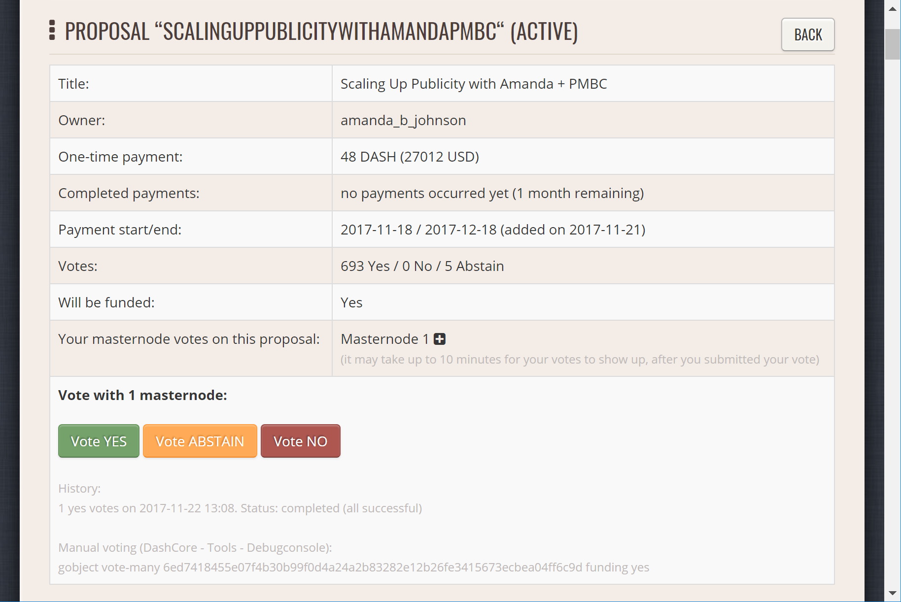

   Voting interface on DashCentral

Dash Masternode Tool (DMT)
--------------------------

If you started your masternode from a hardware wallet using `DMT
<https://github.com/Bertrand256/dash-masternode-tool/releases>`_, you
can also use the tool to cast votes. Click **Tools > Proposals** and
wait for the list of proposals to load. You can easily see the voting
status of each proposal, and selecting a proposal shows details on the
**Details** tab in the lower half of the window. Switch to the **Vote**
tab to **Vote Yes**, **Vote No** or **Vote Abstain** directly from DMT.

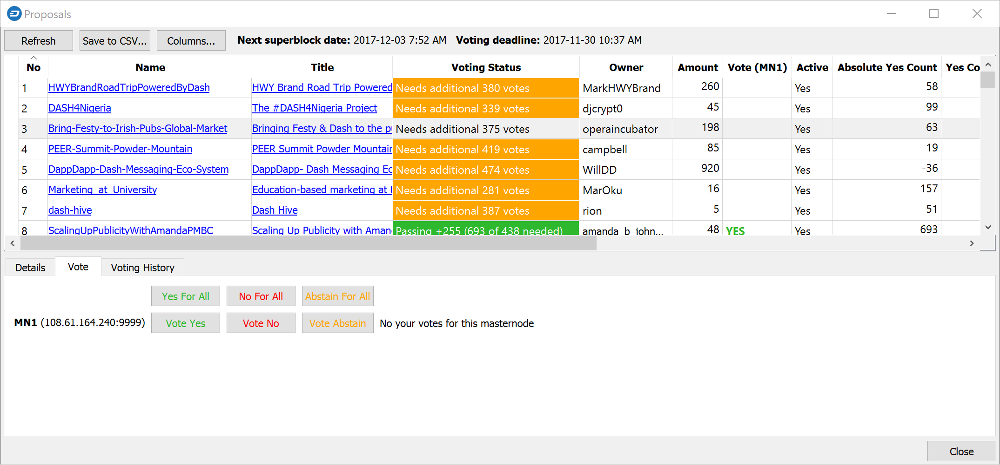

   Voting interface in DMT

.. _dash-core-voting:

Dash Core wallet or masternode
------------------------------

To vote from the Dash Core wallet console or through ``dash-cli``, the wallet
must contain the private key for your masternode's registered voting address.
Unlock an encrypted wallet before voting.

Use ``gobject list`` to find proposals and their IDs (shown as hashes)::

  gobject list

To vote with every valid masternode whose voting key is present in the wallet,
use one of these commands, replacing ``<proposal-hash>`` with the proposal's
actual proposal ID::

  gobject vote-many <proposal-hash> funding yes
  gobject vote-many <proposal-hash> funding no
  gobject vote-many <proposal-hash> funding abstain

To vote with one masternode, use ``vote-alias`` and supply its ProTx hash::

  gobject vote-alias <proposal-hash> funding yes <protx-hash>

Replace ``yes`` with ``no`` or ``abstain`` as appropriate. The ProTx hash
identifies the masternode registration; it is not the proposal hash.

For command-line use, prefix the command with ``dash-cli`` and run it against
the node with the wallet containing the voting key::

  dash-cli gobject vote-alias <proposal-hash> funding yes <protx-hash>

Check the response to confirm that your votes succeeded and review any
error messages.

.. _delegating-votes:

Delegating votes
----------------

Masternodes feature a key designated only for voting,
which makes it possible to delegate your vote to a representative.
Simply enter a Dash address provided by the delegate when
:ref:`registering your masternode <masternode-setup>`, or :ref:`update
<dip3-update-registrar>` your masternode registration to delegate the
vote of a running masternode. The wallet controlling the private key to
this address will then cast votes on behalf of this masternode owner
simply by following the :ref:`Dash Core voting procedure <dash-core-voting>` 
described above. No further configuration is required.
