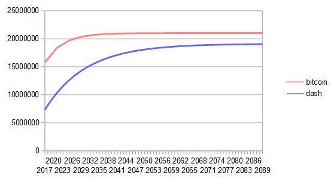
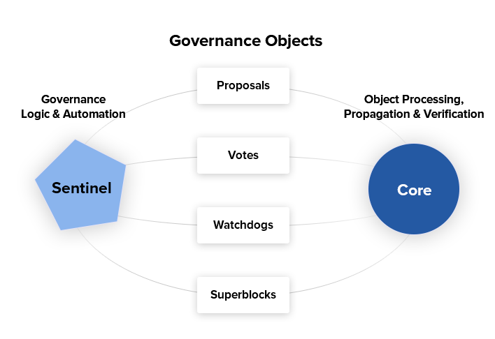

.. meta::
   :description: Dash features several unique value propositions including masternodes, CoinJoin, InstantSend and a decentralized governance system
   :keywords: dash, cryptocurrency, features, masternodes, coinjoin, privatesend, instantsend, sporks, x11, dgw, governance, sentinel, evolution

.. _features:

========
Features
========

.. _specifications:

Specifications
==============

- First block mined at 11PM EST, 18th January 2014
- No premine
- X11 hashing algorithm, CPU/GPU/ASIC mining available
- 2.6 minute block time, 2MB blocks, ~56 transactions per second
- Block subsidy decreases by 7.14% per year
- Dark Gravity Wave difficulty adjustment algorithm
- Between 17.74M and 18.92M total coin supply
- Decentralized second-tier masternode network
- Superior privacy using CoinJoin
- Instant transactions using InstantSend
- Protection against blockchain reorganization events (commonly called 
  51% attacks) using ChainLocks
- Decentralized Governance By Blockchain allows masternode owners to
  vote on budget proposals and decisions that affect Dash

.. _masternode-network:

Masternodes
===========

In addition to traditional Proof of Work (PoW) rewards for mining Dash,
users are also rewarded for running and maintaining special servers
called masternodes. Thanks to this innovative two tier network, Dash can
offer innovative features in a trustless and decentralized way.
Masternodes are used to power CoinJoin, InstantSend, and the
governance and treasury system. Users are rewarded for running
masternodes; a percentage of the block reward is allocated to pay the masternode
network. The current percentage can be found in :ref:`this table <block-reward-reallocation>`.
You can view practical guides on all topics relating to
masternodes :ref:`here <masternodes>`.

Masternodes enable the following services:

-  **InstantSend** allows for near-instant transactions. Dash
   InstantSend transactions are fully confirmed within two seconds.
-  **CoinJoin** gives financial privacy through a decentralized
   implementation of CoinJoin.
-  **ChainLocks**, which protects the blockchain against 51% mining 
   attacks by signing blocks as they are mined.
-  **Governance and Treasury** allows stakeholders in Dash to determine
   the direction of the project and devotes 20% of the block subsidy to
   development of the project and ecosystem.
-  **Dash Evolution** will make using cryptocurrency as easy as using
   PayPal.

Masternode owners must have possession of 1000 DASH, which they prove by
signing a message included in a special transaction written to the
blockchain. The Dash can be moved or spent at any time, but doing so
will cause the masternode to fall out of queue and stop earning rewards.
Masternode users are also given **voting rights** on proposals. Each
masternode has one vote and this vote can be used on budget proposals or
important decisions that affect Dash.

Masternodes cost money and effort to host so they are paid a percentage
of the block reward as an incentive. Because only one masternode is paid
in each block, the frequency of the payment can vary, as well as the
value of the Dash paid out. This `tool <https://stats.masternode.me/>`_
shows a live calculation of masternode earnings. These rewards decrease
by 7% each year, together with the block subsidy. There is also the
possibility for masternodes to earn money from fees in the future.

Evolution Masternodes (evonodes)
--------------------------------

Evolution Masternodes (evonodes) are a subset of Masternodes that have 
been created to host the Dash Platform. An evonode is a lot like Masternodes 
with these differences:

+----------------+-----------------------------------+-----------------------------------------------------+
|                | Masternode                        | Evolution Masternode                                |
+================+===================================+=====================================================+
| Collateral     | 1000 DASH                         | 4000 DASH (4X the collateral for normal masternodes)|
+----------------+-----------------------------------+-----------------------------------------------------+
| Specs          | Lesser than evonodes              | Higher than normal masternodes                      |
+----------------+-----------------------------------+-----------------------------------------------------+
| Service        | Only Dash Core                    | Both Dash Core and Platform                         |
+----------------+-----------------------------------+-----------------------------------------------------+
| Voting Weight  | 1 node gets 1 vote                | Has 4 times the voting power of a normal masternode |
+----------------+-----------------------------------+-----------------------------------------------------+

.. _coinjoin:

CoinJoin
========

CoinJoin gives you consumer grade financial privacy by
shuffling your Dash with other users. All the Dash in your wallet
consists of different inputs, which you can think of as separate,
discrete coins. It uses an innovative process to join your inputs with
the inputs of at least two other people in a single transaction, so the
value in Dash never leaves your wallet. You retain control of your money
at all times.

You can view a practical guide to use CoinJoin
:ref:`here <dashcore-coinjoin-instantsend>`.

The CoinJoin process works like this:

#. CoinJoin begins by breaking your transaction inputs down into
   standard denominations. These denominations are 0.001, 0.01, 0.1, 1
   and 10 Dash -- much like the paper money you use every day.
#. Your wallet then sends requests to specially configured software
   nodes on the network called masternodes. These masternodes are
   informed then that you are interested in creating a certain
   denomination using CoinJoin. No identifiable information is sent to
   the masternodes, so they never know who you are.
#. When two other people send similar messages, indicating that they
   wish to join coins of the same denomination, a session begins. The
   masternode instructs all three users’ wallets to pay the
   now-transformed inputs to themselves. Your wallet pays that
   denomination directly to itself but in a different address (called a
   change address).
#. Your wallet can repeat this process a number of times with each
   denomination. Each time the process is completed it’s called a
   "round." The user may choose between 2-16 rounds of CoinJoin.
#. Your funds will pass through at least the number of rounds you
   specify. Dash 0.16 includes an update known as `Random Round CoinJoin
   <https://github.com/dashpay/dash/pull/3661>`__ which will join a
   given denomination by up to three extra rounds to further improve
   privacy.
#. This process happens in the background without any intervention on
   your part. When you wish to make a transaction using your denominated
   funds no additional waiting will be required.

Note that CoinJoin transactions will be rounded up so that all
transaction inputs are spent. Any excess Dash will be spent on the
transaction fee.

**IMPORTANT:** Your wallet only contains 1000 of these change addresses.
Every time a CoinJoin transaction is created, one of your addresses is
used up. Once enough of them are used, your wallet must create more
addresses. It can only do this, however, if you have automatic backups
enabled. Consequently, users who have backups disabled will also have
CoinJoin disabled.

.. _instantsend:

InstantSend
===========

Traditional decentralized cryptocurrencies must wait for certain period 
of time for enough blocks to pass to ensure that a transaction is both 
irreversible and not an attempt to double-spend money which has already 
been spent elsewhere. This process is time-consuming, and may take 
anywhere from 15 minutes to one hour for the widely accepted number of 
six blocks to accumulate. Other cryptocurrencies achieve faster 
transaction confirmation time by centralizing authority on the network 
to various degrees.

Dash suffers from neither of these limitations thanks to its 
second-layer network of masternodes. Masternodes regularly form voting
quorums to check whether or not a submitted transaction is valid. If it
is valid, the masternodes "lock" the inputs for the transaction and
broadcast this information to the network, effectively promising that
the transaction will be included in subsequently mined blocks and not
allowing any other spending of these inputs during the confirmation time
period.

InstantSend technology will allow for cryptocurrencies such as Dash to 
compete with nearly instantaneous transaction systems such as credit 
cards for point-of-sale situations while not relying on a centralized 
authority. Widespread vendor acceptance of Dash and InstantSend could
revolutionize cryptocurrency by shortening the delay in confirmation of
transactions from as long as an hour (with Bitcoin) to as little as a 
few seconds.

You can view a practical guide to use InstantSend 
:ref:`here <dashcore-coinjoin-instantsend>`. InstantSend was
introduced in a whitepaper called `Transaction Locking and Masternode 
Consensus: A Mechanism for Mitigating Double Spending Attacks <https://github.com/dashpay/docs/blob/master/binary/Dash%20Whitepaper%20-%20Transaction%20Locking%20and%20Masternode%20Consensus.pdf>`_, 
and further improved through the introduction of `LLMQ-based InstantSend
<https://github.com/dashpay/dips/blob/master/dip-0010.md>`__ in Dash
0.14.

**How Dash 'InstantSend' Protects Merchants from Double Spends**,
Dash Detailed by Amanda B. Johnson, 16 September 2016

.. raw:: html

    

        <iframe src="https://www.youtube-nocookie.com/embed/HJx82On8jig?modestbranding=1&rel=0" frameborder="0" allowfullscreen style="position: absolute; top: 0; left: 0; width: 100%; height: 100%;"></iframe>
    

.. _chainlocks:

ChainLocks
==========

ChainLocks are a feature provided by the Dash Network which provides
certainty when accepting payments. This technology, particularly when
used in parallel with :ref:`InstantSend <instantsend>`, creates an
environment in which payments can be accepted immediately and without
the risk of “Blockchain Reorganization Events”.

The risk of blockchain reorganization is typically addressed by
requiring multiple “confirmations” before a transaction can be safely
accepted as payment. This type of indirect security is effective, but at
a cost of time and user experience. ChainLocks are a solution for this
problem.

ChainLocks Process Overview
---------------------------

Every twelve hours a new “LLMQ” (Long-Living Masternode Quorum) is
formed using a “DKG” (Distributed Key Generation) process. All members
of this Quorum are responsible for observing, and subsequently
affirming, newly mined blocks:
  
  1. Whenever a block is mined, Quorum Members will broadcast a signed
     message containing the observed block to the rest of the Quorum.

  2. If 60% or more of the Quorum sees the same new block they will
     collectively form a “CLSIG” (ChainLock Signature) message which
     will be broadcast to the remainder of the network.

  3. When a valid ChainLock Signature is received by a client on the network,
     it will reject all blocks at the same height that do not match the block
     specified in that message.

The result is a quick and unambiguous decision on the “correct”
blockchain for integrated clients and wallets. From a security
perspective, this also makes reorganizations prior to this block
impossible. See `DIP0008 ChainLocks <https://github.com/dashpay/dips/blob/master/dip-0008.md>`__ 
for a full description of how ChainLocks work.

.. _sporks:

Sporks
======

In response to unforeseen issues with the rollout of the major "RC3"
update in June 2014, the Dash development team created a mechanism by
which updated code is released to the network, but not immediately made
active ("enforced"). This innovation allows for far smoother transitions
than in the traditional hard fork paradigm, as well as the collection of
test data in the live network environment. This process of multi-phased
forking was originally to be called "soft forking" but the community
affectionately dubbed it "the spork" and the name stuck.

New features or versions of Dash undergo extensive testing on testnet
before they are released to the main network. When a new feature or
version of Dash is released on mainnet, communication is sent out to
users informing them of the change and the need for them to update their
clients. Those who update their clients run the new code, but it is not
activated until a sufficient percentage of network participants (usually
80%) reach consensus on running it. In the event of errors occurring
with the new code, the client’s blocks are not rejected by the network
and unintended forks are avoided. Data about the error can then be
collected and forwarded to the development team. Once the development
team is satisfied with the new code’s stability in the mainnet
environment – and once acceptable network consensus is attained –
enforcement of the updated code can be activated remotely by multiple
members of the core development team signing a network message together
with their respective private keys. Should problems arise, the code can
be deactivated in the same manner, without the need for a network-wide
rollback or client update. For technical details on individual sporks,
see :ref:`here <understanding-sporks>`.

.. _x11-hash-algorithm:

X11 Hash Algorithm
==================

X11 is a widely used hashing algorithm created by Dash core developer
Evan Duffield. X11’s chained hashing algorithm utilizes a sequence of
eleven scientific hashing algorithms for the proof-of-work. This is so
that the processing distribution is fair and coins will be distributed
in much the same way Bitcoin’s were originally. X11 was intended to make
ASICs much more difficult to create, thus giving the currency plenty of
time to develop before mining centralization became a threat. This
approach was largely successful; as of early 2016, ASICs for X11 now
exist and comprise a significant portion of the network hashrate, but
have not resulted in the level of centralization present in Bitcoin.
Information on mining with X11 can be found in the :ref:`Mining
<mining>` section of this documentation.

X11 is the name of the chained proof-of-work (**PoW**) algorithm that
was introduced in Dash (launched January 2014 as "Xcoin"). It was 
partially inspired by the chained-hashing approach of Quark, adding
further "depth" and complexity by increasing the number of hashes, yet
it differs from Quark in that the rounds of hashes are determined *a
priori* instead of having some hashes being randomly picked.

The X11 algorithm uses multiple rounds of 11 different hashes (blake,
bmw, groestl, jh, keccak, skein, luffa, cubehash, shavite, simd, echo),
thus making it one of the safest and more sophisticated cryptographic
hashes in use by modern cryptocurrencies. The name X11 is not related to
the open source X11 windowing system common on UNIX-like operating 
systems.

Advantages of X11
-----------------

The increased complexity and sophistication of the chained algorithm
provides enhanced levels of security and less uncertainty for a digital
currency, compared to single-hash PoW solutions that are not protected
against security risks like SPOF (Single Point Of Failure). For example,
a possible but not probable computing breakthrough that "breaks" the
SHA256 hash could jeopardize the entire Bitcoin network until the
network shifts through a hard fork to another cryptographic hash.

In the event of a similar computing breakthrough, a digital currency
using the X11 PoW would continue to function securely unless all 11
hashes were broken simultaneously. Even if some of the 11 hashes were to
prove unreliable, there would be adequate warning for a currency using
X11 to take measures and replace the problematic hashes with other more
reliable hashing algorithms.

Given the speculative nature of digital currencies and their inherent
uncertainties as a new field, the X11 algorithm can provide increased
confidence for its users and potential investors that single-hash
approaches cannot. Chained hashing solutions, like X11, provide
increased safety and longevity for store of wealth purposes, investment
diversification and hedging against risks associated with single-hash
currencies plagued by SPOF (Single Point Of Failure).

Evan Duffield, the creator of Dash and X11 chained-hash, has written on
several occasions that X11 was integrated into Dash not with the
intention to prevent ASIC manufacturers from creating ASICs for X11 in
the future, but rather to provide a similar migratory path that Bitcoin
had (CPUs, GPUs, ASICs).

.. _dark-gravity-wave:

Dark Gravity Wave
=================

**DGW** or *Dark Gravity Wave* is an open source difficulty-adjusting
algorithm for Bitcoin-based cryptocurrencies that was first used in Dash
and has since appeared in other digital currencies. DGW was authored by 
Evan Duffield, the developer and creator of Dash, as a response to a 
time-warp exploit found in *Kimoto's Gravity Well*. In concept, DGW is 
similar to the Kimoto Gravity Well, adjusting the difficulty levels 
every block (instead of every 2016 blocks like Bitcoin) based on 
statistical data from recently found blocks. This makes it possible to 
issue blocks with relatively consistent times, even if the hashing power
experiences high fluctuations, without suffering from the time-warp 
exploit.

- Version 2.0 of DGW was implemented in Dash from block 45,000 onwards 
  in order to completely alleviate the time-warp exploit.

- Version 3.0 was implemented on May 14 of 2014 to further improve 
  difficulty re-targeting with smoother transitions. It also fixes 
  issues with various architectures that had different levels of 
  floating-point accuracy through the use of integers.

.. _emission-rate:

Emission Rate
=============

Cryptocurrencies such as Dash and Bitcoin are created through a
cryptographically difficult process known as mining. Mining involves
repeatedly solving :ref:`hash algorithms <x11-hash-algorithm>` until a
valid solution for the current :ref:`mining difficulty 
<dark-gravity-wave>` is discovered. Once discovered, the miner is 
permitted to create new units of the currency. This is known as the 
block subsidy. To ensure that the currency is not subject to endless 
inflation, the block subsidy is reduced at regular intervals, as `shown 
in this calculation
<https://docs.google.com/spreadsheets/d/1HqgEkyfZDAA6pIZ3df2PwFE8Z430SVIzQ-mCQ6wGCh4/edit#gid=523620673>`_.
Graphing this data results in a curve showing total coins in 
circulation, known as the coin emission rate.

While Dash is based on Bitcoin, it significantly modifies the coin
emission rate to offer a smoother reduction in coin emission over time.
While Bitcoin reduces the coin emission rate by 50% every 4 years, Dash
reduces the emission by one-fourteenth (approx. 7.14%) every 210240
blocks (approx. 383.25 days). It can be seen that reducing the block
subsidy by a smaller amount each year offers a smoother transition to a
fee-based economy than Bitcoin.

   Bitcoin vs. Dash coin emission rate

Total coin emission
-------------------

`Bitcoin's total coin emission <https://docs.google.com/spreadsheets/d/1
2tR_9WrY0Hj4AQLoJYj9EDBzfA38XIVLQSOOOVePNm0/pubhtml?gid=0&single=true>`_
can be calculated as the sum of a geometric series, with the total
emission approaching (but never reaching) 21,000,000 BTC. This will
continue until 2140, but the mining subsidy reduces so quickly that 99%
of all bitcoin will be in circulation by 2036, and 99.9% by 2048.

`Dash's total coin emission <https://docs.google.com/spreadsheets/d
/1JUK4Iy8pjTzQ3Fvc-iV15n2qn19fmiJhnKDDSxebbAA/edit#gid=205877544>`_ is
also the sum of a geometric series, but the ultimate total coin emission
is uncertain because it cannot be known how much of the 20% block subsidy
reserved for budget proposals will actually be allocated, since this
depends on future voting behavior. Dash will continue to emit coins for
approximately 192 years before a full year of mining creates less than 1
DASH. After 2209 only 14 more DASH will be created. The last DASH will
take 231 years to be generated, starting in 2246 and ending when
emission completely stops in 2477. Based on these numbers, a maximum and
minimum possible coin supply in the year 2254 can be calculated to be
between:

+-----------------+-----------------------------------+
| 17,742,696 DASH | Assuming zero treasury allocation |
+-----------------+-----------------------------------+
| 18,921,005 DASH | Assuming full treasury allocation |
+-----------------+-----------------------------------+

Block reward allocation
-----------------------

Unlike Bitcoin, which allocates 100% of the block subsidy to miners, Dash
holds back part of the block subsidy for use in the decentralized
:ref:`budget system <decentralized-governance>`. The remainder of the
block subsidy, as well as any transaction fees, is split between the
:ref:`miner <mining>` and a :ref:`masternode <masternodes>`, which is
deterministically selected according to the :ref:`payment logic
<payment-logic>`. Dash features superblocks, which appear every 16616
blocks (approx. 30.29 days) and can release the cumulative governance
budget held back over that :ref:`budget cycle period <budget-cycles>` to
the winning proposals in the budget system. Depending on budget
utilization, this results in an approximate coin allocation over
a budget cycle as follows:

+-----+----------------------------------------+
| 80% | Mining and Masternode Reward           |
+-----+----------------------------------------+
| 20% | Decentralized Governance Budget        |
+-----+----------------------------------------+

When the Dash Core v20 hard fork activates, Dash's governance budget will grow
to 20% of the block subsidy per the governance proposal approved in September
2023. Additional details can be found in the :ref:`Treasury expansion section
<block-subsidy-reallocation-treasury-expansion>`.

.. _block-subsidy-reallocation-treasury-expansion:

Treasury expansion
^^^^^^^^^^^^^^^^^^

In September of 2023, the Dash network approved a `proposal
<https://www.dashcentral.org/p/TREASURY-REALLOCATION-60-20-20>`__ to double the
governance budget by modifying the block subsidy allocation. The new allocation
designates 20% for miners, 20% for the governance system budget, and 60% for
masternodes. The expansion will go into effect upon activation of the Dash Core
v20 hard fork.

+-----+----------------------------------------+
| 20% | Mining Reward                          |
+-----+----------------------------------------+
| 20% | Decentralized Governance Budget        |
+-----+----------------------------------------+
| 60% | Masternode Reward                      |
+-----+----------------------------------------+

Miner and masternode reallocation
^^^^^^^^^^^^^^^^^^^^^^^^^^^^^^^^^

.. note::

   This block reward reallocation process was superseded by the :ref:`treasury
   expansion <block-subsidy-reallocation-treasury-expansion>` approved by the
   network in 2023. The information below is retained for reference but has been
   obsolete since the Dash Core v20 activation.

On 13 August 2020, the Dash network approved a `proposal
<https://www.dashcentral.org/p/decision-proposal-block-reward-reallocat>`__
to modify the block reward allocation from 50/50 between miners and
masternodes to 40/60, respectively. The incremental reallocation adjusts 
the percentage share every three superblock cycles.

.. _block-reward-reallocation:

.. dropdown:: Deprecated block reward reallocation process

   The following table shows the incremental reallocation process and indicates the 
   current reallocation date. Reward reallocation changes began at the first superblock 
   following activation and now occur every three superblock cycles (approximately 
   once per quarter) until the reallocation is complete. 

   +-------------+-----------+--------------+------------+---------------------+
   | Adjustment  | Miner %   | Masternode % | Change (%) |  Reallocation Dates |
   +=============+===========+==============+============+=====================+
   | 0           | 50.0      | 50.0         | 0.00%      |         ---         |
   +-------------+-----------+--------------+------------+---------------------+
   | 1           | 48.7      | 51.3         | 1.30%      |     2020-11-28      |
   +-------------+-----------+--------------+------------+---------------------+
   | 2           | 47.4      | 52.6         | 1.30%      |     2021-02-27      |
   +-------------+-----------+--------------+------------+---------------------+
   | 3           | 46.7      | 53.3         | 0.70%      |     2021-05-29      |
   +-------------+-----------+--------------+------------+---------------------+
   | 4           | 46.0      | 54.0         | 0.70%      |     2021-08-28      |
   +-------------+-----------+--------------+------------+---------------------+
   | 5           | 45.4      | 54.6         | 0.60%      |     2021-11-27      |
   +-------------+-----------+--------------+------------+---------------------+
   | 6           | 44.8      | 55.2         | 0.60%      |     2022-02-25      |
   +-------------+-----------+--------------+------------+---------------------+
   | 7           | 44.3      | 55.7         | 0.50%      |     2022-05-27      |
   +-------------+-----------+--------------+------------+---------------------+
   | 8           | 43.8      | 56.2         | 0.50%      |     2022-08-26      |
   +-------------+-----------+--------------+------------+---------------------+
   | 9           | 43.3      | 56.7         | 0.50%      |     2022-11-25      |
   +-------------+-----------+--------------+------------+---------------------+
   | 10          | 42.8      | 57.2         | 0.50%      |     2023-02-24      |
   +-------------+-----------+--------------+------------+---------------------+
   | 11          | 42.3      | 57.7         | 0.50%      |     2023-05-26      |
   +-------------+-----------+--------------+------------+---------------------+
   | 12          | 41.8      | 58.2         | 0.50%      |     2023-08-25      |
   +-------------+-----------+--------------+------------+---------------------+
   | 13 (Final)  | 41.5      | 58.5         | 0.30%      |     2023-11-24      |
   +-------------+-----------+--------------+------------+---------------------+
   | 14          | 41.2      | 58.8         | 0.30%      |     2024-02-23      |
   +-------------+-----------+--------------+------------+---------------------+
   | 15          | 40.9      | 59.1         | 0.30%      |     2024-05-24      |
   +-------------+-----------+--------------+------------+---------------------+
   | 16          | 40.6      | 59.4         | 0.30%      |     2024-08-22      |
   +-------------+-----------+--------------+------------+---------------------+
   | 17          | 40.3      | 59.7         | 0.30%      |     2024-11-21      |
   +-------------+-----------+--------------+------------+---------------------+
   | 18          | 40.1      | 59.9         | 0.20%      |     2025-02-20      |
   +-------------+-----------+--------------+------------+---------------------+
   | 19          | 40.0      | 60.0         | 0.10%      |     2025-05-22      |
   +-------------+-----------+--------------+------------+---------------------+

   This documentation is based on calculations and posts by moocowmoo.
   Please see `this reddit post <https://www.reddit.com/r/dashpay/comments/
   7fc2on/dash_over_1000_in_a_few_weeks/dqb4pjn/>`_ for more details, or
   run your own `emission calculations using this tool
   <https://repl.it/@moocowmoo/dash-minmax-coin-generation>`_. See `this
   site <https://stats.masternode.me>`_ for live data on current network
   statistics.

.. _decentralized-governance:

Decentralized Governance
========================

Decentralized Governance by Blockchain, or DGBB, is Dash's attempt to
solve two important problems in cryptocurrency: governance and funding.
Governance in a decentralized project is difficult, because by
definition there are no central authorities to make decisions for the
project. In Dash, such decisions are made by the Decentralized Autonomous
Organization (DAO). The DAO allows each masternode to vote once (yes/no/abstain) 
for each proposal. If a proposal passes, it can then be implemented (or not) 
by Dash's developers. A key example is early in 2016, when Dash's Core Team 
submitted a proposal to the network asking whether the blocksize should be 
increased to 2 MB. Within 24 hours, consensus had been reached to approve this 
change. Compare this to Bitcoin, where debate on the blocksize has been raging 
for nearly three years.

DAO also provides a means for Dash to fund its own development. While 
other projects have to depend on donations or premined endowments, Dash 
uses 20% of the block subsidy to fund its own development. Every time a 
block is mined, 80% of the subsidy is split between the miner and
a masternode per the distribution found :ref:`here <block-reward-reallocation>`,
while the remaining 20% is not created until the end of the
month. During the month, anybody can make a budget proposal to the
network. If that proposal receives net approval of at least 10% of the
masternode network, then at the end of the month a
"superblock" will be created. At that time, the block subsidy that was
not paid out (20% of each block) will be used to fund approved
proposals. The network thus funds itself by reserving 20% of the block
subsidy for budget projects.

You can read more about Dash governance in the :ref:`governance` section
of this documentation.

.. _sentinel:

Sentinel
=========

.. attention::

   Sentinel was deprecated in Dash Core v20.0 when its functionality was
   integrated into Dash Core.

Introduced in Dash 0.12.1, Sentinel is an autonomous agent for
persisting, processing and automating Dash governance objects and tasks.
Sentinel is implemented as a Python application that binds to a local
version dashd instance on each Dash masternode.

A Governance Object (or "govObject") is a generic structure introduced
in Dash 0.12.1 to allow for the creation of Budget Proposals and
Triggers. Class inheritance has been utilized to extend this generic
object into a "Proposal" object to supplant the current Dash budget
system.

   Diagram highlighting the relationship between Dash Sentinel and Core

.. _fees:

Fees
====

Transactions on the Dash network are recorded in blocks on the
blockchain. The size of each transaction is measured in bytes, but there
is not necessarily a correlation between high value transactions and the
number of bytes required to process the transaction. Instead,
transaction size is affected by how many input and output addresses are
involved, since more data must be written in the block to store this
information. Each new block is generated by a miner, who is paid for
completing the work to generate the block with a block reward. In order
to prevent the network from being filled with spam transactions, the
size of each block is artificially limited. As transaction volume
increases, the space in each block becomes a scarce commodity. Because
miners are not obliged to include any transaction in the blocks they
produce, once blocks are full, a voluntary transaction fee can be
included as an incentive to the miner to process the transaction. Most
wallets include a small fee by default, although some miners will
process transactions even if no fee is included.

The release of Dash 0.12.2.0 and activation of DIP0001 saw a
simultaneous reduction of fees by a factor of 10, while the block size
was increased from 1MB to 2MB to promote continued growth of low-cost
transactions even as the cost of Dash rises. Dash 0.13.0.0 introduced
InstantSend autolocks, which caused masternodes to automatically attempt
to lock any transaction with 4 or fewer inputs — which are referred to
as “simple” transactions — and removed the additional fee for
InstantSend. 0.14.0.0 then removed the limitation on 4 inputs, so the
network will attempt to lock all transactions. The current fee schedule
for Dash is as follows:

+------------------------+------------------+-------------------------------------+
| Transaction type       | Recommended fee  | Per unit                            |
+========================+==================+=====================================+
| CoinJoin               | 0.001 DASH       | Per 10 rounds of CoinJoin (average) |
+------------------------+------------------+-------------------------------------+
| All other transactions | 0.00001 DASH     | Per kB of transaction data          |
+------------------------+------------------+-------------------------------------+

As an example, a standard and relatively simple transaction on the Dash
network with one input, one output and a possible change address
typically fits in the range of 200 - 400 bytes. Assuming a price of
US$100 per DASH, the fee falls in the range of $0.0002 - $0.0004, or
1/50th of a cent. InstantSend locking will be attempted on all transactions
without any extra charge.

:ref:`CoinJoin` works by creating denominations of 10, 1, 0.1, 0.01
and 0.001 DASH and then creating CoinJoin transactions with other users
using these denominations. Creation of the denominations is charged at
the default fee for a standard transaction. Using CoinJoin is free, but
to prevent spam attacks, an average of one in ten CoinJoin transactions
are charged a fee of 0.0001 DASH. Spending denominated inputs using
CoinJoin incurs the usual standard fees, but to avoid creating a
potentially identifiable change address, the fee is always rounded up to
the lowest possible denomination. This is typically 0.001 DASH, so it is
important to deduct the fee from the amount being sent if possible to
minimise fees. Combining InstantSend and CoinJoin may be expensive
due to this requirement and the fact that a CoinJoin transaction may
require several inputs, while InstantSend charges a fee of 0.0001 DASH
per input. Always check your fees before sending a transaction.

.. _evolution:

Evolution
==========

`Dash Evolution <https://www.dash.org/roadmap/>`_ is the code name for a
decentralized platform built on Dash blockchain technology. The goal is
to provide simple access to the unique features and benefits of Dash to
assist in the creation of decentralized technology. Dash introduces a
tiered network design, which allows users to do various jobs for the
network, along with decentralized API access and a decentralized file
system.

Dash Evolution will be released in stages. Dash Core releases 0.12.1 
through to 0.12.3 lay the groundwork for the decentralized features 
behind the scenes. Version 0.13 introduces the foundation of Evolution,
specifically `DIP2 Special Transactions <https://github.com/dashpay/dips/blob/master/dip-0002.md>`__ 
and `DIP3 Deterministic Masternode Lists <https://github.com/dashpay/dips/blob/master/dip-0003.md>`__.
Version 0.14 establishes `DIP6 Long Living Masternode Quorums <https://github.com/dashpay/dips/blob/master/dip-0006.md>`__.
Expected in late 2019, Dash Core 1.0 will introduce key Evolution
features such as username-based payments, the world's first
decentralized API (DAPI) and a decentralized data storage system (Drive)
based on IPFS.

Included below is our current work on Evolution, that adds many
components such as:

- **Drive:** A decentralized shared file system for user data that
  lives on the second tier network
- **DAPI:** A decentralized API which allows third tier users to access
  the network securely
- **DashPay Decentralized Wallets:** These wallets are light clients
  connected to the network via DAPI and run on various platforms
- **Second Tier:** The masternode network, which provides compensated
  infrastructure for the project
- **Budgets:** The second tier is given voting power to allocate funds 
  for specific projects on the network via the budget system
- **Governance:** The second tier is given voting power to govern the
  currency and chart the course the currency takes
- **Deterministic Masternode Lists:** This feature introduces an 
  on-chain masternode list, which can be used to calculate past and 
  present quorums
- **Social Wallet:** We introduce a social wallet, which allows friends
  lists, grouping of users and shared multisig accounts

Evolution Previews
------------------

**Dash Dapps - Demoing Community Development on environment**, 17 August
2020

.. raw:: html

    

        <iframe src="https://www.youtube-nocookie.com/embed/yy8gO1C8fTs?modestbranding=1&rel=0" frameborder="0" allowfullscreen style="position: absolute; top: 0; left: 0; width: 100%; height: 100%;"></iframe>
    

The following videos featuring Dash Founder Evan Duffield and Head of
UI/UX Development Chuck Williams describe the development process and
upcoming features of the Dash Evolution platform.

**Evolution Demo #1 - The First Dash DAP**, 16 March 2018

.. raw:: html

    

        <iframe src="https://www.youtube-nocookie.com/embed/gbjYhZT2Ulc?modestbranding=1&rel=0" frameborder="0" allowfullscreen style="position: absolute; top: 0; left: 0; width: 100%; height: 100%;"></iframe>
    

**Evolution Demo #2 - Mobile Evolution**, 25 April 2018

.. raw:: html

    

        <iframe src="https://www.youtube-nocookie.com/embed/EtYax7iz4hU?modestbranding=1&rel=0" frameborder="0" allowfullscreen style="position: absolute; top: 0; left: 0; width: 100%; height: 100%;"></iframe>
    

**Evolution Demo #3 - Dashpay User Experience**, 15 May 2018

.. raw:: html

    

        <iframe src="https://www.youtube-nocookie.com/embed/ZJVW9iUHqLg?modestbranding=1&rel=0" frameborder="0" allowfullscreen style="position: absolute; top: 0; left: 0; width: 100%; height: 100%;"></iframe>
    

**Chuck Williams on Evolution**, Dash Conference London, 14 September 2017

.. raw:: html

    

        <iframe src="https://www.youtube-nocookie.com/embed/b-XL_ddWCwQ?modestbranding=1&rel=0" frameborder="0" allowfullscreen style="position: absolute; top: 0; left: 0; width: 100%; height: 100%;"></iframe>
    

**Evan Duffield on the Evolution Roadmap**, Dash Force News, 28 June 
2017

.. raw:: html

    

        <iframe src="https://www.youtube-nocookie.com/embed/E65QixSRosw?modestbranding=1&rel=0" frameborder="0" allowfullscreen style="position: absolute; top: 0; left: 0; width: 100%; height: 100%;"></iframe>
    

