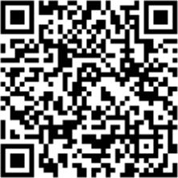

.. meta::
   :description: Glossary and collection of links to other parts of the Dash ecosystem and network
   :keywords: dash, cryptocurrency, glossary, links, dao, community, official, github, roadmap, chat, discord, facebook, twitter, telegram, social media

.. _information:

=====================
Links and Information
=====================

.. _links:

Links
=====

Official sites
--------------

- **Website:** https://www.dash.org
- **User documentation:** https://docs.dash.org
- **Dash Core Documentation:** https://docs.dash.org/core
- **Dash Platform Documentation:** https://docs.dash.org/platform
- **GitHub:** https://github.com/dashpay
- **GitHub (Evolution):** https://github.com/dashevo
- **Roadmap:** https://www.dash.org/roadmap/
- **DIPs:** https://github.com/dashpay/dips

Community sites
---------------

- https://dashdevs.org
- https://www.dashcentral.org
- https://www.dashninja.pl
- https://dashnews.org
- https://dashvotetracker.com
- http://thedashbrain.com

Forums
------

- **Dash Forum**: https://www.dash.org/forum/
- **BitcoinTalk thread:** https://bitcointalk.org/index.php?topic=421615.0

Chat
----

- **Dash Discord:** https://discord.com/invite/PXbUxJB
- **Dash Dapp Devs Discord:** https://chat.dashdevs.org
- **Dash English Telegram:** https://t.me/dash_chat
- **Dash Brasil Telegram:** https://telegram.me/dashbrasil
- **Dash Dinheiro Digital:** https://t.me/DashDinheiroDigital
- **Dash Russia Telegram:** https://telegram.me/Dash_Ru
- **Dash en Español Telegram:** https://t.me/dashpayES
- **Dash Embassy D-A-CH auf Deutsch Telegram:** https://t.me/dashembassydach
- **Dash France Telegram:** https://t.me/DashFrance
- **Dash Indonesia Telegram:** https://t.me/dashindonesia
- **Dash Iran Telegram:** https://t.me/IranianDash
- **Dash Italy Telegram:** https://t.me/dash_chat_italia
- **Dash LatAm Telegram:** https://t.me/DashAmericaLatina
- **Dash Philippines Telegram:** https://t.me/dashphp
- **Dash Thailand Telegram:** https://t.me/dashthailand
- **Dash Turkey Telegram:** https://t.me/dashturkey
- **Dash Telegram News Bot:** https://telegram.me/dashnews
- **QQ 达世币官方群 DASH.China:** 419967021
- **Freenode IRC:** #dashpay

Social media
------------

- **Reddit:** https://www.reddit.com/r/dashpay
- **Twitter:** https://twitter.com/dashpay
- **Steemit:** https://steemit.com/@dashpay
- **LinkedIn:** https://www.linkedin.com/company/dash---digitalcash-cryptocurrency-/
- **YouTube:** https://www.youtube.com/c/DashOrg
- **Instagram:** https://www.instagram.com/dashpay/
- **Dailymotion:** https://www.dailymotion.com/dashworld
- **Soundcloud:** https://soundcloud.com/dashpay
- **Minds:** https://www.minds.com/Dashpay
- **Pinterest:** https://www.pinterest.com/dashdigitalcash/

Facebook
--------

- **English (Official):** https://www.facebook.com/DashPay
- **Dash News En Español:** https://www.facebook.com/DashNewsEspanol
- **Dash Thailand:** https://www.facebook.com/DashDigitalCashTh/
- **Brazil:** https://www.facebook.com/DashBrazil
- **Denmark:** https://www.facebook.com/DashDenmark
- **Germany:** https://www.facebook.com/dashgermany
- **Greece:** https://www.facebook.com/DashGreece
- **Poland:** https://www.facebook.com/Dash.Polska
- **Russia:** https://www.facebook.com/Dash.Russia
- **Thailand:** https://www.facebook.com/groups/dashembassythailand
- **Vietnam:** https://www.facebook.com/dashvietnam

Twitter
-------

- **Dash Official Account:** https://twitter.com/dashpay
- **Samuel Westrich, CTO of Dash Core Group:** https://twitter.com/SamWestrich/
- **Joël Valenzuela, Chief Editor, Dash Force News:** https://twitter.com/TheDesertLynx
- **とみ三（Samurai33）, Dash Japan:** https://twitter.com/samurai3311

News
----

- **Digital Cash Network:** https://www.youtube.com/channel/UCduLugW5-tkzxIde8Iz72mw
- **Cash Alternative TV:** https://www.youtube.com/channel/UCeFCPtS8sViGO_NpKnS2rpg
- **Dash News:** https://dashnews.org
- **Dash News En Español (YouTube):** https://www.youtube.com/channel/UCG6Cuh8Q2eUt4NlZu4K-u8g
- **Dash News Korea:** https://dashnewskorea.com
- **Cointelegraph:** https://cointelegraph.com/tags/dash
- **巴比特 (8BTC):** https://www.8btc.com/p/dash
- **Dash News China (Wechat):** dashnews (or scan QR below)

Blogs
-----

- **Evan Duffield's blog:** https://medium.com/@eduffield222
- **Dashdot:** https://dashdot.io/alpha/

Wikipedia
---------

- `https://en.wikipedia.org/wiki/Dash_(cryptocurrency) <https://en.wikipedia.org/wiki/Dash_(cryptocurrency)>`_

Inactive
--------

- **Bitcoin.com forum:** https://forum.bitcoin.com/dash-f67
- **Crypto-city.com page:** https://www.crypto-city.com/index.php/dash-dash-coin
- **Bitco.in forum:** https://bitco.in/forum/threads/dash-digitalcash.891

Tools
=====

Block explorers, statistics and visualizations
----------------------------------------------

- https://insight.dash.org/insight/
- https://blockchair.com/dash
- https://chainz.cryptoid.info/dash/
- https://www.oklink.com/dash
- https://bitinfocharts.com/dash/explorer/
- https://dashblockexplorer.com
- https://live.blockcypher.com/dash/
- https://dash.tokenview.io
- https://udjinm6.github.io/bitlisten/

Treasury tools
--------------

- https://www.dashcentral.org
- https://dashvotetracker.com
- https://proposal.dash.org
- https://www.dashninja.pl/governance.html
- https://mnowatch.org/leaderboard/

Masternode management
---------------------

- https://www.dashninja.pl
- https://stats.masternode.me
- https://github.com/Bertrand256/dash-masternode-tool
- http://178.254.23.111/~pub/Dash/Dash_Info.html
- https://dash-news.de/dashtv/
- https://mnowatch.org/dash-stats/

Price monitoring and research
-----------------------------

- https://messari.io/asset/dash
- https://namu.wiki/w/Dash
- https://xangle.io/project/DASH/profile
- https://coinmarketcap.com/currencies/dash/
- https://bitinfocharts.com/dash/
- https://www.coingecko.com/en/coins/dash

Dash Community project
----------------------

- https://dashcommunity.github.io
- https://github.com/dashcommunity

DarkNet pages
-------------

- **Dash (Mirror of Main Page):** http://dashorg64cjvj4s3.onion
- **The Hidden Wiki:** `http://zqktlwi4fecvo6ri.onion/wiki/Dash_-_DigitalCash <http://zqktlwi4fecvo6ri.onion/wiki/Dash_-_DigitalCash>`_
- **MNOwatch.org:** http://mnowatchr2h5d5nekj2ogfzigxpgyi75hx2o7xjon4twpwhbsylgefid.onion/

Mobile Apps
===========

iOS
---

- **Dash Wallet:** https://apps.apple.com/app/id1206647026
- **Edge:** https://apps.apple.com/app/id1344400091
- **Coinomi:** https://apps.apple.com/app/id1333588809
- **Exodus:** https://apps.apple.com/app/id1414384820
- **CoinCap:** https://apps.apple.com/app/id1074052280
- **Abra:** https://apps.apple.com/app/id966301394

Android
-------

- **Dash Wallet:** https://play.google.com/store/apps/details?id=hashengineering.darkcoin.wallet
- **Edge:** https://play.google.com/store/apps/details?id=co.edgesecure.app
- **Coinomi:** https://play.google.com/store/apps/details?id=com.coinomi.wallet
- **Exodus:** https://play.google.com/store/apps/details?id=exodusmovement.exodus
- **CoinCap:** https://play.google.com/store/apps/details?id=io.coinCap.coinCap
- **Abra:** https://play.google.com/store/apps/details?id=com.plutus.wallet
- **Bitcoin Ticker Widget:** https://play.google.com/store/apps/details?id=st.brothas.mtgoxwidget
- **BitUniverse:** https://play.google.com/store/apps/details?id=com.bituniverse.portfolio

.. _glossary:

Glossary
========

.. glossary::

  51% Attack
    A condition in which more than half the computing power on a
    cryptocurrency network is controlled by a single miner or group of
    miners. That amount of power theoretically makes them the authority on
    the network. This means that every client on the network believes the
    attacker’s hashed transaction block.

  Address
    A Dash address is used to :ref:`Send/Receive a Payment 
    <dashcore-send-receive>` on the Dash network. It contains a string of
    alphanumeric characters, but can also be represented as a scannable QR
    code. A Dash address is also the public key in the pair of keys used 
    by Dash holders to digitally sign transactions (see Public key).

  Algorithm
    In mathematics and computer science, an `algorithm 
    <https://en.wikipedia.org/wiki/Algorithm>`_ is a self-contained 
    step-by-step set of operations to be performed. Algorithms perform 
    calculation, data processing, and/or automated reasoning tasks.

  Altcoin
    Since Bitcoin was the first cryptocurrency and has the largest market
    capitalization, it is considered as the reference. An altcoin, or
    alternative coin, is any cryptocurrency other than Bitcoin.

  AML
    Anti-Money Laundering techniques are used to stop people from making
    illegally obtained funds appear as though they have been earned
    legally. AML mechanisms can be legal or technical in nature.
    Regulators frequently apply AML techniques to Dash exchanges.

  API
    In computer programming, an `application programming interface (API) 
    <https://en.wikipedia.org/wiki/Application_programming_interface>`_ is
    a set of routines, protocols, and tools for building software and
    applications.

    An API expresses a software component in terms of its operations,
    inputs, outputs, and underlying types, defining functionalities that
    are independent of their respective implementations, which allows
    definitions and implementations to vary without compromising the
    interface. A good API makes it easier to develop a program by
    providing all the building blocks, which are then put together by the
    programmer.

  ASIC
    An application-specific integrated circuit (ASIC), is an integrated
    circuit (IC) customized for a particular use, rather than intended for
    general-purpose use. For example, a chip designed to run in a digital
    voice recorder or for :ref:`high-efficiency Dash mining <asic-mining>`
    is an ASIC.

  ATM / BTM
    A Dash ATM is a physical machine that allows a customer to buy Dash
    with cash. There are many manufacturers, some of which enable users to
    sell Dash for cash. They are also sometimes called 'BTMs' or 'Dash
    AVMS.' Dash is supported on several :ref:`ATMs <how-to-buy>`.

  Backlog
    Backlog generally refers to an accumulation over time of work waiting
    to be done or orders to be fulfilled.

  Backup
    The process of making copies of a computer file to ensure its
    integrity in case of loss, theft, or damage. Dash allows users to
    :ref:`make backup copies <dashcore-backup>` of their digital wallets.
    This protects against losing one's money in the event of a computer
    crashing or losing one’s mobile device. This would be the equivalent
    of being able to backup the cash in your wallet, so that if you lost
    it, you could restore the cash from a backup.

  Bitcoin 2.0
    This is a term explaining the next new level of Bitcoin projects which
    started as a fork of Bitcoin but extended their code into the next
    level of Blockchain Projects (Smart Contracts, Decentralised
    Voting,....)

  Blockchain
    A `blockchain <https://en.wikipedia.org/wiki/Block_chain_(database)>`_ 
    is a distributed database that maintains a continuously-growing list 
    of data records hardened against tampering and revision. It consists 
    of data structure blocks — which exclusively hold data in initial 
    blockchain implementations, and both data and programs in some of the 
    more recent implementations — with each block holding batches of 
    individual transactions and the results of any blockchain executables. 
    Each block contains a timestamp and information linking it to a 
    previous block.

  Blocks
    Transactions on the Blockchain are collected in "`blocks 
    <https://en.wikipedia.org/wiki/Block_chain_(database)#Blocks>`_" which 
    record and confirm when and in what sequence transactions enter and 
    are logged in the block chain. Blocks are created by users known as
    "miners" who use specialized software or equipment designed
    specifically to create blocks.

  ChainLock
    Defined in `DIP8
    <https://github.com/dashpay/dips/blob/master/dip-0008.md>`__,
    ChainLocks are a method of using an LLMQ to threshold sign a block
    immediately after it is propogated by the miner in order to enforce
    the first-seen rule. This is a powerful method of mitigating 51%
    mining attacks, which are associated with double spending.

  Cloud Wallet
    Third parties that will store your Dash on their servers for you, so
    that you can access your funds from any device connected to the
    internet. If their website is hacked or if their servers are damaged,
    you run the risk of losing your Dash. Any online wallets should be
    secured with strong passphrases and 2FA. You cannot make backup copies
    of your online wallet, because you do not have access to the private
    keys. We do not recommend that you store large quantities of funds in
    online wallets.

  Coinbase transaction
    The first transaction in a block. Always created by a miner, it
    includes a single input which constitutes the block reward. This is
    split between the miner and a deterministically chosen masternode.

  Cold Storage
    A method of generating and storing private keys completely offline.
    One could use a desktop or laptop computer disconnected from the
    internet, a dedicated hardware wallet, a USB stick, or a :ref:`paper
    wallet <dash-paper-wallet>`.

  Confirm(ed) Transaction
    When a Dash transaction is made, a miner must verify that the
    transaction is valid. When the inputs and outputs are verified, the
    transaction is included in a block in the blockchain. The transaction
    can then be considered complete and irreversible. The confirmation
    number increases as more blocks are added to the blockchain.

  Confirmation Number
  confirmations

    The number of confirmations for a specific Dash transaction. Zero
    confirmations means that the **transaction is unconfirmed**. One
    confirmation means that the transaction is included in the latest
    block in the blockchain. Two confirmations means the transaction is
    included in two blocks, three confirmations for three blocks, and so
    on. The probability of a transaction being reversed (double spent)
    diminishes exponentially with every block and subsequent confirmation.
    Six confirmations is usually considered "safe" and irreversible.

  Confirmed Transactions
    Transactions that are processed by miners and considered irreversible,
    usually after six confirmations. In the case of InstantSend, funds can
    be considered irreversible after a few seconds, but must still be
    written to the blockchain (and thus "confirmed").

  CPU
    A `central processing unit (CPU) 
    <https://en.wikipedia.org/wiki/Central_processing_unit>`_ is the 
    electronic circuitry within a computer that carries out the 
    instructions of a computer program by performing the basic arithmetic, 
    logical, control and input/output (I/O) operations specified by the 
    instructions. The term has been used in the computer industry at least 
    since the early 1960s. Traditionally, the term "CPU" refers to a 
    processor, more specifically to its processing unit and control unit 
    (CU), distinguishing these core elements of a computer from external 
    components such as main memory and I/O circuitry.

  Cryptocurrency
    A `cryptocurrency <https://en.wikipedia.org/wiki/Cryptocurrency>`_ (or 
    crypto currency or crypto-currency) is a medium of exchange using 
    cryptography to secure the transactions and to control the creation of 
    new units.

  Cryptography
    Cryptography or cryptology (from Greek κρυπτός *kryptós*, "hidden,
    secret"; and γράφειν *graphein*, "writing," or -λογία *-logia*,
    "study," respectively) is the practice and study of techniques for
    secure communication in the presence of third parties called
    adversaries. More generally, cryptography is about constructing and
    analyzing protocols that prevent third parties or the public from
    reading private messages; various aspects in information security such
    as data confidentiality, data integrity, authentication, and non-
    repudiation are central to modern cryptography. Modern cryptography
    exists at the intersection of the disciplines of mathematics, computer
    science, and electrical engineering. Applications of cryptography
    include ATM cards, computer passwords, and electronic commerce.

  DAO
    The development of Dash and the Dash ecosystem is self-funded by the DAO or
    Decentralized Autonomous Organization. Each time a block is discovered, 80%
    of the block reward is split between the miner and a masternodes per the
    distribution found :ref:`here <block-reward-reallocation>`. 20% of the block
    subsidy is withheld by the network and used to fund projects that are
    approved by the masternode network. For a fee, anybody can submit a proposal
    to the network, and will be paid directly by the blockchain if approved by
    the masternodes. The Budget System is sometimes called the Treasury System;
    the two terms are interchangeable.

  DAP
    Decentralized Application Protocol. This term describes an application
    running on top of the Dash DAPI platform.

  DAP Client
    An HTTP Client that connects to DAPI and enables Dash blockchain users
    to read and write data to their DAP Space.

  DAP Schema
    A Dash Schema document extending the Dash System Schema to define
    consensus data and rules within a DAP contract.

  DAP Space
    The part of a DAP State that is owned by a specific blockchain user.
    Data in a DAP Space can only be changed by the owner.

  DAP State
    The total set of data stored in a DAP. This data consists of user
    DAP Spaces.

  DAPI
    Decentralized Application Programming Interface. See above for a
    definition of API. DAPI will perform the same functions as an API, but
    with quorums of masternodes acting as the endpoints for API
    communication.

  Dark Gravity Wave
    In concept, :ref:`Dark Gravity Wave (DGW) <dark-gravity-wave>` is 
    similar to *Kimoto Gravity Well*, adjusting the difficulty levels 
    every block (instead of every 2016 blocks like Bitcoin) by using 
    statistical data of the last blocks found. In this way block issuing 
    times can remain consistent despite fluctuations in hashpower. However 
    it doesn't suffer from the time-warp exploit.

  Darkcoin
    Dash was initially launched as XCoin and then rebranded to Darkcoin and
    finally Dash.

  Dash
    Originally launched as Xcoin and later renamed to Darkcoin, the
    currency was later renamed "Dash" to avoid association with the
    darknet markets. Dash is a portmanteau of "Digital Cash." Dash is an
    open source peer-to- peer cryptocurrency that solves many of Bitcoin's
    problems. Dash's features include InstantSend, CoinJoin,
    a Decentralized Autonomous Organization (DAO), a 2nd tier network
    (referred to as the masternode network). See the :ref:`Features
    <features>` page for a full list of Dash's features.

  DashDrive
    Dash network data storage backend service used by masternodes for 
    off-chain data relating to Evolution. DashDrive implements `IPFS
    <https://ipfs.io>`_, a type of distributed file storage system.

  Dash Client
    Dash clients are software programs used to interface with the Dash
    network. They store the private keys needed to conduct Dash
    transactions as well as a copy of the entire blockchain. A Dash client
    connects to the Dash network and becomes a node in the network. A node
    shares and propagates new transactions with the rest of the network,
    creating a robust decentralized infrastructure.

  Dash Core Wallet 
    The :ref:`Dash Core Wallet <dash-core-wallet>` (known also as the QT
    wallet) is the "official" Dash wallet that is compiled by the Dash
    Core Team and allows both InstantSend and CoinJoin. The DashCore
    wallet will download the entire blockchain and serve it over the
    internet to any peers who request it.

  Dash Evolution
    This is a 3 tier network Dash developers are presently building. It
    will make Dash as easy to use as PayPal, while still remaining
    decentralized. See the :ref:`Evolution <evolution>` page for more 
    information.

  Dash Schema
    A JSON-based language specification for defining and validating
    consensus data in Evolution.

  DDoS
    A distributed denial of service attack uses large numbers of computers
    under an attacker’s control to drain the resources of a central
    target. They often send small amounts of network traffic across the
    Internet to tie up computing and bandwidth resources at the target,
    which prevents it from providing services to legitimate users. Dash
    exchanges have sometimes been hit with DDoS attacks.

  Decentralized
    `Decentralized computing 
    <https://en.wikipedia.org/wiki/Decentralized_computing>`_ is the 
    allocation of resources, both hardware and software, to each 
    individual workstation or office location. In contrast, centralized 
    computing exists when the majority of functions are carried out or 
    obtained from a remote centralized location. Decentralized computing 
    is a trend in modern-day business environments. This is the opposite 
    of centralized computing, which was prevalent during the early days of 
    computers. A decentralized computer system has many benefits over a 
    conventional centralized network. Desktop computers have advanced so 
    rapidly that their potential performance far exceeds the requirements 
    of most business applications. This results in most desktop computers 
    remaining nearly idle most of the time. A decentralized system can use 
    the potential of these systems to maximize efficiency. However, it is 
    debatable whether these networks increase overall effectiveness.

  Desktop Wallet
    A wallet is a piece of software that stores your Dash. There are many
    different wallet options, but it is imperative to choose a secure one.
    We recommend any of the following: :ref:`Dash Core Wallet
    <dash-core-wallet>` / :ref:`Dash Electrum Wallet
    <dash-electrum-wallet>` / :ref:`Hardware Wallets <hardware-wallets>`

  Difficulty
    This number determines how difficult it is to hash a new block. It is
    related to the maximum allowed number in a given numerical portion of
    a transaction block’s hash. The lower the number, the more difficult
    it is to produce a hash value that fits it. Difficulty varies based on
    the amount of computing power used by miners on the Dash network. If
    large numbers of miners leave a network, the difficulty would
    decrease. Dash's increasing popularity and the availability of
    specialized ASIC miners have caused the difficulty to increase over
    time.

  Digital Wallet
    See :ref:`this link <wallets>` for full documentation on wallets.

    A digital wallet is similar to a physical wallet except that it is
    used to hold **digital currency**. A Dash wallet holds your private
    keys, which allow you to spend your Dash. You are also able to make
    backups of your wallet in order to ensure that you never lose access
    to your Dash. Digital wallets can exist in many different forms and on
    many devices:

    - **Desktop Wallet** (:ref:`Dash Electrum Wallet
      <dash-electrum-wallet>`, :ref:`Dash Core Wallet 
      <dash-core-wallet>`): Wallet programs that you install on a laptop 
      or desktop computer. You are solely responsible for protecting the 
      wallet file and the private keys it contains. Make backup copies of 
      your wallet files to ensure that you don't lose access to your 
      funds.

    - **Mobile Wallet** (:ref:`Android <dash-android-wallet>`, :ref:`iOS
      <dash-ios-wallet>`): These wallets can be downloaded through Google
      Play or Apple (iTunes) App Stores. Mobile wallets allow you to use
      Dash on-the-go by scanning a QR code to send payment. Make backup
      copies of your mobile wallet files to ensure that you don't lose
      access to your funds. Due to security issues with mobile phones, it
      is advised that you don't store large amounts of funds on these
      wallets.

    - **Online/Cloud/Web Wallet** (:ref:`Exodus <third-party-wallets>`,
      :ref:`MyDashWallet <web-wallets>`): Third parties that will store 
      your Dash on their servers for you or provide an interface to access 
      your Dash with you providing the keys, so that you can access your 
      Dash from any device connected to the internet. If their website is 
      hacked or if their servers are damaged, you run the risk of losing 
      your Dash. Any online wallets should be secured with strong 
      passphrases and 2FA. You cannot make backup copies of your online 
      wallet, because you do not have access to the private keys. We 
      strongly urge that you NEVER store large amounts of Dash in any 
      online wallet or cryptocurrency exchange.

    - **Hardware Wallets** (:ref:`Trezor <hardware-wallets>`, KeepKey, 
      Ledger, Nano): A hardware wallet is a specialized, tamper-proof, 
      hardware device that stores your private keys. This device is able 
      to sign transactions with your private key without being connected 
      to the internet. However, you must have an internet connection to 
      send the transaction to the Dash network. This allows your private 
      keys to be accessed easily while still keeping them securely 
      protected. This is widely regarded to be the safest form of storage 
      for your Dash.

    - **Offline/Cold Storage** (:ref:`Paper wallet <dash-paper-wallet>`): 
      A special wallet that is created offline and is never exposed to the
      internet. Accomplished by using software to generate a public and
      private key offline and then recording the generated keys. They keys 
      can be printed out on paper or even laser-etched in metal. Copies 
      can be made and stored in a personal safe or bank deposit box. This 
      is an extremely secure way to store Dash. There is no risk of using 
      software wallet files, which can become corrupt, or web wallets, 
      which can be hacked. NOTE: USB sticks are not safe for long-term 
      (multi-year) storage because they degrade over time.

  DKG
    Defined in `DIP6
    <https://github.com/dashpay/dips/blob/master/dip-0006.md>`__,
    Distributed Key Generation (`DKG
    <https://github.com/dashpay/dips/blob/master/dip-0006.md#llmq-dkg-network-protocol>`__) 
    is a method of generating a BLS key pair for use in an LLMQ to perform
    threshold signing on network messages. It is based on BLS M-of-N
    Threshold Scheme and Distributed Key Generation, which is an
    implementation of Shamir’s Secret Sharing.

  Digital Signature
    A digital signature is a mathematical mechanism that allows someone to
    prove their identity or ownership of a digital asset. When your
    digital wallet signs a transaction with the appropriate private key,
    the whole network can see that the signature matches the address of
    the Dash being spent, without the need to reveal the private key to
    the network. You can also digitally sign messages using your private
    key, to prove for instance that you are the owner of a certain Dash
    address.

  Electrum Wallet
    :ref:`Dash Electrum Wallet <dash-electrum-wallet>` is a lightweight
    wallet that does not require you to download or sync the entire
    blockchain, making the wallet lighter and faster. It includes support
    for advanced InstantSend, CoinJoin and masternode features.

  Encryption
    In cryptography, `encryption 
    <https://en.wikipedia.org/wiki/Encryption>`_ is the process of 
    encoding messages or information in such a way that only authorized 
    parties can read it. Encrypted messages which are intercepted by a 
    third-party are indecipherable gibberish without the private key. In 
    an encryption scheme, the *plaintext* message is encrypted using an 
    encryption algorithm, generating *ciphertext* that can only be read if 
    decrypted by the intended recipient. For technical reasons, an 
    encryption scheme usually uses a pseudo-random encryption key 
    generated by an algorithm. Increases in computing power have "broken" 
    many past encryption algorithms, but a well-designed modern system 
    such as AES-256 is considered essentially "uncrackable."

  Escrow Services
    An `escrow <https://en.wikipedia.org/wiki/Escrow>`_ is:

    - a contractual arrangement in which a third party receives and
      disburses money or documents for the primary transacting parties,
      with the disbursement dependent on conditions agreed to by the
      transacting parties; or 

    - an account established by a broker for holding funds on behalf of
      the broker's principal or some other person until the consummation
      or termination of a transaction; or

    - a trust account held in the borrower's name to pay obligations such
      as property taxes and insurance premiums.

    A trusted escrow service is often used when purchasing cryptocurrency
    or other goods/services over the internet. Both the buyer and seller
    will choose a trusted third-party, the seller will send the item (or
    currency) to the escrow agent, and the buyer will send the purchasing
    funds to the escrow agent as well. Once the escrow agent is satisfied
    that both parties have satisfied the terms of the agreement, he/she
    will forward the funds and the product (or currency) being purchased
    to the appropriate party.

  Evan Duffield
    Founder and first Lead Developer of Dash. Inventor of X11, InstantSend
    and PrivateSend. Before creating Dash, Evan was a financial advisor
    and holds a Series 65 license.

  Exchange
    The current price of one Dash compared to the price of other
    currencies, like the US dollar, Yen, Euro, or Bitcoin. Because most
    trading volume takes place on the BTC/DASH markets, price is often
    quoted in fractions of a bitcoin. For instance, the price of one Dash
    at the end of March 2017 was 0.08 (bitcoins per Dash). An excellent
    site for following the exchange rate of Dash is `CoinMarketCap
    <https://coinmarketcap.com/>`_. Businesses wishing to reduce the risk
    of holding a volatile digital currency can avoid that risk altogether
    by having a payment processor do an instant exchange at the time of
    each transaction.

  Faucet
    Faucets are a reward system, in the form of a website or app, that
    dispenses rewards in the form of a microdash or Duff, which is a
    hundredth of a millionth Dash, for visitors to claim in exchange for
    completing a captcha or task as described by the website.

  Fiat Gateway
    `Fiat money <https://en.wikipedia.org/wiki/Fiat_money>`_ has been 
    defined variously as:

    - Any money declared by a government to be legal tender.
    - State-issued money which is neither convertible by law to any other thing, nor fixed in value in terms of any objective standard.
    - Intrinsically valueless money used as money because of government decree.
    
    Examples include the US dollar, the Euro, the Yen, and so forth.

  Fintech
    `Financial technology
    <https://en.wikipedia.org/wiki/Financial_technology>`_, also known as
    FinTech, is an economic industry composed of companies that use
    technology to make financial services more efficient. Financial
    technology companies are generally startups trying to make financial
    processes more efficient or eliminate middle- men. Recently many
    fintech companies have begun utilizing blockchain technology, which is
    the same technology that underpins Dash and Bitcoin.

  Fork
    When the blockchain diverges or splits, with some clients recognizing
    one version of the blockchain as valid, and other clients believing
    that a different version of the blockchain is valid. Most forks
    resolve themselves without causing any problems, because the longest
    blockchain is always considered to be valid. In time, one version of
    the blockchain will usually "win" and become universally recognized as
    valid. Forks can, however, be extremely dangerous and should be
    avoided if possible.

    Forking is most likely to occur during software updates to the
    network. Dash uses a Multi-Phased Fork (“:ref:`Spork <sporks>`”)
    system for greater flexibility and safety.

  Full Nodes
    Any Dash client that is serving a full version of the blockchain to
    peers. This can be a user running a Dash Core wallet on his/her
    desktop, or it could be a :ref:`masternode <masternodes>`. Full nodes
    promote decentralization by allowing any user to double check the
    validity of the blockchain.

  Fungible
    Every unit of the currency is worth the same as any other unit. 

  Genesis Block 
    The very first block in the block chain. 

  GPU
    A `graphics processing unit (GPU)
    <https://en.wikipedia.org/wiki/Graphics_processing_unit>`_, also
    occasionally called visual processing unit (VPU), is a specialized
    electronic circuit designed to rapidly manipulate and alter memory to
    accelerate the creation of images in a frame buffer intended for
    output to a display. GPUs are used in embedded systems, mobile phones,
    personal computers, workstations, and game consoles. Modern GPUs are
    very efficient at manipulating computer graphics and image processing,
    and their highly parallel structure makes them more efficient than
    general- purpose CPUs for algorithms where the processing of large
    blocks of data is done in parallel. In a personal computer, a GPU can
    be present on a video card, or it can be embedded on the motherboard
    or — in certain CPUs — on the CPU die. Certain cryptocurrencies use
    mining algorithms which are most efficiently run on GPUs.

  Hardware Wallet
    :ref:`Hardware wallets <hardware-wallets>` are among the safest type
    of wallet for storing your Dash. Your private key is protected inside
    a piece of hardware, and is never exposed to the internet. You are
    still able to sign transactions as normal, making it both safe and
    convenient.

  Hash
    A mathematical process that takes a variable amount of data and
    produces a shorter, fixed-length output. A hashing function has two
    important characteristics. First, it is mathematically difficult to
    work out what the original input was by looking at the output. Second,
    changing even the tiniest part of the input will produce an entirely
    different output.

  Hashrate
    The number of hashes that can be performed by a Dash miner in a given
    period of time (usually a second). 

  Insight
    Blockchain information server used to power block explorers and 
    respond to transaction queries.

  InstantX
    See InstantSend

  InstantSend
    :ref:`InstantSend <instantsend>` technology uses the masternode 
    network to "lock" transaction inputs, preventing Dash from being 
    double-spent. Unlike Bitcoin, where it takes an hour or longer for 
    transactions to fully confirm, transactions using InstantSend are 
    "locked" and irreversible after only a few seconds.

  Liquidity
    The ability to buy and sell an asset easily, with pricing that stays
    roughly similar between trades. A suitably large community of buyers
    and sellers is important for liquidity. The result of an illiquid
    market is price volatility, and the inability to easily determine the
    value of an asset.

  LLMQ
    Defined in `DIP6
    <https://github.com/dashpay/dips/blob/master/dip-0006.md>`__, A Long-
    Living Masternode Quorum (LLMQ) is a deterministic subset of the
    global deterministic masternode list. Such a quorum is formed with the
    help of a distributed key generation (DKG) protocol and is supposed to
    be active for a long time (e.g. days). Multiple quorums are kept alive
    at the same time, allowing load balancing between these quorums. The
    main task of a LLMQ is to perform threshold signing of consensus
    related messages.

  Masternode
    A :ref:`masternode <masternode-network>` is special type of full node
    that performs services for the network and is paid a portion of the
    block reward. Masternodes require proof of ownership of 1000 DASH.

    Masternodes serve as the second tier of the Dash network, and power
    InstantSend, CoinJoin, and the Budget System.

  Mining
    :ref:`Miners <mining>` process transactions on the Dash network and
    publish them on the blockchain. As a reward for doing this, miners are
    paid a percentage of the block reward. The current percentage can be
    found in :ref:`this table <block-reward-reallocation>`.

  Mobile Wallet
    These are wallets available on mobile devices (iOS + Android).

  MultiSig
    Multi-signature addresses provide additional security by requiring
    multiple people to sign a transaction with their private key before
    the transaction can be sent. For example, in :ref:`2 of 3 multisig
    <dashcore-multisig>`, two out of three possible signatories have to
    sign a transaction for it to be processed. Multi-signature addresses
    are commonly used by exchanges and other organizations that are in
    possession of large sums of cryptocurrency, since it makes theft much
    more difficult.

  Node
    A node is any device running Dash wallet software. Full nodes are
    software clients that have downloaded the entire blockchain and serve
    it to other clients on Dash's peer-to-peer network.

  OTC
    Over the counter (OTC) trades are trades that occur off exchanges. In
    an OTC trade, a buyer and seller trade with each other directly, or
    through an intermediary. OTC trading is useful when a person wants to
    either buy or sell a large amount of cryptocurrency and is afraid that
    a large buy or sell order will move the price (called "slippage").

  P2P
    Peer-to-peer. Decentralized interactions that happen between at least
    two parties in a highly interconnected network. An alternative system
    to a 'hub-and-spoke' arrangement, in which all participants in a
    transaction deal with each other through a single mediation point.

  Paper Wallet
    :ref:`Paper wallets <dash-paper-wallet>` are offline wallets, printed
    on paper for safety. If properly secured and stored they are 
    considered the safest way to store cryptocurrency.

  Privacy
    `Privacy <https://en.wikipedia.org/wiki/Privacy>`_ is the ability of
    an individual or group to seclude themselves, or information about
    themselves, and thereby express themselves selectively. The boundaries
    and content of what is considered private differ among cultures and
    individuals, but share common themes. When something is private to a
    person, it usually means that something is inherently special or
    sensitive to them. The domain of privacy partially overlaps security
    (confidentiality), which can include the concepts of appropriate use,
    as well as protection of information. Dash includes CoinJoin, which
    allows users to maintain financial privacy.

  Private Key
    A `private key <https://en.wikipedia.org/wiki/Public-
    key_cryptography>`_ is a long alphanumeric passcode that allows Dash
    to be spent. Every Dash wallet contains one or more private keys which
    are saved in the wallet file. The private keys are mathematically
    related to all Dash addresses generated for the wallet. Because the
    private key is the "ticket" that allows someone to spend Dash, it is
    important that these are kept secure and secret.

  PrivateSend
    :ref:`PrivateSend <coinjoin>` obscures the source of funds in order
    to maintain financial privacy between users. It can be turned on or 
    off at the users' discretion.

  Proof of Service - PoSe  
    Consensus mechanism used in Dash to verify that a masternode has
    provided uninterrupted service meeting a minimum quality level to the
    network. Maintaining this service allows a masternode to enter and
    move up through the global list and eventually into the selection pool
    to receive payment.

  Proof of Stake - PoS
    Consensus mechanism that relies on ownership of a cryptocurrency to
    maintain the blockchain. In Proof of Stake systems, each owner of the
    currency can use their wallet to "stake," and there's a small chance
    that they will be chosen to create the next block and add it to the
    chain. In this way consensus is maintained across all nodes. Proof of
    Stake saves electricity and does not require specialized computer
    hardware. It does however suffer from several pitfalls, including the
    "nothing at stake" problem. Since no electricity is consumed, in the
    event of an attack it is actually beneficial for Proof of Stake nodes
    to "vote" to accept both the legitimate chain and the attacker's
    chain.

  Proof of Work - PoW
    Consensus mechanism that keeps all nodes honest by requiring
    computational power to be expended in order to create new blocks.
    Miners must use expensive equipment and burn electricity to add blocks
    to the blockchain. Without a consensus mechanism of some sort, any
    node could add blocks to the chain and the network's nodes would never
    agree on which chain was valid.

  Public Key
    The `public key <https://en.wikipedia.org/wiki/Public-
    key_cryptography>`_ is derived from the private key but is not secret
    and can be revealed to anybody. When a private key is used to sign
    messages, the public key is used to verify that the signature is
    valid.

  Pump and dump
    Inflating the value of a financial asset that has been produced or
    acquired cheaply, often using aggressive publicity and misleading
    statements. The publicity causes others to acquire the asset, forcing
    up its value. When the value is high enough, the perpetrator sells
    their assets, cashing in and flooding the market, which causes the
    value to crash. This is particularly common in markets with low
    liquidity, such as some altcoins.

  Quorum
    Group of masternodes signing or voting on some action, with the
    formation of the group determined by some determiniation algorithm.

  QR Code
    A two-dimensional graphical block containing a monochromatic pattern
    representing a sequence of data. QR codes are designed to be scanned
    by cameras, including those found in mobile phones, and are frequently
    used to encode Dash addresses.

  Satoshi Nakamoto
    `Satoshi Nakamoto <https://en.wikipedia.org/wiki/Satoshi_Nakamoto>`_
    is the name used by the person or people who designed Bitcoin and
    created its original reference implementation.

  SDK
    Software Development Kit. A set of tools, code and documentation used
    by developers to create apps targeting a specific hardware or software
    platform.

  Signaling
    An indication, flag, or signal of support for a feature or fork.
    The term signaling is most often used in the context of miners delivering
    this indication of support or agreement. The message is generally delivered
    through their adoption of updated software in support of a particular
    protocol and/or by setting a specific version bit within discovered blocks.

  State View
    The current state of all data objects once all changes from state
    transitions have been applied. Used in Evolution to determine what
    should be displayed in a given social wallet, for example.

  Spork
    The Dash development team created a mechanism known as a ":ref:`spork
    <sporks>`" by which updated code is released to the network, but not
    immediately made active (or “enforced”). Communication is sent out to
    users informing them of the change and the need for them to update
    their clients. Those who update their clients run the new code, but in
    the event of errors occurring with that new code, the client’s blocks
    are not rejected by the network and unintended forks are avoided. Data
    about the error can then be collected and forwarded to the development
    team. Once the development team is satisfied with the new code’s
    stability in the mainnet environment – and once acceptable network
    consensus is attained – enforcement of the updated code can be
    activated remotely. Should problems arise, the code can be deactivated
    in the same manner, without the need for a network-wide rollback or
    client update.

  Tainted Coins
    Taint is a measure of correlation between two (wallet) addresses. It
    is only important if the user is trying to remain anonymous.

  tDash
    Test Dash, used on :ref:`testnet <testnet>`.

  Testnet
    :ref:`Testnet <testnet>` is a network only for testing (parallel to
    the mainnet), test wallets, test coins, test masternodes, test miners,
    and test users all simulate their mainnet counterparts in a safe
    environment where errors or forks are not harmful.

  Tor
    An anonymous routing protocol used by people wanting to hide their
    identity online.

  Transaction
    Some movement of data on the distributed blockchain ledger.
    Transactions may be divided into classical and special transactions.
    Similar to Bitcoin, classical transactions move balances between
    addresses on the blockchain. Special transactions contain an extra
    payload in the format defined by `DIP2
    <https://github.com/dashpay/dips/blob/master/dip-0002.md>`_, and can
    be used to manage blockchain users, for example.

  Transaction Block
    A collection of transactions on the Dash network, gathered into a
    block that can then be hashed and added to the blockchain.

  Transaction Fee
    A :ref:`small fee <fees>` imposed on some transactions sent across the
    Dash network. The transaction fee is awarded to the miner that
    successfully hashes the block containing the relevant transaction.

  Unconfirmed Transactions
    Transactions that are not yet processed by miners or held via
    InstantSend are "unconfirmed on the blockchain." Unconfirmed
    transactions can be reversed and should not be considered as "final."

  Vanity Address
    A Dash address with a desirable pattern, such as a name.

  Virgin Dash
    Dash received as a reward for mining a block or running a masternode.
    These have not yet been spent anywhere and are "virgin."

  Volatility
    The measurement of price movements over time for a traded financial
    asset (including Dash).

  Wallet
    A method of storing Dash for later use. A wallet holds the private
    keys associated with Dash addresses. The blockchain is the record of
    the Dash balances (and transactions) associated with those addresses.

  Whitepaper
    A `white paper <https://en.wikipedia.org/wiki/White_paper>`_ is an
    authoritative report or guide that informs readers concisely about a
    complex issue and presents the issuing body's philosophy on the
    matter. It is meant to help readers understand an issue, solve a
    problem, or make a decision.

  X11
    :ref:`X11 <x11-hash-algorithm>` is a hashing algorithm created by Dash 
    Core developer Evan Duffield.

  Zero Confirmations  
    This is a transaction without any confirmations from the blockchain.
    It is technically reversible (unless InstantSend was used).

  vin
    A transaction (tx) consists of one or more inputs and one or more
    outputs. The vin is the list of inputs to the transaction, and vout is
    the list of outputs. Masternodes require a 1000 DASH vin (exactly that
    amount) in order to work.

  VMN
    Virtual Masternode - a standalone masternode emulator in JavaScript
    that simulates Layer 1-3 Evolution functions for DAP design, development
    and testing.
