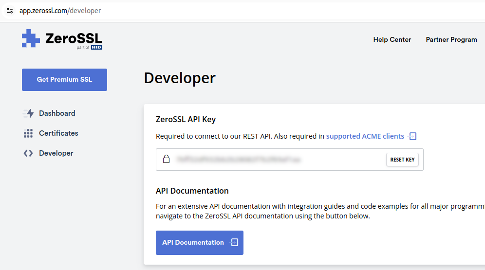

.. meta::
   :description: This guide describes how to set up a Dash evolution masternode.

.. _evonode-upgrade-from-dashmate-v0_25:

===========================
Upgrade from dashmate v0.25
===========================

Check your current dashmate version to make sure you are on the right path::

  dashmate --version

Install the new dashmate version
--------------------------------

1. Stop dashmate::
   
     dashmate stop

2. Download and install the `latest dashmate version
   <https://github.com/dashpay/platform/releases/latest>`__. For more details, refer to the
   :ref:`install instructions <evonode-setup-install-dashmate>`.

3. Reset previous services to ensure compatibility with the new version. Use ``--keep-data`` so the
   existing blockchain is retained::
   
     dashmate reset --keep-data

.. _evonode-setup-ssl:

Set up SSL certificate
----------------------

There are two ways to set up SSL certificates:

1. Register for the ZeroSSL service and set your API key. Since ZeroSSL provides an API, dashmate
   can update your certificates automatically. The free plan only provides 3 free certificates (or 3
   renewals of 1 certificate). Other plans require paying with a credit card.
2. Obtain SSL certificates for your IP address using any available provider and upload certificate
   files. `SSL Dragon <https://www.ssldragon.com/>`_ and `SuperbitHost
   <https://www.superbithost.com/ssl-certificates/>`_ are two options that accept cryptocurrency.

Choose which option works best for you and follow the relevant steps below to configure dashmate
with your certificate.

.. _evonode-setup-ssl-zerossl:

ZeroSSL
~~~~~~~

1. Register on `https://zerossl.com/ <https://zerossl.com/>`_.  We recommend not using your personal
   email address.
2. Log in and click ``Developer`` on the left sidebar.
3. Copy your ZeroSSL API key. **Do not create a "New certificate".**

  ZeroSSL Developer tab showing the API key

4. Set your ZeroSSL API key in dashmate::

    dashmate config set platform.gateway.ssl.enabled true
    dashmate config set platform.gateway.ssl.provider zerossl
    dashmate config set platform.gateway.ssl.providerConfigs.zerossl.apiKey [YOUR-KEY]
    dashmate ssl obtain

.. _evonode-setup-ssl-files:

Files
~~~~~

1. Update the dashmate config::
   
    dashmate config set platform.gateway.ssl.enabled true
    dashmate config set platform.gateway.ssl.provider file

2. Copy ``bundle.crt`` and ``private.key`` to the dashmate home directory
   ``$HOME/.dashmate/mainnet/platform/gateway/ssl``

Start dashmate node
-------------------

1. Start the node::

    dashmate start

2. Make sure the node works properly by running the following status commands::

    dashmate status
    dashmate status core
    dashmate status platform
