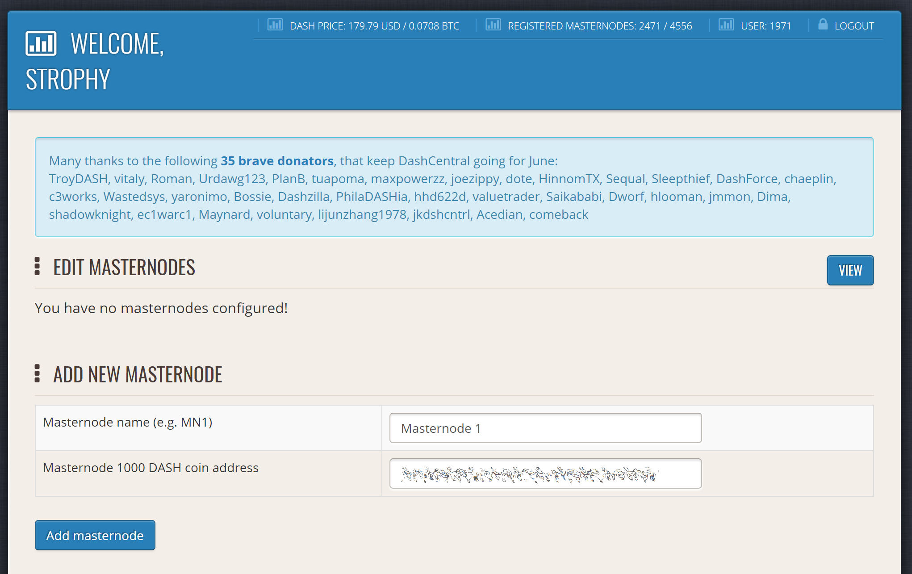
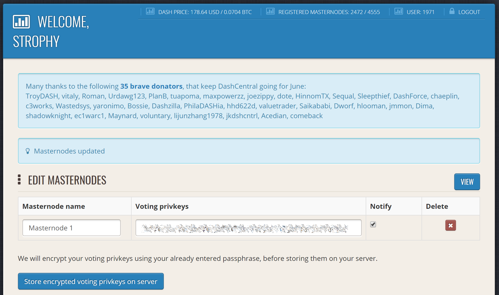
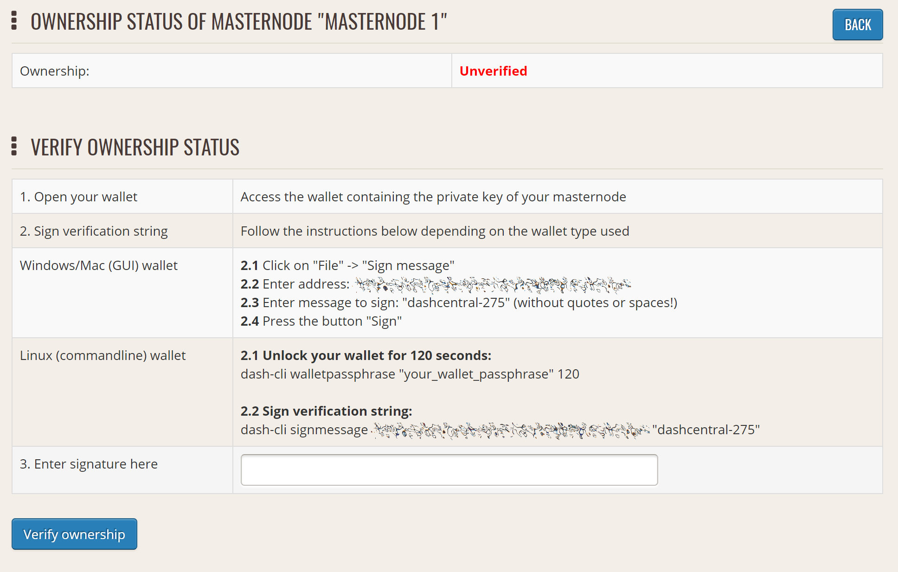
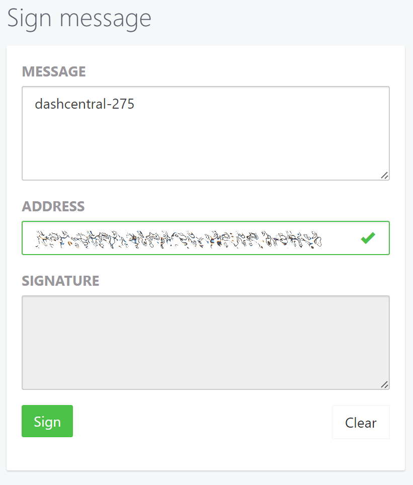
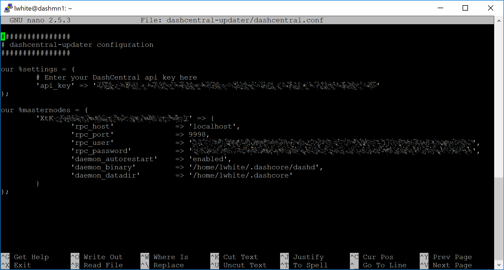
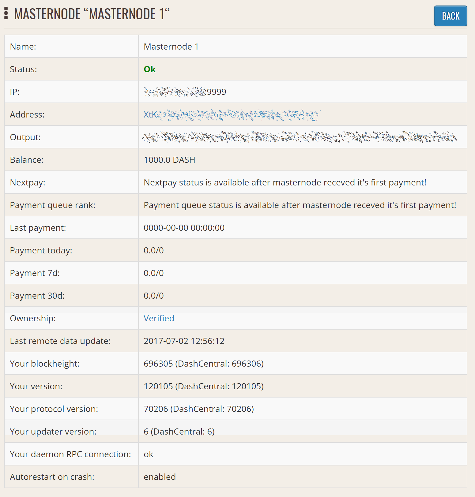

.. meta::
   :description: Maintaining a Dash masternode involves staying up to date with the latest version, voting and handling payments
   :keywords: dash, cryptocurrency, masternode, maintenance, maintain, payments, withdrawal, voting, monitoring, dip3, upgrade, deterministic

.. _masternode-maintenance:

===========
Maintenance
===========

Masternodes require regular maintenance to ensure you do not drop off
the payment queue. This includes promptly installing updates to Dash, as
well as maintaining the security and performance of the server. In
addition, masternodes should vote on proposals and perform other tasks
in the interest of the network and the value of the Dash they hold.

.. _masternode-update:

Masternode Software Update
==========================

The Dash Core software requires regular updates in order to remain
consistent with the current network consensus. Follow the procedure
described below to manually update your masternode. If you are still
using the legacy dashman installer, see the legacy update documentation
`here <https://docs.dash.org/en/0.15.0/masternodes/maintenance.html#masternode-software-update>`__.

Manual update
-------------

To update Dash manually, log in to your server using ssh or PuTTY. If
your crontab contains an entry to automatically restart dashd, invoke
``crontab -e`` and comment out the appropriate line by adding the ``#``
character. It should look something like this::

  # * * * * * pidof dashd || ~/.dashcore/dashd

Then stop Dash running::

  ~/.dashcore/dash-cli stop

Visit the `GitHub releases page
<https://github.com/dashpay/dash/releases>`_ and copy the link to the
latest `x86_64-linux-gnu` version. Go back to your terminal window and
enter the following command, pasting in the address to the latest
version of Dash Core by right clicking or pressing **Ctrl + V**::

  cd /tmp
  wget https://github.com/dashpay/dash/releases/download/v20.1.1/dashcore-20.1.1-x86_64-linux-gnu.tar.gz

Verify the authenticity of your download by checking its detached
signature against the public key published by the Dash Core development
team. All releases of Dash are signed using GPG with one of the
following keys:

- Alexander Block (codablock) with the key ``63A9 6B40 6102 E091``,
  `verifiable here on Keybase <https://keybase.io/codablock>`__
- Pasta (pasta) with the key ``5252 7BED ABE8 7984``, `verifiable here
  on Keybase <https://keybase.io/pasta>`__

::

  curl https://keybase.io/codablock/pgp_keys.asc | gpg --import
  curl https://keybase.io/pasta/pgp_keys.asc | gpg --import
  wget https://github.com/dashpay/dash/releases/download/v20.1.1/dashcore-20.1.1-x86_64-linux-gnu.tar.gz.asc
  gpg --verify dashcore-20.1.1-x86_64-linux-gnu.tar.gz.asc

Extract the compressed archive and copy the new files to the directory::

  tar xfv dashcore-20.1.1-x86_64-linux-gnu.tar.gz
  cp -f dashcore-20.1.1/bin/dashd ~/.dashcore/
  cp -f dashcore-20.1.1/bin/dash-cli ~/.dashcore/

Restart Dash::

  ~/.dashcore/dashd

You will see a message reading "Dash Core server starting".
The Dash software on the masternode is now updated.

.. _update-dip3-config:

Updating Masternode Information
===============================

Periodically, it may be necessary to update masternode information if
any information relating to the owner or operator changes. Examples may
include a change in IP address, change in owner/operator payout address
or changes to the nominated voting/operator keys. It is also possible to
revoke a masternode's registered status (in the event of a security
breach, for example) to force both owner and operator to update their
details.

Changing the BLS operator key or creating a new ProTx based on the same
collateral transaction will reset your position in the payment queue.
Changing your IP address or making changes to the voting or various
payout addresses will not reset your position in the payment queue.

.. _dip3-update-service:

ProUpServTx
-----------

A Provider Update Service Transaction (ProUpServTx) is used to update
information relating to the operator. An operator can update the IP
address and port fields of a masternode entry. If a non-zero
``operatorReward`` was set in the initial ProRegTx, the operator may
also set the ``operatorPayoutAddress`` field in the ProUpServTx. If
``operatorPayoutAddress`` is not set and ``operatorReward`` is non-zero,
the owner gets the full masternode reward. A ProUpServTx can be created
from DMT by clicking the **Update service** button, or from Dash Core
using the following syntax::

  protx update_service proTxHash ipAndPort operatorKey (operatorPayoutAddress feeSourceAddress)

Where:

- ``proTxHash``: The transaction id of the initial ProRegTx
- ``ipAndPort``: IP and port in the form "ip:port"
- ``operatorKey``: The operator BLS private key associated with the
  registered operator public key
- ``operatorPayoutAddress`` (optional): The address used for operator 
  reward payments. Only allowed when the ProRegTx had a non-zero 
  ``operatorReward`` value. Enter ``""`` to use the
  last on-chain operator payout address, or as a placeholder when 
  specifying a ``feeSourceAddress``.
- ``feeSourceAddress`` (optional): An address used to fund ProTx fee. 
  ``operatorPayoutAddress`` will be used if not specified.

Example::

  protx update_service d6ec9a03e1251ac8c34178f47b6d763dc4ea6d96fd6eddb3c7aae2359e0f474a 140.82.59.51:10002 4308daa8de099d3d5f81694f6b618381e04311b9e0345b4f8b025392c33b0696 yf6Cj6VcCfDxU5yweAT3NKKvm278rVbkhu

  fad61c5f21cf3c0832f782c1444d3d2e2a8dbff39c5925c38033730e64ecc598

The masternode is now removed from the PoSe-banned list, and the IP:port
and operator reward addresses are updated.

.. _dip3-update-registrar:

ProUpRegTx
----------

A Provider Update Registrar Transaction (ProUpRegTx) is used to update
information relating to the owner. An owner can update the operator's
BLS public key (e.g. to nominate a new operator), the voting address and
their own payout address. A ProUpRegTx can be created from DMT by
clicking the **Update operator key**, **Update voting key** or **Update
payout addr.** buttons, or from Dash Core using the following syntax::

  protx update_registrar proTxHash operatorKeyAddr votingKeyAddr payoutAddress (feeSourceAddress)

.. warning::
   After v19 hard fork activation, ``protx update_registrar_legacy`` must
   be used if a legacy scheme BLS key is being used to registrar update a
   masternode.

Where:

- ``proTxHash``: The transaction id of the initial ProRegTx
- ``operatorKeyAddr``: An updated BLS public key, or ``""`` to use the
  last on-chain operator key
- ``votingKeyAddr``: An updated voting key address, or ``""`` to use the
  last on-chain voting key
- ``payoutAddress``: An updated Dash address for owner payments, or 
  ``""`` to use the last on-chain operator key
- ``feeSourceAddress`` (optional): An address used to fund ProTx fee. 
  ``PayoutAddress`` will be used if not specified.

Example to update payout address::

  protx update_registrar cedce432ebabc9366f5eb1e3abc219558de9fbd2530a13589b698e4bf917b8ae "" "" yi5kVoPQQ8xaVoriytJFzpvKomAQxg6zea

ProUpRevTx
----------

A Provider Update Revocation Transaction (ProUpRevTx) is used by the
operator to terminate service or signal the owner that a new BLS key is
required. It will immediately put the masternode in the PoSe-banned
state. The owner must then issue a ProUpRegTx to set a new operator key.
After the ProUpRegTx is mined to a block, the new operator must issue a
ProUpServTx to update the service-related metadata and clear the PoSe-
banned state (revive the masternode). A ProUpRevTx can be created from
DMT by clicking the **Revoke operator** button, or from Dash Core using
the following syntax::

  protx revoke proTxHash operatorKey reason (feeSourceAddress)

Where:

- ``proTxHash``: The transaction id of the initial ProRegTx
- ``operatorKey``: The operator BLS private key associated with the
  registered operator public key
- ``reason``: Integer value indicating the revocation `reason <https://github.com/dashpay/dips/blob/master/dip-0003.md#appendix-a-reasons-for-self-revocation-of-operators>`__
- ``feeSourceAddress`` (optional): An address used to fund ProTx fee. 
  ``operatorPayoutAddress`` will be used if not specified.

Example::

  protx revoke 9f5ec7540baeefc4b7581d88d236792851f26b4b754684a31ee35d09bdfb7fb6 565950700d7bdc6a9dbc9963920bc756551b02de6e4711eff9ba6d4af59c0101 0

Proof of Service Bans
=====================

If your masternode fails to provide service to the network in accordance
with the current consensus rules, it will receive a :ref:`Proof of Service Ban <proof-of-service>`.
If your masternode is in the ``POSE_BANNED`` status, you should check
the following settings are configured correctly:

- Ensure you are running the :ref:`latest version of Dash <masternode-update>`
- Ensure your masternode has sufficient memory, swap, processing power 
  and hard drive space
- Ensure you are fully synced to the `correct blockheight <https://insight.dash.org/insight/>`__, 
  and that you are on the correct chain and not forked off
- Ensure that a BLS private key is specified using the 
  ``masternodeblsprivkey`` option in the masternode's ``dash.conf`` file
- Ensure that the BLS private key on the masternode is unique on the 
  network and not shared with any other masternodes
- Ensure that the BLS private key on the masternode corresponds to the 
  BLS public key registered on the blockchain in the ``ProRegTx`` or 
  ``ProUpRegTx``
- Ensure that the ``externalip`` (and ``port`` if using testnet) are 
  specified correctly and not blocked by a firewall or port forwarding 
  service

Once you are certain these settings are correct, you can update your
service status on the network and return to the valid set of masternodes
by creating a :ref:`ProUpServTx <dip3-update-service>`. Monitor your
masternode closely using ``masternode status`` and/or the ``debug.log``
file after restoring service. This information can help you pinpoint the
specific misconfiguration that is causing the masternode to be banned.
The masternode will be banned again if it continues to fail to provide
service.

DashCentral voting, verification and monitoring
===============================================

DashCentral is a community-supported website managed by community member
Rango. It has become a *de facto* site for discussion of budget
proposals and to facilitate voting from a graphical user interface, but
also offers functions to monitor masternodes.

Adding your masternode to DashCentral
-------------------------------------

`Dashcentral <https://www.dashcentral.org/>`_ allows you to vote on
proposals from the comfort of your browser. After completing
`registration <https://www.dashcentral.org/register>`_, go to the
`masternodes <https://www.dashcentral.org/masternodes>`_ page and click
the **Add masternode now** button. Enter your collateral address on the
following screen:

   Adding a masternode to DashCentral

Click **Add masternode**. Your masternode has now been added to
DashCentral.

Enabling voting from DashCentral
--------------------------------

Click **Edit** under **Voting privkeys** to enter your masternode
private key to enable voting through the DashCentral web interface.
Enter a voting passphrase (not the same as your login password, but
equally important to remember!) and enter the private key (the same key
you used in the dash.conf file on your masternode) on the following
screen:

   Adding voting privkeys to DashCentral

It is important to note that the private key to start your masternode is
unrelated to the private keys to the collateral address storing your
1000 DASH. These keys can be used to issue commands on behalf of the
masternode, such as voting, but cannot be used to access the collateral.
The keys are encrypted on your device and never stored as plain text on
DashCentral servers. Once you have entered the key, click **Store
encrypted voting privkeys on server**. You can now vote on proposals
from the DashCentral web interface.

Verifying ownership
-------------------

You can also issue a message from your address to verify ownership of
your masternode to DashCentral. Click **Unverified** under **Ownership**
and the following screen will appear:

   Verifying ownership of your masternode to DashCentral

Instructions on how to sign your collateral address using a software
wallet appear. If you are using a hardware wallet other than Trezor, you
will need to use the DMT app to sign the address. If you are using the
Trezor hardware wallet, go to your `Trezor wallet
<https://wallet.trezor.io/>`_, copy the collateral address and click
**Sign & Verify**. The following screen will appear, where you can enter
the message provided by DashCentral and the address you wish to sign:

   Signing a message from the Trezor Wallet

Click **Sign**, confirm on your Trezor device and enter your PIN to sign
the message. A message signature will appear in the **Signature** box.
Copy this signature and paste it into the box on DashCentral and click
**Verify ownership**. Verification is now complete.

.. figure:: img/maintenance-dc-verified.png
   :width: 400px

   Masternode ownership has been successfully verified

Installing the DashCentral monitoring script
--------------------------------------------

DashCentral offers a service to monitor your masternode, automatically
restart dashd in the event of a crash and send email in the event of an
error. Go to the `Account settings
<https://www.dashcentral.org/account/edit>`_ page and generate a new API
key, adding a PIN to your account if necessary. Scroll to the following
screen:

.. figure:: img/maintenance-dc-monitoring.png
   :width: 400px

   Setting up the DashCentral monitoring script

Copy the link to the current version of the dashcentral script by right-
click and selecting **Copy link address**. Open PuTTY and connect to
your masternode, then type::

  wget https://www.dashcentral.org/downloads/dashcentral-updater-v6.tgz

Replace the link with the current version of dashcentral-updater as
necessary. Decompress the archive using the following command::

  tar xvzf dashcentral-updater-v6.tgz

View your masternode configuration details by typing::

  cat .dashcore/dash.conf

Copy the values for ``rpcuser`` and ``rpcpassword``. Then edit the
dashcentral configuration by typing::

  nano dashcentral-updater/dashcentral.conf

Replace the values for ``api_key``, your masternode collateral address,
``rpc_user``, ``rpc_password``, ``daemon_binary`` and ``daemon_datadir``
according to your system. A common configuration, where ``lwhite`` is
the name of the Linux user, may look like this:

   DashCentral updater configuration file

::

  ################
  # dashcentral-updater configuration
  ################

  our %settings = (
      # Enter your DashCentral api key here
      'api_key' => 'api_key_from_dashcentral'
  );

  our %masternodes = (
      'masternode_collateral_address' => {
          'rpc_host'           => 'localhost',
          'rpc_port'           => 9998,
          'rpc_user'           => 'rpc_user_from_dash.conf',
          'rpc_password'       => 'rpc_password_from_dash.conf',
          'daemon_autorestart' => 'enabled',
          'daemon_binary'      => '/home/<username>/.dashcore/dashd',
          'daemon_datadir'     => '/home/<username>/.dashcore'
      }
  );

Press **Ctrl + X** to exit, confirm you want save with **Y** and press
**Enter**. Test your configuration by running the dashcentral script,
then check the website. If it was successful, you will see that an
update has been sent::

  dashcentral-updater/dcupdater

.. figure:: img/maintenance-dc-update.png
   :width: 400px

   Manually testing the DashCentral updater

   DashCentral updater has successfully sent data to the DashCentral
   site

Once you have verified your configuration is working, we can edit the
crontab on your system to schedule the dcupdater script to run every 2
minutes. This allows the system to give you early warning in the event
of a fault and will even restart the dashd daemon if it hangs or
crashes. This is an effective way to make sure you do not drop off the
payment queue. Type the following command::

  crontab -e

Select an editor if necessary and add the following line at the end of
your crontab, replacing lwhite with your username on your
system::

  */2 * * * * /home/lwhite/dashcentral-updater/dcupdater

.. figure:: img/maintenance-dc-crontab.png
   :width: 400px

   Editing crontab to run the DashCentral updater automatically

Press **Ctrl + X** to exit, confirm you want save with **Y** and press
**Enter**. The dcupdater script will now run every two minutes, restart
dashd whenever necessary and email you in the event of an error.

Masternode monitoring tools
===========================

Several sites operated by community members are available to monitor key
information and statistics relating to the masternode network.

Block Explorers
---------------

Since Dash is a public blockchain, it is possible to use block explorers
to view the balances of any Dash public address, as well as examine the
transactions entered in any given block. Each unique transaction is also
searchable by its txid. A number of block explorers are available for
the Dash network.

- `Blockchair <https://blockchair.com/dash>`__ offers a block explorer
  with detailed visualizations to analyse the Dash blockchain.
- `CryptoID <https://chainz.cryptoid.info/>`__ offers a `Dash blockchain
  explorer <https://chainz.cryptoid.info/dash/>`__ and a `function
  <https://chainz.cryptoid.info/dash/masternodes.dws>`__ to view and map
  Dash masternodes.
- `BitInfoCharts <https://bitinfocharts.com>`_ offers a `page
  <https://bitinfocharts.com/dash/>`_ of price statistics and
  information and a `blockchain explorer
  <https://bitinfocharts.com/dash/explorer/>`__.
- `CoinCheckup <https://coincheckup.com/coins/dash/charts>`__ offers a
  range of statistics and data on most blockchains, including Dash.
- `Dash.org <https://www.dash.org/>`__ includes a blockchain explorer
  at `explorer.dash.org <https://explorer.dash.org/insight/>`__ and
  `insight.dash.org <https://insight.dash.org/insight/>`__.
- `Trezor <https://trezor.io/>`__ operates a `blockchain explorer <https
  ://dash-bitcore1.trezor.io/>`__ powered by a `Dash fork
  <https://github.com/dashpay/insight-ui>`__ of `insight
  <https://insight.is/>`__, an advanced blockchain API tool

Dash Masternode Tool
--------------------

https://github.com/Bertrand256/dash-masternode-tool

Written and maintained by community member Bertrand256, Dash Masternode
Tool (DMT) allows you to start a masternode from all major hardware
wallets such as Trezor, Ledger and KeepKey. It also supports functions
to vote on proposals and withdraw masternode payments without affecting
the collateral transaction.

DASH Ninja
----------

https://www.dashninja.pl

DASH Ninja, operated by forum member and Dash Core developer elbereth,
offers key statistics on the adoption of different versions of Dash
across the masternode network. Several features to monitor governance of
the Dash, the masternode payment schedule and the geographic
distribution of masternodes are also available, as well as a simple
blockchain explorer.

DashCentral
-----------

https://www.dashcentral.org

DashCentral, operated by forum member rango, offers an advanced service
to monitor masternodes and vote on budget proposals through an advanced
web interface.

Masternode.me
-------------

https://stats.masternode.me

Masternode.me, operated by Dash community member moocowmoo, offers
sequential reports on the price, generation rate, blockchain information
and some information on masternodes.

Dash Masternode Information
---------------------------

http://178.254.23.111/~pub/Dash/Dash_Info.html

This site, operated by forum member and Dash Core developer crowning,
offers a visual representation of many key statistics of the Dash
masternode network, including graphs of the total masternode count over
time, price information and network distribution.
