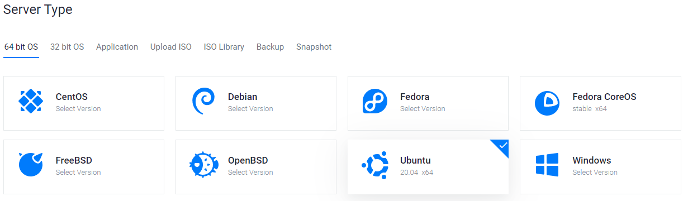

.. meta::
   :description: This guide describes how to set up a server to host a masternode.
   :keywords: dash, guide, masternodes, setup, bls

.. _server-config:

====================
Server configuration
====================

Setting up a masternode requires a basic understanding of Linux and blockchain
technology, as well as an ability to follow instructions closely. It also
requires regular maintenance and careful security, particularly if you are not
storing your Dash on a hardware wallet. There are some decisions to be made
along the way, and optional extra steps to take for increased security.

Commercial :ref:`masternode hosting services <masternode-hosting>` are available
if you prefer to delegate day-to-day operation of your masternode to a
professional operator. When using these hosting services, you retain full
control of the masternode collateral and pay an agreed percentage of your reward
to the operator.

.. _vps-setup:

Set up your VPS
===============

A VPS, more commonly known as a cloud server, is fully functional installation
of an operating system (usually Linux) operating within a virtual machine. The
virtual machine allows the VPS provider to run multiple systems on one physical
server, making it more efficient and much cheaper than having a single operating
system running on the "bare metal" of each server.

A VPS is ideal for hosting a Dash masternode because they typically offer
guaranteed uptime, redundancy in the case of hardware failure and a static IP
address that is required to ensure you remain in the masternode payment queue.
While running a masternode from home on a desktop computer is technically
possible, it will most likely not work reliably because most ISPs allocate
dynamic IP addresses to home users.

Before beginning, take a few minutes to review the masternode
:hoverxref:`hardware requirements <mn-hardware-reqs-table>` which may help you decide
which VPS provider best suits your needs. We will use `Vultr
<https://www.vultr.com/>`_ hosting as an example of a VPS, although
`DigitalOcean <https://www.digitalocean.com/>`_, `Amazon EC2
<https://aws.amazon.com/ec2/>`_, `Google Cloud
<https://cloud.google.com/compute/>`_, `Choopa <https://www.choopa.com/>`_ and
`OVH <https://www.ovh.com.au/>`_ are also popular choices. First create an
account and add credit. Then go to the **Servers** menu item on the left and
click **+** to add a new server. Select a location for your new server on the
following screen:

.. figure:: img/setup-server-location.png
   :width: 400px

   Vultr server location selection screen

Select Ubuntu 20.04 x64 as the server type. We use this LTS release of Ubuntu
instead of the latest version because LTS releases are supported with security
updates for 5 years, instead of the usual 9 months.

   Vultr server type selection screen

Select a server size offering at least 2GB of memory.

.. figure:: img/setup-server-size.png
   :width: 400px

   Vultr server size selection screen

Enter a hostname and label for your server. In this example we will use
``dashmn1`` as the hostname.

   Vultr server hostname & label selection screen

Vultr will now install your server. This process may take a few minutes.

   Vultr server installation screen

Click **Manage** when installation is complete and take note of the IP address,
username and password.

.. figure:: img/setup-server-manage.png
   :width: 276px

   Vultr server management screen

.. _vps-os-setup:

Set up your operating system
============================

We will begin by connecting to your newly provisioned server. On Windows, we
will first download an app called PuTTY to connect to the server. Go to the
`PuTTY download page
<https://www.chiark.greenend.org.uk/~sgtatham/putty/latest.html>`_ and select
the appropriate MSI installer for your system. On Mac or Linux you can ssh
directly from the terminal - simply type ``ssh root@<server_ip>`` and enter your
password when prompted.

   PuTTY download page

Double-click the downloaded file to install PuTTY, then run the app from your
Start menu. Enter the IP address of the server in the **Host Name** field and
click **Open**. You may see a certificate warning, since this is the first time
you are connecting to this server. You can safely click **Yes** to trust this
server in the future.

.. figure:: img/setup-putty-alert.png
   :width: 320px

   PuTTY security alert when connecting to a new server

You are now connected to your server and should see a terminal window. Begin by
logging in to your server with the user ``root`` and password supplied by your
hosting provider.

.. figure:: img/setup-putty-connect.png
   :width: 400px

   Password challenge when connecting to your VPS for the first time

Set up users
------------

You should immediately change the root password and store it in a safe place for
security. You can copy and paste any of the following commands by selecting them
in your browser, pressing **Ctrl + C**, then switching to the PuTTY window and
right-clicking in the window. The text will paste at the current cursor
location::

  passwd root

Enter and confirm a new password (preferably long and randomly generated). Next
we will create a new user with the following command, replacing ``<username>``
with a username of your choice::

  adduser <username>

You will be prompted for a password. Enter and confirm using a new password
(different to your root password) and store it in a safe place. You will also
see prompts for user information, but this can be left blank. Once the user has
been created, we will add them to the sudo group so they can perform commands as
root::

  usermod -aG sudo <username>

Update the system
-----------------

Now, while still as root, we will update the system from the Ubuntu package
repository::

  apt update
  apt upgrade

The system will show a list of upgradable packages. Press **Y** and **Enter** to
install the packages. 

Configure the firewall
----------------------

We will now install a firewall (and some other packages we will use later)::

  apt install ufw python virtualenv git unzip pv

(press **Y** and **Enter** to confirm)

Choose the appropriate firewall configuration below based on which network your
masternode will support:

.. code-block:: none
  :caption: Mainnet configuration

  ufw allow ssh/tcp
  ufw limit ssh/tcp
  ufw allow 9999/tcp
  ufw logging on
  ufw enable

.. code-block:: none
  :caption: Testnet configuration
  
  ufw allow ssh/tcp
  ufw limit ssh/tcp
  ufw allow 19999/tcp
  ufw allow 26656/tcp
  ufw allow 3000/tcp
  ufw logging on
  ufw enable

(press **Y** and **Enter** to confirm)

Enable swap
-----------

Next, we add will add swap memory, enable it, and set it to be enabled on
subsequent reboots::

  fallocate -l 4G /swapfile
  chmod 600 /swapfile
  mkswap /swapfile
  swapon /swapfile
  nano /etc/fstab

Add the following line at the end of the file (press tab to separate each
word/number), then press **Ctrl + X** to close the editor, then **Y** and
**Enter** save the file.

::

  /swapfile none swap sw 0 0

Restrict remote access
----------------------

Finally, in order to prevent brute force password hacking attacks, we will
install fail2ban and disable root login over ssh. These steps are optional, but
highly recommended. Start with fail2ban::

  apt install fail2ban

Create a new configuration file::

  nano /etc/fail2ban/jail.local

And paste in the following configuration:

.. code-block:: ini

  [sshd]
  enabled = true
  port = 22
  filter = sshd
  logpath = /var/log/auth.log
  maxretry = 3

Then press **Ctrl + X** to close the editor, then **Y** and **Enter** save the
file. Restart and enable the fail2ban service::

  systemctl restart fail2ban
  systemctl enable fail2ban

Next, open the SSH configuration file to disable root login over SSH::

  nano /etc/ssh/sshd_config

Locate the line that reads ``PermitRootLogin yes`` and set it to
``PermitRootLogin no``. Directly below this, add a line which reads ``AllowUsers
<username>``, replacing ``<username>`` with the username you selected above.
Then press **Ctrl + X** to close the editor, then **Y** and **Enter** save the
file.

Optionally install or update `AppArmor <https://apparmor.net/>`_ (try this step
if you are having problems related to AppArmor)::

  sudo apt install apparmor

Reboot
------

Now, reboot the server to apply any necessary kernel updates::

  reboot now

Your SSH client (e.g. PuTTY) will disconnect when the server reboots.

.. note::

  While this setup includes basic steps to protect your server against attacks,
  much more can be done. In particular, authenticating with a `public key
  <https://help.ubuntu.com/community/SSH/OpenSSH/Keys>`_ instead of a
  username/password combination. Enabling `automatic security updates
  <https://help.ubuntu.com/community/AutomaticSecurityUpdates>`_ is advisable.
  More tips are available `here
  <https://www.cyberciti.biz/tips/linux-security.html>`__.

