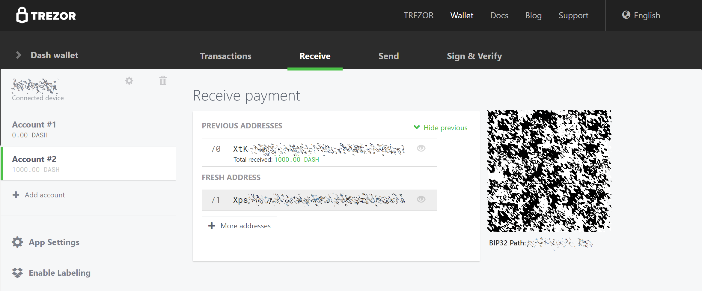
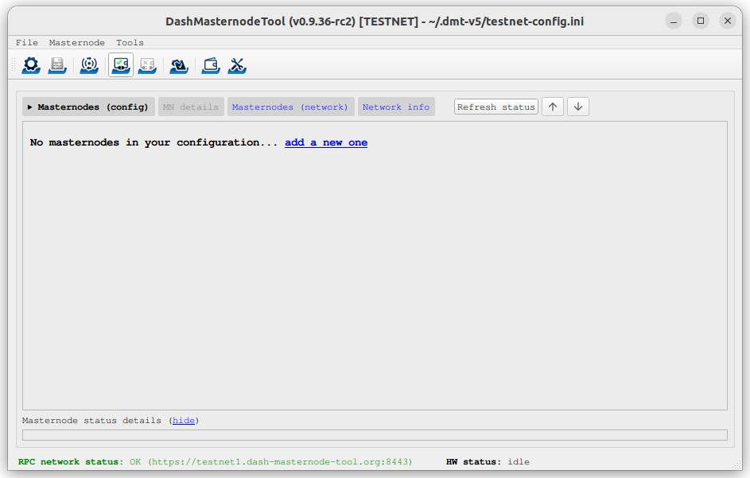
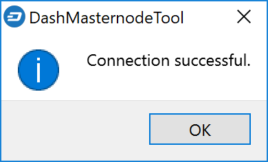
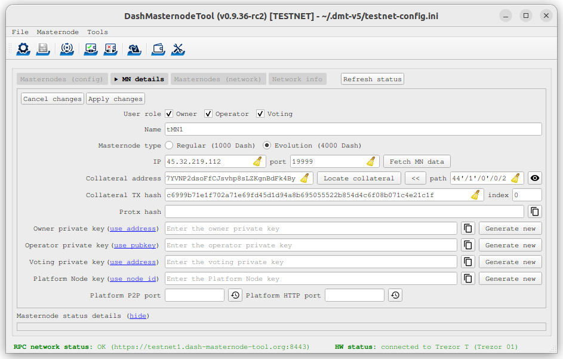
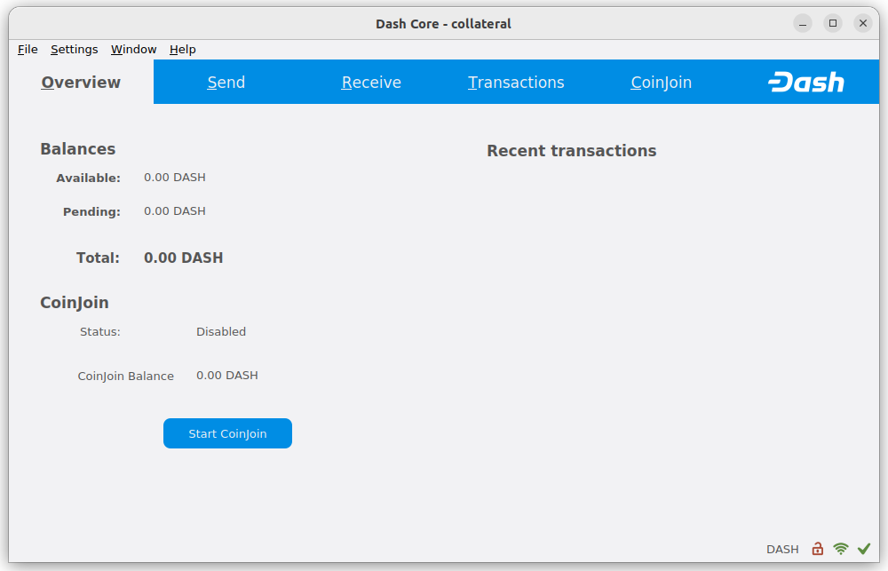
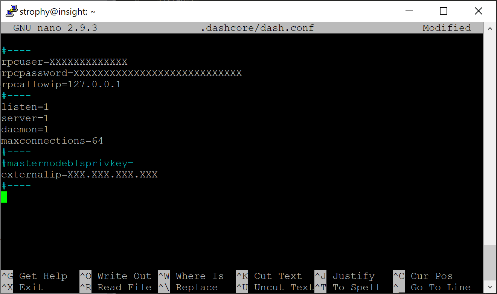
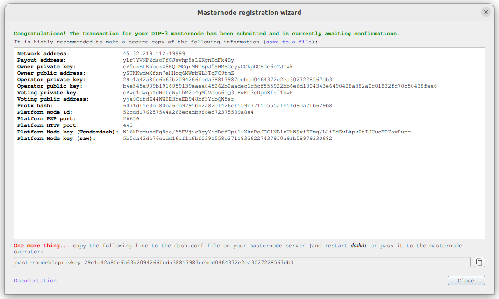
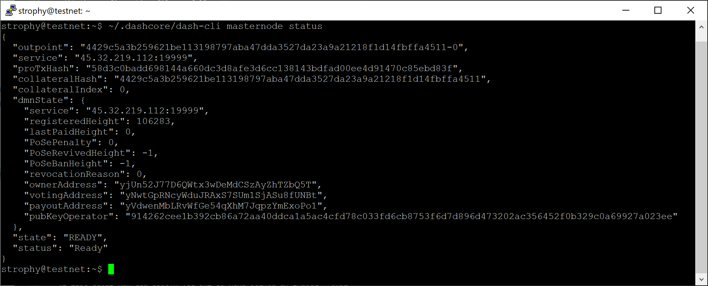

.. meta::
   :description: This guide describes how to set up a Dash evolution masternode. It also describes various options for hosting and different wallets
   :keywords: dash, guide, masternodes, trezor, dip3, setup, bls, evonode

.. _evonode-setup:

=============
Evonode Setup
=============

Setting up an Evolution masternode requires a basic understanding of Linux
and blockchain technology, as well as an ability to follow instructions closely.
It also requires regular maintenance and careful security, particularly if you
are not storing your Dash on a hardware wallet. There are some decisions to be
made along the way, and optional extra steps to take for increased security.

Commercial :ref:`masternode hosting services <masternode-hosting>` are available
if you prefer to delegate day-to-day operation of your evonode to a
professional operator. When using these hosting services, you retain full
control of the DASH collateral and pay an agreed percentage of your reward to
the operator. It is also possible to delegate your voting keys to a
representative, see the :ref:`governance documentation <delegating-votes>` for
more information.

Before you begin
================

This guide assumes you are setting up a single mainnet Evolution
masternode for the first time. If you are updating a masternode, see  :ref:`here
<masternode-update>` instead. You will need:

- 4000 Dash
- A wallet to store your Dash, preferably a hardware wallet, although Dash Core
  wallet is also supported
- A Linux server, preferably a Virtual Private Server (VPS)

For information about hosted masternodes, see the documentation listed below:

- :ref:`Information for users of hosted masternodes <hosted-setup>`
- :ref:`Information for operators of hosted masternodes <operator-transactions>`

This documentation describes the commands as if they were entered in the Dash
Core GUI by opening the console from **Window > Console**, but the same result
can be achieved on a masternode by entering the same commands and adding the
prefix ``~/.dashcore/dash-cli`` to each command.

Server configuration
--------------------

Proper server configuration is essential to successful masternode operation for
both security and performance reasons. Refer to the :hoverxref:`Server
configuration <server-config>` page for details on preparing your server to host
a masternode.

Once you have completed server configuration, complete the remaining steps in
the sections below to finish setting up your evonode or follow along with this
step-by-step tutorial.

.. raw:: html

    

        <iframe src="https://www.youtube-nocookie.com/embed/973E4knShBA" frameborder="0" allowfullscreen style="position: absolute; top: 0; left: 0; width: 100%; height: 100%;"></iframe>
    

.. _evonode-send-collateral:

Send the collateral
===================

A Dash address with a single unspent transaction output (UTXO) of exactly 4000
DASH is required to operate an Evolution masternode. Once it has been
sent, various keys regarding the transaction must be extracted for later entry
in a configuration file and registration transaction as proof to write the
configuration to the blockchain so the Evolution masternode can be
included in the deterministic list.

A masternode can be registered from a hardware wallet or the official Dash Core
wallet, although a hardware wallet is highly recommended to enhance security and
protect yourself against hacking. This guide will describe the steps for both
hardware wallets and Dash Core.

.. _evonode-send-collateral-hardware:

Option 1: Holding collateral in a hardware wallet
-------------------------------------------------

Set up your Trezor using the Trezor wallet at https://wallet.trezor.io/ and send
a test transaction to verify that it is working properly. For help on this, see
:ref:`this guide <hardware-trezor>` - you may also choose to (carefully!) `add a
passphrase
<https://blog.trezor.io/passphrase-the-ultimate-protection-for-your-accounts-3a311990925b>`_
to your Trezor to further protect your collateral. Create a new account in your
Trezor wallet by clicking **Add account**. Then click the **Receive** tab and
send exactly 4000 DASH to the address displayed. If you are setting up multiple
masternodes, send to consecutive addresses within the same new account. You
should see the transaction as soon as the first confirmation arrives, usually
within a few minutes.

  Trezor Wallet Receive tab showing successfully received collateral

Once the transaction appears, click the QR code on the right to view the
transaction on the blockchain. Keep this window open as we complete the
following steps, since we will soon need to confirm that 15 confirmations exist,
as shown in the following screenshot.

.. figure:: img/setup-collateral-blocks.png
  :width: 400px

  Trezor blockchain explorer showing 15 confirmations for collateral transfer

While we are waiting for 15 confirmations, download the latest version of the
Dash Masternode Tool (DMT) from the `GitHub releases page
<https://github.com/Bertrand256/dash-masternode-tool/releases>`__. Unzip and run
the file. The following window appears.

  Dash Masternode Tool startup screen

Click the third button from the left **Check Dash Network Connection** in the
top left corner of the main window to verify that the connection is working.
Then connect your Trezor device and click the next button **Test Hardware Wallet
Connection** to verify the Trezor connection is working.

.. figure:: img/setup-collateral-hardware.png
  :width: 180px

  Dash Masternode Tool successful connection confirmations

We will now use DMT to enter some basic information about the masternode and
extract the transaction ID. First, click **add a new one** or click **MN
actions** and select **Add New Masternode Entry...**. Carry out the following
sequence of steps as shown in the screenshot:

#. Enter a name for your masternode. The host name you specified for your VPS
   above is a good choice.
#. Select which masternode type you are setting up.
#. Enter the IP address of your masternode. This was given to you by the VPS
   provider when you set up the server. Then enter the TCP port number. This
   should be 9999 for mainnet.
#. Click **Locate collateral** to view unused collateral funding transactions
   available on the connected hardware wallet. Select the address to which you
   sent the collateral and click **Apply**. The **Collateral address**,
   **path**, **Collateral TX hash** and **index** fields should be filled
   automatically.

  Dash Masternode Tool with masternode configuration

Leave DMT open and continue with the next step: :ref:`Software Installation
<evonode-setup-install>`.

Option 2: Holding collateral in Dash Core wallet
------------------------------------------------

Open Dash Core wallet and wait for it to synchronize with the network. It should
look like this when ready:

   Fully synchronized Dash Core wallet

Click **Window > Console** to open the console. Type the following command into
the console to generate a new Dash address for the collateral::

  getnewaddress
  yiFfzbwiN9oneftd7cEfr3kQLRwQ4kp7ue

Take note of the collateral address, since we will need it later.  The next step
is to secure your wallet (if you have not already done so). First, encrypt the
wallet by selecting **Settings > Encrypt wallet**. You should use a strong, new
password that you have never used somewhere else. Take note of your password and
store it somewhere safe or you will be permanently locked out of your wallet and
lose access to your funds. Next, back up your wallet file by selecting **File >
Backup Wallet**. Save the file to a secure location physically separate to your
computer, since this will be the only way you can access our funds if anything
happens to your computer. For more details on these steps, see :ref:`here
<dashcore-backup>`.

Now send exactly 4000 DASH in a single transaction to the new address you
generated in the previous step. This may be sent from another wallet, or from
funds already held in your current wallet. Once the transaction is complete,
view the transaction in a `blockchain explorer
<https://insight.dash.org/insight/>`_ by searching for the address. You
will need 15 confirmations before you can register the masternode, but you can
continue with the next step at this point already: generating your masternode
operator key.

.. figure:: img/setup-collateral-blocks.png
   :width: 400px

   Trezor blockchain explorer showing 15 confirmations for collateral transfer

.. _evonode-setup-install:

Masternode Installation
=======================

The following options are available for installing Dash masternode software:

- :ref:`Dashmate installation (recommended) <evonode-setup-install-dashmate>`
- :ref:`Manual installation <evonode-setup-install-manual>`

.. _evonode-setup-install-dashmate:

Dashmate installation
---------------------

Dashmate is a universal tool designed to help you set up and run Dash nodes in a
containerized environment. It is based on Docker technology and features an
interactive setup command. Dashmate handles the installation of Dash Core, as
well as all dependencies and supporting services. See this :ref:`dashmate
documentation <dashmate>` for more information.

Open PuTTY or a console again and connect to the server using the username and
password you just created for your new, non-root user. Begin by installing
dashmate dependencies::

  curl -fsSL https://get.docker.com -o get-docker.sh && sh ./get-docker.sh
  sudo usermod -aG docker $USER
  newgrp docker
  curl -o- https://raw.githubusercontent.com/nvm-sh/nvm/v0.39.5/install.sh | bash
  source ~/.bashrc
  nvm install 20

Install dashmate::

  npm install -g dashmate

Alternative installation options are available on the :hoverxref:`dashmate page
<dashmate-install>`.

Continue with the :ref:`Registration step <register-evonode>` to setup the
collateral, keys and construct the ProTx transaction required to enable your
masternode.

.. _evonode-setup-install-manual:

Manual installation
-------------------

.. attention::
  
  Dash Platform will include multiple services that must be configured properly
  for an Evolution masternode to operate correctly. A :ref:`dashmate-based
  installation <evonode-setup-install-dashmate>` is recommended to ensure
  your configuration is functional.

Dash Core
^^^^^^^^^

To manually download and install the components of your Dash Evolution masternode, 
visit the `GitHub releases page <https://github.com/dashpay/dash/releases>`_ and 
copy the link to the latest version appropriate for your CPU architecture, 
e.g. ``x86_64-linux-gnu``. Go back to your terminal window and enter the following 
command, pasting in the address to the latest version of Dash Core by right clicking
or pressing **Ctrl+ V**::

  cd /tmp
  wget https://github.com/dashpay/dash/releases/download/v20.1.1/dashcore-20.1.1-x86_64-linux-gnu.tar.gz

Verify the authenticity of your download by checking its detached
signature against the public key published by the Dash Core development
team. All releases of Dash are signed using GPG with one of the
following keys:

- Alexander Block (codablock) with the key ``63A9 6B40 6102 E091``,
  `verifiable here on Keybase <https://keybase.io/codablock>`__
- Pasta (pasta) with the key ``5252 7BED ABE8 7984``, `verifiable here
  on Keybase <https://keybase.io/pasta>`__

::

  curl https://keybase.io/codablock/pgp_keys.asc | gpg --import
  curl https://keybase.io/pasta/pgp_keys.asc | gpg --import
  wget https://github.com/dashpay/dash/releases/download/v20.1.1/dashcore-20.1.1-x86_64-linux-gnu.tar.gz.asc
  gpg --verify dashcore-20.1.1-x86_64-linux-gnu.tar.gz.asc

Create a working directory for Dash, extract the compressed archive and
copy the necessary files to the directory::

  mkdir ~/.dashcore
  tar xfv dashcore-20.1.1-x86_64-linux-gnu.tar.gz
  cp -f dashcore-20.1.1/bin/dashd ~/.dashcore/
  cp -f dashcore-20.1.1/bin/dash-cli ~/.dashcore/

Create a configuration file using the following command::

  nano ~/.dashcore/dash.conf

An editor window will appear. We now need to create a configuration file
specifying several variables. Copy and paste the following text to get
started, then replace the variables specific to your configuration as
follows::

  #----
  rpcuser=XXXXXXXXXXXXX
  rpcpassword=XXXXXXXXXXXXXXXXXXXXXXXXXXXX
  rpcallowip=127.0.0.1
  #----
  listen=1
  server=1
  daemon=1
  #----
  #masternodeblsprivkey=
  externalip=XXX.XXX.XXX.XXX
  #----

Replace the fields marked with ``XXXXXXX`` as follows:

- ``rpcuser``: enter any string of numbers or letters, no special
  characters allowed
- ``rpcpassword``: enter any string of numbers or letters, no special
  characters allowed
- ``externalip``: this is the IP address of your VPS

Leave the ``masternodeblsprivkey`` field commented out for now. The
result should look something like this:

   Entering key data in dash.conf on the masternode

Press **Ctrl + X** to close the editor and **Y** and **Enter** save the
file. You can now start running Dash on the masternode to begin
synchronization with the blockchain::

  ~/.dashcore/dashd

You will see a message reading **Dash Core server starting**. 

Add dashd to crontab to make sure it runs every minute to check on your
masternode::

  crontab -e

Choose nano as your editor and enter the following lines at the end of
the file::

  * * * * * pidof dashd || ~/.dashcore/dashd

Press enter to make sure there is a blank line at the end of the file,
then press **Ctrl + X** to close the editor and **Y** and **Enter** save
the file. We now need to wait for 15 confirmations of the collateral
transaction to complete, and wait for the blockchain to finish
synchronizing on the masternode. You can use the following commands to
monitor progress::

  ~/.dashcore/dash-cli mnsync status

When synchronisation is complete, you should see the following
response::

  {
    "AssetID": 999,
    "AssetName": "MASTERNODE_SYNC_FINISHED",
    "AssetStartTime": 1558596597,
    "Attempt": 0,
    "IsBlockchainSynced": true,
    "IsSynced": true,
    "IsFailed": false
  }

Continue with the :ref:`Registration step <register-evonode>` to setup the
collateral, keys and construct the ProTx transaction required to enable your
masternode.

.. _register-evonode:

Register your masternode
========================

The keys required for the different masternode roles are described briefly under
:ref:`mn-concepts` in this documentation.

.. _register-evonode-hardware:

Option 1: Registering from a hardware wallet
--------------------------------------------

Go back to DMT and ensure that all fields from the previous step are still
filled out correctly.  Click **Generate new** for the private keys required for
the masternode:

- Owner private key
- Operator private key
- Voting private key
- Platform Node private key (evonodes only)

For evonodes, click the button beside the **Platform P2P port** and **Platform HTTP
port** fields to set the default values.

Click **Apply changes** when these fields have been set.

.. figure:: img/setup-dmt-full.png
  :width: 400px

  Dash Masternode Tool ready to register a new masternode

Then click **MN actions** and select **Register masternode**. Optionally specify
a different **Payout address** and/or **Operator reward**, then click
**Continue**. Select **Remote Dash RPC Node (automatic method)**. (For details
about using your own local RPC node, see the `Dash Masternode Tool documentation
<https://github.com/Bertrand256/dash-masternode-tool/blob/master/doc/config-connection-direct.md>`__.)
Confirm the following two messages:

.. figure:: img/setup-dmt-send.png
  :width: 220px

  Dash Masternode Tool confirmation dialogs to register a masternode

Complete server configuration
^^^^^^^^^^^^^^^^^^^^^^^^^^^^^

At this point the masternode registration is complete, but the BLS private key
must be added to the server so it can become operational. The BLS key
allows the masternode to watch the blockchain for relevant Pro*Tx transactions,
and will cause it to start serving as a masternode when the signed ProRegTx is
broadcast by the owner, as we just did above.

Take note of your BLS private key and then proceed with the relevant
instructions below based on which :ref:`Software Installation option
<evonode-setup-install>` you are using.

Dashmate
~~~~~~~~

For dashmate-based masternodes, enter the BLS private key during the initial
dashmate setup process. Run the dashmate setup wizard on your server::

  dashmate setup

Select the network and masternode type. Select **Yes** when asked if your
masternode is already registered since this was done earlier in the section.

Enter the **BLS private key** and the **Platform node key** from DMT when
requested by dashmate.

Dashmate will automatically detect the external IP address and select the
default ports for the network you are setting up. You can modify these values if
necessary for a specific reason, but typically the defaults should be used.

Once the dashmate wizard has completed successfully, start your node as
follows::

  dashmate start

You can manage your masternode status, configuration, and running state entirely
from within dashmate. See the dashmate :hoverxref:`node operation documentation
<dashmate-node-operation>` for details.

Manual
~~~~~~

For manual installations, log in to your masternode using ``ssh`` or PuTTY and
edit the configuration file as follows::

  nano ~/.dashcore/dash.conf

The editor appears with the existing masternode configuration. Add or
uncomment this lines in the file, replacing the key with your BLS
private key generated above::

  masternodeblsprivkey=24c1fa3c22c6ea6b1cc68a37be18acb51042b19465fe0a26301c8717bf939805

Press enter to make sure there is a blank line at the end of the file,
then press **Ctrl + X** to close the editor and **Y** and **Enter** save
the file. Note that providing a ``masternodeblsprivkey`` enables
masternode mode, which will automatically force the ``txindex=1``,
``peerbloomfilters=1``, and ``prune=0`` settings necessary to provide
masternode service. We now need to restart the masternode for this
change to take effect. Enter the following commands, waiting a few
seconds in between to give Dash Core time to shut down::

  ~/.dashcore/dash-cli stop
  sleep 15
  ~/.dashcore/dashd

At this point you can monitor your masternode by entering
``~/.dashcore/dash-cli masternode status`` or using the **Refresh status**
function in DMT. The final result should appear as follows:

  dash-cli masternode status output showing successfully registered masternode

At this point you can safely log out of your server by typing ``exit``.
Congratulations! Your masternode is now running.

.. _evonode-dashcore-protx:
.. _register-evonode-dashmate:

Option 2: Registering from dashmate
-----------------------------------

.. attention::
  For mainnet masternodes, it highly is recommended to :ref:`store the collateral on a
  hardware wallet <evonode-send-collateral-hardware>` and use the Dash Masternode
  Tool to register as described in :ref:`Option 1: Registering from a hardware
  wallet <register-evonode-hardware>`.

Dashmate can assist with masternode registration by requesting the parameters
necessary to construct a valid protx command that can be sent from Dash Core.
This option is most useful for setting up testnet masternodes where the
collateral is stored in Dash Core rather than a hardware wallet.

Collect required information
^^^^^^^^^^^^^^^^^^^^^^^^^^^^

Prior to running the dashmate setup wizard you should obtain the
:hoverxref:`collateral transaction info <evonode-mn-outputs>` and the owner,
voting, and payout addresses for the new evonode. For example, use Dash Core to
generate the addresses as described in the :hoverxref:`Get masternode addresses
section <evonode-get-addresses>`.

Run the setup wizard
^^^^^^^^^^^^^^^^^^^^

To begin masternode setup, run ``dashmate setup`` to start the interactive wizard::

  dashmate setup

You will be prompted to select a network, node type, IP address and BLS private
key. When setting up an unregistered masternode, you will also be prompted for
the collateral transaction information and owner, voting, and payout addresses.

Enter the requested information or accept the detected/generated defaults. For
an example showing all steps of the setup wizard, refer to the
:hoverxref:`dashmate section <dashmate-wizard-walkthrough>`.

Submit the ProRegTx
^^^^^^^^^^^^^^^^^^^

The dashmate wizard will output a command you can use to submit the provider
registration special transaction that registers the masternode on the network.
Copy the provided protx command and run it using dash-cli or the Dash Core
console.

.. figure:: ../network/dashmate/img/10b-protx-command-successful.png
   :align: center
   :width: 95%

   Registration command

Start the node
^^^^^^^^^^^^^^

Once the dashmate wizard has completed successfully, start your node as follows::

  dashmate start

You can manage your masternode status, configuration, and running state entirely
from within dashmate. See the dashmate :hoverxref:`node operation documentation
<dashmate-node-operation>` for details.

.. _register-evonode-core:

Option 3: Registering from Dash Core wallet
-------------------------------------------

.. attention::
  For mainnet masternodes, it highly is recommended to :ref:`store the collateral on a
  hardware wallet <evonode-send-collateral-hardware>` and use the Dash Masternode
  Tool to register as described in :ref:`Option 1: Registering from a hardware
  wallet <register-evonode-hardware>`.

This option can be used without installing any applications other than Dash
Core; however, it requires the most technical skill.

.. _evonode-mn-outputs:

Identify the funding transaction
^^^^^^^^^^^^^^^^^^^^^^^^^^^^^^^^

If you used an address in Dash Core wallet for your collateral transaction, you
now need to find the txid of the transaction. Click **Window > Console** and
enter the following command::

  masternode outputs

This should return a string of characters similar to the following::

  {
  "16347a28f4e5edf39f4dceac60e2327931a25fdee1fb4b94b63eeacf0d5879e3-1",
  }

The first long string is your ``collateralHash``, while the last number is the
``collateralIndex``. 

.. _evonode-bls-generation:

Generate a BLS key pair
^^^^^^^^^^^^^^^^^^^^^^^

A public/private BLS key pair is required to operate a masternode. The private
key is specified on the masternode itself, and allows it to be included in the
deterministic masternode list once a provider registration transaction with the
corresponding public key has been created.

If you are using a hosting service, they may provide you with their public key,
and you can skip this step. If you are hosting your own masternode or have
agreed to provide your host with the BLS private key, generate a BLS
public/private keypair in Dash Core by clicking **Tools > Console** and entering
the following command::

  bls generate

  {
    "secret": "6d93ececa9993d9f1de4f3ae837115442a48a8e4c757ebb6261090af2f57547b",
    "public": "b4dfbe01becd50c9d754c3b87f9d6728f3bff30b8b820f894e1fd249fd11aa27b0b4145ad550cbc35e9796e60329ad0a",
    "scheme": "basic"
  }

.. warning::
  
  **These keys are NOT stored by the wallet and must be backed up and kept
  secure.**

Add the private key to your masternode configuration
~~~~~~~~~~~~~~~~~~~~~~~~~~~~~~~~~~~~~~~~~~~~~~~~~~~~

The public key will be used in following steps. The private key must be
entered in the ``dash.conf`` file on the masternode. This allows the
masternode to watch the blockchain for relevant Pro*Tx transactions, and
will cause it to start serving as a masternode when the signed ProRegTx
is broadcast by the owner (final step below). Log in to your masternode
using ``ssh`` or PuTTY and edit the configuration file as follows::

  nano ~/.dashcore/dash.conf

The editor appears with the existing masternode configuration. Add or
uncomment this line in the file, replacing the key with your BLS private
key generated above::

  masternodeblsprivkey=395555d67d884364f9e37e7e1b29536519b74af2e5ff7b62122e62c2fffab35e

Press enter to make sure there is a blank line at the end of the file,
then press **Ctrl + X** to close the editor and **Y** and **Enter** save
the file. Note that providing a ``masternodeblsprivkey`` enables
masternode mode, which will automatically force the ``txindex=1``,
``peerbloomfilters=1``, and ``prune=0`` settings necessary to provide
masternode service. We now need to restart the masternode for this
change to take effect. Enter the following commands, waiting a few
seconds in between to give Dash Core time to shut down::

  ~/.dashcore/dash-cli stop
  sleep 15
  ~/.dashcore/dashd

.. _evonode-generate-platform-node-id:

Generate a Platform Node ID
^^^^^^^^^^^^^^^^^^^^^^^^^^^

The following command will generate new P2P key using Tenderdash and display it
on the screen::

  docker run --entrypoint /usr/bin/tenderdash --rm -ti dashpay/tenderdash gen-node-key

  {"id":"1e8e241c05ca350c8fe0b8ba4680e7652673dae2","priv_key": ...

Save the value contained in the ``id`` field for use as your ``platformNodeID``.

Alternatively, the following commands can be used generate P2P key, save it to
`privkey.pem`, and generate ``platformNodeID`` in hex format::

  openssl genpkey -algorithm ed25519 -out privkey.pem
  openssl pkey -in privkey.pem -noout  -text_pub |tail -n +3 | tr -d '[:space:]' | xxd -r -p| sha256sum | head -c 40

  1e8e241c05ca350c8fe0b8ba4680e7652673dae2

The platform node ID will be used in following steps. We will now prepare the
transaction used to register the masternode on the network.

.. warning::
  
  **These keys are NOT stored by the wallet and must be backed up and kept
  secure.**

.. _evonode-get-addresses:

Get masternode addresses
^^^^^^^^^^^^^^^^^^^^^^^^

Owner address
~~~~~~~~~~~~~

First, we need to get a new, unused address from the wallet to serve as the
**owner key address** (``ownerKeyAddr``). This is not the same as the collateral
address holding 4000 Dash. Generate a new address as follows::

  getnewaddress

  yfgxFhqrdDG15ZWKJAN6dQvn6dZdgBPAip

Voting address
~~~~~~~~~~~~~~

This address can also be used as the **voting key address** (``votingKeyAddr``).
Alternatively, you can specify an address provided to you by your chosen voting
delegate, or simply generate a new voting key address as follows::

  getnewaddress

  yfRaZN8c3Erpqj9iKnmQ9QDBeUuRhWV3Mg

Payout address
~~~~~~~~~~~~~~
Then either generate or choose an existing address to receive the **owner's
masternode payouts** (``payoutAddress``). It is also possible to use an address
external to the wallet::

  getnewaddress

  yjZVt49WsQd6XSrPVAUGXtJccxviH9ZQpN

Fee source address
~~~~~~~~~~~~~~~~~~

You can also optionally generate and fund another address as the **transaction
fee source** (``feeSourceAddress``). If you selected an external payout address,
you must specify a fee source address. 

Either the payout address or fee source address must have enough balance to pay
the transaction fee, or the ``register_prepare_hpmn`` transaction will fail.

Key access
~~~~~~~~~~

The private keys to the owner and fee source addresses must exist in the wallet
submitting the transaction to the network. If your wallet is protected by a
password, it must now be unlocked to perform the following commands. Unlock your
wallet for 5 minutes::

  walletpassphrase yourSecretPassword 300

.. _hmpn-prepare-proregtx:

Prepare a ProRegTx transaction
^^^^^^^^^^^^^^^^^^^^^^^^^^^^^^

We will now prepare an unsigned ProRegTx special transaction using the ``protx
register_prepare_hpmn`` command. This command has the following syntax::

  protx register_prepare_hpmn collateralHash collateralIndex ipAndPort ownerKeyAddr 
    operatorPubKey votingKeyAddr operatorReward payoutAddress (feeSourceAddress)

Open a text editor such as notepad to prepare this command. Replace each
argument to the command as follows:

- ``collateralHash``: The txid of the 4000 Dash collateral funding transaction
- ``collateralIndex``: The output index of the 4000 Dash funding transaction
- ``ipAndPort``: Masternode IP address and port, in the format ``x.x.x.x:yyyy``
- ``ownerKeyAddr``: The new Dash address generated above for the owner/voting
  address
- ``operatorPubKey``: The BLS public key :hoverxref:`generated above
  <evonode-bls-generation>` (or provided by your hosting service)
- ``votingKeyAddr``: The new Dash address generated above, or the address of a
  delegate, used for proposal voting
- ``operatorReward``: The percentage of the block reward allocated to the
  operator as payment
- ``payoutAddress``: A new or existing Dash address to receive the owner's
  masternode rewards
- ``platformNodeID``: Platform P2P node ID :hoverxref:`generated above
  <evonode-generate-platform-node-id>`
- ``platformP2PPort``: TCP port of Dash Platform peer-to-peer communication
  between nodes. Must be 26656 for mainnet.
- ``platformHTTPPort``: TCP port of Platform HTTP/API interface. Must be 443 for
  mainnet.
- ``feeSourceAddress``: An (optional) address used to fund ProTx fee.
  ``payoutAddress`` will be used if not specified.

Note that the operator is responsible for :ref:`specifying their own reward
<dip3-update-service>` address in a separate ``update_service`` transaction if
you specify a non-zero ``operatorReward``. The owner of the masternode
collateral does not specify the operator's payout address.

Example (remove line breaks if copying)::

  protx register_prepare_hpmn 
    16347a28f4e5edf39f4dceac60e2327931a25fdee1fb4b94b63eeacf0d5879e3 
    1 
    45.76.230.239:19999 
    yfgxFhqrdDG15ZWKJAN6dQvn6dZdgBPAip 
    99f20ed1538e28259ff80044982372519a2e6e4cdedb01c96f8f22e755b2b3124fbeebdf6de3587189cf44b3c6e7670e 
    yfRaZN8c3Erpqj9iKnmQ9QDBeUuRhWV3Mg 
    0 
    yjZVt49WsQd6XSrPVAUGXtJccxviH9ZQpN
    1e8e241c05ca350c8fe0b8ba4680e7652673dae2
    26656
    443
    yR83WsikBaBaNusTnHZf28kAcL8oVmp1TE

Output::

  {
    "tx": "030001000175c9d23c2710798ef0788e6a4d609460586a20e91a15f2097f56fc6e007c4f8e0000000000feffffff01a1949800000000001976a91434b09363474b14d02739a327fe76e6ea12deecad88ac00000000d1010000000000e379580dcfea3eb6944bfbe1de5fa2317932e260acce4d9ff3ede5f4287a34160100000000000000000000000000ffff2d4ce6ef4e1fd47babdb9092489c82426623299dde76b9c72d9799f20ed1538e28259ff80044982372519a2e6e4cdedb01c96f8f22e755b2b3124fbeebdf6de3587189cf44b3c6e7670ed1935246865dce1accce6c8691c8466bd67ebf1200001976a914fef33f56f709ba6b08d073932f925afedaa3700488acfdb281e134504145b5f8c7bd7b47fd241f3b7ea1f97ebf382249f601a0187f5300",
    "collateralAddress": "yjSPYvgUiAQ9AFj5tKFA8thFLoLBUxQERb",
    "signMessage": "yjZVt49WsQd6XSrPVAUGXtJccxviH9ZQpN|0|yfgxFhqrdDG15ZWKJAN6dQvn6dZdgBPAip|yfRaZN8c3Erpqj9iKnmQ9QDBeUuRhWV3Mg|ad5f82257bd00a5a1cb5da1a44a6eb8899cf096d3748d68b8ea6d6b10046a28e"
  }

Next we will use the ``collateralAddress`` and ``signMessage`` fields to sign
the transaction, and the output of the ``tx`` field to submit the transaction.

Sign the ProRegTx transaction
^^^^^^^^^^^^^^^^^^^^^^^^^^^^^

We will now sign the content of the ``signMessage`` field using the private key
for the collateral address as specified in ``collateralAddress``. Note that no
internet connection is required for this step, meaning that the wallet can
remain disconnected from the internet in cold storage to sign the message. In
this example we will again use Dash Core, but it is equally possible to use the
signing function of a hardware wallet. The command takes the following syntax::

  signmessage collateralAddress signMessage

Example::

  signmessage yjSPYvgUiAQ9AFj5tKFA8thFLoLBUxQERb yjZVt49WsQd6XSrPVAUGXtJccxviH9ZQpN|0|yfgxFhqrdDG15ZWKJAN6dQvn6dZdgBPAip|yfRaZN8c3Erpqj9iKnmQ9QDBeUuRhWV3Mg|ad5f82257bd00a5a1cb5da1a44a6eb8899cf096d3748d68b8ea6d6b10046a28e

Output::

  II8JvEBMj6I3Ws8wqxh0bXVds6Ny+7h5HAQhqmd5r/0lWBCpsxMJHJT3KBcZ23oUZtsa6gjgISf+a8GzJg1BfEg=

Submit the signed message
^^^^^^^^^^^^^^^^^^^^^^^^^

We will now submit the ProRegTx special transaction to the blockchain to
register the masternode. This command must be sent from a Dash Core wallet
holding a balance on either the ``feeSourceAddress`` or ``payoutAddress``, since
a standard transaction fee is involved. The command takes the following syntax::

  protx register_submit tx sig

Where: 

- ``tx``: The serialized transaction previously returned in the ``tx`` output
  field from the ``protx register_prepare_hpmn`` command
- ``sig``: The message signed with the collateral key from the ``signmessage``
  command

Example::

  protx register_submit 030001000175c9d23c2710798ef0788e6a4d609460586a20e91a15f2097f56fc6e007c4f8e0000000000feffffff01a1949800000000001976a91434b09363474b14d02739a327fe76e6ea12deecad88ac00000000d1010000000000e379580dcfea3eb6944bfbe1de5fa2317932e260acce4d9ff3ede5f4287a34160100000000000000000000000000ffff2d4ce6ef4e1fd47babdb9092489c82426623299dde76b9c72d9799f20ed1538e28259ff80044982372519a2e6e4cdedb01c96f8f22e755b2b3124fbeebdf6de3587189cf44b3c6e7670ed1935246865dce1accce6c8691c8466bd67ebf1200001976a914fef33f56f709ba6b08d073932f925afedaa3700488acfdb281e134504145b5f8c7bd7b47fd241f3b7ea1f97ebf382249f601a0187f5300 II8JvEBMj6I3Ws8wqxh0bXVds6Ny+7h5HAQhqmd5r/0lWBCpsxMJHJT3KBcZ23oUZtsa6gjgISf+a8GzJg1BfEg=

Output::

  aba8c22f8992d78fd4ff0c94cb19a5c30e62e7587ee43d5285296a4e6e5af062

Your masternode is now registered and will appear on the Deterministic
Masternode List after the transaction is mined to a block. You can view this
list on the **Masternodes** tab of the Dash Core wallet, or
in the console using the command ``protx list valid``, where the txid of the
final ``protx register_submit`` transaction identifies your masternode.

At this point you can go back to your terminal window and monitor your
masternode by entering ``~/.dashcore/dash-cli masternode status`` or
using the **Refresh status** function in DMT. 

At this point you can safely log out of your server by typing ``exit``.
Congratulations! Your masternode is now running.
