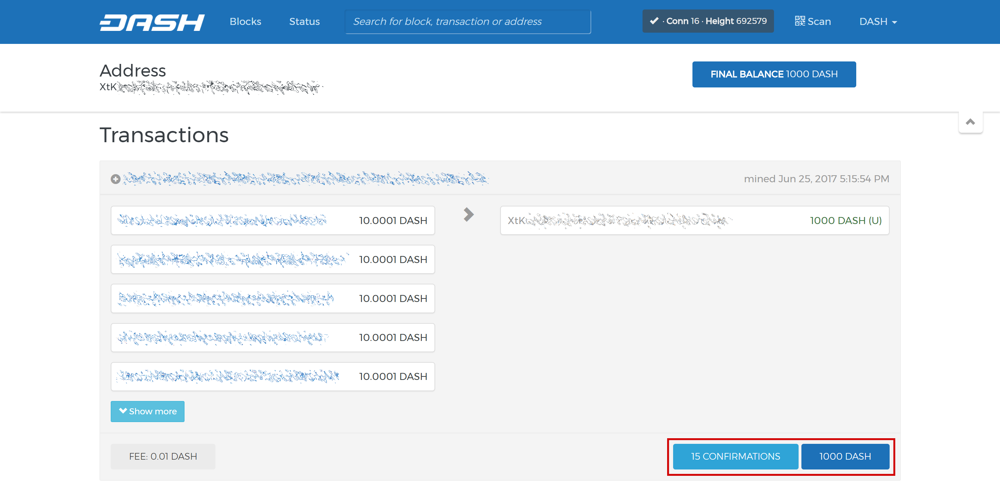
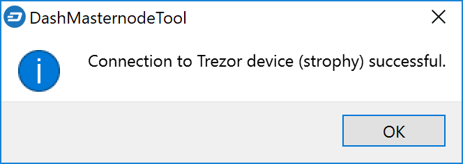
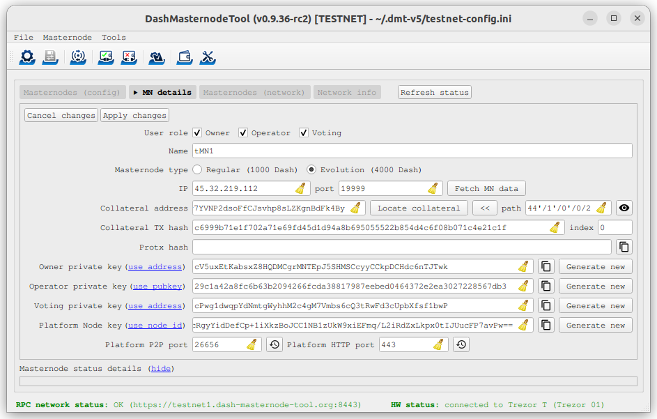

.. meta::
   :description: This guide describes how to set up a Dash evolution masternode. It also describes various options for hosting and different wallets
   :keywords: dash, guide, masternodes, trezor, dip3, setup, bls, evonode

.. _evonode-setup:

=============
Evonode Setup
=============

Setting up an Evolution masternode requires a basic understanding of Linux
and blockchain technology, as well as an ability to follow instructions closely.
It also requires regular maintenance and careful security, particularly if you
are not storing your Dash on a hardware wallet. There are some decisions to be
made along the way, and optional extra steps to take for increased security.

Commercial :ref:`masternode hosting services <masternode-hosting>` are available
if you prefer to delegate day-to-day operation of your evonode to a
professional operator. When using these hosting services, you retain full
control of the DASH collateral and pay an agreed percentage of your reward to
the operator. It is also possible to delegate your voting keys to a
representative, see the :ref:`governance documentation <delegating-votes>` for
more information.

Before you begin
================

This guide assumes you are setting up a single mainnet Evolution
masternode for the first time. If you are updating a masternode, see  :ref:`here
<masternode-update>` instead. You will need:

- 4000 Dash
- A wallet to store your Dash, preferably a hardware wallet, although Dash Core
  wallet is also supported
- A Linux server, preferably a Virtual Private Server (VPS)

For information about hosted masternodes, see the documentation listed below:

- :ref:`Information for users of hosted masternodes <hosted-setup>`
- :ref:`Information for operators of hosted masternodes <operator-transactions>`

This documentation describes the Dash Core commands as if they were entered in
the GUI by opening the console from **Window > Console**, but the same result
can be achieved on a masternode by entering the same commands and adding the
prefix ``~/.dashcore/dash-cli`` to each command.

Server configuration
--------------------

Proper server configuration is essential to successful masternode operation for
both security and performance reasons. Refer to the :hoverxref:`Server
configuration <server-config>` page for details on preparing your server to host
a masternode.

Once you have completed server configuration, complete the remaining steps in
the sections below to finish setting up your evonode or follow along with this
step-by-step tutorial.

.. raw:: html

    

        <iframe src="https://www.youtube-nocookie.com/embed/973E4knShBA" frameborder="0" allowfullscreen style="position: absolute; top: 0; left: 0; width: 100%; height: 100%;"></iframe>
    

.. _evonode-send-collateral:

Send the collateral
===================

A Dash address with a single unspent transaction output (UTXO) of exactly 4000
DASH is required to operate an Evolution masternode. Once it has been
sent, various keys regarding the transaction must be extracted for later entry
in a configuration file and registration transaction as proof to write the
configuration to the blockchain so the Evolution masternode can be
included in the deterministic list.

A masternode can be registered from a hardware wallet or the official Dash Core
wallet, although a hardware wallet is highly recommended to enhance security and
protect yourself against hacking. This guide will describe the steps for both
hardware wallets and Dash Core.

.. _evonode-send-collateral-hardware:

Option 1: Holding collateral in a hardware wallet
-------------------------------------------------

Set up your Trezor using the Trezor wallet at https://wallet.trezor.io/ and send
a test transaction to verify that it is working properly. For help on this, see
:ref:`this guide <hardware-trezor>` - you may also choose to (carefully!) `add a
passphrase
<https://blog.trezor.io/passphrase-the-ultimate-protection-for-your-accounts-3a311990925b>`_
to your Trezor to further protect your collateral. Create a new account in your
Trezor wallet by clicking **Add account**. Then click the **Receive** tab and
send exactly 4000 DASH to the address displayed. If you are setting up multiple
masternodes, send to consecutive addresses within the same new account. You
should see the transaction as soon as the first confirmation arrives, usually
within a few minutes.

.. figure:: img/setup-collateral-trezor.png
  :width: 400px

  Trezor Wallet Receive tab showing successfully received collateral

Once the transaction appears, click the QR code on the right to view the
transaction on the blockchain. Keep this window open as we complete the
following steps, since we will soon need to confirm that 15 confirmations exist,
as shown in the following screenshot.

  Trezor blockchain explorer showing 15 confirmations for collateral transfer

While we are waiting for 15 confirmations, download the latest version of the
Dash Masternode Tool (DMT) from the `GitHub releases page
<https://github.com/Bertrand256/dash-masternode-tool/releases>`__. Unzip and run
the file. The following window appears.

.. figure:: img/setup-collateral-dmt-start.png
  :width: 400px

  Dash Masternode Tool startup screen

Click the third button from the left **Check Dash Network Connection** in the
top left corner of the main window to verify that the connection is working.
Then connect your Trezor device and click the next button **Test Hardware Wallet
Connection** to verify the Trezor connection is working.

.. figure:: img/setup-collateral-connection.png
  :width: 100px

  Dash Masternode Tool successful connection confirmations

We will now use DMT to enter some basic information about the masternode and
extract the transaction ID. First, click **add a new one** or click **MN
actions** and select **Add New Masternode Entry...**. Carry out the following
sequence of steps as shown in the screenshot:

#. Enter a name for your masternode. The host name you specified for your VPS
   above is a good choice.
#. Select which masternode type you are setting up.
#. Enter the IP address of your masternode. This was given to you by the VPS
   provider when you set up the server. Then enter the TCP port number. This
   should be 9999 for mainnet.
#. Click **Locate collateral** to view unused collateral funding transactions
   available on the connected hardware wallet. Select the address to which you
   sent the collateral and click **Apply**. The **Collateral address**,
   **path**, **Collateral TX hash** and **index** fields should be filled
   automatically.

.. figure:: img/setup-collateral-dmt-ready.png
  :width: 400px

  Dash Masternode Tool with masternode configuration

Leave DMT open and continue with the next step: :ref:`Software Installation
<evonode-setup-install>`.

Option 2: Holding collateral in Dash Core wallet
------------------------------------------------

.. attention::

  Storing your collateral in a Dash Core wallet is **not** recommended. :ref:`Using a hardware
  wallet <evonode-send-collateral-hardware>` is **highly recommended** to enhance security and
  protect yourself against hacking. Only proceed with using Dash Core if you understand the risks.

.. dropdown:: Dash Core collateral instructions

  Open Dash Core wallet and wait for it to synchronize with the network. It should
  look like this when ready:

  .. figure:: img/setup-collateral-dashcore.png
    :width: 400px

    Fully synchronized Dash Core wallet

  Click **Window > Console** to open the console. Type the following command into
  the console to generate a new Dash address for the collateral::

    getnewaddress
    yiFfzbwiN9oneftd7cEfr3kQLRwQ4kp7ue

  Take note of the collateral address, since we will need it later.  The next step
  is to secure your wallet (if you have not already done so). First, encrypt the
  wallet by selecting **Settings > Encrypt wallet**. You should use a strong, new
  password that you have never used somewhere else. Take note of your password and
  store it somewhere safe or you will be permanently locked out of your wallet and
  lose access to your funds. Next, back up your wallet file by selecting **File >
  Backup Wallet**. Save the file to a secure location physically separate to your
  computer, since this will be the only way you can access our funds if anything
  happens to your computer. For more details on these steps, see :ref:`here
  <dashcore-backup>`.

  Now send exactly 4000 DASH in a single transaction to the new address you
  generated in the previous step. This may be sent from another wallet, or from
  funds already held in your current wallet. Once the transaction is complete,
  view the transaction in a `blockchain explorer
  <https://insight.dash.org/insight/>`_ by searching for the address. You
  will need 15 confirmations before you can register the masternode, but you can
  continue with the next step at this point already: generating your masternode
  operator key.

  .. figure:: img/setup-collateral-blocks.png
    :width: 400px

    Trezor blockchain explorer showing 15 confirmations for collateral transfer

.. _evonode-setup-install:

Masternode Installation
=======================

Dash Platform will include multiple services that must be configured properly for an Evolution
masternode to operate correctly. A :ref:`dashmate-based installation
<evonode-setup-install-dashmate>` is recommended to ensure your configuration is functional.

.. _evonode-setup-install-dashmate:

Dashmate installation
---------------------

Dashmate is a universal tool designed to help you set up and run Dash nodes in a
containerized environment. It is based on Docker technology and features an
interactive setup command. Dashmate handles the installation of Dash Core, as
well as all dependencies and supporting services. See this :ref:`dashmate
documentation <dashmate>` for more information.

Open PuTTY or a console again and connect to the server using the username and
password you just created for your new, non-root user. Begin by installing
dashmate dependencies::

  curl -fsSL https://get.docker.com -o get-docker.sh && sh ./get-docker.sh
  sudo usermod -aG docker $USER
  newgrp docker

Download the dashmate installation package for your CPU architecture from the `GitHub releases page
<https://github.com/dashpay/platform/releases/latest>`__ and install it using apt::

   wget https://github.com/dashpay/platform/releases/download/v1.6.2/dashmate_1.6.2.afe982a10-1_amd64.deb
   sudo apt update
   sudo apt install ./dashmate_1.6.2.afe982a10-1_amd64.deb

.. note:: At the end of the installation process, ``apt`` may display an error due to installing a downloaded package. You can ignore this error message:
   
   ``N: Download is performed unsandboxed as root as file '/home/ubuntu/dashmate_1.6.2.afe982a10-1_amd64.deb' couldn't be accessed by user '_apt'. - pkgAcquire::Run (13: Permission denied)``

Alternative installation options are available on the :hoverxref:`dashmate page
<dashmate-install>`.

Continue with the :ref:`Registration step <register-evonode>` to setup the
collateral, keys and construct the ProTx transaction required to enable your
masternode.

.. _register-evonode:

Register your masternode
========================

The keys required for the different masternode roles are described briefly under
:ref:`mn-concepts` in this documentation.

.. _register-evonode-hardware:

Option 1: Registering from a hardware wallet
--------------------------------------------

Go back to DMT and ensure that all fields from the previous step are still
filled out correctly.  Click **Generate new** for the private keys required for
the masternode:

- Owner private key
- Operator private key
- Voting private key
- Platform Node private key (evonodes only)

For evonodes, click the button beside the **Platform P2P port** and **Platform HTTP
port** fields to set the default values.

Click **Apply changes** when these fields have been set.

  Dash Masternode Tool ready to register a new masternode

Then click **MN actions** and select **Register masternode**. Optionally specify a different
**Payout address** and/or **Operator reward**, then click **Continue**.

.. important::

  Assigning a payout address from a non-hardware wallet like :ref:`Dash Core
  <evonode-get-addresses>` is recommended for the initial release of Dash Platform. Currently, the
  Dash Masternode Tool does not support the credit withdraw process that will be used to transfer
  Dash Platform rewards.

Select **Remote Dash RPC Node (automatic method)**. (For details about using your own local RPC
node, see the `Dash Masternode Tool documentation
<https://github.com/Bertrand256/dash-masternode-tool/blob/master/doc/config-connection-direct.md>`__.)
Confirm the following two messages:

.. figure:: img/setup-dmt-send.png
  :width: 220px

.. figure:: img/setup-dmt-sent.png
  :width: 400px

  Dash Masternode Tool confirmation dialogs to register a masternode

Complete server configuration
^^^^^^^^^^^^^^^^^^^^^^^^^^^^^

At this point the masternode registration is complete, but the BLS private key
must be added to the server so it can become operational. The BLS key
allows the masternode to watch the blockchain for relevant Pro*Tx transactions,
and will cause it to start serving as a masternode when the signed ProRegTx is
broadcast by the owner, as we just did above.

Take note of your BLS private key and then proceed with the relevant
instructions below.

Dashmate
~~~~~~~~

For dashmate-based masternodes, enter the BLS private key during the initial
dashmate setup process. Run the dashmate setup wizard on your server::

  dashmate setup

Select the network and masternode type. Select **Yes** when asked if your
masternode is already registered since this was done earlier in the section.

Enter the **BLS private key** and the **Platform node key** from DMT when
requested by dashmate.

Dashmate will automatically detect the external IP address and select the
default ports for the network you are setting up. You can modify these values if
necessary for a specific reason, but typically the defaults should be used.

Once the dashmate wizard has completed successfully, start your node as
follows::

  dashmate start

You can manage your masternode status, configuration, and running state entirely
from within dashmate. See the dashmate :hoverxref:`node operation documentation
<dashmate-node-operation>` for details.

.. _evonode-dashcore-protx:
.. _register-evonode-dashmate:

Option 2: Registering from dashmate
-----------------------------------

.. attention::
  For mainnet masternodes, it highly is recommended to :ref:`store the collateral on a
  hardware wallet <evonode-send-collateral-hardware>` and use the Dash Masternode
  Tool to register as described in :ref:`Option 1: Registering from a hardware
  wallet <register-evonode-hardware>`.

Dashmate can assist with masternode registration by requesting the parameters
necessary to construct a valid protx command that can be sent from Dash Core.
This option is most useful for setting up testnet masternodes where the
collateral is stored in Dash Core rather than a hardware wallet.

Collect required information
^^^^^^^^^^^^^^^^^^^^^^^^^^^^

Prior to running the dashmate setup wizard you should obtain the
:hoverxref:`collateral transaction info <evonode-mn-outputs>` and the owner,
voting, and payout addresses for the new evonode. For example, use Dash Core to
generate the addresses as described in the :hoverxref:`Get masternode addresses
section <evonode-get-addresses>`.

Run the setup wizard
^^^^^^^^^^^^^^^^^^^^

To begin masternode setup, run ``dashmate setup`` to start the interactive wizard::

  dashmate setup

You will be prompted to select a network, node type, IP address and BLS private
key. When setting up an unregistered masternode, you will also be prompted for
the collateral transaction information and owner, voting, and payout addresses.

Enter the requested information or accept the detected/generated defaults. For
an example showing all steps of the setup wizard, refer to the
:hoverxref:`dashmate section <dashmate-wizard-walkthrough>`.

Submit the ProRegTx
^^^^^^^^^^^^^^^^^^^

The dashmate wizard will output a command you can use to submit the provider
registration special transaction that registers the masternode on the network.
Copy the provided protx command and run it using dash-cli or the Dash Core
console.

.. figure:: ../network/dashmate/img/10b-protx-command-successful.png
   :align: center
   :width: 95%

   Registration command

Start the node
^^^^^^^^^^^^^^

Once the dashmate wizard has completed successfully, start your node as follows::

  dashmate start

You can manage your masternode status, configuration, and running state entirely
from within dashmate. See the dashmate :hoverxref:`node operation documentation
<dashmate-node-operation>` for details.

.. _register-evonode-core:

Option 3: Registering from Dash Core wallet
-------------------------------------------

.. attention::
  For mainnet masternodes, it highly is recommended to :ref:`store the collateral on a
  hardware wallet <evonode-send-collateral-hardware>` and use the Dash Masternode
  Tool to register as described in :ref:`Option 1: Registering from a hardware
  wallet <register-evonode-hardware>`.

If you prefer managing the collateral and keys using Dash Core, the following sections show how to
generate and retrieve information that may be required by dashmate or the Dash Masternode Tool.

.. _evonode-mn-outputs:

Identify the funding transaction
^^^^^^^^^^^^^^^^^^^^^^^^^^^^^^^^

If you used an address in Dash Core wallet for your collateral transaction, you
now need to find the txid of the transaction. Click **Window > Console** and
enter the following command::

  masternode outputs

This should return a string of characters similar to the following::

  {
  "16347a28f4e5edf39f4dceac60e2327931a25fdee1fb4b94b63eeacf0d5879e3-1",
  }

The first long string is your ``collateralHash``, while the last number is the
``collateralIndex``. 

.. _evonode-bls-generation:

Generate a BLS key pair
^^^^^^^^^^^^^^^^^^^^^^^

A public/private BLS key pair is required to operate a masternode. The private
key is specified on the masternode itself, and allows it to be included in the
deterministic masternode list once a provider registration transaction with the
corresponding public key has been created.

If you are using a hosting service, they may provide you with their public key,
and you can skip this step. If you are hosting your own masternode or have
agreed to provide your host with the BLS private key, generate a BLS
public/private keypair in Dash Core by clicking **Tools > Console** and entering
the following command::

  bls generate

  {
    "secret": "6d93ececa9993d9f1de4f3ae837115442a48a8e4c757ebb6261090af2f57547b",
    "public": "b4dfbe01becd50c9d754c3b87f9d6728f3bff30b8b820f894e1fd249fd11aa27b0b4145ad550cbc35e9796e60329ad0a",
    "scheme": "basic"
  }

.. warning::
  
  **These keys are NOT stored by the wallet and must be backed up and kept
  secure.**

.. _evonode-generate-platform-node-id:

Generate a Platform Node ID
^^^^^^^^^^^^^^^^^^^^^^^^^^^

The following command will generate new P2P key using Tenderdash and display it
on the screen::

  docker run --entrypoint /usr/bin/tenderdash --rm -ti dashpay/tenderdash gen-node-key

  {"id":"1e8e241c05ca350c8fe0b8ba4680e7652673dae2","priv_key": ...

Save the value contained in the ``id`` field for use as your ``platformNodeID``.

Alternatively, the following commands can be used generate P2P key, save it to
`privkey.pem`, and generate ``platformNodeID`` in hex format::

  openssl genpkey -algorithm ed25519 -out privkey.pem
  openssl pkey -in privkey.pem -noout  -text_pub |tail -n +3 | tr -d '[:space:]' | xxd -r -p| sha256sum | head -c 40

  1e8e241c05ca350c8fe0b8ba4680e7652673dae2

.. warning::
  
  **These keys are NOT stored by the wallet and must be backed up and kept
  secure.**

.. _evonode-get-addresses:

Get masternode addresses
^^^^^^^^^^^^^^^^^^^^^^^^

Owner address
~~~~~~~~~~~~~

First, we need to get a new, unused address from the wallet to serve as the
**owner key address** (``ownerKeyAddr``). This is not the same as the collateral
address holding 4000 Dash. Generate a new address as follows::

  getnewaddress

  yfgxFhqrdDG15ZWKJAN6dQvn6dZdgBPAip

Voting address
~~~~~~~~~~~~~~

This address can also be used as the **voting key address** (``votingKeyAddr``).
Alternatively, you can specify an address provided to you by your chosen voting
delegate, or simply generate a new voting key address as follows::

  getnewaddress

  yfRaZN8c3Erpqj9iKnmQ9QDBeUuRhWV3Mg

Payout address
~~~~~~~~~~~~~~
Then either generate or choose an existing address to receive the **owner's
masternode payouts** (``payoutAddress``). It is also possible to use an address
external to the wallet::

  getnewaddress

  yjZVt49WsQd6XSrPVAUGXtJccxviH9ZQpN

.. _upgrade-evonode:

Upgrade Core-only evonode
=========================

There are three options to proceed with upgrading an existing Core-only evonode to support Platform.
Please choose one which is suitable for you:

1. Upgrade an existing dashmate node. If you already have a dashmate-based evonode that meets the
   :ref:`minimum system requirements <evonode-hardware-reqs-table>`, you just need to update
   dashmate and obtain SSL certificates. You can upgrade from :ref:`dashmate v0.25
   <evonode-upgrade-from-dashmate-v0_25>` or :ref:`dashmate v1.0 <evonode-upgrade-from-dashmate-v1>`.
2. :ref:`Set up a dashmate node on a new host <evonode-upgrade-new-host>`. If you are running an
   evonode with dashd on a host that does not meet the :ref:`minimum system requirements
   <evonode-hardware-reqs-table>`, we recommend setting up a new server and migrating your evonode
   to it. Consider the following details when evaluating this option:

   - You will need to set up a new server and keep the existing and new servers running while Core
     is syncing on the new server.
   - You must either be able to move your current public IP to the new server or update the IP
     address using a :ref:`ProUpServTx <dip3-update-service>` update.
   - Your existing node will continue to operate while you set up the new server, so any problems
     with the new node will not affect the existing one.
   - This is a good opportunity to upgrade the OS and software to current versions.
3. :ref:`Set up a dashmate node on your existing host <evonode-upgrade-existing-host>`. If you
   prefer to install dashmate on the same server as your existing node, make sure you have enough
   disk space to store two copies of the Core blockchain at the same time during the migration (for
   about 10 mins).

Prerequisites
-------------

- ARM64 or x86-64 Linux host (Ubuntu is recommended) that meets the :ref:`minimum requirements
  <evonode-hardware-reqs-table>`
- Public IPv4 address
- Network configuration (firewall, security groups) allowing public access to the following TCP
  ports:
  
  - 9999/tcp
  - 443/tcp
  - 26656/tcp
  - 80/tcp (if you are going to use ZeroSSL)
- Backup of any existing Dash Core and dashmate configuration data, including private keys
- `ZeroSSL API access key <https://app.zerossl.com/developer>`_ or SSL certificate for the public
  IPv4 address (not DNS name)

.. _evonode-ssl-cert:

SSL certificates
----------------

There are two ways to get SSL certificates:

1. Register for the ZeroSSL service and set your API key. Since ZeroSSL provides an API, dashmate
   can update your certificates automatically. The free plan only provides 3 free certificates (or 3
   renewals of 1 certificate). Other plans require paying with a credit card. You can get an API key
   for dashmate by completing the following steps:

   - Register on `https://zerossl.com/ <https://zerossl.com/>`_. *We recommend not using your
     personal email address.*
   - Log in and click ``Developer`` on the left sidebar.
   - Copy your ZeroSSL API key to provide to dashmate later. *Do not create a "New certificate".*

   .. figure:: img/zerossl-developer-tab.png
     :width: 75%

     ZeroSSL Developer tab showing the API key

2. Obtain SSL certificates for your IP address using any available provider and upload the
   certificate files to your server. `SSL Dragon <https://www.ssldragon.com/>`_ and `SuperbitHost
   <https://www.superbithost.com/ssl-certificates/>`_ are two options that accept cryptocurrency.

   Please make sure that the certificate chain file contains your server certificate at the top and
   intermediate/root certificates if present. If a bundle file is present, you need to concatenate it
   with the certificate file::
   
    cat certificate.crt bundle.crt > full_chain.crt

   Verify the validity of the private key and certificate chain by running these commands::

     openssl rsa -noout -modulus -in private.key | openssl md5
     openssl x509 -noout -modulus -in bundle.crt | openssl md5

   The output of these two commands should be the same.
   

.. toctree::
   :maxdepth: 1

   dashmate-upgrade-v0_25
   dashmate-upgrade-v1
   dashmate-new-host
   dashmate-existing-host
