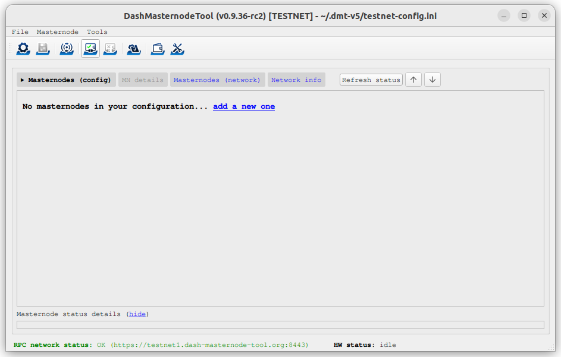
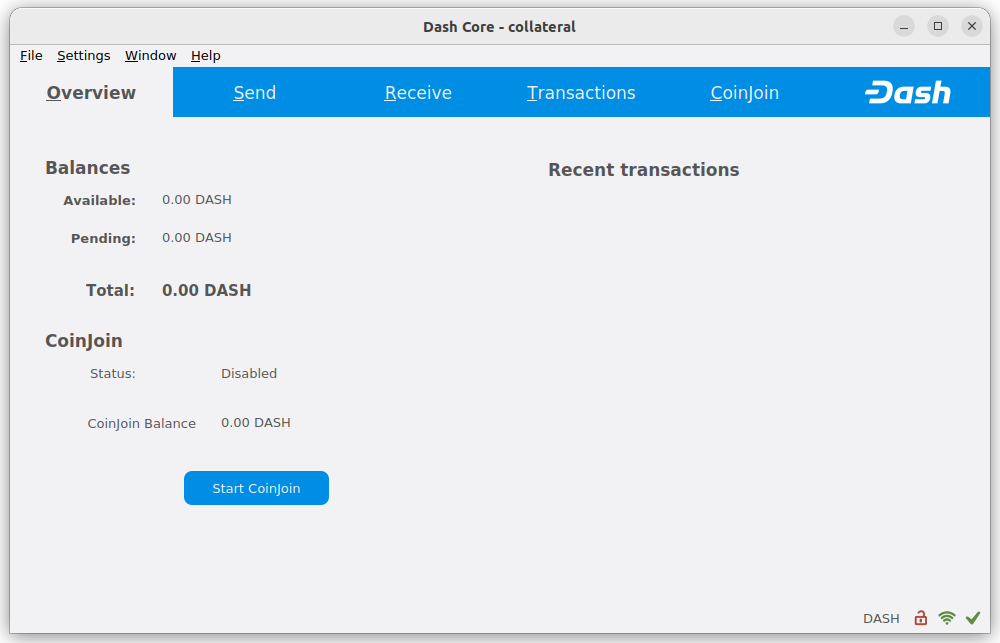
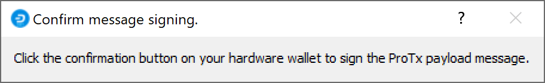

.. meta::
   :description: This guide describes how to set up a Dash masternode with evo services.
   :keywords: dash, guide, masternodes, trezor, dip3, setup, bls

.. _testnet-masternode-setup:

=============
Testnet Setup
=============

Setting up a masternode with support for evo services requires a basic
understanding of Linux and blockchain technology, as well as an ability
to follow instructions closely. It also requires regular maintenance and
careful security, particularly if you are not storing your Dash on a
hardware wallet. There are some decisions to be made along the way, and
optional extra steps to take for increased security.

Commercial :ref:`masternode hosting services <masternode-hosting>` are
available if you prefer to delegate day-to-day operation of your
masternode to a professional operator. When using these hosting
services, you retain full control of the 1000 DASH collateral and pay an
agreed percentage of your reward to the operator. It is also possible to
delegate your voting keys to a representative, see the 
:ref:`governance documentation <delegating-votes>` for more
information.

Before you begin
================

This guide assumes you are setting up a single testnet masternode for
the first time. If you are updating a masternode, see  :ref:`here
<masternode-update>` instead. You will need:

- 1000 Dash
- A wallet to store your Dash, preferably a hardware wallet, although 
  Dash Core wallet is also supported
- A Linux server, preferably a Virtual Private Server (VPS)

For information about hosted masternodes, see the documentation listed below:

- :ref:`Information for users of hosted masternodes <hosted-setup>`
- :ref:`Information for operators of hosted masternodes <operator-transactions>`

This documentation describes the commands as if they were entered in the
Dash Core GUI by opening the console from **Window > Console**, but the
same result can be achieved on a masternode by entering the same
commands and adding the prefix ``~/.dashcore/dash-cli`` to each command.

Server configuration
--------------------

Proper server configuration is essential to successful masternode operation for
both security and performance reasons. Refer to the :hoverxref:`Server configuration
<server-config>` page for details on preparing your server to host a masternode.

Send the collateral
===================

A Dash address with a single unspent transaction output (UTXO) of
exactly 1000 DASH is required to operate a masternode. Once it has been
sent, various keys regarding the transaction must be extracted for later
entry in a configuration file and registration transaction as proof to
write the configuration to the blockchain so the masternode can be
included in the deterministic list. A masternode can be registered from
a hardware wallet or the official Dash Core wallet, although a hardware
wallet is highly recommended to enhance security and protect yourself
against hacking. This guide will describe the steps for both hardware
wallets and Dash Core.

Option 1: Holding collateral in a hardware wallet
-------------------------------------------------

Set up your Trezor using the Trezor wallet at https://wallet.trezor.io/
and send a test transaction to verify that it is working properly. For
help on this, see :ref:`this guide <hardware-trezor>` - you may also
choose to (carefully!) `add a passphrase <https://blog.trezor.io/passphrase-the-ultimate-protection-for-your-accounts-3a311990925b>`_
to your Trezor to further protect your collateral. Create a new account
in your Trezor wallet by clicking **Add account**. Then click the
**Receive** tab and send exactly 1000 DASH to the address displayed. If
you are setting up multiple masternodes, send 1000 DASH to consecutive
addresses within the same new account. You should see the transaction as
soon as the first confirmation arrives, usually within a few minutes.

.. figure:: img/setup-collateral-trezor.png
   :width: 400px

   Trezor Wallet Receive tab showing successfully received collateral of
   1000 DASH

Once the transaction appears, click the QR code on the right to view the
transaction on the blockchain. Keep this window open as we complete the
following steps, since we will soon need to confirm that 15
confirmations exist, as shown in the following screenshot.

.. figure:: img/setup-collateral-blocks.png
   :width: 400px

   Trezor blockchain explorer showing 15 confirmations for collateral
   transfer

While we are waiting for 15 confirmations, download the latest version
of the Dash Masternode Tool (DMT) from the GitHub releases page `here
<https://github.com/Bertrand256/dash-masternode-tool/releases>`__. Unzip
and run the file. The following window appears.

   Dash Masternode Tool startup screen

Click the third button from the left **Check Dash Network Connection**
in the top left corner of the main window to verify that the connection
is working. Then connect your Trezor device and click the next button
**Test Hardware Wallet Connection** to verify the Trezor connection is
working.

.. figure:: img/setup-collateral-connection.png
   :width: 100px

.. figure:: img/setup-collateral-hardware.png
   :width: 180px

   Dash Masternode Tool successful connection confirmations

We will now use DMT to enter some basic information about the masternode
and extract the transaction ID. Carry out the following sequence of
steps as shown in this screenshot:

   Dash Masternode Tool configuration steps

#. Click the **New** button.
#. Enter a name for your masternode. The host name you specified 
   for your VPS above is a good choice.
#. Enter the IP address of your masternode. This was given to you
   by the VPS provider when you set up the server. Then enter the TCP 
   port number. This should be 19999.
#. Click **Locate collateral** to view unused collateral funding 
   transactions available on the connected hardware wallet. Select the 
   address to which you sent 1000 Dash and click **Apply**. The 
   **Collateral address**, **path**, **Collateral TX hash** and
   **index** fields should be filled automatically.

.. figure:: img/setup-collateral-dmt-ready.png
   :width: 400px

   Dash Masternode Tool with masternode configuration

Leave DMT open and continue with the next step: :ref:`installing Dash
Core on your VPS <testnet-masternode-setup-install>`.

Option 2: Holding collateral in Dash Core wallet
------------------------------------------------

Open Dash Core wallet and wait for it to synchronize with the network.
It should look like this when ready:

   Fully synchronized Dash Core wallet

Click **Window > Console** to open the console. Type the following
command into the console to generate a new Dash address for the
collateral::

  getnewaddress
  yiFfzbwiN9oneftd7cEfr3kQLRwQ4kp7ue

Take note of the collateral address, since we will need it later.  The
next step is to secure your wallet (if you have not already done so).
First, encrypt the wallet by selecting **Settings > Encrypt wallet**.
You should use a strong, new password that you have never used somewhere
else. Take note of your password and store it somewhere safe or you will
be permanently locked out of your wallet and lose access to your funds.
Next, back up your wallet file by selecting **File > Backup Wallet**.
Save the file to a secure location physically separate to your computer,
since this will be the only way you can access our funds if anything
happens to your computer. For more details on these steps, see
:ref:`here <dashcore-backup>`.

Now send exactly 1000 DASH in a single transaction to the new address
you generated in the previous step. This may be sent from another
wallet, or from funds already held in your current wallet. Once the
transaction is complete, view the transaction in a `blockchain explorer
<https://testnet-insight.dash.org/insight/>`_ by searching for the
address. You will need 15 confirmations before you can register the
masternode, but you can continue with the next step at this point
already: generating your masternode operator key.

.. figure:: img/setup-collateral-blocks.png
   :width: 400px

   Trezor blockchain explorer showing 15 confirmations for collateral
   transfer

.. _testnet-masternode-setup-install:

Masternode Installation
=======================

The following tools are available for installing a Dash masternode:

- :ref:`dashmate installation <testnet-masternode-setup-install-dashmate>`
- :ref:`Manual installation <testnet-masternode-setup-install-manual>`
- `Dash Masternode Zeus <https://github.com/kxcd/Masternode-Zeus>`__ (does not yet support platform services)

.. _testnet-masternode-setup-install-dashmate:

dashmate installation
---------------------

``dashmate`` replaces the `dashman
<https://github.com/moocowmoo/dashman/>`__ masternode installer by
moocowmoo. dashmate is based on Docker technology and
features an interactive setup command and the ability to manage multiple
node configs and multiple networks. It handles the installation of Dash
Core and Tenderdash, as well as all dependencies and supporting
services. Full dashmate documentation is available `here
<https://github.com/dashpay/platform/tree/master/packages/dashmate#readme>`__.

.. warning::
    Installation as root user is not supported or recommended.

Open PuTTY or a console again and connect using the username and
password you just created for your new, non-root user. Begin by
installing dashmate dependencies::

  curl -fsSL https://get.docker.com -o get-docker.sh && sh ./get-docker.sh
  sudo usermod -aG docker $USER
  newgrp docker
  curl -o- https://raw.githubusercontent.com/nvm-sh/nvm/v0.39.1/install.sh | bash
  source ~/.bashrc
  nvm install 16

Install dashmate::

  npm install -g dashmate

Run the interactive setup wizard::

  dashmate setup

You will be prompted to select a network, node type, IP address and BLS
private key. Enter this information or accept the detected/generated
defaults. Start your node as follows::

  dashmate start

You can manage your masternode status, configuration, and running state
entirely from within dashmate. See the documentation `here
<https://github.com/dashpay/platform/blob/master/packages/dashmate/README.md>`__ or use the built-in help
system to learn more:

- ``dashmate --help``
- ``dashmate <command> --help``

   dashmate displaying a range of status output

You can check the status of your masternode using the various ``dashmate
status`` commands as follows::

- dashmate status
- dashmate status core
- dashmate status host
- dashmate status masternode
- dashmate status platform
- dashmate status services

Continue with the :ref:`Registration step <testnet-register-masternode>` to
setup the collateral, keys and construct the ProTx transaction required
to enable your masternode.

.. _testnet-masternode-update:

Masternode Update
-----------------

You can use ``dashmate`` to update minor versions of the software on
your masternode as follows::

  dashmate stop
  dashmate update
  dashmate start

Adding the following ``git`` and ``npm`` commands optionally also
ensures you are using the latest stable version of dashmate::

  dashmate stop
  npm update -g dashmate
  dashmate update
  dashmate start

Adding the following command will drop all data from Dash Platform
(necessary if Platform has been wiped) and restart with the latest
version::

  dashmate stop
  npm update -g dashmate
  dashmate reset --platform-only
  dashmate update
  dashmate start

.. _testnet-register-masternode:

Masternode registration
=======================

The three keys required for the different masternode roles are described briefly
under :ref:`mn-concepts` in this documentation.

Option 1: Registering from a hardware wallet
--------------------------------------------

Go back to DMT and ensure that all fields from the previous step are
still filled out correctly.  Click **Generate new** for the three
private keys required for a masternode:

- Owner private key
- Operator private key (generate new or use private key generated by dashmate)
- Voting private key

.. figure:: img/setup-dmt-full.png
   :width: 220px

   Dash Masternode Tool ready to register a new masternode

Then click **Register masternode**. Optionally specify a different
**Payout address** and/or **Operator reward**, then click **Continue**.
Select **Remote Dash RPC Node (automatic method)**. (See `here <https://github.com/Bertrand256/dash-masternode-tool/blob/master/doc/config-connection-direct.md>`__ 
for documentation on using your own local RPC node.) and confirm the
following two messages:

.. figure:: img/setup-dmt-sent.png
   :width: 220px

   Dash Masternode Tool confirmation dialogs to register a masternode

The public key will be used in following steps. The private key must be
entered in the configuration on the masternode. This allows the
masternode to watch the blockchain for relevant Pro*Tx transactions, and
will cause it to start serving as a masternode when the signed ProRegTx
is broadcast by the owner (final step below). If you are using the BLS
key generated by ``dashmate setup``, this information is already configured
for your masternode. If you generated your own BLS key pair, edit the
dashmate configuration as follows::

  dashmate config set core.masternode.operator.privateKey <bls_private_key>
  dashmate restart

At this point you can go back to your terminal window and monitor your
masternode by entering ``dashmate status`` or using the **Get status**
function in DMT.

You can now safely log out of your server by typing ``exit``.
Congratulations! Your masternode is now running.

.. _testnet-dashcore-protx:

Option 2: Registering from Dash Core wallet
-------------------------------------------

Identify the funding transaction
^^^^^^^^^^^^^^^^^^^^^^^^^^^^^^^^

If you used an address in Dash Core wallet for your collateral
transaction, you now need to find the txid of the transaction. Click
**Window > Console** and enter the following command::

  masternode outputs

This should return a string of characters similar to the following::

  {
  "16347a28f4e5edf39f4dceac60e2327931a25fdee1fb4b94b63eeacf0d5879e3-1",
  }

The first long string is your ``collateralHash``, while the last number
is the ``collateralIndex``. 

.. _testnet-bls-generation:

Generate a BLS key pair
^^^^^^^^^^^^^^^^^^^^^^^

A public/private BLS key pair is required to operate a masternode. The
private key is specified on the masternode itself, and allows it to be
included in the deterministic masternode list once a provider
registration transaction with the corresponding public key has been
created.

If you are using a hosting service, they may provide you with their
public key, and you can skip this step. If you are hosting your own
masternode or have agreed to provide your host with the BLS private key,
you can use the BLS key generated by the ``dashmate setup`` command.
Alternatively, you can generate a BLS public/private keypair in Dash
Core by clicking **Window > Console** and entering the following
command::

  bls generate

  {
    "secret": "395555d67d884364f9e37e7e1b29536519b74af2e5ff7b62122e62c2fffab35e",
    "public": "99f20ed1538e28259ff80044982372519a2e6e4cdedb01c96f8f22e755b2b3124fbeebdf6de3587189cf44b3c6e7670e",
    "scheme": "legacy"
  }

**These keys are NOT stored by the wallet or dashmate and must be kept
secure, similar to the value provided in the past by the** ``masternode
genkey`` **command.**

Add the private key to your masternode configuration
^^^^^^^^^^^^^^^^^^^^^^^^^^^^^^^^^^^^^^^^^^^^^^^^^^^^

The public key will be used in following steps. The private key must be
entered in the ``dash.conf`` file on the masternode. This allows the
masternode to watch the blockchain for relevant Pro*Tx transactions, and
will cause it to start serving as a masternode when the signed ProRegTx
is broadcast by the owner (final step below). If you are using the BLS
key generated by ``dashmate setup``, this information is already
configured for your masternode. If you generated your own BLS key pair,
edit the dashmate configuration as follows::

  dashmate config set core.masternode.operator.privateKey <bls_private_key>
  dashmate restart

We will now prepare the transaction used to register the masternode on
the network.

Prepare a ProRegTx transaction
^^^^^^^^^^^^^^^^^^^^^^^^^^^^^^

A pair of BLS keys for the operator were already generated above, and
the private key was entered on the masternode. The public key is used in
this transaction as the ``operatorPubKey``.

First, we need to get a new, unused address from the wallet to serve as
the **owner key address** (``ownerKeyAddr``). This is not the same as
the collateral address holding 1000 Dash. Generate a new address as
follows::

  getnewaddress

  yfgxFhqrdDG15ZWKJAN6dQvn6dZdgBPAip

This address can also be used as the **voting key address**
(``votingKeyAddr``). Alternatively, you can specify an address provided
to you by your chosen voting delegate, or simply generate a new voting
key address as follows::

  getnewaddress

  yfRaZN8c3Erpqj9iKnmQ9QDBeUuRhWV3Mg

Then either generate or choose an existing address to receive the
**owner's masternode payouts** (``payoutAddress``). It is also possible
to use an address external to the wallet::

  getnewaddress

  yjZVt49WsQd6XSrPVAUGXtJccxviH9ZQpN

You can also optionally generate and fund another address as the
**transaction fee source** (``feeSourceAddress``). If you selected an
external payout address, you must specify a fee source address. 

Either the payout address or fee source address must have enough balance
to pay the transaction fee, or the ``register_prepare`` transaction will
fail.

The private keys to the owner and fee source addresses must exist in the
wallet submitting the transaction to the network. If your wallet is
protected by a password, it must now be unlocked to perform the
following commands. Unlock your wallet for 5 minutes::

  walletpassphrase yourSecretPassword 300

We will now prepare an unsigned ProRegTx special transaction using the
``protx register_prepare`` command. This command has the following
syntax::

  protx register_prepare collateralHash collateralIndex ipAndPort ownerKeyAddr 
    operatorPubKey votingKeyAddr operatorReward payoutAddress (feeSourceAddress)

.. warning::
   After v19 hard fork activation, ``protx register_prepare_legacy`` must
   be used if a legacy scheme BLS key is being used to register a masternode.
   It's recommended to instead generate a new basic scheme BLS key where
   possible. This can be done by following the
   :ref:`Generate a BLS key pair <testnet-bls-generation>` instructions.    

Open a text editor such as notepad to prepare this command. Replace each
argument to the command as follows:

- ``collateralHash``: The txid of the 1000 Dash collateral funding 
  transaction
- ``collateralIndex``: The output index of the 1000 Dash funding 
  transaction
- ``ipAndPort``: Masternode IP address and port, in the format 
  ``x.x.x.x:yyyy``
- ``ownerKeyAddr``: The new Dash address generated above for the 
  owner/voting address
- ``operatorPubKey``: The BLS public key generated above (or provided 
  by your hosting service)
- ``votingKeyAddr``: The new Dash address generated above, or the 
  address of a delegate, used for proposal voting
- ``operatorReward``: The percentage of the block reward allocated to 
  the operator as payment
- ``payoutAddress``: A new or existing Dash address to receive the 
  owner's masternode rewards
- ``feeSourceAddress``: An (optional) address used to fund ProTx fee. 
  ``payoutAddress`` will be used if not specified.

Note that the operator is responsible for :ref:`specifying their own
reward <dip3-update-service>` address in a separate ``update_service``
transaction if you specify a non-zero ``operatorReward``. The owner of
the masternode collateral does not specify the operator's payout
address.

Example (remove line breaks if copying)::

  protx register_prepare 
    16347a28f4e5edf39f4dceac60e2327931a25fdee1fb4b94b63eeacf0d5879e3 
    1 
    45.76.230.239:19999 
    yfgxFhqrdDG15ZWKJAN6dQvn6dZdgBPAip 
    99f20ed1538e28259ff80044982372519a2e6e4cdedb01c96f8f22e755b2b3124fbeebdf6de3587189cf44b3c6e7670e 
    yfRaZN8c3Erpqj9iKnmQ9QDBeUuRhWV3Mg 
    0 
    yjZVt49WsQd6XSrPVAUGXtJccxviH9ZQpN 
    yR83WsikBaBaNusTnHZf28kAcL8oVmp1TE

Output::

  {
    "tx": "030001000175c9d23c2710798ef0788e6a4d609460586a20e91a15f2097f56fc6e007c4f8e0000000000feffffff01a1949800000000001976a91434b09363474b14d02739a327fe76e6ea12deecad88ac00000000d1010000000000e379580dcfea3eb6944bfbe1de5fa2317932e260acce4d9ff3ede5f4287a34160100000000000000000000000000ffff2d4ce6ef4e1fd47babdb9092489c82426623299dde76b9c72d9799f20ed1538e28259ff80044982372519a2e6e4cdedb01c96f8f22e755b2b3124fbeebdf6de3587189cf44b3c6e7670ed1935246865dce1accce6c8691c8466bd67ebf1200001976a914fef33f56f709ba6b08d073932f925afedaa3700488acfdb281e134504145b5f8c7bd7b47fd241f3b7ea1f97ebf382249f601a0187f5300",
    "collateralAddress": "yjSPYvgUiAQ9AFj5tKFA8thFLoLBUxQERb",
    "signMessage": "yjZVt49WsQd6XSrPVAUGXtJccxviH9ZQpN|0|yfgxFhqrdDG15ZWKJAN6dQvn6dZdgBPAip|yfRaZN8c3Erpqj9iKnmQ9QDBeUuRhWV3Mg|ad5f82257bd00a5a1cb5da1a44a6eb8899cf096d3748d68b8ea6d6b10046a28e"
  }

Next we will use the ``collateralAddress`` and ``signMessage`` fields to
sign the transaction, and the output of the ``tx`` field to submit the
transaction.

Sign the ProRegTx transaction
^^^^^^^^^^^^^^^^^^^^^^^^^^^^^

We will now sign the content of the ``signMessage`` field using the
private key for the collateral address as specified in
``collateralAddress``. Note that no internet connection is required for
this step, meaning that the wallet can remain disconnected from the
internet in cold storage to sign the message. In this example we will
again use Dash Core, but it is equally possible to use the signing
function of a hardware wallet. The command takes the following syntax::

  signmessage collateralAddress signMessage

Example::

  signmessage yjSPYvgUiAQ9AFj5tKFA8thFLoLBUxQERb yjZVt49WsQd6XSrPVAUGXtJccxviH9ZQpN|0|yfgxFhqrdDG15ZWKJAN6dQvn6dZdgBPAip|yfRaZN8c3Erpqj9iKnmQ9QDBeUuRhWV3Mg|ad5f82257bd00a5a1cb5da1a44a6eb8899cf096d3748d68b8ea6d6b10046a28e

Output::

  II8JvEBMj6I3Ws8wqxh0bXVds6Ny+7h5HAQhqmd5r/0lWBCpsxMJHJT3KBcZ23oUZtsa6gjgISf+a8GzJg1BfEg=

Submit the signed message
^^^^^^^^^^^^^^^^^^^^^^^^^

We will now submit the ProRegTx special transaction to the blockchain to
register the masternode. This command must be sent from a Dash Core
wallet holding a balance on either the ``feeSourceAddress`` or
``payoutAddress``, since a standard transaction fee is involved. The
command takes the following syntax::

  protx register_submit tx sig

Where: 

- ``tx``: The serialized transaction previously returned in the ``tx`` 
  output field from the ``protx register_prepare`` command
- ``sig``: The message signed with the collateral key from the 
  ``signmessage`` command

Example::

  protx register_submit 030001000175c9d23c2710798ef0788e6a4d609460586a20e91a15f2097f56fc6e007c4f8e0000000000feffffff01a1949800000000001976a91434b09363474b14d02739a327fe76e6ea12deecad88ac00000000d1010000000000e379580dcfea3eb6944bfbe1de5fa2317932e260acce4d9ff3ede5f4287a34160100000000000000000000000000ffff2d4ce6ef4e1fd47babdb9092489c82426623299dde76b9c72d9799f20ed1538e28259ff80044982372519a2e6e4cdedb01c96f8f22e755b2b3124fbeebdf6de3587189cf44b3c6e7670ed1935246865dce1accce6c8691c8466bd67ebf1200001976a914fef33f56f709ba6b08d073932f925afedaa3700488acfdb281e134504145b5f8c7bd7b47fd241f3b7ea1f97ebf382249f601a0187f5300 II8JvEBMj6I3Ws8wqxh0bXVds6Ny+7h5HAQhqmd5r/0lWBCpsxMJHJT3KBcZ23oUZtsa6gjgISf+a8GzJg1BfEg=

Output::

  aba8c22f8992d78fd4ff0c94cb19a5c30e62e7587ee43d5285296a4e6e5af062

Your masternode is now registered and will appear on the Deterministic
Masternode List after the transaction is mined to a block. You can view
this list on the **Masternodes -> DIP3 Masternodes** tab of the Dash
Core wallet, or in the console using the command ``protx list valid``,
where the txid of the final ``protx register_submit`` transaction
identifies your masternode.

At this point you can go back to your terminal window and monitor your
masternode by entering ``dashmate status`` or using the **Get status**
function in DMT. 

.. _testnet-masternode-setup-install-manual:

Manual installation
===================

**The manual installation guide is currently a work in progress.**

This guide describes how to manually download and install the components
of your Dash masternode under Ubuntu Linux 22.04 LTS "Jammy Jellyfish"
assuming you have a non-root user named ``dash``. You will need to
manually adjust apt commands if using a different distro.

Core services
-------------

Prepare your environment for installing keys through GPG::

  sudo apt update
  sudo apt install apt-transport-https
  sudo mkdir -m 600 /root/.gnupg

Tor
^^^

Tor is an internet relay system designed to preserve anonymity on the
internet. Install Tor as follows::

  wget -qO- https://deb.torproject.org/torproject.org/A3C4F0F979CAA22CDBA8F512EE8CBC9E886DDD89.asc | gpg --dearmor | sudo tee /usr/share/keyrings/tor-archive-keyring.gpg >/dev/null
  echo "deb [signed-by=/usr/share/keyrings/tor-archive-keyring.gpg] https://deb.torproject.org/torproject.org $(lsb_release -cs) main" | sudo tee /etc/apt/sources.list.d/tor.list
  sudo apt update
  sudo apt install -y tor deb.torproject.org-keyring

Dash Core
^^^^^^^^^

Dash Core is a fork of Bitcoin Core and is responsible for all consensus
and communication relating to the base blockchain. Download Dash Core as
follows::

  cd /tmp
  wget https://github.com/dashpay/dash/releases/download/v20.1.1/dashcore-20.1.1-$(uname -m)-linux-gnu.tar.gz

Verify the authenticity of your download by checking its detached
signature against the public key published by the Dash Core development
team. All releases of Dash are signed using GPG with the following key:

- Pasta (pasta) with the key ``5252 7BED ABE8 7984``, `verifiable here
  on Keybase <https://keybase.io/pasta>`__

::

  curl https://keybase.io/pasta/pgp_keys.asc | gpg --import
  wget https://github.com/dashpay/dash/releases/download/v20.1.1/dashcore-20.1.1-$(uname -m)-linux-gnu.tar.gz.asc
  gpg --verify dashcore-20.1.1-$(uname -m)-linux-gnu.tar.gz.asc

Extract the compressed archive and copy the necessary files to the
directory::

  tar xfv dashcore-20.1.1-$(uname -m)-linux-gnu.tar.gz
  sudo install -t /usr/local/bin dashcore-20.1.1/bin/*

Create a working directory for Dash Core::

  mkdir ~/.dashcore

Configure Dash Core::

  cat << EOF | tee ~/.dashcore/dash.conf
  #----
  rpcuser=dashrpc
  rpcpassword=password
  rpcallowip=127.0.0.1
  #----
  listen=1
  server=1
  daemon=1
  #----
  txindex=1
  addressindex=1
  timestampindex=1
  spentindex=1
  #----
  zmqpubrawtx=tcp://0.0.0.0:29998
  zmqpubrawtxlock=tcp://0.0.0.0:29998
  zmqpubhashblock=tcp://0.0.0.0:29998
  zmqpubrawchainlock=tcp://0.0.0.0:29998
  #----
  #masternodeblsprivkey=
  externalip=$(curl icanhazip.com)
  #---- comment the following lines if you are not using Tor
  proxy=127.0.0.1:9050
  torcontrol=127.0.0.1:9051
  #----
  testnet=1
  
  [test]
  port=19999
  rpcport=19998
  bind=0.0.0.0
  rpcbind=0.0.0.0
  EOF

Optionally replace the ``rpcuser`` and ``rpcpassword`` fields with your
own values. Leave the ``masternodeblsprivkey`` field commented out for
now. Configure Dash Core to start as a service::

  cat << EOF | sudo tee /etc/systemd/system/dashd.service
  [Unit]
  Description=Dash Core
  After=syslog.target network-online.target
  
  [Service]
  Type=forking
  User=dash
  Group=dash
  ExecStart=/usr/local/bin/dashd
  TimeoutStartSec=10m
  ExecStop=/usr/local/bin/dash-cli stop
  SyslogIdentifier=dashd
  TimeoutStopSec=120
  RestartSec=120
  
  [Install]
  WantedBy=multi-user.target
  EOF

Start Dash Core::

  sudo systemctl daemon-reload
  sudo systemctl enable dashd
  sudo systemctl start dashd

Verify Dash Core is running::

  sudo systemctl status dashd

Use the following command to monitor sync status::

  dash-cli mnsync status

When synchronisation is complete, you should see the following
response::

  {
    "AssetID": 999,
    "AssetName": "MASTERNODE_SYNC_FINISHED",
    "AssetStartTime": 1558596597,
    "Attempt": 0,
    "IsBlockchainSynced": true,
    "IsSynced": true,
    "IsFailed": false
  }

Platform services
-----------------

Next, we will install the Dash Platform services. Start with installing
JavaScript dependencies::

  cd
  curl -o- https://raw.githubusercontent.com/nvm-sh/nvm/v0.39.5/install.sh | bash
  source ~/.bashrc
  nvm install 20
  npm install pm2 -g

Followed by Rust dependencies::

  sudo apt install -y build-essential clang cmake curl g++ gcc gnupg2 libgmp-dev libpython3.10-dev libssl-dev libzmq3-dev lsb-release pkg-config
  curl --proto '=https' --tlsv1.2 -sSf https://sh.rustup.rs | sh -s -- -y
  source "$HOME/.cargo/env"
  rustup toolchain install stable
  rustup target add wasm32-unknown-unknown --toolchain stable
  cargo install -f wasm-bindgen-cli@0.2.86

And Go dependencies::

  cd /tmp
  wget https://go.dev/dl/go1.19.11.linux-$(dpkg --print-architecture).tar.gz
  sudo tar -C /usr/local -xzf go1.19.11.linux-$(dpkg --print-architecture).tar.gz
  export PATH=$PATH:/usr/local/go/bin

Drive
^^^^^

Drive is a replicated state machine for Dash Platform. Download Drive as
follows::

  git clone --depth 1 --branch master https://github.com/dashpay/platform/
  cd platform
  corepack enable
  yarn install
  yarn workspace @dashevo/rs-drive build
  yarn workspace @dashevo/wasm-dpp build
  yarn workspaces focus --production @dashevo/drive
  cp packages/js-drive/.env.example packages/js-drive/.env

Configure Drive::

  sed -i 's/^CORE_JSON_RPC_PASSWORD.*/CORE_JSON_RPC_PASSWORD=password/' packages/js-drive/.env
  sed -i 's/^CORE_JSON_RPC_PORT.*/CORE_JSON_RPC_PORT=19998/' packages/js-drive/.env
  sed -i 's/^CORE_JSON_RPC_USERNAME.*/CORE_JSON_RPC_USERNAME=dashrpc/' packages/js-drive/.env
  sed -i 's/^INITIAL_CORE_CHAINLOCKED_HEIGHT.*/INITIAL_CORE_CHAINLOCKED_HEIGHT=854281/' packages/js-drive/.env
  sed -i 's/^VALIDATOR_SET_LLMQ_TYPE.*/VALIDATOR_SET_LLMQ_TYPE=6/' packages/js-drive/.env
  sed -i 's/^DASHPAY_MASTER_PUBLIC_KEY=.*/DASHPAY_MASTER_PUBLIC_KEY=02d4dcce3f0a8d2936ce26df4d255fd2835b629b73eea39d4b2778096b91e77946/' packages/js-drive/.env
  sed -i 's/^DASHPAY_SECOND_PUBLIC_KEY=.*/DASHPAY_SECOND_PUBLIC_KEY=03699c8b4ebf1696c92e9ec605a02a38f6f9cec47d13fb584fdad779e936e20ccb/' packages/js-drive/.env
  sed -i 's/^DPNS_MASTER_PUBLIC_KEY=.*/DPNS_MASTER_PUBLIC_KEY=02c8b4747b528cac5fddf7a6cc63702ee04ed7d1332904e08510343ea00dce546a/' packages/js-drive/.env
  sed -i 's/^DPNS_SECOND_PUBLIC_KEY=.*/DPNS_SECOND_PUBLIC_KEY=0201ee28f84f5485390567e939c2b586010b63a69ec92cab535dc96a8c71913602/' packages/js-drive/.env
  sed -i 's/^FEATURE_FLAGS_MASTER_PUBLIC_KEY=.*/FEATURE_FLAGS_MASTER_PUBLIC_KEY=029cf2232549de08c114c19763309cb067688e21e310ac07458b59c2c026be7234/' packages/js-drive/.env
  sed -i 's/^FEATURE_FLAGS_SECOND_PUBLIC_KEY=.*/FEATURE_FLAGS_SECOND_PUBLIC_KEY=02a2abb50c03ae9f778f08a93849ba334a82e625153720dd5ef14e564b78b414e5/' packages/js-drive/.env
  sed -i 's/^MASTERNODE_REWARD_SHARES_MASTER_PUBLIC_KEY=.*/MASTERNODE_REWARD_SHARES_MASTER_PUBLIC_KEY=0319d795c0795bc8678bd0e58cfc7a4ad75c8e1797537728e7e8de8b9acc2bae2b/' packages/js-drive/.env
  sed -i 's/^MASTERNODE_REWARD_SHARES_SECOND_PUBLIC_KEY=.*/MASTERNODE_REWARD_SHARES_SECOND_PUBLIC_KEY=033756572938aaad752158b858ad38511c6edff4c79cf8462f70baa25fc6e8a616/' packages/js-drive/.env
  sed -i 's/^WITHDRAWALS_MASTER_PUBLIC_KEY=.*/WITHDRAWALS_MASTER_PUBLIC_KEY=032f79d1d9d6e652599d3315d30306b1277fbf588e32e383aef0a59749547d47b7/' packages/js-drive/.env
  sed -i 's/^WITHDRAWALS_SECOND_PUBLIC_KEY=.*/WITHDRAWALS_SECOND_PUBLIC_KEY=03eebbe3dc3721603a0b5a13441f214550ffa7d035b7dea9f1911de0f63ddac58d/' packages/js-drive/.env

Start Drive::

  pm2 start yarn --name "drive" -- workspace @dashevo/drive abci

Verify Drive is running by checking for a time value under ``uptime``::

  pm2 list

Tenderdash
^^^^^^^^^^

Tenderdash is a fork of Tendermint and is the blockchain implementation
used by Dash Platform. As binaries are not yet published, you will need
to build from source. Build and install Tenderdash as follows::

  cd
  git clone --depth 1 --branch v0.11.3 https://github.com/dashpay/tenderdash
  cd tenderdash
  make install-bls
  make build-linux
  sudo install -t /usr/local/bin build/*

Initialize Tenderdash::

  tenderdash init full

Several files will be generated in the ``~/.tenderdash`` directory.
Modify the configuration with the following commands::

  sed -i 's/\(^moniker.*\)/#\1/' ~/.tenderdash/config/config.toml
  sed -i 's/^timeout_commit.*/timeout_commit = "500ms"/' ~/.tenderdash/config/config.toml
  sed -i 's/^create_empty_blocks_interval.*/create_empty_blocks_interval = "3m"/' ~/.tenderdash/config/config.toml
  sed -i 's/^namespace.*/namespace = "drive_tendermint"/' ~/.tenderdash/config/config.toml
  sed -i 's/^bootstrap-peers.*/bootstrap-peers = "74907790a03b51ac062c8a1453dafd72a08668a3@35.92.167.154:36656,2006632eb20e670923d13d4f53abc24468eaad4d@52.12.116.10:36656"/' ~/.tenderdash/config/config.toml
  sed -i 's/^core-rpc-host.*/core-rpc-host = "localhost:19998"/' ~/.tenderdash/config/config.toml
  curl https://gist.githubusercontent.com/strophy/d8665f30aa7544785439e5973a98a1c5/raw/ab254ae5ff4e176daaf6a53c7448e527fe5800d2/genesis.json > ~/.tenderdash/config/genesis.json

Configure Tenderdash to start as a service::

  cat << EOF | sudo tee /etc/systemd/system/tenderdash.service
  [Unit]
  Description=Tenderdash
  After=syslog.target network-online.target
   
  [Service]
  User=dash
  Group=dash
  TimeoutStartSec=10m
  TimeoutStopSec=120
  RestartSec=120
  ExecStart=/usr/local/bin/tenderdash node
  SyslogIdentifier=tenderdash
   
  [Install]
  WantedBy=multi-user.target
  EOF

Ensure Dash Core is fully synced and start Tenderdash::

  sudo systemctl daemon-reload
  sudo systemctl enable tenderdash
  sudo systemctl start tenderdash

Verify Tenderdash is running::

  sudo systemctl status tenderdash

DAPI
^^^^

DAPI provides masternode services over the JSON RPC and gRPC protocols.
Start DAPI as follows::

  cd ~/platform
  yarn workspaces focus --production @dashevo/dapi
  cp packages/dapi/.env.example packages/dapi/.env

Modify the configuration with the following commands::

  sed -i 's/^API_JSON_RPC_PORT.*/API_JSON_RPC_PORT=3004/' packages/dapi/.env
  sed -i 's/^API_GRPC_PORT.*/API_GRPC_PORT=3005/' packages/dapi/.env
  sed -i 's/^TX_FILTER_STREAM_GRPC_PORT.*/TX_FILTER_STREAM_GRPC_PORT=3006/' packages/dapi/.env
  sed -i 's/^DASHCORE_RPC_PORT.*/DASHCORE_RPC_PORT=19998/' packages/dapi/.env
  sed -i 's/^DASHCORE_ZMQ_PORT.*/DASHCORE_ZMQ_PORT=29998/' packages/dapi/.env
  sed -i 's/^DASHCORE_P2P_PORT.*/DASHCORE_P2P_PORT=19999/' packages/dapi/.env

Start DAPI::

  pm2 start yarn --name "dapi" -- workspace @dashevo/dapi api

Start the transaction filter stream::

  pm2 start yarn --name "dapi" -- workspace @dashevo/dapi core-streams

Envoy
^^^^^

Envoy is a gRPC service proxy for cloud-native applications. As it is
responsible for TLS termination, you will need to obtain a TLS
certificate for your public IP address before configuring Envoy. You can
do this independently using a provider of your choice, or use ZeroSSL to
obtain a free certificate. Visit https://app.zerossl.com/certificate/new
and enter your public IP address, select HTTP File Upload as the
verification method and then download the auth file. Place the contents
of this file in the ``/var/www/html/.well-known/pki-validation/``
directory with the original filename on your server and serve it using
nginx as follows::

  sudo mkdir -p /var/www/html/.well-known/pki-validation/
  sudo nano /var/www/html/.well-known/pki-validation/<your_auth_file_name>.txt
  sudo apt install -y nginx

Click the link shown in Step 3 of the ZeroSSL interface and verify that
the contents of the auth file are displayed in your browser. Complete
validation in ZeroSSL and download the bundle file in ``.zip`` format.
Extract it on your local computer, and copy the contents of the
``certificate.crt`` followed by ``ca_bundle.crt`` one after the other
into the bundle file at the following location on the remote node::

  sudo nano /etc/ssl/bundle.crt

Then copy the contents of ``private.key`` into the following location on
the remote node::

  sudo nano /etc/ssl/private.key

Remove nginx and the temporary auth file as follows:

  sudo apt -y --purge autoremove nginx
  sudo rm -rf /var/www/html/.well-known
        
Install Envoy as follows::

  cd /tmp
  echo $(uname -m) | grep -q "aarch64" && envoy_arch="aarch_64" || envoy_arch="x86_64"
  wget https://github.com/envoyproxy/envoy/releases/download/v1.23.10/envoy-1.23.10-linux-$envoy_arch
  sudo install -T envoy-1.23.10-linux-$envoy_arch /usr/local/bin/envoy  

Configure Envoy as follows::

  sudo mkdir /etc/envoy
  curl https://gist.githubusercontent.com/strophy/2716c203d88e77419152f6392623b844/raw/ce7aa360b544621c22587a09e0cf7190fd4a202e/envoy.yaml | sudo tee /etc/envoy/config.yaml

Configure Envoy to start as a service::

  cat << EOF | sudo tee -a /etc/systemd/system/envoy.service
  [Unit]
  Description=Envoy
  After=syslog.target network-online.target
  
  [Service]
  ExecStart=bash -c '/usr/local/bin/envoy --config-path /etc/envoy/config.yaml | tee'
  Restart=always
  RestartSec=5
  KillMode=mixed
  SyslogIdentifier=envoy
  
  [Install]
  WantedBy=multi-user.target
  EOF

Start Envoy::
  
  sudo systemctl daemon-reload
  sudo systemctl enable envoy
  sudo systemctl start envoy

Verify Envoy is running::

  sudo systemctl status envoy

Finishing up
------------

Ensure services managed by ``pm2`` start on reboot::

  pm2 save
  pm2 startup

Copy and paste the resulting command to ensure PM2 restarts processes on
boot::

  sudo env PATH=$PATH:/home/dash/.nvm/versions/node/v16.20.2/bin /home/dash/.nvm/versions/node/v16.20.2/lib/node_modules/pm2/bin/pm2 startup systemd -u dash --hp /home/dash

At this point you can safely log out of your server by typing ``exit``.
Congratulations! Your masternode is now running.

.. _testnet-masternode-setup-install-dev:

Developer installation
======================

Developers requiring a local masternode can get started quickly by
starting dashmate and providing a private key containing collateral
directly. Install dependencies if necessary (Docker, NodeJS, NPM, Github
CLI). Windows, macOS and Linux are supported, the following example
shows how to install dependencies under Ubuntu 20.04 LTS.::

  curl -o- https://raw.githubusercontent.com/nvm-sh/nvm/v0.39.5/install.sh | bash
  source ~/.bashrc
  nvm install 20
  curl -fsSL https://get.docker.com -o get-docker.sh && sh ./get-docker.sh
  sudo usermod -aG docker $USER
  newgrp docker

Generate a new Dash address for temporary use using `this script
<https://repl.it/@strophy/Generate-Dash-Address>`__ or the
``getnewaddress`` and ``dumpprivkey`` RPC commands in `Dash Core
<https://www.dash.org/downloads>`__ in testnet mode. Go to
https://testnet-faucet.dash.org/ and request 1000+ tDash to your new
address using the promo code 'masternode'. Then download and initialize
dashmate as follows::

  npm install -g dashmate

If you are using Windows, you will need to change the path for two log files.
Modify the example below with a log path of your choosing::

  dashmate config set platform.drive.abci.log.prettyFile.path C:\Users\strophy\Documents\GitHub\dashmate\testnet-drive-pretty.log
  dashmate config set platform.drive.abci.log.jsonFile.path C:\Users\strophy\Documents\GitHub\dashmate\testnet-drive-json.log

Register your masternode on the network as follows::

  dashmate setup testnet masternode -p <funding-private-key>

Wait until sync and registration are complete. Then start the masternode::

  dashmate start

Your masternode is now providing service on the following local ports::

  Core P2P:     19999
  Core RPC:     19998
  Platform P2P: 26656
  Platform RPC: 26657
  DAPI:    3000

Note that platform sync will take some time after core sync is complete.
You can monitor progress with ``dashmate status platform`` or use ``dashmate
--help`` to view other commands.
