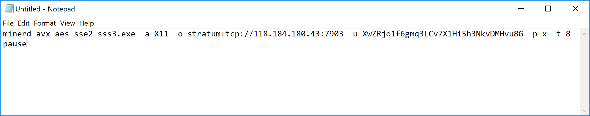
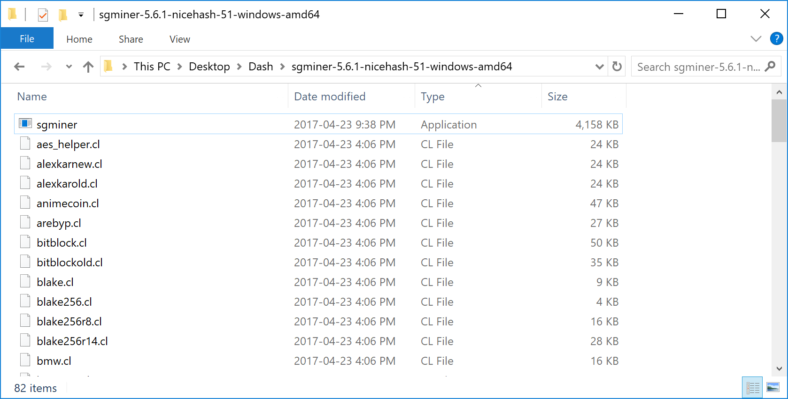
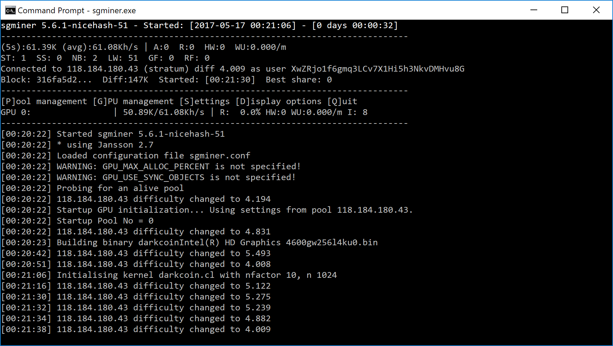

.. meta::
   :description: Information and guides on how to mine the Dash cryptocurrency
   :keywords: dash, mining, X11, masternode, CPU, GPU, ASIC, software, hardware, pool, mining pools

.. _mining:

======
Mining
======

Mining in the context of cryptocurrency such as Dash refers to the
process of searching for solutions to cryptographically difficult
problems as a method of securing blocks on the blockchain. The process
of mining creates new currency tokens as a reward to the miner. Mining
is possible on a range of hardware. Dash implements an algorithm known
as :ref:`X11 <x11-hash-algorithm>`, which the miner must solve in order
to earn rewards.

The simplest and most general hardware available for mining is the
general purpose CPU present in every computer. A CPU is designed to be
versatile but offers less efficiency than a GPU, which is designed to
rapidly calculate millions of vectors in parallel. While specific CPU
instruction enhancements related to cryptography such as AES or AVX can
provide a decent boost, GPUs offer a significant performance increase
due to their multiple pipelines capable of processing the predictably
repetitive calculations associated with cryptocurrency mining. Finally,
ASICs are relatively inflexible and can only process the specific
function(s) for which they were designed, but at an even faster rate
than the more general purpose GPUs and CPUs. A number of X11 ASICs are
now available on the market, which have quickly made CPU and GPU mining
uneconomic due to the increased difficulty of hashing arising from the
rapidly increasing hash rate. The result is a currency which is more
secure against brute force attacks on the Dash blockchain.

The profitability of mining is determined by the hashrate of your mining
device, the current network difficulty and the costs of your hardware
and electricity. The following links provide up to date information:

- `Hashrate <https://bitinfocharts.com/comparison/dash-hashrate.html>`_
- `Mining difficulty <https://bitinfocharts.com/comparison/dash-difficulty.html>`_
- `Profitability calculation tool <https://www.coinwarz.com/mining/dash/calculator>`_

Masternodes vs. Mining
======================

Dash, like Bitcoin and most other cryptocurrencies, is based on a
decentralized ledger of all transactions, known as a blockchain. This
blockchain is secured through a consensus mechanism; in the case of both
Dash and Bitcoin, the consensus mechanism is Proof of Work (PoW). Miners
attempt to solve difficult problems with specialized computers, and when
they solve the problem, they receive the right to add a new block to the
blockchain. If all the other people running the software agree that the
problem was solved correctly, the block is added to the blockchain and
the miner is rewarded.

Dash works a little differently from Bitcoin, however, because it has a
two-tier network. The second tier is powered by :ref:`masternodes
<masternodes>` (Full Nodes), which enable financial privacy
(CoinJoin), instant transactions (InstantSend), and the decentralized
governance and budget system. Because this second tier is so important,
masternodes are also rewarded when miners discover new blocks. The
breakdown is as follows: 90% of the block subsidy is split between the
miner and a masternode per the distribution found :ref:`here <block-reward-reallocation>`,
while 10% is reserved for the budget system (created by superblocks
every month).

The masternode system is referred to as Proof of Service (PoSe), since
the masternodes provide crucial services to the network. In fact, the
entire network is overseen by the masternodes, which have the power to
reject improperly formed blocks from miners. If a miner tried to take
the entire block reward for themselves or tried to run an old version of
the Dash software, the masternode network would orphan that block, and
it would not be added to the blockchain.

In short, miners power the first tier, which is the basic sending and
receiving of funds and prevention of doublespending. Masternodes power
the second tier, which provide the added features that make Dash
different from other cryptocurrencies. Masternodes do not mine, and
mining computers cannot serve as masternodes. Additionally, each
masternode is “secured” by 1000 DASH. Those DASH remain under the sole
control of their owner at all times, and can still be freely spent. The
funds are not locked in any way. However, if the funds are moved or
spent, the associated masternode will go offline and stop receiving
rewards.

Mining Pools
============

Mining Dash in pools is more likely to generate rewards than solo mining
directly on the blockchain. Mining dash using P2Pool is strongly
encouraged, since it is a good way to distribute, rather than
centralize, the hashing power. The following site lists Dash P2Pool
mining pools near you, simply choose a pool with favourable fees and
ping time and enter your Dash payment address as username and anything
as password.

- http://www.p2poolmining.us/p2poolnodes/

If you would like to set up your own P2Pool, documentation of the
process is available :ref:`here <p2pool>` and the code for p2pool-dash
is available on `GitHub <https://github.com/dashpay/p2pool-dash>`_.
Other mining pools are listed below and may be advantageous for
different reasons such as ping latency, uptime, fee, users, etc. A guide
to using a typical mining pool can be found :ref:`here <mining-pools>`.

- https://coinfoundry.org
- https://mining.luxor.tech
- https://dash.suprnova.cc
- https://www.nicehash.com
- https://www.coinotron.com
- https://dash.miningpoolhub.com
- https://www.multipool.us
- https://www.f2pool.com
- https://www2.coinmine.pl/dash/
- https://www.antpool.com
- https://avalon-life.io
- https://www.genesis-mining.com
- https://www.viabtc.com
- https://zpool.ca

DISCLAIMER: This list is provided for informational purposes only.
Services listed here have not been evaluated or endorsed by the Dash
developers and no guarantees are made as to the accuracy of this
information. Please exercise discretion when using third-party services.
If you’d like to be added to this list please reach out to
leon.white@dash.org

In addition to joining a pool, you will also need to create a Dash
address to receive your payout. To do this in Dash Core wallet, see
:ref:`here <dashcore-send-receive>`.

.. toctree::
   :hidden:
   :includehidden:
   :maxdepth: 1

   pools.rst
   p2pool.rst

CPU Mining
==========

This documentation describes how to mine Dash under the Windows
operating system using just the CPU in your computer. Please note that
the prevalence of GPU and ASIC miners mean that unless you have free
electricity, this is highly unlikely to be profitable! Since this is the
case, the software in this guide has not been updated in several years,
and is intended for experimental purposes and testnet only.

This is a fairly simple procedure and examples will be given in order to
achieve the fastest possible hash rate for your CPU, but remember that
more optimized miners do exist, so we advise you to keep an eye out on
mining sites such as these in order to keep up with the latest
information and releases.

- `Crypto Mining Blog <https://cryptomining-blog.com/>`_
- `Dash Forum Mining Discussions <https://www.dash.org/forum/topic/mining.3/>`_
- `Bitcoin Talk Altcoin Mining Discussions <https://bitcointalk.org/index.php?board=160.0>`_

Mining software
---------------

The first step is to download appropriate mining software. A good basic
miner for modern CPUs can be found here:

- https://github.com/elmad/darkcoin-cpuminer-1.3-avx-aes

This software depends on your CPU supporting the AES-NI and AVX
instruction sets. You can use `CPU-Z
<https://www.cpuid.com/softwares/cpu-z.html>`_ to check if this is the
case for your CPU:

   CPU-Z showing details for an Intel i7 Haswell CPU

If your CPU does not support AES-NI and AVX, then you can try more
generalized software which does not require specific instruction sets,
such as these:

- https://github.com/ig0tik3d/darkcoin-cpuminer-1.2c
- https://github.com/tpruvot/cpuminer-multi

Our goal here is to choose mining software that supports the maximum
possible instruction sets available on your CPU, and then try to
increase the hash speed. Once you have made your choice, click
**Releases** and download and extract the zip file. The different \*.exe
files indicate which specific processor optimizations they support. The
folder should look something like this:

.. figure:: img/cpu-miner-files.png
   :width: 400px

   Executable CPU miners for Dash

Configuration
-------------

Begin by selecting a mining pool and generating a Dash address as
described in the :ref:`Mining Pools <mining-pools>` section above. Keep
all your mining files in a single folder. In this example we will work
from the Desktop. The node selected for this example is from the
p2poolming.us list and is located in China::

  http://118.184.180.43:7903/static/

Next, open **Notepad** and type in on one line the command we will use
to start the miner, followed by pause on the second line. The general
format is as follows::

  <minerd> -a <algorithm> -o <url> -u <username> -p <password> -t <threads>
  pause

Where:

- minerd = the executable miner daemon file you choose to use
- a = algorithm, which is X11 for Dash
- o = URL of your mining pool, including the protocol and port
- u = username, usually the Dash receiving address of your wallet or worker
- p = password, can often be set to x
- t = number of threads used
- pause = keeps the window open in the case of errors

For the CPU in the example above, the command may be::

  minerd-avx-aes-sse2-sss3.exe -a X11 -o stratum+tcp://118.184.180.43:7903 -u XwZRjo1f6gmq3LCv7X1Hi5h3NkvDMHvu8G -p x -t 8
  pause

   Notepad file showing an example command to start a CPU miner

Click **File**, then **Save As**. Change **Save as type** to **All
Files**, then type the file name as *startminer.bat* and save it in the
same folder as the unzipped *minerd* files.

Testing
-------

You are now ready to start! Keep an eye on your CPU usage in **Task
Manager** (right click the taskbar to open this) and be careful that the
CPU temperature does not exceed your maximum rating (around 64°C). If
you have temperature or desktop stability problems, reduce ``t`` to ~2
threads and try that first. If ``t`` is left out, the machine will
default to the maximum number of threads. After running the miner for a
while, take a look at the hash speed and payouts in your mining pool.
You can identify your miner by the wallet address on the page.

.. figure:: img/cpu-mining.png
   :width: 400px

   Example of CPU mining using DarkCoin CPUMiner 1.3 on Intel Core i7

Tips
----

Reduce the number of threads for added desktop usability and heat
reduction. If the CPU temperature is too high, consider fitting a new
fan and check that the heat sink thermal paste on the CPU is adequate.
Tweak the processor clock speed for added performance using a
motherboard controller like `AI Suite
<https://www.asus.com/support/FAQ/1012780/>`_ for Asus motherboards.
Reduction of CPU core voltage will result in lower temperature but
increased instability.

Try to select a pool that is nearby to reduce network latency. If the
node appears slow, switch to another location. Please distribute the
hashing power globally to different pools to avoid forking.

GPU Mining
==========

This guide consolidates several other guides on how to use your GPU (the
processor on your graphics card) to mine Dash using the X11 algorithm on
Windows. Please note that the growing market for ASIC miners means that
this if probably not going to be profitable! A lot of the software and
binaries described here also have not been updated for several years, so
this guide should be used for experimental purposes only.

This guide will cover the process of downloading and configuring the
mining software, followed by some suggestions for optimizations. This
technology can change rapidly, so we advise you to keep an eye out on
mining sites such as these in order to keep up with the latest
information and releases.

- `Crypto Mining Blog <https://cryptomining-blog.com/>`_
- `Dash Forum Mining Discussions <https://www.dash.org/forum/topic/mining.3/>`_
- `Bitcoin Talk Altcoin Mining Discussions <https://bitcointalk.org/index.php?board=160.0>`_

Mining software
---------------

As for CPU mining, a range of mining software is available for GPU
mining. Most of it based on sgminer compiled with different
optimizations specific to different hardware. A good approach is to
identify your graphics hardware, then choose an appropriate build of
sgminer. You can use `GPU-Z <https://www.techpowerup.com/gpuz/>`_ to
identify your GPU hardware:

.. figure:: img/gpu-z.png
   :width: 400px

   GPU-Z showing details for AMD Radeon Turks and NVIDIA Quadro GK104
   class GPUs

Next, download the mining software. Most of these are based on the
original `sgminer <https://github.com/sgminer-dev/sgminer>`_, but this
is not suitable for the X11 algorithm, offers no compiled binaries and
hasn't been updated in years. We will describe using pre-compiled binary
software maintained by newer developers only.

**AMD**

- https://github.com/nicehash/sgminer/releases

**NVIDIA**

- https://github.com/tpruvot/ccminer/releases (focus on core 
  application)
- https://github.com/sp-hash/ccminer/releases (sp-mod, optimized CUDA
  kernels for Windows)

Download your chosen release and extract the zip file to a known
location. The folder should look something like this:

   Executable GPU miners for Dash

The sgminer file is the executable file, while the various files with
.cl extensions define the various algorithms supported by sgminer. In
this case, we are interested in the darkcoin.cl and darkcoin-mod.cl
implementations of X11. Note that the name of the executable file may be
different for miners with different optimizations, for example ccminer
for NVIDIA cards.

Configuration
-------------

Begin by selecting a mining pool and generating a Dash address as
described in the :ref:`Mining Pools <mining-pools>` section above. Keep
all your mining files in a single folder. In this example we will work
from the Desktop. The node selected for this example is from the
p2poolming.us list and is located in China::

  http://118.184.180.43:7903/static/

Next, open **Notepad** and create the basic configuration. The general
format is as follows::

  {
    "pools" : [
      {
        "url" : "stratum+tcp://pooladdress:7903",
        "user" : "walletaddress",
        "pass" : "x",
        "algorithm":"darkcoin"
      }
    ]
  }

Where:

- pools = defines a list of pools (in this case, only one) towards which
  the hashing power is directed
- url = URL of your mining pool, including the protocol and port
- user = username, usually the Dash receiving address of your wallet or
  worker
- pass = password, can often be set to x
- algorithm = hashing algorithm to use, in this case darkcoin (for
  historic reasons) or darkcoin-mod

For the pool above, the configuration may be:

.. figure:: img/gpu-config.png
   :width: 400px

   Configuration file for a Dash GPU miner

Click **File**, then **Save As**. Change **Save as type** to **All
Files**, then type the file name as *sgminer.conf* and save it in the
same folder as the unzipped *sgminer* files.

Testing
-------

Double click your *sgminer.exe* and a **Command Prompt** window should
appear immediately. If it disappears too quickly, check your
configuration for missing commas, unclosed brackets or incorrect file
name. The program will compile a special binary specific to your GPU and
store it in the folder, then begin hashing.

   Example of GPU mining using sgminer 5.6.1-nicehash-51 on Intel HD
   Graphics 4600

.. _asic-mining:

ASIC Mining
===========

ASIC stands for *Application-Specific Integrated Circuit* and describes
a type of processor that is designed for one purpose only. ASICs are a
popular choice for mining cryptocurrency because they can offer a higher
efficiency than CPU or GPU miners, resulting in higher profit.

Please note that the information on this page may become obsolete very
quickly due to the rapidly changing market and difficulty of mining
Dash. You are responsible for carrying out your own research and any
listing on this page should not be considered an endorsement of any
particular product. A good place to begin your research is the `mining
section of the Dash Forums <https://www.dash.org/forum/topic/hardware-discussions-asic-gpu-cpu.101/>`_.

The following X11 ASIC miners are available on the market today, click
the product name to visit the manufacturer's website:

+----------------------------------------------------------------------------------------------------------+---------------+---------+---------+-----------------+---------+
| Name                                                                                                     | Hash rate     | Power   | Weight  | Dimensions (mm) | Price   |
+==========================================================================================================+===============+=========+=========+=================+=========+
| `Bitmain Antminer D5 <https://shop.bitmain.com.cn/product/detail?pid=000201811150956053407f2Bhw2x068D>`_ | 119 GH/s ±5%  | 1566 W  | 7.5 kg  | 486 x 265 x 388 | $1,180  |
+----------------------------------------------------------------------------------------------------------+---------------+---------+---------+-----------------+---------+
| `Spondoolies SPx36 <https://www.spondoolies-tech.com/products/spx36>`_                                   | 540 GH/s ±10% | 4400 W  | 19.5 kg | 640 x 525 x 185 | $7,000  |
+----------------------------------------------------------------------------------------------------------+---------------+---------+---------+-----------------+---------+
| `StrongU STU-U6 <https://strongu.com.cn/Home/Goods/goodsInfo/id/263.html>`_                              | 420 GH/s ±8%  | 2100 W  | 8.5 kg  | 370 x 135 x 208 |         |
+----------------------------------------------------------------------------------------------------------+---------------+---------+---------+-----------------+---------+

ASIC resellers may also have miners available:

- http://kaboomracks.com
- https://brokerage.luxor.tech/dashboard

The following ASIC miners are either no longer easily available or
obsolete due to the increase in difficulty on the network.

+-------------------------------------------------------------------------------------------------------+----------------+--------+---------+-----------------+
| Name                                                                                                  | Hash rate      | Power  | Weight  | Dimensions (mm) |
+=======================================================================================================+================+========+=========+=================+
| `Baikal BK-X <https://www.baikalminer.com/product09.php>`_                                            | 10 GH/s ±5%    | 800 W  | 3.8 kg  | 312 x 125 x 130 |
+-------------------------------------------------------------------------------------------------------+----------------+--------+---------+-----------------+
| `Baikal Mini <https://www.baikalminer.com/>`_                                                         | 150 MH/s ±10%  | 40 W   | .475 kg | 140 x 100 x 95  |
+-------------------------------------------------------------------------------------------------------+----------------+--------+---------+-----------------+
| `Baikal Giant+ A2000 <https://www.baikalminer.com/product06.php>`_                                    | 2000 MH/s ±10% | 430 W  | 3 kg    | 300 x 140 x 125 |
+-------------------------------------------------------------------------------------------------------+----------------+--------+---------+-----------------+
| `Baikal Giant A900 <https://www.baikalminer.com/>`_                                                   | 900 MH/s ±5%   | 217 W  | 2.5 kg  | 300 x 123 x 123 |
+-------------------------------------------------------------------------------------------------------+----------------+--------+---------+-----------------+
| `Baikal Quad Cube <https://www.baikalminer.com/>`_                                                    | 1200 MH/s ±10% | 300 W  | 3 kg    | 135 x 135 x 425 |
+-------------------------------------------------------------------------------------------------------+----------------+--------+---------+-----------------+
| `Bitmain Antminer D3 <https://shop.bitmain.com/product/detail?pid=000201810311345082643S60TX7I0609>`_ | 17 GH/s ±5%    | 970 W  | 6.5 kg  | 320 x 130 x 190 |
+-------------------------------------------------------------------------------------------------------+----------------+--------+---------+-----------------+
| `iBelink DM384M <https://ibelink.co/>`_                                                               | 384 MH/s ±10%  | 715 W  | 21 kg   | 490 x 350 x 180 |
+-------------------------------------------------------------------------------------------------------+----------------+--------+---------+-----------------+
| `iBelink DM11G <https://www.asicminervalue.com/miners/ibelink/dm11g>`_                                | 11 GH/s ±5%    | 810 W  | 22 kg   | 490 x 350 x 180 |
+-------------------------------------------------------------------------------------------------------+----------------+--------+---------+-----------------+
| `iBelink DM22G <https://www.asicminervalue.com/miners/ibelink/dm22g>`_                                | 22 GH/s ±5%    | 810 W  | 19 kg   | 490 x 350 x 180 |
+-------------------------------------------------------------------------------------------------------+----------------+--------+---------+-----------------+
| Pinidea DR-1                                                                                          | 500 MH/s ±10%  | 320 W  | 4.5 kg  | 290 x 130 x 150 |
+-------------------------------------------------------------------------------------------------------+----------------+--------+---------+-----------------+
| Pinidea DR-2                                                                                          | 450 MH/s ±5%   | 335 W  | 4.5 kg  | 200 x 165 x 135 |
+-------------------------------------------------------------------------------------------------------+----------------+--------+---------+-----------------+
| Pinidea DR-3                                                                                          | 600 MH/s ±5%   | 345 W  | 4.5 kg  | 200 x 165 x 135 |
+-------------------------------------------------------------------------------------------------------+----------------+--------+---------+-----------------+
| Pinidea DU-1                                                                                          | 9 MH/s ±5%     | 7 W    |         | 50 x 50 x 30    |
+-------------------------------------------------------------------------------------------------------+----------------+--------+---------+-----------------+
| Pinidea DRX-Kuznetsov                                                                                 | 900 MH/s ±5%   | 650 W  |         | 280 x 180 x 150 |
+-------------------------------------------------------------------------------------------------------+----------------+--------+---------+-----------------+
| Pinidea DRX-Varyag                                                                                    | 1200 MH/s ±5%  | 850 W  |         | 280 x 180 x 150 |
+-------------------------------------------------------------------------------------------------------+----------------+--------+---------+-----------------+
| `iBelink DM56G <https://ibelink.co/product/ibelink-dm56g-x11-dash-miner-with-56-gh-s-hash-rate/>`_    | 56 GH/s ±5%    | 2100 W | 17 kg   | 490 x 390 x 180 |
+-------------------------------------------------------------------------------------------------------+----------------+--------+---------+-----------------+
| `Innosilicon A5 <https://www.innosilicon.com/html/a5-miner/index.html>`_                              | 32 GH/s ±8%    | 750 W  | 3.1 kg  | 400 x 135 x 158 |
+-------------------------------------------------------------------------------------------------------+----------------+--------+---------+-----------------+
