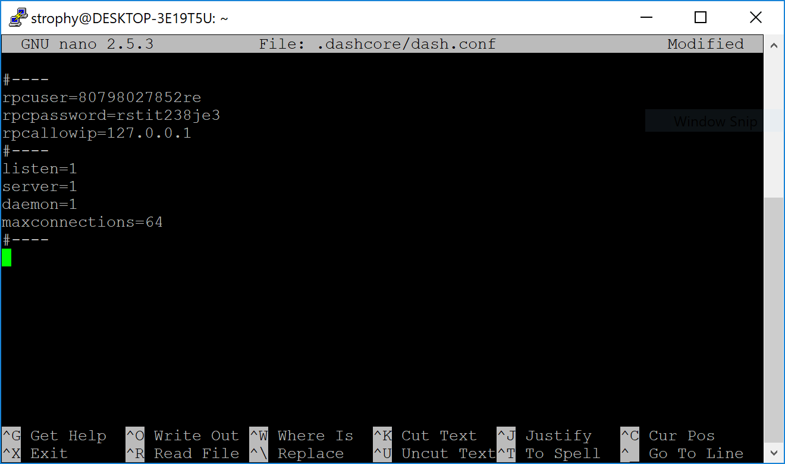

.. meta::
   :description: Guide to setting up a Dash P2Pool node
   :keywords: dash, mining, X11, p2pool, node, pool, software, ASIC, mining pool

.. _p2pool:

=================
P2Pool Node Setup 
=================

This guide describes how to set up a Dash P2Pool node to manage a pool
of miners. Unlike centralized mining pools, P2Pool is based on the same
peer-2-peer (P2P) model as Dash, making the pool as a whole highly
resistant to malicious attacks, and preserving and protecting the
decentralized nature of Dash. When you launch a P2Pool node, it seeks
out, connects with, and shares data with a decentralized network of
other P2Pool nodes (also known as peers). P2Pool nodes share a
cryptographic chain of data representing value, similar to Dash's
blockchain. The P2Pool version is called the sharechain. The
decentralized and fair nature of this mining model means mining with
P2Pool is strongly encouraged. P2Pool for Dash uses the `p2pool-dash
<https://github.com/dashpay/p2pool-dash>`_ software on GitHub, which is
a fork of p2pool for Bitcoin. For more information, see `here
<https://en.bitcoin.it/wiki/P2Pool>`__.

Because of the way P2Pool manages difficulty adjustments on the
sharechain, it is important to maintain low latency between the miners
and the P2Pool node to avoid miners submitting shares too late to enter
the sharechain. When setting up your node, you need to consider its
physical and network location relative to the miners you intend to
connect to the node. If you operate a mining farm, your P2Pool node
should probably be a physical machine on the same local network as your
miners. If you plan to operate a public node, it may be best to set up
your P2Pool node as a virtual machine in a data center with a high speed
connection so geographically close miners can mine to your pool with
relatively low latency.

This following section describes the steps to setup an Ubuntu Server
running P2Pool for Dash. It has been tested with Ubuntu 20.04 LTS and
Dash 0.16. While a reasonable effort will be made to keep it up to
date, it should be possible to modify the instructions slightly to
support different versions or operating systems as necessary.

Setting up the host server
==========================

Download a copy of Ubuntu Server LTS from
https://ubuntu.com/download/server and install it on your system
according to the steps described `here
<https://ubuntu.com/tutorials/install-ubuntu-server>`__. If you are
using a VPS such as Vultr or AWS, your provider will most likely provide
an option to install this system during provisioning. Ensure you enable
OpenSSH server during setup so you can control your server from a remote
console. Once you have access to your server, create a new non-root user
if you have not already done so using the following command, replacing
``<username>`` with a username of your choice::

  adduser <username>

You will be prompted for a password. Enter and confirm using a new
password (different to your root password) and store it in a safe place.
You will also see prompts for user information, but this can be left
blank. Once the user has been created, we will add them to the sudo
group so they can perform commands as root::

  usermod -aG sudo <username> 

Reboot your server and log in as the new user. At this point it is
recommended to connect remotely using `PuTTY
<https://www.chiark.greenend.org.uk/~sgtatham/putty/latest.html>`_ (for
Windows) or ssh (for Linux and macOS) if you have not already done so.

Setting up port forwarding
==========================

If you are on a private network behind a router, you will need to set up
port forwarding for at least port 8999 (UDP/TCP) for access to the
sharechain, as well as port 7903 (UDP/TCP) if you want your node to be
accessible to the public. How this is done depends on your particular
network router and is therefore beyond the scope of this documentation.
An example from the popular DD-WRT open source router distribution is
shown below. Guides to setting up port forwarding can be found `here
<https://www.wikihow.com/Set-Up-Port-Forwarding-on-a-Router>`__ and `here
<https://www.noip.com/support/knowledgebase/general-port-forwarding-guide/>`__.

Take note of your IP address either from your router management
interface or by visiting https://www.whatismyip.com

.. figure:: img/p2pool-ddwrt.png
   :width: 400px

   Setting up port forwarding under DD-WRT

Manual setup
============

First update your operating system as follows::

  sudo apt update
  sudo apt upgrade

Setting up dashd
----------------

P2Pool requires a full Dash node to be running to get block and
transaction data. To download and install Dash, visit
https://www.dash.org/downloads/ on your computer to find the link to the
latest Dash Core wallet. Click **Linux**, then right-click on **Download
TGZ** for **Dash Core x64** and select **Copy link address**. Go back to
your terminal window and enter the following command, pasting in the
address to the latest version of Dash Core by right clicking or pressing
**Ctrl + V**::

  cd ~
  wget https://github.com/dashpay/dash/releases/download/v20.1.1/dashcore-20.1.1-x86_64-linux-gnu.tar.gz

Verify the authenticity of your download by checking its detached
signature against the public key published by the Dash Core development
team. All releases of Dash are signed using GPG with one of the
following keys:

- Alexander Block (codablock) with the key ``63A9 6B40 6102 E091``,
  `verifiable here on Keybase <https://keybase.io/codablock>`__
- Pasta (pasta) with the key ``5252 7BED ABE8 7984``, `verifiable here
  on Keybase <https://keybase.io/pasta>`__

::

  curl https://keybase.io/codablock/pgp_keys.asc | gpg --import
  curl https://keybase.io/pasta/pgp_keys.asc | gpg --import
  wget https://github.com/dashpay/dash/releases/download/v20.1.1/dashcore-20.1.1-x86_64-linux-gnu.tar.gz.asc
  gpg --verify dashcore-20.1.1-x86_64-linux-gnu.tar.gz.asc

Create a working directory for Dash, extract the compressed archive,
copy the necessary files to the directory and set them as executable::

  mkdir ~/.dashcore
  tar xfvz dashcore-20.1.1-x86_64-linux-gnu.tar.gz
  cp dashcore-20.1.1/bin/dashd .dashcore/
  cp dashcore-20.1.1/bin/dash-cli .dashcore/

Clean up unneeded files::

  rm dashcore-20.1.1-x86_64-linux-gnu.tar.gz
  rm -r dashcore-20.1.1/

Create a configuration file using the following command::

  nano ~/.dashcore/dash.conf

An editor window will appear. We now need to create a configuration file
specifying several variables. Copy and paste the following text to get
started, then replace the variables specific to your configuration as
follows::

  #----
  rpcuser=XXXXXXXXXXXXX
  rpcpassword=XXXXXXXXXXXXXXXXXXXXXXXXXXXX
  rpcallowip=127.0.0.1
  #----
  listen=1
  server=1
  daemon=1
  maxconnections=64
  #----

Replace the fields marked with ``XXXXXXX`` as follows:

- ``rpcuser``: enter any string of numbers or letters, no special
  characters allowed
- ``rpcpassword``: enter any string of numbers or letters, no special
  characters allowed

The result should look something like this:

   Entering key data in dash.conf on the P2Pool node

Press **Ctrl + X** to close the editor and **Y** and **Enter** save the
file. You can now start running Dash on the masternode to begin
synchronization with the blockchain::

  ~/.dashcore/dashd

You will see a message reading **Dash Core server starting**. You can
continue with the following steps and check synchronization periodically
using the following command. Synchronization is complete when the number
of ``blocks`` is equal to the current number of blocks in the Dash
blockchain, as can be seen from any synchronized Dash wallet or `block
explorer <https://insight.dash.org/insight/>`_::

  ~/.dashcore/dash-cli getblockcount

Setting up P2Pool
-----------------

We will now set up the P2Pool software and its dependencies. Begin with
the dependencies::
  
  sudo apt install python2 python2-dev gcc g++ git
  curl https://bootstrap.pypa.io/get-pip.py --output get-pip.py
  sudo python2 get-pip.py
  pip install twisted

Create working directories and set up p2pool-dash::

  git clone https://github.com/dashpay/p2pool-dash
  cd p2pool-dash
  git submodule update --init
  cd dash_hash
  python2 setup.py install --user

We will add some optional extra interfaces to the control panel::

  cd ..
  mv web-static web-static.old
  git clone https://github.com/justino/p2pool-ui-punchy web-static
  mv web-static.old web-static/legacy
  cd web-static
  git clone https://github.com/hardcpp/P2PoolExtendedFrontEnd ext
  cd ..

You can now start p2pool and optionally specify the payout address,
external IP (if necessary), fee and donation as follows::

  python2 ~/p2pool-dash/run_p2pool.py --external-ip <public_ip> -w <port> -f <fee> -a <payout_address> --give-author <donation>

You can then monitor your node by browsing to the following addresses,
replacing ``<ip_address>`` with the IP address of your P2Pool node:

- Punchy interface: http://ip_address:7903/static
- Legacy interface: http://ip_address:7903/static/legacy
- Status interface: http://ip_address:7903/static/status
- Extended interface: http://ip_address:7903/static/ext

   Example configuration showing a single Bitmain Antminer D3 connected
   to a p2pool-dash node on the local network
