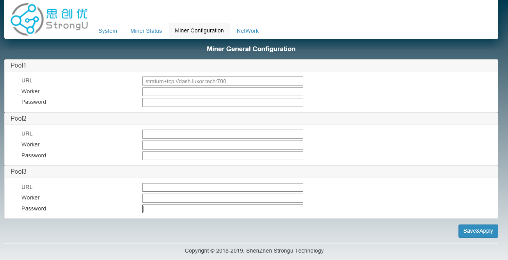
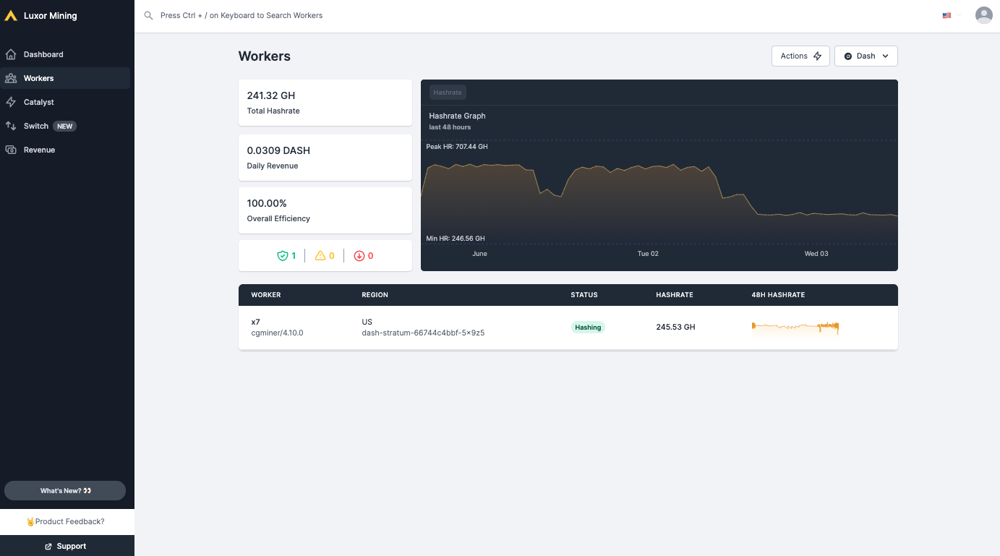

.. meta::
   :description: Guide to mining using a mining pool
   :keywords: dash, mining, X11, CPU, GPU, ASIC, hardware, pool, mining pools, Luxor

.. _mining-pools:

============
Mining Pools
============

Mining Dash in pools is more likely to generate rewards than solo mining
directly on the blockchain. This is because you are extremely unlikely
to mine a block as an individual given the current mining difficulty, so
pooling efforts results in more frequent incremental rewards than
extremely rare large rewards. Commercial mining pools offer a number of
services, described below using the example of Luxor Mining.

Miner Hosting
=============

Some miners may decide to host the machines directly in their homes.
This can work if you have a good shed or basement. But keep in mind that
ASIC machines can be intrusive in your home. They are quite loud when
operating (think a vacuum cleaner). In addition, mining hardware
consumes a very significant amount of electricity, so running multiple
mining ASICs in your home may damage your wiring or fuse board, may
require additional ventilation or power and network distribution
systems, and bears a risk of starting a fire. Ensure you are properly
informed about these challenges before mining at home. 

Depending on the above considerations and your electricity rate, it may
make sense to send your mining machine to a mining colocation site for
hosting on your behalf. The mining colocation business takes a "hosting
fee" in return for setup, ensuring proper operations, electricity and
ongoing maintenance.

There are many hosting options available in the US / Canada such as
`Compute North <https://www.computenorth.com/>`__, `Frontier
<https://www.bitcoinmined.net/>`__, `Core Scientific
<https://www.corescientific.com/>`__, `Lightspeed
<https://www.lightspeedhosting.com/>`__, and many more. `Crypto Mining
Tools <https://cryptomining.tools/>`__ offers a `mining map
<https://cryptomining.tools/directory/map/1541>`__ with more options in
North America. `Hashrate Index <https://hashrateindex.com>`__ provides a
`database of hosted colocations <https://hashrateindex.com/farms>`__ in
the US, Canada, Russia, Paraguay and more. `F2Pool
<https://www.f2pool.com/>`__ has a `list of hosting locations
<https://www.f2pool.com/>`__ in China and the CIS region. `BC Mining
<https://bcmining.uy/>`__ offers multiple projects in South America.
Please make sure to do your own research before making any decision on
engaging a colocation business.

Setting up your miner
=====================

Powering up the Miner
---------------------

Connect your machine to the power outlet via the built-in PSU. Then
connect your miner to your internet-connected router or switch using a
standard network cable. You are now ready to power up your miner.

Scanning for Devices
--------------------

To get started, use a scanning tool like `AngryIP
<https://angryip.org/>`__ or `Locator
<https://minerstat.com/software/locator>`__ to scan every device on your
local network and see its IP address. After you have identified your
miner’s IP address, you are ready to proceed with Configuration.

Configuration
-------------

Enter the local network IP address of your miner in the URL bar of any
web browser. A dashboard similar to the one shown below will pop up. We
are setting up a StrongU STU-U6, but the process is similar for other
ASICs.

   Setting up a mining ASIC to use a pool

Choosing a Mining Pool
----------------------

To finish the configuration, you will need to choose a mining pool. A
deep dive into the mining pool landscape is available `here
<https://blog.dash.org/luxor-launches-dash-pps-mining-pool-daf493bce9d2>`__.

To help with the security of the network and decentralization we
recommend using  P2Pool. To set up your own P2Pool server, follow the
setup documentation available :ref:`here <p2pool>`. The code for
p2pool-dash is `available on GitHub
<https://github.com/dashpay/p2pool-dash>`__. 

If you do not want to set up your own pool, you can check out a list of
pools `here <https://chainz.cryptoid.info/dash/#!extraction>`__. In this
guide we will set up a miner with `Luxor
<https://mining.luxor.tech/>`__, a US-based mining pool that operates
based on the pay-per-share (PPS) payment method. Other pools can be
found `here <https://miningpoolstats.stream/dash>`__.

Completing Configuration
------------------------

Once you have created a `user account
<https://medium.com/luxor/meet-user-accounts-a0d56235c0e6>`__ with the
mining pool, you will have all the information you need to complete the
setup process.

- URL: ``stratum+tcp://dash.luxor.tech:700``
- Worker: ``[LuxorUsername].WorkerName`` 
  Workername can be anything, but avoid using symbols or special
  characters as it may be invalid.
- Password: ``123``

For the other nodes (Pool 2 and Pool 3), feel free to use any of the
other region nodes or other pools, such as ``dash-eu.luxor.tech:5050``.

Once you have filled out the details, click **Save & Apply**. Setup is
now complete.

Monitoring Results
------------------

It will take about 5 minutes for your workers to appear on the stats
page. To find your user, simply go to Luxor, login to your account and
navigate to the Workers tab. You should see something like this:

   Monitoring mining results with Luxor pool

Note: For P2Pool, there is no central point to check balance. To learn
more about P2Pool, see the :ref:`P2Pool documentation <p2pool>`.

Setting up the Dash Wallet
--------------------------

The last step is to set up your Dash address where you will receive your
miner payouts. To do this in the Dash Core wallet, see :ref:`here
<dashcore-send-receive>`.

Once you have your address, navigate to the Settings page in the top
right-hand corner of the `Luxor <https://mining.luxor.tech/>`__ site
after you have logged in. You can enter your address and set a custom
payout threshold here.

.. figure:: img/luxor-threshold.png
   :width: 300px

   Setting the payout threshold with Luxor pool
