.. meta::
   :description: Description of dash evo tool features and usage
   :keywords: dash, platform, evonode, masternodes, dash evo tool

.. _evo-tool:

=============
Dash Evo Tool
=============

Dash Evo Tool is an application designed to help you vote on usernames, withdraw evonode credits,
and complete an expanding list of Platform actions. This guide describes how to download, install,
and use the Dash Evo Tool.

.. _evo-tool-install:

Installation
============

.. note::

  The Dash Evo Tool requires a Dash Core full node configured to allow RPC and ZMQ access.

Linux, MacOS, or Windows packages are available on the `GitHub releases page
<https://github.com/dashpay/dash-evo-tool/releases/latest>`__. Download the zip file for your
Operating System, then unzip the downloaded file:

* `Windows <https://github.com/dashpay/dash-evo-tool/releases/download/v0.5.0/dash-evo-tool-windows.zip>`_
* `Mac (ARM m1-m4) <https://github.com/dashpay/dash-evo-tool/releases/download/v0.5.0/dash-evo-tool-arm64-mac.zip>`_
* `Mac (x86) <https://github.com/dashpay/dash-evo-tool/releases/download/v0.5.0/dash-evo-tool-x86_64-mac.zip>`_
* `Linux (x86) <https://github.com/dashpay/dash-evo-tool/releases/download/v0.5.0/dash-evo-tool-x86_64-linux.zip>`_
* `Linux (ARM) <https://github.com/dashpay/dash-evo-tool/releases/download/v0.5.0/dash-evo-tool-arm64-linux.zip>`_ 

.. _evo-tool-configure:

Configuration
=============

1. Open the directory where the download was unzipped.
2. Open the ``.env`` file (you may need to show hidden files to see it). For the network you plan to
   connect to, make the following changes. Replace the ``*`` with the network name (MAINNET or
   TESTNET):

   * Update ``*_CORE_RPC_USER`` to match the ``rpcuser`` value from your Dash Core dash.conf file.
   * Update ``*_CORE_RPC_PASSWORD`` to match the ``rpcpassword`` value from your Dash Core dash.conf
     file.
   * If your dash.conf includes ``rpcallowip``, update ``*_CORE_HOST`` with that IP address.
   * If your dash.conf includes ``rpcport``, update ``*_CORE_RPC_PORT`` with that port.
3. (*Optional*) If you are going to run Dash Core manually instead of launching it via the Dash Evo
   Tool, you must enable ZMQ by adding the following lines to your dash.conf file:

   .. tab-set::
      .. tab-item:: Mainnet ZMQ setup

         .. code-block:: ini

            # Dash Evo Tool ZMQ config - mainnet
            zmqpubhashchainlock=tcp://0.0.0.0:23708
            zmqpubrawtxlocksig=tcp://0.0.0.0:23708

      .. tab-item:: Testnet ZMQ setup
   
         .. code-block:: ini
      
            # Place under the [test] section
            # Dash Evo Tool ZMQ config - testnet
            zmqpubhashchainlock=tcp://0.0.0.0:23709
            zmqpubrawtxlocksig=tcp://0.0.0.0:23709

.. tip::

  The default location of the ``dash.conf`` file can be found in the :ref:`Dash Core documentation
  <dashcore-rpc>`. At a minimum, the following values must be defined for RPC access to be enabled:

  .. code-block:: ini

    server=1
    rpcuser=<some_user_name>
    rpcpassword=<some_password>

Updating the env file
---------------------

When the application runs for the first time, it creates a application directory and copies the
``.env`` file into it. It also stores application data in the directory. Any further updates to the
``.env`` file must be made to the copy in the application directory.

==================  =======================================================
Operating System    Configuration File Path
==================  =======================================================
macOS               ~/Library/Application Support/Dash-Evo-Tool/
Windows             C:\\Users\\<User>\\AppData\\Roaming\\Dash-Evo-Tool\\config
Linux               /home/<user>/.config/dash-evo-tool/
==================  =======================================================

.. _evo-tool-run:

Running the application
=======================

Once the ``.env`` file is configured, launch the Dash Evo Tool by double-clicking the file named
``dash-evo-tool``.

Alternatively, you can launch the application directly from your terminal. For example, on Linux,
run::

  ./dash-evo-tool

.. _evo-tool-select-network:

Network selection
=================

The Dash Evo Tool supports both testnet and mainnet. To choose a network, navigate to the Network
Selection screen and click the checkbox in the Select column for the desired network. Then click the
**Start** button on that row to launch Dash Core.

.. _evo-tool-manual-core-launch:

.. note::

  You can also launch Dash Core manually without using the Dash Evo Tool. This may be necessary if
  Dash Core is installed in a non-standard location. When launching Dash Core manually, you must
  enable ZMQ as described in :hoverxref:`Configuration Step 3 <evo-tool-configure>`.

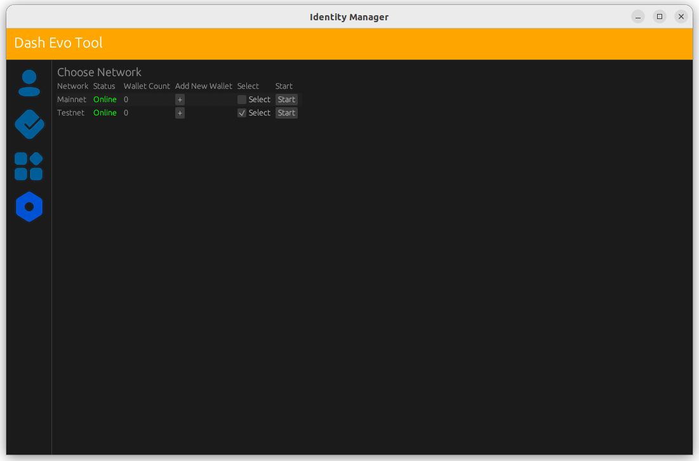

   Network selection screen with testnet selected

.. _evo-tool-identity:

Identity operations
===================

.. _evo-tool-identity-load:

Load existing identity
----------------------

On the main identity screen, click the **Load Identity** button on the upper right side of the
screen.

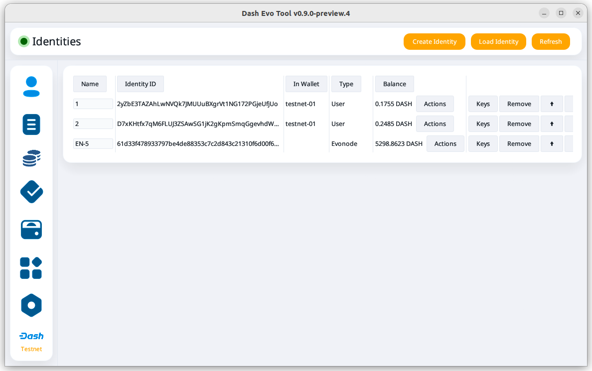

   Identity screen with no loaded identities

Some identity types require different information. Use the **Identity Type** dropdown menu to select
the type you want to add. In this example, an evonode identity is being added.

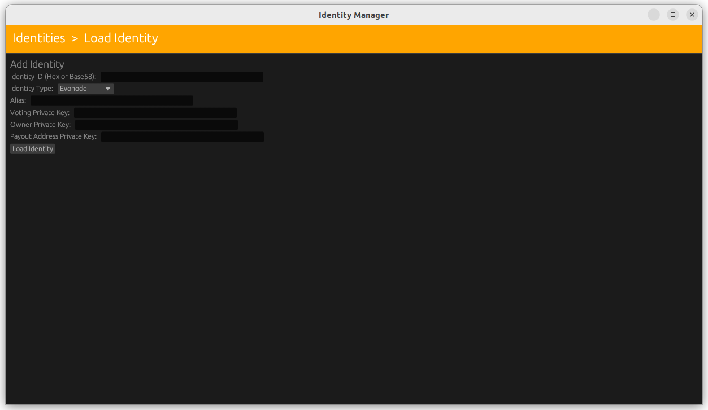

   Identity load screen for evonode

.. _evo-tool-identity-load-id-key:

.. attention::

  Your collateral key is **not** required. Do not enter it into the Dash Evo Tool.

Add the Identity ID and Owner Private Key. You may also want to add the Voting Private Key, but
adding the Payout Address Private Key is **not** recommended. For a masternode or evonode, use the
protx hash as the Identity ID.

If you use the `Dash Masternode Tool <https://github.com/Bertrand256/dash-masternode-tool>`_, you
can get the protx hash and private keys from the masternode details screen.

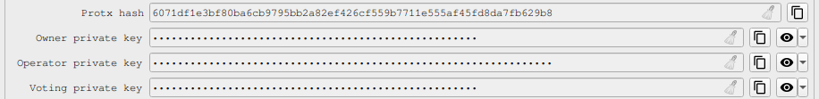

   Dash Masternode Tool

Click **Load Identity** once you have entered the required information.

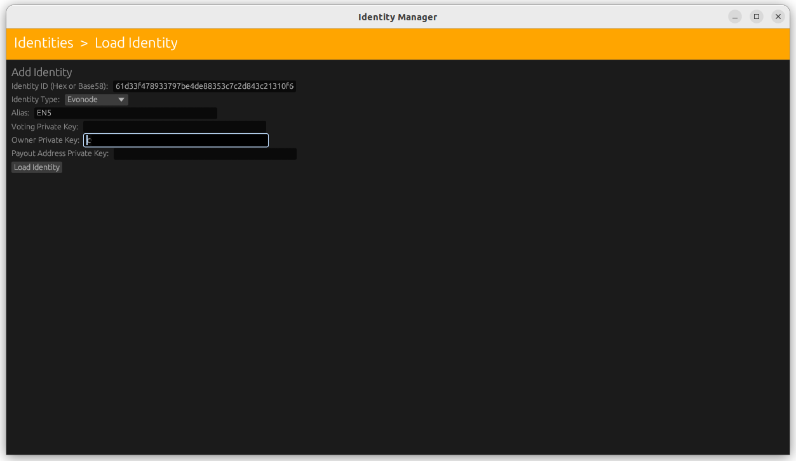

   Identity load screen with evonode info filled out

Once the identity is loaded, you can view its balance and details about its keys. For evonodes, you
can also initiate :ref:`withdrawals <evo-tool-identity-evo-withdraw>`.

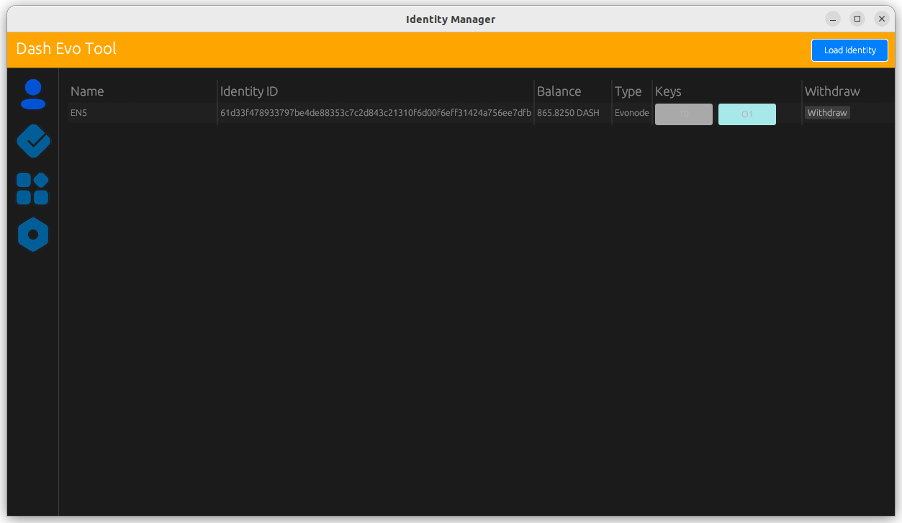

   Identity screen with an evonode identity loaded

.. _evo-tool-identity-create:

Create new identity
-------------------

.. tip::
   
   Before creating an identity, make sure you have :ref:`added a Dash Evo Tool wallet
   <evo-tool-wallet-create>`.

On the main identity screen, click the **Create Identity** button on the upper right side of the
screen.

   Identity screen with no loaded identities

On the create identity screen, leave the first two options set to the default and select the funding
method. Then, send the requested amount of DASH to the provided address.

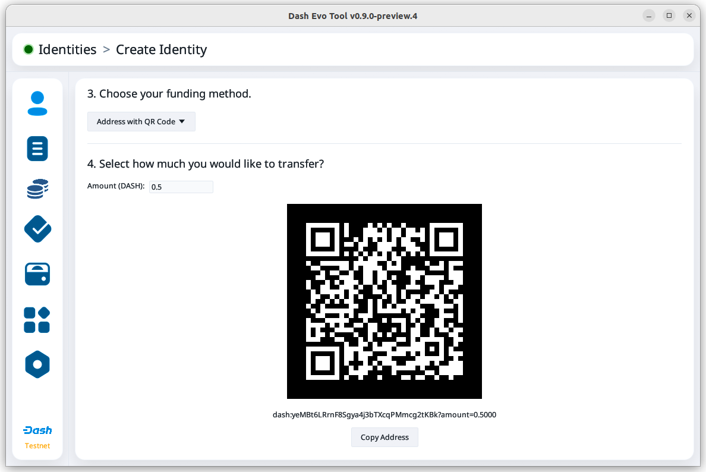

   Waiting for funds

The status will change from "Waiting for funds" to "Waiting for Platform acknowledgement" once the
funds have been received and the identity registration process has started.

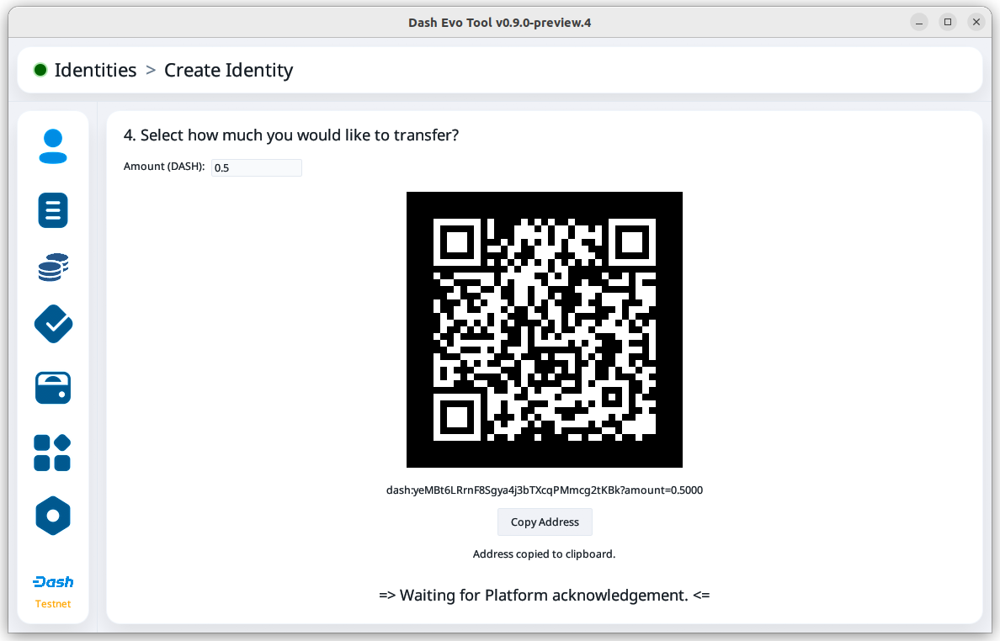

   Waiting for Platform acknowledgement

Once the identity has been registered, you can choose to return to the identity screen or proceed to
:ref:`registering a name <evo-tool-name-register>`.

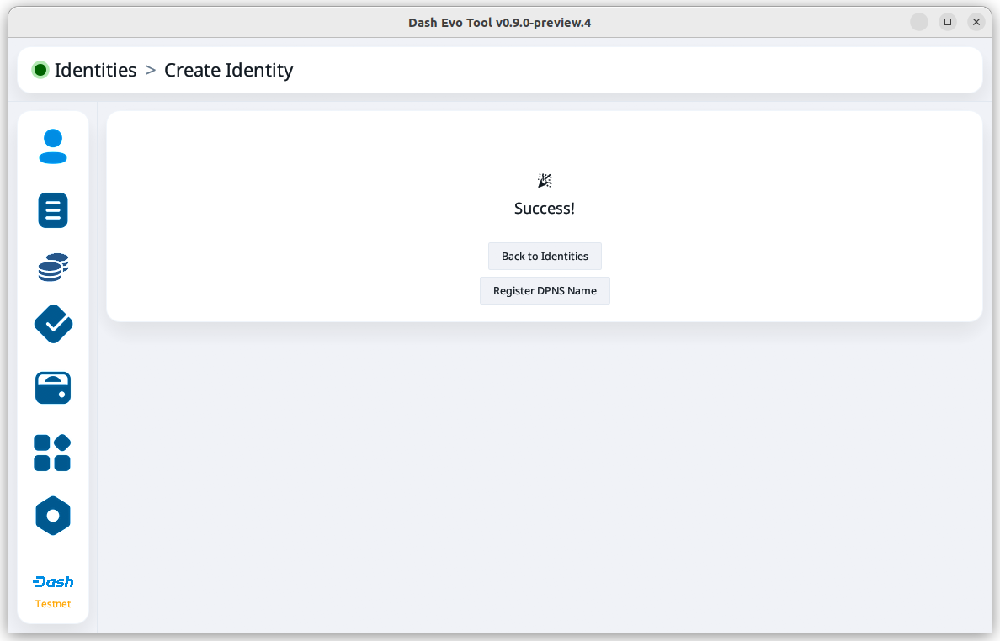

   Identity creation success

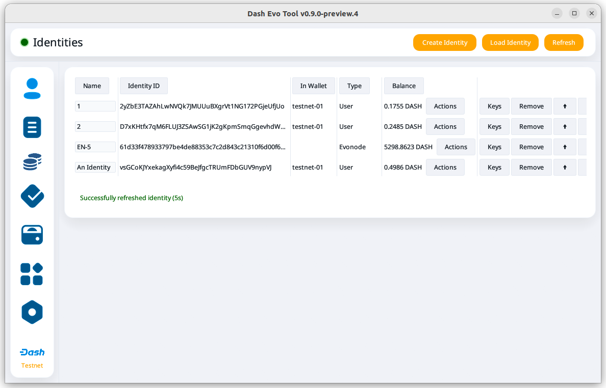

   Identity screen with an identity loaded

.. _evo-tool-identity-evo-withdraw:

Evonode withdrawals
-------------------

.. note::

  Withdrawal requests enter a queue that is currently processed more slowly than intended. Depending
  on the timing of the withdrawal request, it may take up to 18 hours to complete. 
  
  For security, there is also a limit on how much can be withdrawn from Platform daily. If
  withdrawal requests hit the daily limit, they will remain in the queue longer. For details, see
  this `DCG development update
  <https://www.youtube.com/live/rc_avHHqG6E?si=ETv0yX-1b3odCU8F&t=599>`_.

From the identity main screen, click the **Withdraw** button for an identity.

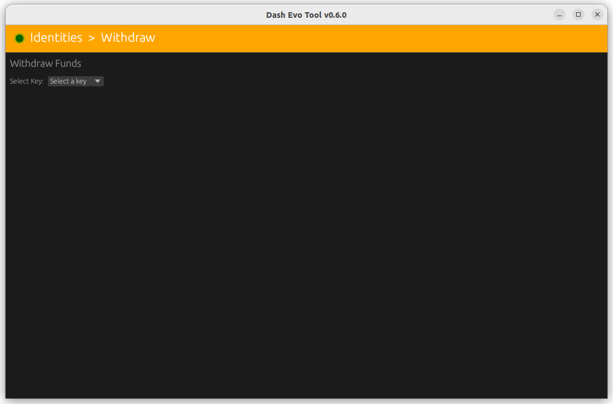

   Identity screen with an evonode identity loaded

On the withdrawal screen, select the key to sign the withdrawal. Selecting the owner key is
recommended since this will direct the withdrawal to the payout address. Next, set the amount to
withdraw.

.. note::

  The **Max** button currently has a bug and sets the withdrawal amount in credits instead of DASH,
  so you will need to manually adjust the amount if you use that button.

Click **Withdraw** after entering the information.

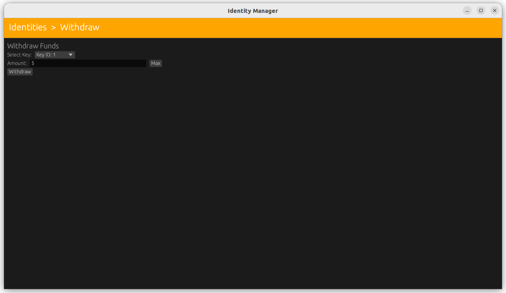

   Withdraw screen with key and amount selected

When the withdrawal confirmation screen opens, confirm that the amount and destination address are
correct. Click **Confirm** to request the withdrawal.

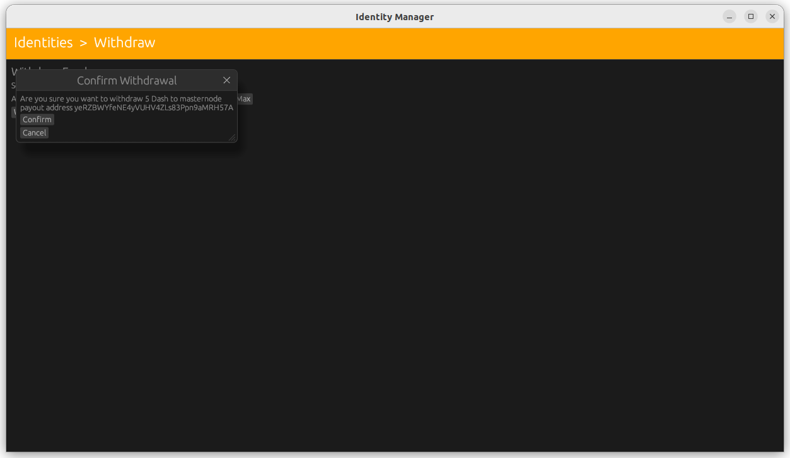

   Withdrawal confirmation screen

.. _evo-tool-name:

Name operations
===============

.. _evo-tool-name-register:

Register name
-------------

After :ref:`creating an identity <evo-tool-identity-create>`, you can register a name for it. From
the main name screen, click the **Register Name** button on the upper right side of the screen.

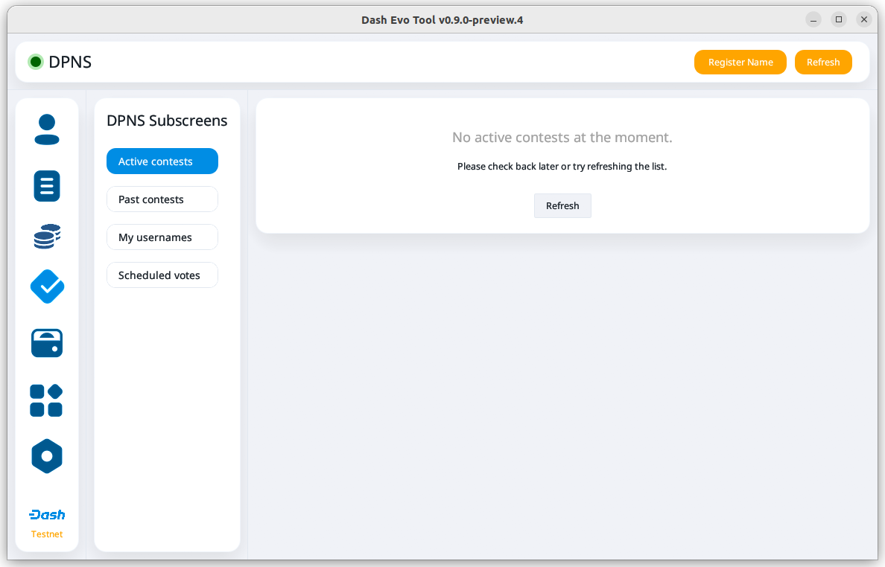

   Name screen

First, select the identity to register a name for. This step will be automatically done if you are
registering a name as part of the identity creation process. 

Next, enter the desired name. Notification will be provided if you selected a contested name and the
estimated cost will be displayed. Click **Register Name** to complete the registration.

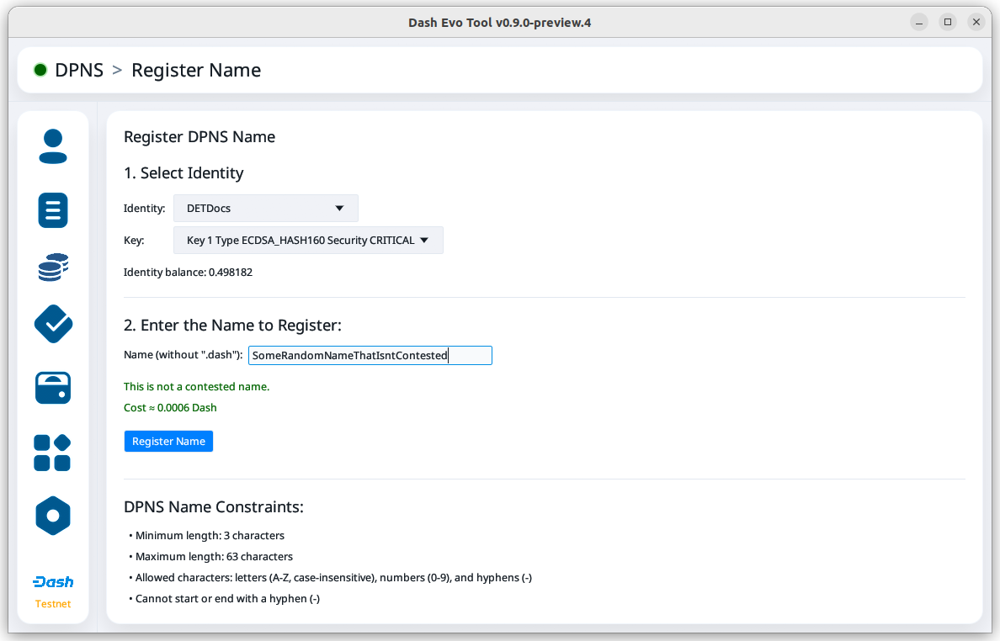

   Name registration

Upon successful registration, you can see the name on the **My usernames** screen along with any
other names you have registered.

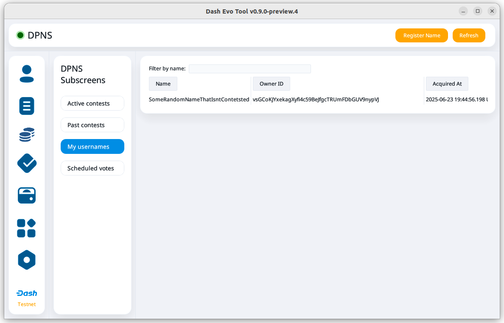

   Name registered successfully

.. _evo-tool-name-voting:

Vote for names
--------------

The Voting screen displays a list of names that are currently require a vote. Click the **Refresh**
button to update the screen at any time.

.. note::
  
  Voting can only be done by masternodes and evonodes, and each node can only modify its vote four times.
  See the :ref:`load identity section <evo-tool-identity-load>` for instructions on importing your keys.

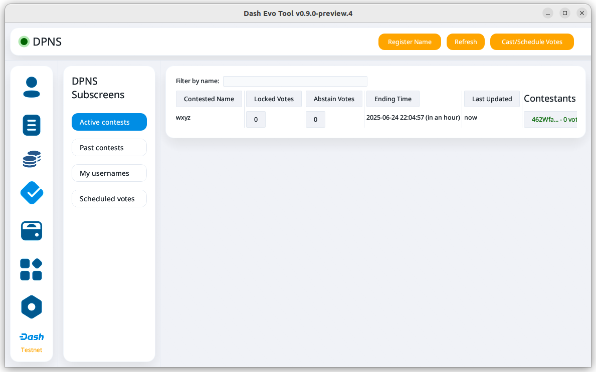

   Voting screen

To vote for a contestant, click on an entry in the Contestants column. You can also vote to Lock the
name or Abstain by clicking the value in those columns. You will be prompted to load an evonode or
masternode identity if you have not already done so.

After clicking one of the contestants, vote for that identity to receive the name by clicking one of
your specific identities on the Vote Confirmation screen. Click **All** to vote with all your loaded
identities simultaneously.

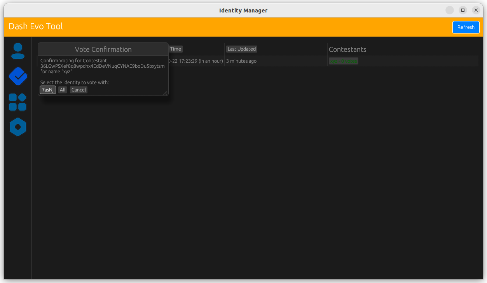

   Vote confirmation screen

See the `DPNS page
<https://docs.dash.org/projects/platform/en/stable/docs/explanations/dpns.html#voting-details>`_ for
more voting details.

.. _evo-tool-wallet:

Wallet operations
=================

.. note::

   The Dash Evo Tool wallet features only work if your Dash Core node has a single wallet open. **If
   you have multiple wallets open in Dash Core, close all of them except the one used by the Dash
   Evo Tool.**

.. _evo-tool-wallet-create:

Create wallet
-------------

This tool includes a basic wallet feature to support identity registration. Wallets can be added
from the wallet screen.

.. attention::

   Since this tool adds watching-only addresses to Dash Core when creating identities, it is
   recommended to close all existing Dash Core wallets and :ref:`create a new, empty wallet
   <dashcore-installation-macos-create-wallet>` for the Dash Evo Tool. Also, make sure to
   :ref:`backup your Dash Core wallet <dashcore-backup>`.

Click **Add Wallet** to create a new wallet.

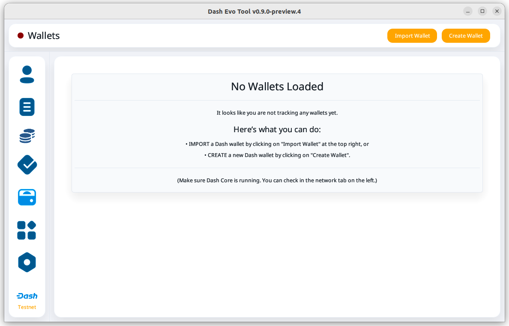

   Wallet screen

After creating extra randomness with the mouse, select your preferred language and click
**Generate** to display you passphrase. Write it down and store it securely, then click the checkbox
in step 3 to confirm.

Next, enter a wallet name and optionally add a password before clicking **Save Wallet** to store the
wallet.

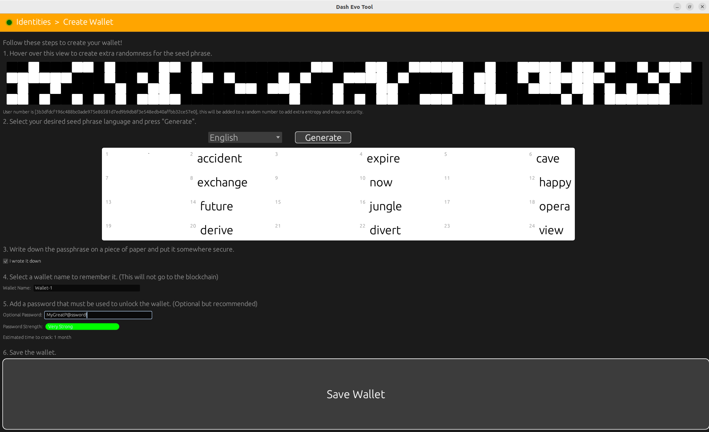

   Wallet create screen

.. _evo-tool-wallet-use:

Use wallet
----------

Select your wallet using the dropdown box.

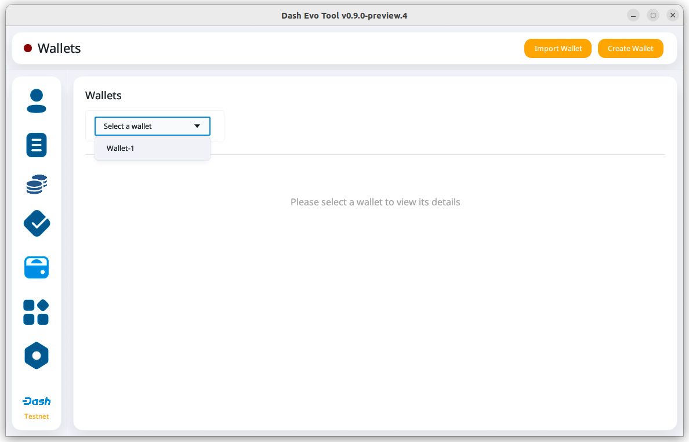

   Select wallet

.. _evo-tool-wallet-use-funds:

Funds
^^^^^

Several tabs display wallet details. The Funds tab shows your receiving addresses. Click **Add
Receiving Address** if you want to add additional addresses to fund the wallet.

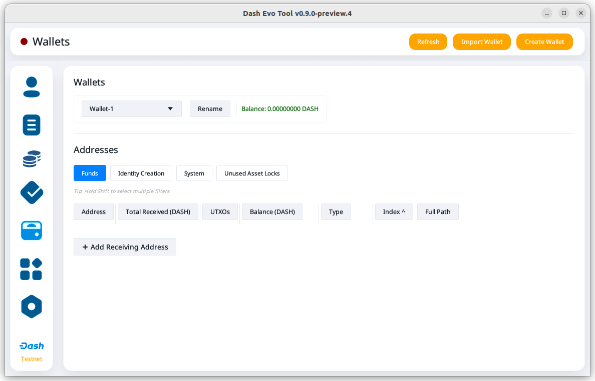

   Wallet Funds tab

After adding addresses, they will appear in a table with balance and other details.

.. figure:: img/wallet/wallet-funds-with-address.png
   :align: center
   :width: 90%

   Wallet with address added