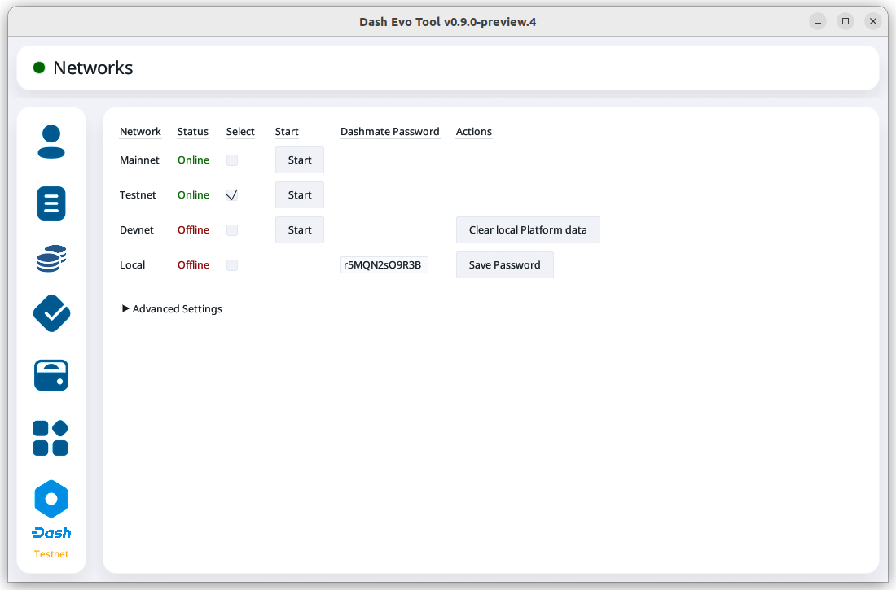

.. meta::
   :description: Description of dash evo tool features and usage
   :keywords: dash, platform, evonode, masternodes, dash evo tool

.. _evo-tool:

=============
Dash Evo Tool
=============

Dash Evo Tool is an application designed to help you vote on usernames, withdraw evonode credits,
and complete an expanding list of Platform actions. This guide describes how to download, install
and use the Dash Evo Tool.

.. _evo-tool-install:

Installation
============

Linux, MacOS, or Windows packages are available on the `GitHub releases page
<https://github.com/dashpay/dash-evo-tool/releases/latest>`__. Download the zip file for your
Operating System, then unzip the downloaded file:

  * `Windows <https://github.com/dashpay/dash-evo-tool/releases/download/v0.1.2/DashEvoTool-windows-x86_64.zip>`_
  * `Mac (ARM m1-m4) <https://github.com/dashpay/dash-evo-tool/releases/download/v0.1.1/DashEvoTool-aarch64-mac.zip>`_
  * `Mac (x86) <https://github.com/dashpay/dash-evo-tool/releases/download/v0.1.1/DashEvoTool-x86_64-mac.zip>`_
  * `Linux (x86) <https://github.com/dashpay/dash-evo-tool/releases/download/v0.1.3/DashEvoTool-linux-x86_64.zip>`_
  * `Linux (ARM) <https://github.com/dashpay/dash-evo-tool/releases/download/v0.1.3/DashEvoTool-linux-aarch64.zip>`_ 

.. _evo-tool-configure:

Configuration
=============

1. Open the directory where the download was unzipped.
2. Open the ``.env`` file (you may need to show hidden files to see it) and update the
   ``*_CORE_RPC_USER``, and ``*_CORE_RPC_PASSWORD`` values to match the values configured in your
   ``dash.conf`` file. *Unless you have a non-standard installation, only the user and password
   fields should need to be updated.*

.. tip::

  The default location of the ``dash.conf`` file can be found in the :ref:`Dash Core documentation
  <dashcore-rpc>`.

.. _evo-tool-run:

Running the application
=======================

Once the ``.env`` file is configured, launch the Dash Evo Tool by double-clicking the file named
``dash-evo-tool-<your platform>`` (e.g., ``dash-evo-tool-aarch64-mac``).

Alternatively, you can launch the application directly from your terminal. For example, on an x86
Linux, run::

  ./dash-evo-tool-x86_64-linux

.. _evo-tool-select-network:

Network selection
=================

The Dash Evo Tool supports both testnet and mainnet. To choose a network, navigate to the Network
Selection screen and click the checkbox in the Select column for the desired network. Then click the
**Start** button on that row to launch Dash Core.

.. note::

  You can also launch Dash Core manually without using the Dash Evo Tool. This may be necessary if
  you have Dash Core installed in a non-standard location.

   Network selection screen with testnet selected

.. _evo-tool-identity:

Identity operations
===================

.. _evo-tool-identity-load:

Load an identity
----------------

On the main identity screen, click the **Load Identity** button on the upper right side of the
screen.

   Identity screen with no loaded identities

Some identity types require different information. Use the **Identity Type** dropdown menu to select
the type you want to add. In this example, an evonode identity is being added.

.. figure:: img/identity/add-identity-evonode.png
   :align: center
   :width: 90%

   Identity load screen for evonode

Add the Identity ID and Owner Private Key. You may also want to add the Voting Private Key, but
adding the Payout Address Private Key is **not** recommended. For a masternode or evonode, use the
protx hash as the Identity ID.

Click **Load Identity** once you have entered the required information.

.. figure:: img/identity/add-identity-id-and-key.png
   :align: center
   :width: 90%

   Identity load screen with evonode info filled out

Once the identity is loaded, you can view its balance and details about its keys. For evonodes, you
can also initiate :ref:`withdrawals <evo-tool-identity-evo-withdraw>`.

.. figure:: img/identity/main-evonode.png
   :align: center
   :width: 90%

   Identity screen with an evonode identity loaded

.. _evo-tool-identity-evo-withdraw:

Evonode withdrawals
-------------------

.. attention::

  Withdrawal requests enter a queue that is currently processed more slowly than intended. Depending
  on the timing of the withdrawal request, it may take up to 18 hours to complete. 
  
  For security there is also a limit on how much can be withdrawn from Platform per day. If
  withdrawal requests hit the daily limit, they will remain in the queue longer. For details, see
  this `DCG development update
  <https://www.youtube.com/live/rc_avHHqG6E?si=ETv0yX-1b3odCU8F&t=599>`_.

From the identity main screen, click the **Withdraw** button for an identity.

   Identity screen with an evonode identity loaded

On the withdraw screen, select the key to be used for signing the withdrawal. Selecting the owner
key is recommended since this will direct the withdrawal to the payout address. Next, set the amount
to withdraw.

Click **Withdraw** after entering the information.

.. figure:: img/identity/withdraw-key-amount.png
   :align: center
   :width: 90%

   Withdraw screen with key and amount selected

When the withdrawal confirmation screen opens, confirm that the amount and destination address are
correct. Click **Confirm** to request the withdrawal.

.. figure:: img/identity/withdrawal-confirm.png
   :align: center
   :width: 90%

   Withdrawal confirmation screen

