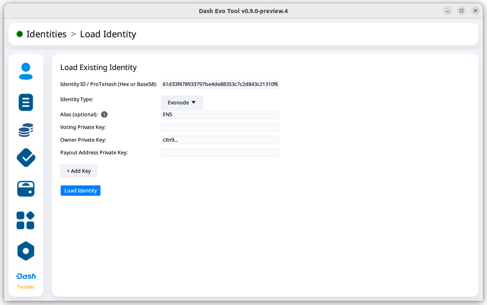
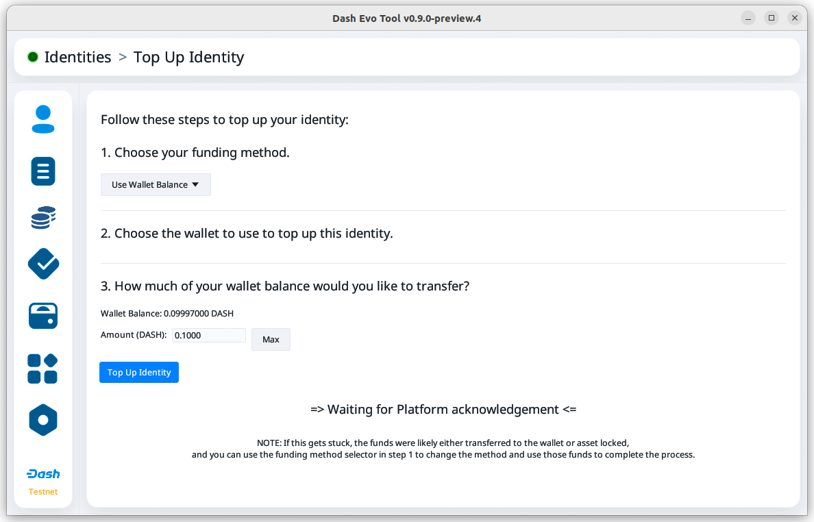
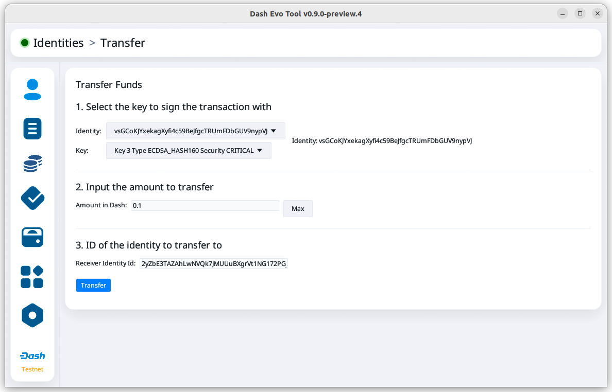
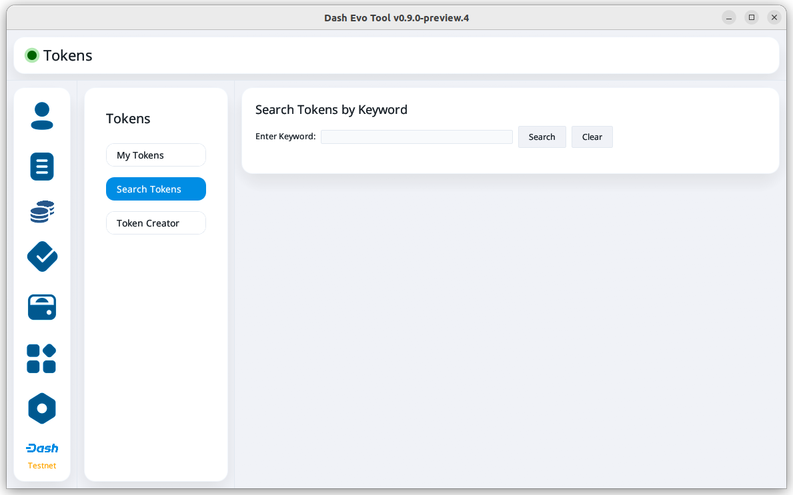
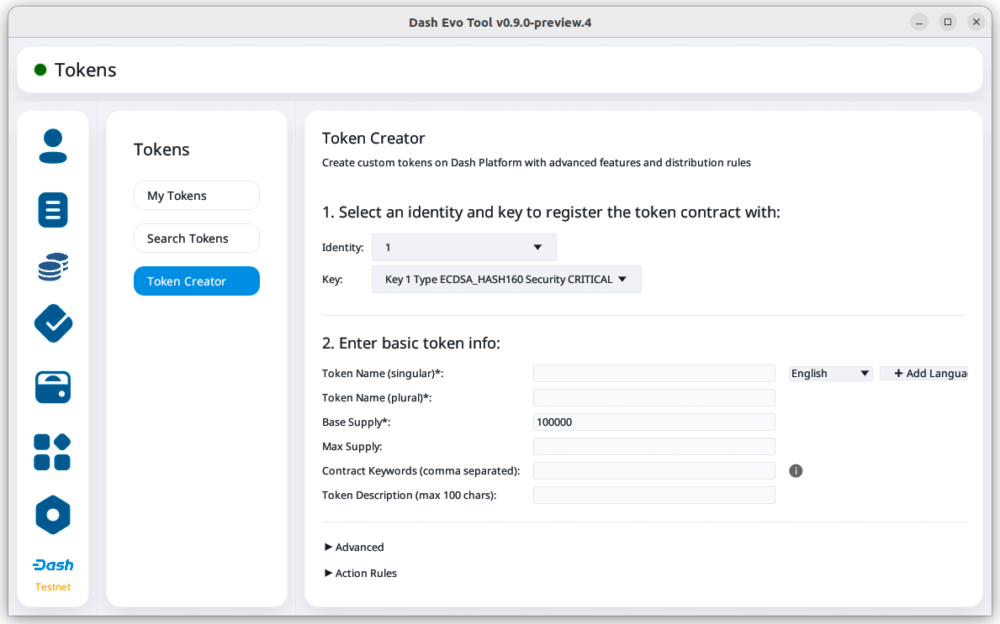
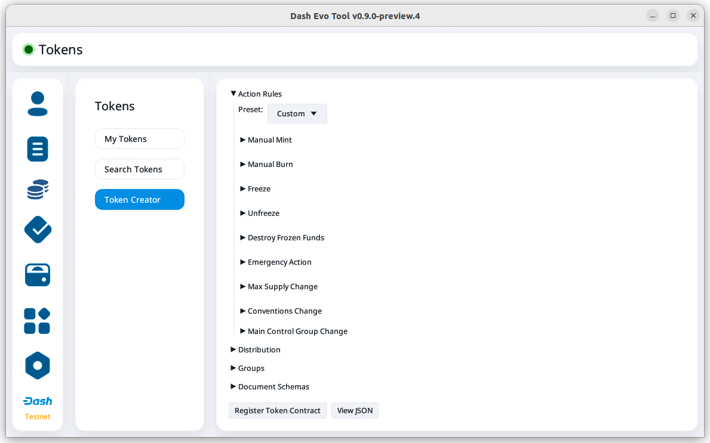
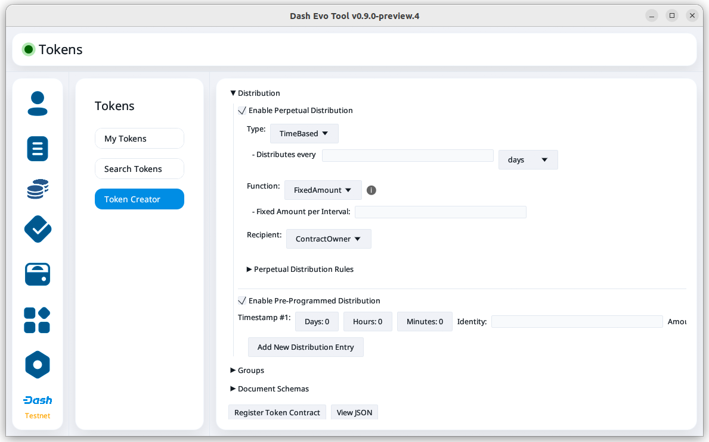

.. meta::
   :description: Description of dash evo tool features and usage
   :keywords: dash, platform, evonode, masternodes, dash evo tool, token

.. _evo-tool:

=============
Dash Evo Tool
=============

Dash Evo Tool is an application designed to help you :ref:`vote on usernames
<evo-tool-name-voting>`, :ref:`withdraw evonode credits <evo-tool-identity-evo-withdraw>`,
:ref:`manage tokens <evo-tool-token>`, and complete an expanding list of Platform actions. This
guide describes how to download, install, and use the Dash Evo Tool.

.. _evo-tool-install:

Installation
============

.. note::

  The Dash Evo Tool requires a running Dash Core full node.

Linux, MacOS, or Windows packages are available on the `GitHub releases page
<https://github.com/dashpay/dash-evo-tool/releases/latest>`__. Download the zip file for your
Operating System, then unzip the downloaded file:

* `Windows <https://github.com/dashpay/dash-evo-tool/releases/download/v0.8.5/dash-evo-tool-windows.zip>`_
* `Mac (ARM m1-m4) <https://github.com/dashpay/dash-evo-tool/releases/download/v0.8.5/dash-evo-tool-arm64-mac.zip>`_
* `Mac (x86) <https://github.com/dashpay/dash-evo-tool/releases/download/v0.8.5/dash-evo-tool-x86_64-mac.zip>`_
* `Linux (x86) <https://github.com/dashpay/dash-evo-tool/releases/download/v0.8.5/dash-evo-tool-x86_64-linux.zip>`_
* `Linux (ARM) <https://github.com/dashpay/dash-evo-tool/releases/download/v0.8.5/dash-evo-tool-arm64-linux.zip>`_ 

.. _evo-tool-configure:

Configuration
=============

The Dash Evo Tool includes a configuration file that will work without modification. *If you have a
custom Dash Core config file that you want to continue using*, expand the dropdown below for
advanced configuration details.

.. dropdown:: Advanced configuration - using a custom Dash Core config

  .. note::
    
   The default location of the ``dash.conf`` file can be found in the :ref:`Dash Core documentation
   <dashcore-rpc>`.

  1. Open the directory where the download was unzipped.
  2. Open the ``.env`` file (you may need to show hidden files to see it). For the network you plan to
     connect to, make the following changes. Replace the ``*`` with the network name (MAINNET or
     TESTNET):

     * Update ``*_CORE_RPC_USER`` to match the ``rpcuser`` value from your Dash Core dash.conf file.
     * Update ``*_CORE_RPC_PASSWORD`` to match the ``rpcpassword`` value from your Dash Core dash.conf
       file.
     * If your dash.conf includes ``rpcallowip``, update ``*_CORE_HOST`` with that IP address.
     * If your dash.conf includes ``rpcport``, update ``*_CORE_RPC_PORT`` with that port.
  3. Enable ZMQ by adding the following lines to your dash.conf file:

     .. tab-set::
        .. tab-item:: Mainnet ZMQ setup

           .. code-block:: ini

              # Dash Evo Tool ZMQ config - mainnet
              zmqpubhashchainlock=tcp://0.0.0.0:23708
              zmqpubrawtxlocksig=tcp://0.0.0.0:23708

        .. tab-item:: Testnet ZMQ setup
     
           .. code-block:: ini
        
              # Place under the [test] section
              # Dash Evo Tool ZMQ config - testnet
              zmqpubhashchainlock=tcp://0.0.0.0:23709
              zmqpubrawtxlocksig=tcp://0.0.0.0:23709

  4. At a minimum, the following values must be defined for RPC access to be enabled:

     .. code-block:: ini

        server=1
        rpcuser=<some_user_name>
        rpcpassword=<some_password>

Updating the env file
---------------------

When the application runs for the first time, it creates a application directory and copies the
``.env`` file into it. It also stores application data in the directory. Any further updates to the
``.env`` file must be made to the copy in the application directory.

==================  =======================================================
Operating System    Configuration File Path
==================  =======================================================
macOS               ~/Library/Application Support/Dash-Evo-Tool/
Windows             C:\\Users\\<User>\\AppData\\Roaming\\Dash-Evo-Tool\\config
Linux               /home/<user>/.config/dash-evo-tool/
==================  =======================================================

.. _evo-tool-run:

Running the application
=======================

.. note::

   On some macOS devices, you will need to approve the app in your security settings using the
   process described in `Safely open apps on your Mac
   <https://support.apple.com/en-us/102445#openanyway>`__.

Once the ``.env`` file is configured, launch the Dash Evo Tool by double-clicking the file named
``dash-evo-tool``.

Alternatively, you can launch the application directly from your terminal. For example, on Linux,
run::

  ./dash-evo-tool

.. _evo-tool-select-network:

Network selection
=================

The Dash Evo Tool supports both testnet and mainnet. To choose a network, navigate to the Network
Selection screen and click the checkbox in the Select column for the desired network. Then click the
**Start** button on that row to launch Dash Core.

.. _evo-tool-manual-core-launch:

.. note::

  If you have Dash Core installed in a non-standard location or want to use a custom dash.conf file,
  configure those options in the advanced settings.

.. tab-set::
  .. tab-item:: Network selection

   .. figure:: img/network-selection.png
      :align: center
      :width: 90%

      Network selection screen with testnet selected

  .. tab-item:: Advanced network settings

   If you have Dash Core installed in a non-standard location, click **Show more advanced
   settings**, then click **Select file** to select the location of your Dash Core installation.
   
   Also, if you use a custom dash.conf file, uncheck **Overwrite dash.conf** and make sure your file
   aligns with the RPC and ZMQ settings mentioned in the :hoverxref:`Configuration section
   <evo-tool-configure>`.

   
   .. figure:: img/network-selection-advanced.png
      :align: center
      :width: 90%

      Network selection screen with advanced settings displayed

.. _evo-tool-identity:

Identity operations
===================

.. _evo-tool-identity-load:

Load existing identity
----------------------

On the main identity screen, click the **Load Identity** button on the upper right side of the
screen.

.. figure:: img/identity/main-empty.png
   :align: center
   :width: 90%

   Main identity screen

Some identity types require different information. Use the **Identity Type** dropdown menu to select
the type you want to add. In this example, an evonode identity is being added.

.. figure:: img/identity/add-identity-evonode.png
   :align: center
   :width: 90%

   Identity load screen for evonode

.. _evo-tool-identity-load-id-key:

.. attention::

  Your collateral key is **not** required. Do not enter it into the Dash Evo Tool.

Add the Identity ID and Owner Private Key. You may also want to add the Voting Private Key, but
adding the Payout Address Private Key is **not** recommended. For a masternode or evonode, use the
protx hash as the Identity ID.

If you use the `Dash Masternode Tool <https://github.com/Bertrand256/dash-masternode-tool>`_, you
can get the protx hash and private keys from the masternode details screen.

.. figure:: img/dmt-keys.png
   :align: center
   :width: 90%

   Dash Masternode Tool

Click **Load Identity** once you have entered the required information.

   Identity load screen with evonode info filled out

Once the identity is loaded, you can view its balance and details about its keys. For evonodes, you
can also initiate :ref:`withdrawals <evo-tool-identity-evo-withdraw>`.

.. figure:: img/identity/main-evonode.png
   :align: center
   :width: 90%

   Identity screen with an evonode identity loaded

.. _evo-tool-identity-create:

Create new identity
-------------------

.. tip::
   
   Before creating an identity, make sure you have :ref:`added a Dash Evo Tool wallet
   <evo-tool-wallet-create>`.

On the main identity screen, click the **Create Identity** button on the upper right side of the
screen.

.. figure:: img/identity/main-empty.png
   :align: center
   :width: 90%

   Main identity screen

On the create identity screen, leave the first two options set to the default and select the funding
method.

   Identity create options

Then, choose your funding method and send the requested amount of DASH to the provided address.

   Waiting for funds

The status will change from "Waiting for funds" to "Waiting for Core Chain to produce proof of
transfer of funds". Then, the status will change to "Waiting for Platform acknowledgement" once the
funds have been received and the identity registration process has started.

   Waiting for Platform acknowledgement

Once the identity has been registered, you can choose to return to the identity screen or proceed to
:ref:`registering a name <evo-tool-name-register>`.

   Identity creation success

   Identity screen with the new identity loaded

.. _evo-tool-identity-top-up:

Top up identity
---------------

.. tip::
   
   Before topping up an identity, make sure you have :ref:`added a Dash Evo Tool wallet
   <evo-tool-wallet-create>`.

Your identity's credit balance will decrease as you use applications on Platform. You can increase
your balance by doing an identity top up. On the main identity screen, click the **Actions** button
for the identity you want to add credits to, then click **Top up**.

   Identity actions menu

On the top up identity screen, select the funding method and funding amount. Then, click **Top Up
Identity** to continue.

   Waiting for funds

The status will change from "Waiting for funds" to "Waiting for Platform acknowledgement" once the
funds have been received and the identity top up process has started.

   Waiting for Platform acknowledgement

Once the top up is complete, a message will indicate it was successful.

.. _evo-tool-identity-transfer-credits:

Transfer credits
----------------

You can transfer credits to another identity by providing the identity's ID. On the main identity
screen, click the **Actions** button for the identity sending the credits, then click **Transfer**.

   Identity actions menu

On the transfer screen, set the amount and the identity ID to receive the transferred credits. Then,
click **Transfer** to continue.

   Transfer screen with transfer details entered

When the withdrawal confirmation screen opens, confirm that the amount and destination identity ID
are correct. Click **Confirm** to transfer the credits.

   Transfer confirmation screen

Once the transfer is complete, a message will indicate it was successful.

.. _evo-tool-identity-evo-withdraw:

Evonode withdrawals
-------------------

.. note::

  Withdrawal requests enter a queue for processing. For security, there is a limit on how much can
  be withdrawn from Platform daily. If withdrawal requests hit the daily limit, they will remain in
  the queue longer. For details, see this `DCG development update
  <https://www.youtube.com/live/rc_avHHqG6E?si=ETv0yX-1b3odCU8F&t=599>`_.

From the identity main screen,  click the **Actions** button for the identity requesting a
withdrawal, then click **Withdraw**.

   Withdraw screen

On the withdrawal screen, select the key to sign the withdrawal. Selecting the owner key is
recommended since this will direct the withdrawal to the payout address. Next, set the amount to
withdraw.

Click **Withdraw** after entering the information.

.. figure:: img/identity/withdraw-key-amount.png
   :align: center
   :width: 90%

   Withdraw screen with key and amount selected

When the withdrawal confirmation screen opens, confirm that the amount and destination address are
correct. Click **Confirm** to request the withdrawal.

.. figure:: img/identity/withdrawal-confirm.png
   :align: center
   :width: 90%

   Withdrawal confirmation screen

.. _evo-tool-name:

Name operations
===============

.. _evo-tool-name-register:

Register name
-------------

After :ref:`creating an identity <evo-tool-identity-create>`, you can register a name for it. From
the main name screen, click the **Register Name** button on the upper right side of the screen.

   Name screen

First, select the identity to register a name for. This step will be automatically done if you are
registering a name as part of the identity creation process. 

Next, enter the desired name. Notification will be provided if you selected a contested name and the
estimated cost will be displayed. Click **Register Name** to complete the registration.

   Name registration

Upon successful registration, you can see the name on the **My usernames** screen along with any
other names you have registered.

   Name registered successfully

.. _evo-tool-name-voting:

Vote for names
--------------

The Voting screen displays a list of names that are currently require a vote. Click the **Refresh**
button to update the screen at any time.

.. note::
  
  Voting can only be done by masternodes and evonodes, and each node can only modify its vote four times.
  See the :ref:`load identity section <evo-tool-identity-load>` for instructions on importing your keys.

To vote for a contestant, click on an entry in the Contestants column. You can also vote to Lock the
name or Abstain from voting by clicking the value in those columns. Vote for multiple name contests
simultaneously by making several selections.

Once you have made selections for all contests you want to vote on, click the **Cast/Schedule
Votes** button to open the voting screen. There you can chose to cast your votes immediately or
schedule them for later.

   Voting screen

Click **Apply Votes** after determining how to vote for each selected contest.

.. tab-set::
   
   .. tab-item:: Cast vote

      .. figure:: img/voting/vote-now.png
         :align: center
         :width: 90%

         Cast vote(s) immediately

   .. tab-item:: Schedule vote

      .. note::

         The Dash Evo Tool must be running and connected for scheduled votes to execute at the
         planned time.

      .. figure:: img/voting/vote-schedule.png
         :align: center
         :width: 90%

         Schedule vote(s) for later

.. _evo-tool-name-scheduled-votes:

Scheduled votes
---------------

Click **Scheduled votes** to view a list of any pending scheduled votes. Pending votes can be
canceled by clicking the **Remove** button. 

.. figure:: img/voting/scheduled-votes.png
   :align: center
   :width: 90%

   Scheduled votes screen

See the `DPNS page
<https://docs.dash.org/projects/platform/en/stable/docs/explanations/dpns.html#voting-details>`_ for
more voting details.

.. _evo-tool-name-contests:

View contests
-------------

Click **Active contests** or **Past contests** to view a list current or previous contests.

.. tab-set::
   
   .. tab-item:: Active contests

      .. figure:: img/name/main.png
         :align: center
         :width: 90%

         Active contests screen

   .. tab-item:: Past contests

      .. figure:: img/name/past-contests.png
         :align: center
         :width: 90%

         Past contests screen

.. _evo-tool-name-mine:

My usernames
------------

Click **My Usernames** to view a list of usernames owned by your identities.

   My usernames screen

.. _evo-tool-token:

Token operations
=================

My Tokens
---------

The My Tokens screen shows all tokens currently being tracked. Click the **Refresh** button to
update the screen at any time or **Add Token** to follow additional tokens.

You can view token information and access token-related commands by clicking on a token name to open
the Token Details screen.

   My Tokens screen

The Token Details screen shows the balance for each of your identities and provides access to
token-related :hoverxref:`actions <evo-tool-token-actions>` (e.g., transfer).

   Token details screen

.. _evo-tool-token-actions:

Token actions
^^^^^^^^^^^^^

.. note::

   Token actions can only be used when they are enabled by the token's data contract configuration.
   Enabled actions can only be performed by authorized identities as defined in the token's data
   contract.

You can complete the following actions using the Dash Evo Tool:

+---------------+--------------------------------------------------------------+
| Action        | Description                                                  |
+===============+==============================================================+
| Transfer      | Transfer tokens to another identity                          |
+---------------+--------------------------------------------------------------+
| Claim         | Redeem or withdraw available tokens (e.g., from distribution)|
+---------------+--------------------------------------------------------------+
| Mint          | Create new tokens and add them to the total supply           |
+---------------+--------------------------------------------------------------+
| Burn          | Permanently remove tokens from circulation                   |
+---------------+--------------------------------------------------------------+
| Freeze        | Temporarily disable token transfers for a specific identity  |
+---------------+--------------------------------------------------------------+
| Destroy       | Permanently eliminate frozen tokens for a specific identity  |
+---------------+--------------------------------------------------------------+
| Unfreeze      | Re-enable transfers for a previously frozen identity         |
+---------------+--------------------------------------------------------------+
| Pause         | Halt all token operations temporarily                        |
+---------------+--------------------------------------------------------------+
| Resume        | Reactivate operations after a pause                          |
+---------------+--------------------------------------------------------------+
| View Claims   | Display information about completed token claims             |
+---------------+--------------------------------------------------------------+
| Update Config | Modify token configuration settings                          |
+---------------+--------------------------------------------------------------+
| Purchase      | Buy tokens that have set a price                             |
+---------------+--------------------------------------------------------------+
| Set Price     | Define or update the price accepted for the token            |
+---------------+--------------------------------------------------------------+

.. tab-set::
  .. tab-item:: Example transfer action

    .. figure:: img/token/token-actions-transfer.png
      :align: center
      :width: 90%

      Initiate a transfer action

  .. tab-item:: Example group mint action

    For tokens configured to use :ref:`groups <evo-tool-token-group-actions>` for multi-party
    control, a message is displayed indicating the requirement for other group members to sign off
    on the request.

    .. figure:: img/token/token-actions-mint-group.png
      :align: center
      :width: 90%

      Initiate a minting group action

Search Tokens
-------------

The Search Tokens screen can be used to search for tokens by the keywords assigned to them by the
token creator during token registration.

   Token search screen

.. _evo-tool-token-creator:

Token Creator
-------------

The Token Creator screen provides a comprehensive interface for creating and registering tokens on
Dash Platform. It covers all configurable token attributes, ranging from basic supply details
to advanced control mechanisms and distribution rules.

   Token creator screen

The following sections describe the token creator parameters used to configure your token.

Identity and Key Selection
^^^^^^^^^^^^^^^^^^^^^^^^^^

Select an identity and an associated key to register the token contract:

- **Identity**: The Dash Platform identity that will own the token contract
- **Key**: The key from the identity used to sign the registration, including purpose and security
  level

.. note::

   Only valid identity/key pairs are permitted to register token contracts.

Token Information
^^^^^^^^^^^^^^^^^

**Name and Metadata**

- **Token Name (singular)**: Name for a single unit of the token
- **Token Name (plural)**: Name for multiple units
- **Language**: Localized language for token naming
- **Add singular name to keywords**: Whether the token name will appear in token search queries
- **Description**: Short (max 100 characters) description of the token

**Supply Parameters**

- **Base Supply**: Number of tokens created at registration
- **Max Supply**: Maximum possible token supply

**Keywords**

- **Contract Keywords**: Comma-separated tags for categorization and querying

Advanced Settings (Optional)
^^^^^^^^^^^^^^^^^^^^^^^^^^^^

**General Options**

- **Start as paused**: Contract starts paused after creation
- **Keep history**: Enables historical recording. Advanced settings allow specifying which actions are logged.
- **Name should be capitalized**: Forces capitalization of token name on display
- **Decimals**: Number of decimal places for token divisibility

Action Rules
^^^^^^^^^^^^

Define which administrative actions are permitted after contract creation:

   Token creator action rules

- **Manual Mint**: Allow creating additional tokens
- **Manual Burn**: Allow destroying tokens
- **Freeze**: Freeze balances of individual addresses
- **Destroy Frozen Funds**: Destroy frozen balances
- **Emergency Action**: Permit emergency actions
- **Max Supply Change**: Allow changes to the maximum supply
- **Conversions Change**: Allow changes to conversion rates
- **Main Control Group Change**: Allow changes to the contract's control group

**Presets**

The Dash Evo Tool provides several pre-defined action templates to simplify token configuration:
  
  +----------------------+------------------------------------------------------------------------------+
  | Rule Preset          | Description                                                                  |
  +======================+==============================================================================+
  | Custom               | Allows setting all action rules independently for maximum flexibility.       |
  +----------------------+------------------------------------------------------------------------------+
  | Most Restrictive     | No actions are permitted after initialization.                               |
  |                      | All governance and control settings are immutable.                           |
  |                      | Suitable for tokens that should remain fixed and tamper-proof.               |
  +----------------------+------------------------------------------------------------------------------+
  | Only Emergency       | Only emergency actions (e.g., pausing the token) are permitted.              |
  | Action               | Minting, burning, and advanced operations (such as freezing) are disallowed. |
  |                      | This preset allows minimal control for critical situations without risking   |
  |                      | token supply or ownership manipulation.                                      |
  +----------------------+------------------------------------------------------------------------------+
  | Minting and Burning  | Allows minting and burning operations, but not advanced features such as     |
  |                      | freezing. Enables supply management without enabling full administrative     |
  |                      | capabilities.                                                                |
  +----------------------+------------------------------------------------------------------------------+
  | Advanced Actions     | Grants the ability to perform advanced actions, including freezing and       |
  |                      | unfreezing balances. Minting and burning are also permitted. Suitable for    |
  |                      | tokens that require moderate administrative control without total override   |
  |                      | capabilities.                                                                |
  +----------------------+------------------------------------------------------------------------------+
  | All Allowed          | Enables all actions.                                                         |
  +----------------------+------------------------------------------------------------------------------+

Distribution Options
^^^^^^^^^^^^^^^^^^^^

Define token distribution using perpetual and/or pre-programmed options:

   Token creator distribution

**Perpetual Distribution**

Automated recurring token distributions:

- **Enable**: Activates automated distribution
- **Type**: Distribution trigger type (e.g., ``BlockBased``)
- **Distributes every (interval)**: Block, epoch, or time-based interval between distribution events
- **Function**: Distribution model (e.g., ``FixedAmount`` per interval)
- **Recipient**: Identity receiving distributed tokens

**Pre-Programmed Distribution**

One-time or scheduled future distributions:

- **Enable Pre-Programmed Distribution**: Enables scheduled events
- **Add New Distribution Entry**: Create new pre-programmed distribution event

Groups (Optional)
^^^^^^^^^^^^^^^^^

Define multi-party shared control of the contract:

- **Add New Group**: Create a control group
- **Main Control Group Position**: Set primary group responsible for contract ownership and administration

Register and Review
^^^^^^^^^^^^^^^^^^^

- **Register Token Contract**: Submit and register the token contract on Dash Platform
- **View JSON**: View full contract schema prior to registration

.. _evo-tool-token-group-actions:

Group Actions
-------------

The Group Actions screen allows querying group action requests. Select a contract and an identity,
then click **Fetch Group Actions** to see all related group actions request.

Click the **Take Action** button to open the approval screen for a specific request.

.. figure:: img/token/token-group-actions-main.png
   :align: center
   :width: 90%

   Group Actions screen

On approval screen, select the key to sign the request. Then, click the **Sign <Action>** button.
When the confirmation screen opens, confirm that the action details are correct. Finally, click
**Confirm** to complete your approval of the request.

   Group Actions Approval screen

.. _evo-tool-wallet:

Wallet operations
=================

.. note::

   The Dash Evo Tool wallet features only work if your Dash Core node has a single wallet open. **If
   you have multiple wallets open in Dash Core, close all of them except the one used by the Dash
   Evo Tool.**

.. _evo-tool-wallet-create:

Create wallet
-------------

This tool includes a basic wallet feature to support identity registration. Wallets can be added
from the wallet screen.

.. attention::

   Since this tool adds watching-only addresses to Dash Core when creating identities, it is
   recommended to close all existing Dash Core wallets and :ref:`create a new wallet
   <dashcore-installation-macos-create-wallet>` for the Dash Evo Tool. Also, make sure to
   :ref:`backup your Dash Core wallet <dashcore-backup>`.

Click **Create Wallet** to create a new wallet.

   Wallet screen

After creating extra randomness with the mouse, select your preferred language and click
**Generate** to display you passphrase. Write it down and store it securely.

   Wallet create screen

Click the checkbox in step 3 to confirm you have saved the passphrase. Next, enter a wallet name and
optionally add a password before clicking **Save Wallet** to store the wallet.

   Wallet create screen

.. _evo-tool-wallet-use:

Use wallet
----------

Select your wallet using the dropdown box.

   Select wallet

.. _evo-tool-wallet-use-funds:

Funds
^^^^^

Several tabs display wallet details. The Funds tab shows your receiving addresses. Click **Add
Receiving Address** if you want to add additional addresses to fund the wallet.

   Wallet Funds tab

After adding addresses, they will appear in a table with balance and other details.

.. figure:: img/wallet/wallet-funds-with-address.png
   :align: center
   :width: 90%

   Wallet with address added