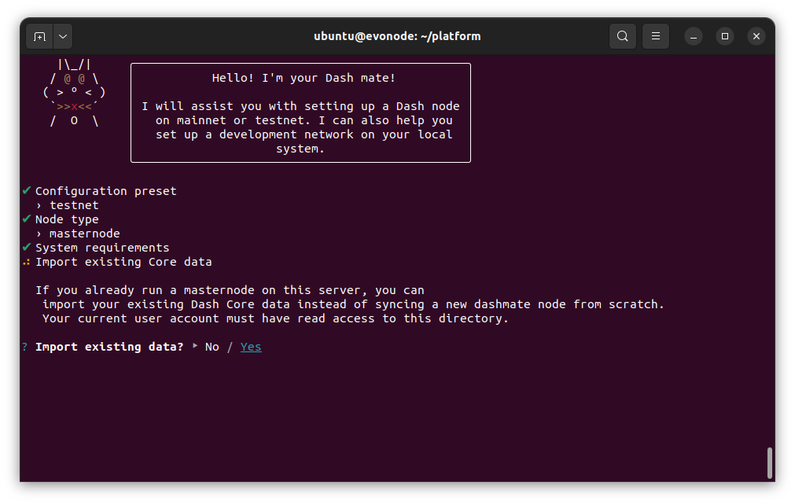
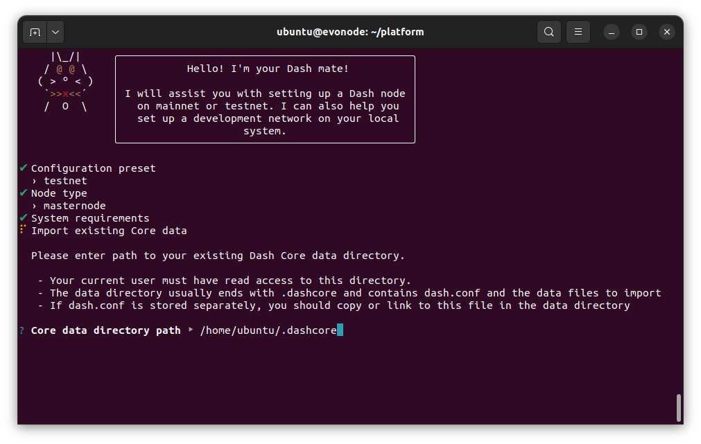
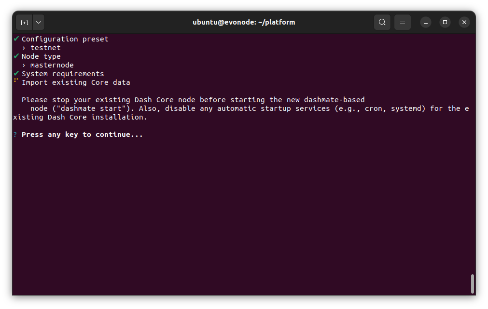
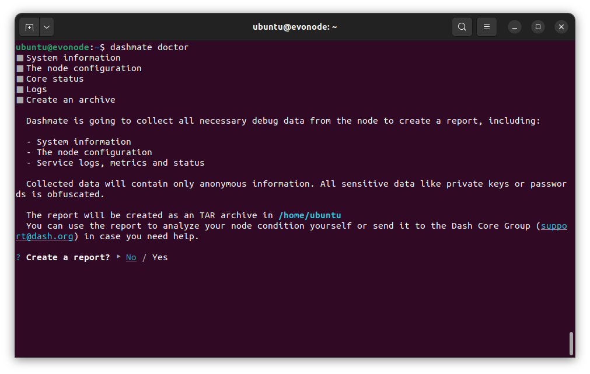
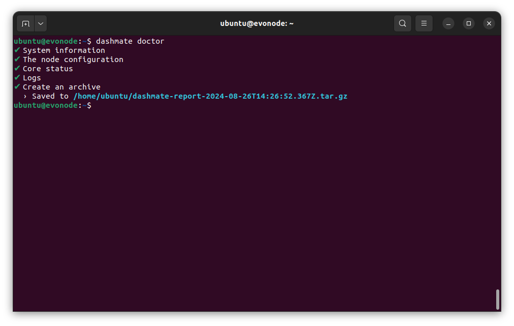

.. meta::
   :description: Description of dashmate features and usage
   :keywords: dash, wallet, core, platform, evonode, masternodes, dashmate

.. _dashmate:

========
Dashmate
========

Dashmate is a universal tool designed to help you set up and run Dash
masternodes in a containerized environment. It is also an ideal tool to quickly
and easily set up and run a development network on your local system.

.. figure:: img/dashmate.gif
   :align: center

   Setting up a testnet evonode using dashmate

.. _dashmate-full-install:

Installation
============

This guide describes how to download, install and use dashmate on for Linux. The guide is written
for Ubuntu 22.04 x64 LTS, but the steps should be similar for other Linux distributions.

.. _dashmate-dep-install:

Install dependencies
--------------------

Install and configure Docker::
   
   curl -fsSL https://get.docker.com -o get-docker.sh && sh ./get-docker.sh
   sudo usermod -aG docker $USER
   newgrp docker

.. _dashmate-install:

Install dashmate
----------------

There are several methods available for installing dashmate. Installing the Linux, MacOS, or Windows
packages from the `GitHub releases page <https://github.com/dashpay/platform/releases/latest>`__ is
recommended for mainnet masternodes.

.. _dashmate-install-deb:

Debian package
^^^^^^^^^^^^^^

Download the newest dashmate installation package for your architecture from the `GitHub releases
page <https://github.com/dashpay/platform/releases/latest>`__::

   wget https://github.com/dashpay/platform/releases/download/v1.8.0/dashmate_1.8.0.e4e156c86-1_amd64.deb

Install dashmate using apt::

   sudo apt update
   sudo apt install ./dashmate_1.8.0.e4e156c86-1_amd64.deb

.. note:: At the end of the installation process, ``apt`` may display an error due to installing a downloaded package. You can ignore this error message:
   
   ``N: Download is performed unsandboxed as root as file '/home/ubuntu/dashmate_1.8.0.e4e156c86-1_amd64.deb' couldn't be accessed by user '_apt'. - pkgAcquire::Run (13: Permission denied)``

Node package
^^^^^^^^^^^^

.. warning:: This installation option is not recommended for mainnet masternodes. Please install
            packages from the `GitHub releases page <https://github.com/dashpay/platform/releases/latest>`__.

.. dropdown:: Node.js dashmate install

   To install the NodeJS package, it is necessary to install NodeJS first. We recommend
   installing it using `nvm <https://github.com/nvm-sh/nvm#readme>`__::

     curl -o- https://raw.githubusercontent.com/nvm-sh/nvm/v0.39.5/install.sh | bash
     source ~/.bashrc
     nvm install 20

   Once NodeJS has been installed, use npm to install dashmate::

      npm install -g dashmate

.. _dashmate-wizard-walkthrough:

Masternode setup
================

Dashmate is primarily recommended for setting up Evolution masternodes (evonodes). With the
exception of a few minor extra steps for evonodes, the process is identical for evonodes and regular
masternodes. Complete the steps in the sections below to set up your node or follow along with this
step-by-step tutorial.

.. raw:: html

    

        <iframe src="https://www.youtube-nocookie.com/embed/973E4knShBA" frameborder="0" allowfullscreen style="position: absolute; top: 0; left: 0; width: 100%; height: 100%;"></iframe>
    

To begin masternode setup, run ``dashmate setup`` to start the interactive wizard::

   dashmate setup

Set Network and Node type
-------------------------

.. figure:: img/1-dashmate-setup.png
   :align: center
   :width: 90%

   Select the testnet network preset

.. figure:: img/2-select-node-type.png
   :align: center
   :width: 90%

   Create an Evolution masternode

Select **No** to register a new masternode or **Yes** to import information
about an existing masternode.

.. figure:: img/3-already-registered.png
   :align: center
   :width: 90%

   Set up a new masternode

If registering a new masternode, jump to the :ref:`defining keys and addresses
<dashmate-define-keys-addresses>` section next.

Import existing Core data
-------------------------

.. note:: The following step only applies when migrating an existing masternode into dashmate.

If you chose to import an existing masternode in the previous step, you will be prompted for the
location of your existing installation. 

   Import existing data

   Enter existing Core data directory

   Core data import complete

Once the Core data has been imported, jump to the :ref:`configure communication
<dashmate-configure-communication>` section.

.. _dashmate-define-keys-addresses:

Define Keys and Addresses
-------------------------

.. figure:: img/4-wallet-for-keys.png
   :align: center
   :width: 90%

   Store masternode keys in Dash Core

Enter the requested information from your :hoverxref:`collateral funding
transaction <evonode-send-collateral>`. You can find these values using Dash Core's
:hoverxref:`masternode outputs <evonode-mn-outputs>` command.

.. figure:: img/5b-collateral-info-completed.png
   :align: center
   :width: 90%

   Enter collateral transaction information

Enter the owner, voting, and payout addresses you :hoverxref:`generated using
Dash Core <evonode-get-addresses>` or your selected wallet.

.. figure:: img/6b-mn-addresses-completed.png
   :align: center
   :width: 90%

   Enter masternode addresses

Enter an operator BLS private key. You can enter one you have created (e.g.
:hoverxref:`using Dash Core <evonode-bls-generation>`) or received from a hosting
provider. Optionally, use the one automatically generated by dashmate.

If a portion of the masternode rewards are intended to go to the operator
directly, set the reward share percentage also.

.. figure:: img/7-bls-operator-key.png
   :align: center
   :width: 90%

   Enter operator information

.. note:: The following step only applies to Evolution masternodes. Regular masternodes 
          do not require a Platform node key since they do not host Platform services.

Enter a Platform node key. You can enter one :hoverxref:`you have created
<evonode-generate-platform-node-id>` or received from a hosting provider.
Optionally, use the one automatically generated by dashmate.

.. figure:: img/8-ed25519-platform-key.png
   :align: center
   :width: 90%

   Enter the Platform node key

.. _dashmate-configure-communication:

Configure communication
-----------------------

Dashmate will automatically detect the external IP address and select the
default ports for the network you are setting up. You can modify these values if
necessary for a specific reason, but typically the defaults should be used.

.. figure:: img/9-ip-and-ports.png
   :align: center
   :width: 90%

   Enter connection information

Register the masternode
-----------------------

Copy the provided protx command and run it using dash-cli or the Dash Core
console. Do note that your payout address must have a balance for the
registration process to be successful, so remember to send some DASH
to this address before you begin registration.

Select **Yes** after the command has been run successfully. If you
receive an error, select **No** to go back through the previous steps and review
details.

.. figure:: img/10b-protx-command-successful.png
   :align: center
   :width: 90%

   Run the registration command

.. _dashmate-enable-ssl:

Enable SSL
----------

.. note:: The following step only applies to evonodes. Regular masternodes do not
   require an SSL certificate since they do not host Platform services.

Dash Platform requires SSL for communication. Dashmate provides several options
for obtaining the required SSL certificate.

.. warning:: Self-signed certificates cannot be used on mainnet. When setting
   up a mainnet evonode, **ZeroSSL** and **File on disk** are the only options available.

.. figure:: img/11a-ssl-config-zerossl.png
   :align: center
   :width: 90%

   Configure SSL

Once the configuration is complete, a summary showing the network and type of
node configured is displayed. This summary includes important parameters and
information on how to proceed.

.. warning::

   The BLS operator private key and Platform Node key must be backed up and kept secure.

.. figure:: img/12-configuration-complete.png
   :align: center
   :width: 95%

   Configuration complete! 🎉

Start the node
--------------

Start your node as follows::

   dashmate start

.. note::

   When starting a node for the first time, dashmate will download the
   Docker images required for each service. The time required for this
   one-time download will depend on the available bandwidth but typically
   should complete within a few minutes.

.. _dashmate-node-operation:

Dashmate node operation
=======================

You can manage your masternode status, configuration, and running state entirely
from within dashmate. Use the built-in help system to learn more:

- ``dashmate --help``
- ``dashmate <command> --help``

.. figure:: img/dashmate-help.png
   :width: 90%

   Dashmate displaying top-level help output

Start or restart node
---------------------

To start your dashmate node, run::

   dashmate start

To restart your dashmate node, run::

   dashmate restart

Stop node
---------

To stop your dashmate node, run::

   dashmate stop

Node status
-----------

You can check the status of your masternode using the various ``dashmate
status`` commands as follows::

  dashmate status
  dashmate status core
  dashmate status host
  dashmate status masternode
  dashmate status platform
  dashmate status services

.. figure:: img/dashmate-status.png
   :width: 350px

   Dashmate displaying a range of status output

Node update
-----------

To update dashmate, it is necessary to download and install the new version of dashmate. First, stop
dashmate if it is running::

  dashmate stop

Next, install the new version of dashmate following the instructions in the :ref:`dashmate install
section <dashmate-install>`.

Once the new version of dashmate is installed, update dash service docker images::

  dashmate update

Finally, restart dashmate::
   
  dashmate start

Troubleshooting
===============

.. warning::

   Only enable logs if you have :ref:`configured log rotation <dashmate-log-rotation>` to avoid
   running out of disk space.

The following sections describe how to enable log rotation, set up file logging for Core and
Platform, adjust log levels, and collect the logs for analysis.

Dashmate log overview
---------------------

Dashmate logs for each service are stored within its Docker container. Although this is typically
sufficient, more advanced options are sometimes needed to adjust the log level, output format,
or destination. Several cases include when you need to: 

* Modify the level of detail provided in the logs (e.g., debug vs info)
* Provide data to a log server (e.g., `Elasticsearch <https://www.elastic.co/elasticsearch>`_)
* Store persistent file logs external to the Docker containers
* Use log monitoring tools to track service health

For example, since the default dashmate logs are only stored in the Docker containers, they are lost
if the container is removed for some reason (new Docker image, dashmate reset, failure, etc.).
Therefore, you may want to store persistent log files external to Docker while troubleshooting an
issue to ensure valuable log data cannot be lost.

.. _dashmate-log-rotation:

Set up log rotation
-------------------

By default, dashmate logs are not written to the docker host file system. At times you may want to
write them to the host file system. Before enabling logging, it is important to configure log
rotation to avoid running out of disk space. 

Create a new logrotate configuration file for dashmate logs:

.. code-block:: shell

   sudo nano /etc/logrotate.d/platform-logs

Paste in the following configuration and replace the example path one that matches your system. This
example configuration rotates logs daily and retains seven historical files for each log file type.
Historical files are each limited to 1GB.

::

   /home/ubuntu/logs/*.log {
     rotate 7
     daily
     maxsize 1G
     missingok
     notifempty
     copytruncate
     compress
     delaycompress
   }

Press **Ctrl + X** to close the editor and **Y** and **Enter** save the file.

.. tip::

   For additional log rotation details, see `this configuration tutorial
   <https://www.digitalocean.com/community/tutorials/how-to-manage-logfiles-with-logrotate-on-ubuntu-22-04>`_
   or check out the `logrotate man pages
   <https://manpages.ubuntu.com/manpages/jammy/man8/logrotate.8.html>`_.

.. _dashmate-logs-core:

Configure Core logs
-------------------

Enable logging to file
^^^^^^^^^^^^^^^^^^^^^^

Use ``dashmate config set`` to configure a location for storing Core logs on the host file system.
Replace the example path with one that matches your system:

.. code-block:: shell

   dashmate config set core.log.filePath "/home/ubuntu/core-debug.log"

.. _dashmate-logs-core-debug:

Toggle debug logs
^^^^^^^^^^^^^^^^^

To enable debug logging for additional details, run the following command. Debug logs can be
turned off by setting the value back to ``false``:

.. code-block:: shell

   dashmate config set core.log.debug.enabled true

.. dropdown:: Advanced debug logging

   Dashmate supports some advanced debug log options provided by Dash Core. The following
   boolean ``core.log.debug`` settings correspond directly to the parameters described in the `Core
   documentation
   <https://docs.dash.org/projects/core/en/stable/docs/dashcore/wallet-arguments-and-commands-dashd.html#debugging-testing-options>`_:
   ``ips``, ``sourceLocations``, ``threadNames``, and ``timeMicros``.

   **Dashmate Debug Log Options**

   +-------------------------+---------------------------------------------------------------+
   | **Setting**             | **Description**                                               |
   +-------------------------+---------------------------------------------------------------+
   | ``ips``                 | Logs the IP addresses of incoming and outgoing connections    |
   +-------------------------+---------------------------------------------------------------+
   | ``sourceLocations``     | Logs the source locations (file and line number) for          |
   |                         | debugging information                                         |
   +-------------------------+---------------------------------------------------------------+
   | ``threadNames``         | Logs the names of the threads used for various operations     |
   +-------------------------+---------------------------------------------------------------+
   | ``timeMicros``          | Logs timestamps with microsecond precision for detailed       |
   |                         | performance analysis                                          |
   +-------------------------+---------------------------------------------------------------+
   | **Filter Option**       | **Description**                                               |
   +-------------------------+---------------------------------------------------------------+
   | ``includeOnly``         | Log only the specified categories (e.g., ``["net", "rpc"]``). |
   |                         | If empty, all categories will be logged                       |
   +-------------------------+---------------------------------------------------------------+
   | ``exclude``             | Excludes specified categories from logging (e.g., ``["rpc",   |
   |                         | "instantsend"]``)                                             |
   +-------------------------+---------------------------------------------------------------+

   .. code-block:: shell
      
      dashmate config set core.log.debug.ips true
      dashmate config set core.log.debug.includeOnly '["instantsend", "llmq"]'

View current log settings
^^^^^^^^^^^^^^^^^^^^^^^^^

To view the current Core log settings, run:

.. code-block:: shell

   dashmate config get core.log

Disable logging to file
^^^^^^^^^^^^^^^^^^^^^^^

To disable logging to a file outside the container, reset the log path to ``null``:

.. code-block:: shell

   dashmate config set core.log.filePath null

.. _dashmate-logs-platform:

Configure Platform logs
-----------------------

For troubleshooting flexibility, dashmate provides independent log configuration for the Platform
Gateway, Drive ABCI, and Tenderdash. Each service can be configured with the most helpful log level
and output format.

.. _dashmate-logs-platform-gateway:

Gateway logs
^^^^^^^^^^^^

The Platform gateway has two types of logs: service logs and access logs. Service logs are directed
to stdout, while access logs can be configured to go to stdout, stderr, or to a file. If all logs
are directed to stdout, the output will be a mixture of service and access data.

**Enable file logging**

Use ``dashmate config set`` to configure a location for storing Platform gateway access logs on the
host file system. The example below adds file logging while also keeping the default stdout logging.
Replace the example path with one that matches your system:

.. code-block:: shell

   dashmate config set platform.gateway.log.accessLogs '[
      {
         "type": "file",
         "format": "text",
         "path": "/home/ubuntu/logs/gateway.log",
         "template": null
      },      
      {
         "type": "stdout",
         "format": "text",
         "template": null
      }
   ]'

**Disable file logging**

To disable logging to a file, remove the file config from the accessLogs setting:

.. code-block:: shell

   dashmate config set platform.gateway.log.accessLogs '[
      {
         "type": "stdout",
         "format": "text",
         "template": null
      }
   ]'

**Change log level**

Platform gateway service logs support several levels of detail. In increasing order of detail they
are: ``critical``, ``error``, ``warn``, ``info`` (default), ``debug``, and ``trace``. To disable
service logs, set the log level to ``off``. 

The log level can be changed by using ``dashmate config set`` to update the
``platform.gateway.log.level`` value. For example, run these commands to change the gateway service
log level to debug on your dashmate node:

.. code-block:: shell

  dashmate config set platform.gateway.log.level debug
  dashmate restart --platform

**View log settings**

To view the current Platform gateway log settings, run:

.. code-block:: shell

   dashmate config get platform.gateway.log

.. _dashmate-logs-platform-abci:

Drive ABCI logs
^^^^^^^^^^^^^^^

**Enable file logging**

Use ``dashmate config set`` to configure a location for storing Platform ABCI logs on the host
file system. Replace the example path with one that matches your system:

.. code-block:: shell

   dashmate config set platform.drive.abci.logs '{
      "stdout": {
         "destination":"stdout",
         "level": "info",
         "format":"compact",
         "color":true
      }, 
      "file": {
         "destination": "/home/ubuntu/logs/drive-abci.log",
         "level": "info",
         "format": "compact",
         "color": true
      }
   }'

**Disable file logging**

To disable logging to a file, remove the file config from the logs setting:

.. code-block:: shell

   dashmate config set platform.drive.abci.logs '{
      "stdout": {
         "destination":"stdout",
         "level": "info",
         "format":"compact",
         "color":true
      }
   }'

**Change log level**

Drive ABCI logs support several levels of detail. In increasing order of detail they are: ``error``,
``warn``, ``info`` (default), ``debug``, and ``trace``. A logging specification string can also be
provided in the RUST_LOG format for more flexibility. To disable service logs, set the log level to
``silent``. 

The log level can be changed by using ``dashmate config set`` to update the
``platform.drive.abci.logs.*.level`` value. For example, run these commands to change the log levels
for file logging and stdout logging to debug on your dashmate node:

.. code-block:: shell

  dashmate config set platform.drive.abci.logs.file.level debug
  dashmate config set platform.drive.abci.logs.stdout.level debug
  dashmate restart --platform

**View log settings**

To view the current Platform gateway log settings, run:

.. code-block:: shell

   dashmate config get platform.drive.abci.logs

.. _dashmate-logs-platform-tenderdash:

Tenderdash logs
^^^^^^^^^^^^^^^

**Enable file logging**

Use ``dashmate config set`` to configure a location for storing Tenderdash logs on the host file
system. Replace the example path with one that matches your system:

.. code-block:: shell

   dashmate config set platform.drive.tenderdash.log.path "/home/ubuntu/logs/drive-tenderdash.log"

**Disable file logging**

To disable logging to a file, set the path back to ``null``:

.. code-block:: shell

   dashmate config set platform.drive.tenderdash.log.path null

**Change log level**

Tenderdash logs support several levels of detail. In increasing order of detail they are:
``error``, ``warn``, ``info`` (default), ``debug``, and ``trace``. A logging
specification string can also be provided in the RUST_LOG format for more flexibility. To disable
service logs, set the log level to ``silent``. 

The log level can be changed by using ``dashmate config set`` to update the
``platform.drive.abci.logs.*.level`` value. For example, run these commands to change the log level
to debug on your dashmate node:

.. code-block:: shell

  dashmate config set platform.drive.tenderdash.log.level debug
  dashmate restart --platform

**View log settings**

To view the current Tenderdash log settings, run:

.. code-block:: shell

   dashmate config get platform.drive.tenderdash.log

.. _dashmate-doctor:

Collect logs
------------

Dashmate includes the doctor command to make troubleshooting and log reporting easier. The dashmate
doctor command collects important debugging data about the masternode and creates a compressed report file
that can be sent to the support team if necessary. This report includes:

- **Operating System**: Details about the architecture, CPU, memory, and swap
- **Docker**: Status and logs (exit codes, stdout, stderr) for each service
- **Core RPC**: Essential details like the best ChainLock, quorums, blockchain information, peers, and masternode status
- **Tenderdash RPC**: Status, genesis, network information, ABCI details, and a consensus state dump
- **Metrics**: Tenderdash and Drive metrics (if enabled in the configuration)

To create a report, run ``dashmate doctor`` and select **Yes**::

   dashmate doctor

   Run the doctor command

Upon successful completion, the full path to the report archive is displayed.

   Doctor output

.. _dashmate-metrics:

Metrics
-------

To provide better network visibility to DCG developers for troubleshooting, volunteers can
contribute metrics to the DCG metrics server.

1. Enable metrics on your dashmate node

   .. code-block:: shell

      dashmate config set platform.gateway.metrics.enabled true
      dashmate config set platform.gateway.metrics.host 0.0.0.0
      dashmate config set platform.gateway.metrics.port 9090
      dashmate config set platform.gateway.admin.enabled true

      dashmate config set platform.gateway.rateLimiter.metrics.enabled true
      dashmate config set platform.gateway.rateLimiter.metrics.host 0.0.0.0
      dashmate config set platform.gateway.rateLimiter.metrics.port 9102

      dashmate config set platform.drive.abci.metrics.enabled true
      dashmate config set platform.drive.abci.metrics.host 0.0.0.0
      dashmate config set platform.drive.abci.metrics.port 29090

      dashmate config set platform.drive.tenderdash.metrics.enabled true
      dashmate config set platform.drive.tenderdash.metrics.host 0.0.0.0
      dashmate config set platform.drive.tenderdash.metrics.port 26660

      dashmate restart --platform 

2. Grant access to metrics from the DCG metrics server (34.219.3.238) by updating your network
   configuration (i.e., your firewall, AWS security groups, etc.)

3. Provide DCG with your IP address and port so it can be added to the DCG Prometheus server

Additional Information
======================

For further documentation see the `dashmate repository
<https://github.com/dashpay/platform/blob/master/packages/dashmate/README.md>`__.
