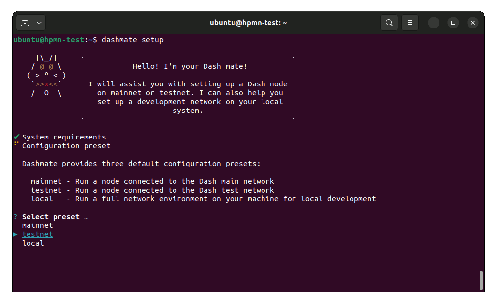
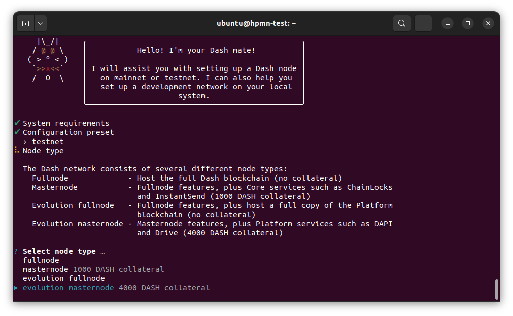
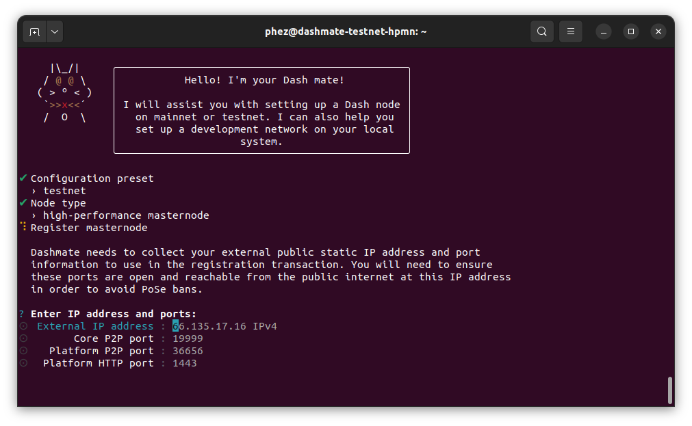
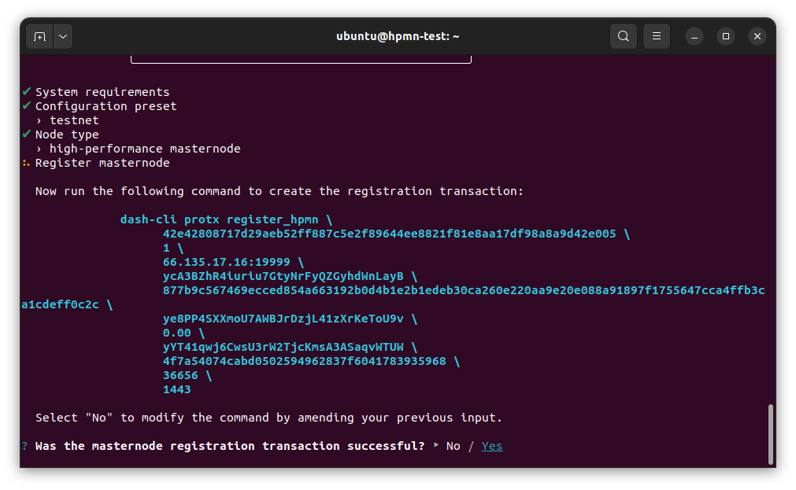

.. meta::
   :description: Description of dashmate and its many properties.
   :keywords: dash, wallet, core, platform, HPMN, masternodes, dashmate

.. _dashmate:

========
Dashmate
========

Dashmate is a universal tool designed to help you set up and run Dash
masternodes in a containerized environment. It is also an ideal tool to quickly
and easily set up and run a development network on your local system.

   Setting up a testnet HPMN using Dashmate

Installation
============

Install dependencies
--------------------

Install and configure Docker::
   
   curl -fsSL https://get.docker.com -o get-docker.sh && sh ./get-docker.sh
   sudo usermod -aG docker $USER
   newgrp docker

.. _dashmate-install:

Install Dashmate
----------------

There are several methods available for installing Dashmate.

.. _dashmate-install-deb:

Debian package
^^^^^^^^^^^^^^

Download the Dashmate installation package::

   wget https://github.com/dashpay/platform/releases/download/v0.24.0-dev.17/dashmate_0.24.0.12b0c20-1_amd64.deb

Install Dashmate using apt::

   sudo apt update
   sudo apt install ./dashmate_0.24.0.12b0c20-1_amd64.deb

Node package
^^^^^^^^^^^^

To install the NodeJS package, it is necessary to install NodeJS first. We recommend
installing it using `nvm <https://github.com/nvm-sh/nvm#readme>`__::

  curl -o- https://raw.githubusercontent.com/nvm-sh/nvm/v0.39.1/install.sh | bash
  source ~/.bashrc
  nvm install 16

Once NodeJS has been installed, use npm to install Dashmate::

   npm install -g dashmate

Masternode setup
================

You can setup both regular masternodes and high-performance masternodes (HPMNs)
using Dashmate. There are few minor extra steps for HPMNs, but the process is
largely identical for both masternode types.

To begin masternode setup, run ``dashmate setup`` and select the desired network type::

   dashmate setup

Set Network and Node type
-------------------------

.. figure:: img/1-dashmate-setup.png
   :align: center
   :width: 90%

   Select the testnet network preset

   Create a high-performance masternode

Select **No** to register a new masternode or **Yes** to import information
about an existing masternode.

   Set up a new masternode

Define Keys and Addresses
-------------------------

   Store masternode keys in Dash Core

Enter the requested information from your :hoverxref:`collateral funding
transaction <hpmn-send-collateral>`. You can find these values using Dash Core's
:hoverxref:`masternode outputs <hpmn-mn-outputs>` command.

.. figure:: img/5b-collateral-info-completed.png
   :align: center
   :width: 90%

   Enter collateral transaction information

Enter the owner, voting, and payout addresses you :hoverxref:`generated using
Dash Core <hpmn-get-addresses>` or your selected wallet.

.. figure:: img/6b-mn-addresses-completed.png
   :align: center
   :width: 90%

   Enter masternode addresses

Enter an operator BLS private key. You can enter one you have created (e.g.
:hoverxref:`using Dash Core <hpmn-bls-generation>`) or received from a hosting
provider. Optionally, you can use the one automatically generated by Dashmate.

If a portion of the masternode rewards are intended to go to the operator
directly, set the reward share percentage also.

   Enter operator information

.. note:: The following step only applies to HPMNs. Regular masternodes do not
   require a Platform node key since they do not host Platform services.

Enter a Platform node key. You can enter one :hoverxref:`you have created
<hpmn-generate-platform-node-id>` or received from a hosting provider.
Optionally, you can use the one automatically generated by Dashmate.

   Enter the Platform node key

Configure communication
-----------------------

Dashmate will automatically detect your external IP address and select the
default ports for the network you are setting up. You can modify these values if
necessary for a specific reason, but typically the defaults should be used.

   Enter connection information

Register the masternode
-----------------------

Copy the provided protx command and run it using dash-cli or the Dash Core
console. Select **Yes** after the command has been run successfully. If you
receive an error, you can select **No** to go back through the previous steps to
review details.

   Run the registration command

Enable SSL
----------

.. note:: The following step only applies to HPMNs. Regular masternodes do not
   require an SSL certificate since they do not host Platform services.

Dash Platform requires SSL for communication. Dashmate provides several options
for obtaining the required SSL certificate.

.. warning:: Self-signed certificates cannot be used on mainnet. When setting
   up a mainnet HPMN, **ZeroSSL** and **File on disk** are the only options available.

.. figure:: img/11a-ssl-config-zerossl.png
   :align: center
   :width: 90%

   Configure SSL

Once the configuration is complete, a summary showing the network and type of
node configured is displayed. This summary includes important parameters and
information on how to proceed.

.. warning::

   The BLS operator private key and Platform Node key must be backed up and kept secure.

   Configuration complete! 🎉
