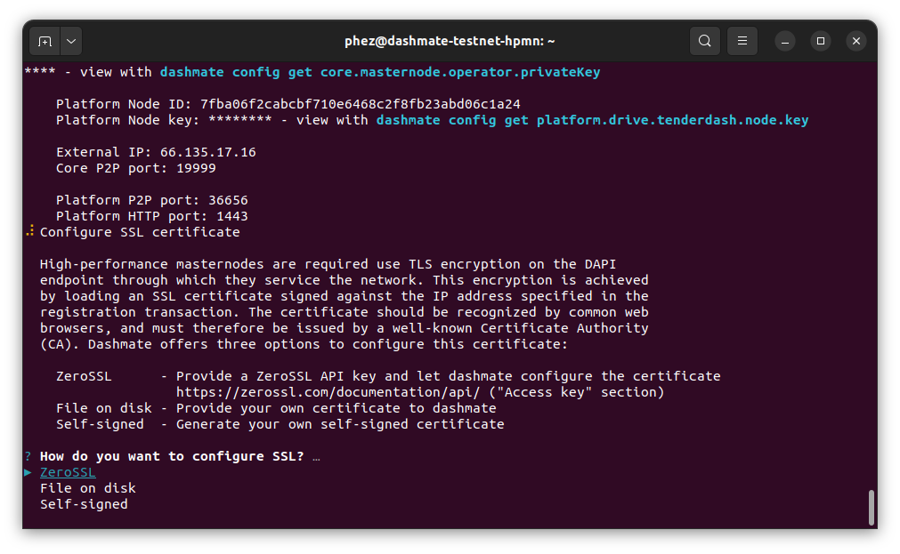

.. meta::
   :description: Description of dashmate and its many properties.
   :keywords: dash, wallet, core, platform, HPMN, masternodes, dashmate

.. _dashmate:

========
Dashmate
========

Dashmate is a universal tool designed to help you set up and run Dash
masternodes in a containerized environment. It is also an ideal tool to quickly
and easily set up and run a development network on your local system.

.. image:: img/dashmate.gif
   :align: center

Install dependencies
====================

Install and configure Docker::
   
   curl -fsSL https://get.docker.com -o get-docker.sh && sh ./get-docker.sh
   sudo usermod -aG docker $USER
   newgrp docker

.. _dashmate-install:

Install Dashmate
================

There are several methods available for installing Dashmate.

.. _dashmate-install-deb:

Debian package
--------------

Download the Dashmate installation package::

   wget https://github.com/dashpay/platform/releases/download/v0.24.0-dev.17/dashmate_0.24.0.12b0c20-1_amd64.deb

Install Dashmate using apt::

   sudo apt update
   sudo apt install ./dashmate_0.24.0.12b0c20-1_amd64.deb

Node package
------------

To install the NodeJS package, it is necessary to install NodeJS first. We recommend
installing it using `nvm <https://github.com/nvm-sh/nvm#readme>`__::

  curl -o- https://raw.githubusercontent.com/nvm-sh/nvm/v0.39.1/install.sh | bash
  source ~/.bashrc
  nvm install 16

Once NodeJS has been installed, use npm to install Dashmate::

   npm install -g dashmate

Masternode setup
================

You can setup both regular masternodes and high-performance masternodes (HPMNs)
using Dashmate. There are few minor extra steps for HPMNs, but the process is
largely identical for both masternode types. The following example shows setting
up a testnet HPMN.

To begin masternode setup, run ``dashmate setup`` and select the desired network type::

   dashmate setup

.. figure:: img/1-dashmate-setup.png
   :align: center
   :width: 95%

   Select the testnet network preset

.. figure:: img/2-select-node-type.png
   :align: center
   :width: 95%

   Create a high-performance masternode

.. figure:: img/3-already-registered.png
   :align: center
   :width: 95%

   Set up a new masternode

.. figure:: img/4-wallet-for-keys.png
   :align: center
   :width: 95%

   Store masternode keys in Dash Core

Enter the requested information from your :hoverxref:`collateral funding
transaction <hpmn-send-collateral>`. You can find these values using Dash Core's
:hoverxref:`masternode outputs <hpmn-mn-outputs>` command.

.. figure:: img/5b-collateral-info-completed.png
   :align: center
   :width: 95%

   Enter collateral transaction info

Enter the owner, voting, and payout addresses you :hoverxref:`generated using
Dash Core <hpmn-get-addresses>` or your selected wallet.

.. figure:: img/6b-mn-addresses-completed.png
   :align: center
   :width: 95%

   Enter masternode addresses

Enter the masternode's operator private key. If a portion of the masternode
rewards are intended to go to the operator directly, set the reward share
percentage also.

.. figure:: img/7-bls-operator-key.png
   :align: center
   :width: 95%

   Enter operator info

.. figure:: img/8-ed25519-platform-key.png
   :align: center
   :width: 95%

   Enter the Platform node key

.. figure:: img/9-ip-and-ports.png
   :align: center
   :width: 95%

   Enter connection info

Copy the provided protx command and run it using dash-cli or the Dash Core
console. Select **Yes** after the command has been run successfully. If you
receive an error, you can select **No** to go back through the previous steps to
review details.

.. figure:: img/10b-protx-command-successful.png
   :align: center
   :width: 95%

   Run the registration command

Dash Platform requires SSL for communication. Dashmate provides several options
for obtaining the required SSL certificate.

   Configure SSL

.. figure:: img/12-configuration-complete.png
   :align: center
   :width: 95%

   Configuration complete!
