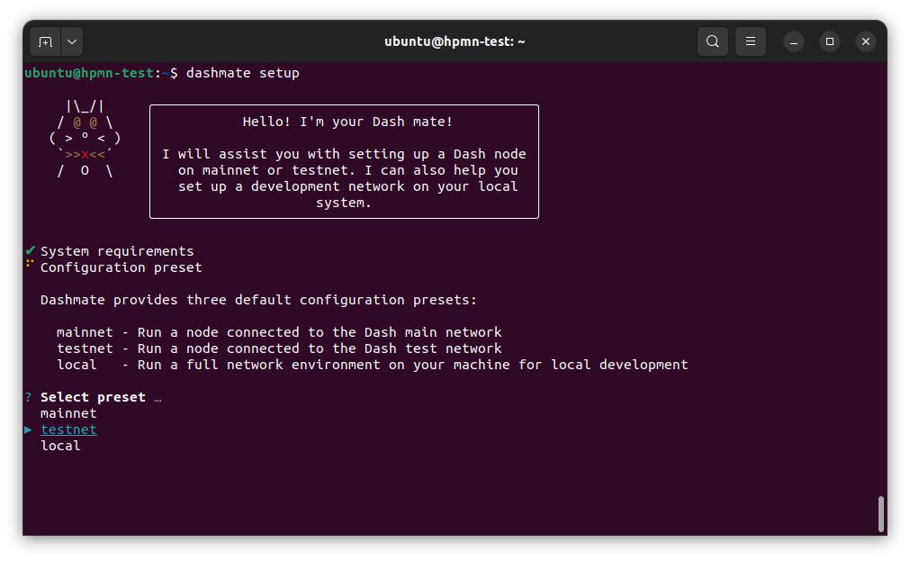

.. meta::
   :description: Description of dashmate features and usage
   :keywords: dash, wallet, core, platform, evonode, masternodes, dashmate

.. _dashmate:

========
Dashmate
========

Dashmate is a universal tool designed to help you set up and run Dash
masternodes in a containerized environment. It is also an ideal tool to quickly
and easily set up and run a development network on your local system.

.. figure:: img/dashmate.gif
   :align: center

   Setting up a testnet evonode using dashmate

.. _dashmate-full-install:

Installation
============

.. _dashmate-dep-install:

Install dependencies
--------------------

Install and configure Docker::
   
   curl -fsSL https://get.docker.com -o get-docker.sh && sh ./get-docker.sh
   sudo usermod -aG docker $USER
   newgrp docker

.. _dashmate-install:

Install dashmate
----------------

There are several methods available for installing dashmate.

.. _dashmate-install-deb:

Debian package
^^^^^^^^^^^^^^

Download the dashmate installation package::

   wget https://github.com/dashpay/platform/releases/download/v0.25.15/dashmate_0.25.15-1_arm64.deb

Install dashmate using apt::

   sudo apt update
   sudo apt install ./dashmate_0.25.15-1_arm64.deb

Node package
^^^^^^^^^^^^

To install the NodeJS package, it is necessary to install NodeJS first. We recommend
installing it using `nvm <https://github.com/nvm-sh/nvm#readme>`__::

  curl -o- https://raw.githubusercontent.com/nvm-sh/nvm/v0.39.5/install.sh | bash
  source ~/.bashrc
  nvm install 20

Once NodeJS has been installed, use npm to install dashmate::

   npm install -g dashmate

.. _dashmate-wizard-walkthrough:

Masternode setup
================

You can setup both regular masternodes and Evolution masternodes (evonodes)
using dashmate. There are few minor extra steps for evonodes, but the process is
largely identical for both masternode types. Complete the steps in the sections
below to set up your node or follow along with this step-by-step tutorial.

.. raw:: html

    

        <iframe src="https://www.youtube-nocookie.com/embed/973E4knShBA" frameborder="0" allowfullscreen style="position: absolute; top: 0; left: 0; width: 100%; height: 100%;"></iframe>
    

To begin masternode setup, run ``dashmate setup`` to start the interactive wizard::

   dashmate setup

Set Network and Node type
-------------------------

   Select the testnet network preset

.. figure:: img/2-select-node-type.png
   :align: center
   :width: 90%

   Create an Evolution masternode

Select **No** to register a new masternode or **Yes** to import information
about an existing masternode.

.. figure:: img/3-already-registered.png
   :align: center
   :width: 90%

   Set up a new masternode

Define Keys and Addresses
-------------------------

.. figure:: img/4-wallet-for-keys.png
   :align: center
   :width: 90%

   Store masternode keys in Dash Core

Enter the requested information from your :hoverxref:`collateral funding
transaction <evonode-send-collateral>`. You can find these values using Dash Core's
:hoverxref:`masternode outputs <evonode-mn-outputs>` command.

.. figure:: img/5b-collateral-info-completed.png
   :align: center
   :width: 90%

   Enter collateral transaction information

Enter the owner, voting, and payout addresses you :hoverxref:`generated using
Dash Core <evonode-get-addresses>` or your selected wallet.

.. figure:: img/6b-mn-addresses-completed.png
   :align: center
   :width: 90%

   Enter masternode addresses

Enter an operator BLS private key. You can enter one you have created (e.g.
:hoverxref:`using Dash Core <evonode-bls-generation>`) or received from a hosting
provider. Optionally, use the one automatically generated by dashmate.

If a portion of the masternode rewards are intended to go to the operator
directly, set the reward share percentage also.

.. figure:: img/7-bls-operator-key.png
   :align: center
   :width: 90%

   Enter operator information

.. note:: The following step only applies to Evolution masternodes. Regular masternodes 
          do not require a Platform node key since they do not host Platform services.

Enter a Platform node key. You can enter one :hoverxref:`you have created
<evonode-generate-platform-node-id>` or received from a hosting provider.
Optionally, use the one automatically generated by dashmate.

.. figure:: img/8-ed25519-platform-key.png
   :align: center
   :width: 90%

   Enter the Platform node key

Configure communication
-----------------------

Dashmate will automatically detect the external IP address and select the
default ports for the network you are setting up. You can modify these values if
necessary for a specific reason, but typically the defaults should be used.

.. figure:: img/9-ip-and-ports.png
   :align: center
   :width: 90%

   Enter connection information

Register the masternode
-----------------------

Copy the provided protx command and run it using dash-cli or the Dash Core
console. Do note that your payout address must have a balance for the
registration process to be successful, so remember to send some DASH
to this address before you begin registration.

Select **Yes** after the command has been run successfully. If you
receive an error, select **No** to go back through the previous steps and review
details.

.. figure:: img/10b-protx-command-successful.png
   :align: center
   :width: 90%

   Run the registration command

Enable SSL
----------

.. note:: The following step only applies to evonodes. Regular masternodes do not
   require an SSL certificate since they do not host Platform services.

Dash Platform requires SSL for communication. Dashmate provides several options
for obtaining the required SSL certificate.

.. warning:: Self-signed certificates cannot be used on mainnet. When setting
   up a mainnet evonode, **ZeroSSL** and **File on disk** are the only options available.

.. figure:: img/11a-ssl-config-zerossl.png
   :align: center
   :width: 90%

   Configure SSL

Once the configuration is complete, a summary showing the network and type of
node configured is displayed. This summary includes important parameters and
information on how to proceed.

.. warning::

   The BLS operator private key and Platform Node key must be backed up and kept secure.

.. figure:: img/12-configuration-complete.png
   :align: center
   :width: 95%

   Configuration complete! 🎉

Start the node
--------------

Start your node as follows::

   dashmate start

.. note::

   When starting a node for the first time, dashmate will download the
   Docker images required for each service. The time required for this
   one-time download will depend on the available bandwidth but typically
   should complete within a few minutes.

.. _dashmate-node-operation:

Dashmate node operation
=======================

You can manage your masternode status, configuration, and running state entirely
from within dashmate. Use the built-in help system to learn more:

- ``dashmate --help``
- ``dashmate <command> --help``

.. figure:: img/dashmate-help.png
   :width: 90%

   Dashmate displaying top-level help output

Start or restart node
---------------------

To start your dashmate node, run::

   dashmate start

To restart your dashmate node, run::

   dashmate restart

Stop node
---------

To stop your dashmate node, run::

   dashmate stop

Node status
-----------

You can check the status of your masternode using the various ``dashmate
status`` commands as follows::

  dashmate status
  dashmate status core
  dashmate status host
  dashmate status masternode
  dashmate status platform
  dashmate status services

   Dashmate displaying a range of status output

Node update
-----------

You can use ``dashmate`` to update minor versions of the software on your
masternode as follows::

  dashmate stop
  dashmate update
  dashmate start

Additional Information
======================

For further documentation see the `dashmate repository
<https://github.com/dashpay/platform/blob/master/packages/dashmate/README.md>`__.
