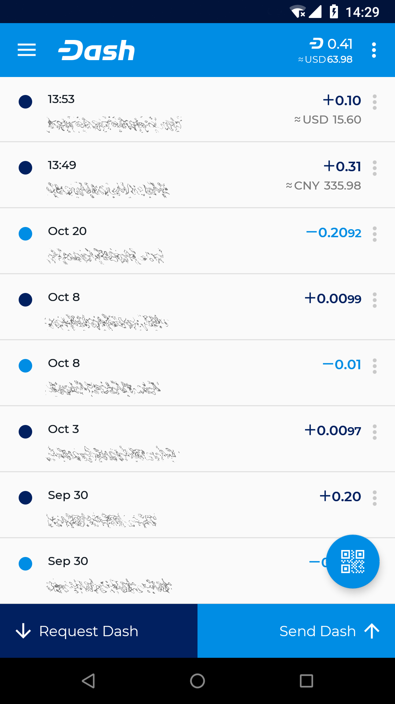
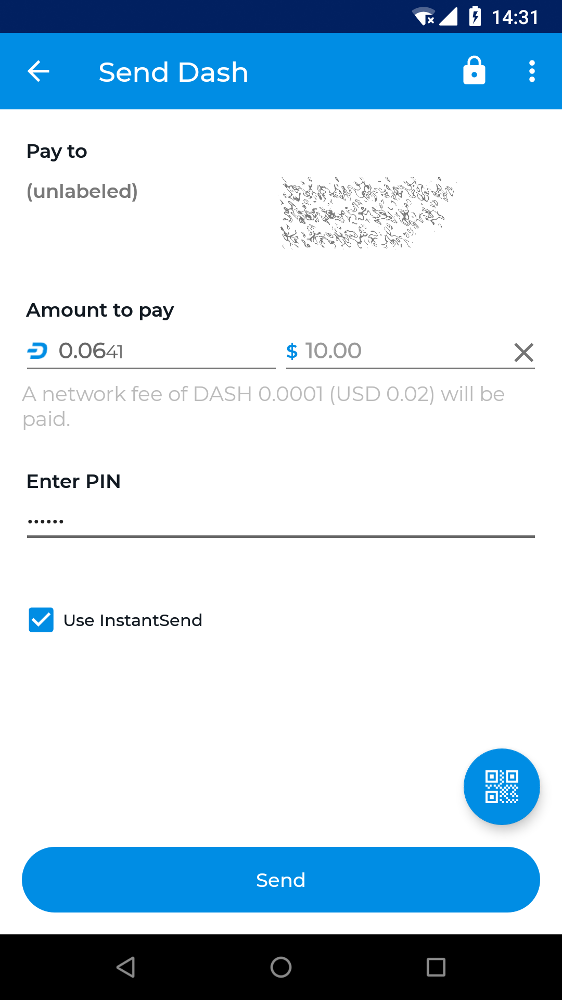

.. _dash-android-wallet:

Dash Android Wallet
===================

Dash offers a standalone wallet for Android, with development supported 
by the Dash budget. The Dash Android Wallet supports advanced Dash 
features, including contact management and InstantSend. You can scan and 
display QR codes for quick transfers, backup and restore your wallet, 
keep an address book of frequently used addresses, pay with NFC, sweep 
paper wallets and more.

.. toctree::
   :includehidden:
   :maxdepth: 1

   installation.rst
   getting-started.rst
   advanced-functions.rst

*Dash Android Wallet*
