.. meta::
   :description: Coin control, HD wallets, multisig, multiple wallet files using the Dash Core wallet
   :keywords: dash, core, wallet, backup, restore, wallet.dat, multisig, hd, seed, passphrase, mnemonic, coin control, hierarchical deterministic

.. _dashcore-advanced:

===============
Advanced topics
===============

.. _coin-control:

Coin Control
============

Coin Control allows users of the Dash Core Wallet to specify which
addresses and Unspent Transaction Outputs (UTXOs) should be used as
inputs in transactions. This allows you to keep a specific balance on
certain addresses in your wallet, while spending others freely. In Dash
Core Wallet, click **Settings > Options > Wallet > Enable coin control
features**. Now, when you go to the Send tab in your wallet, a new
button labelled **Inputs…** will appear. Click this button to select
which UTXOs can be used as input for any transactions you create. The
following window appears:

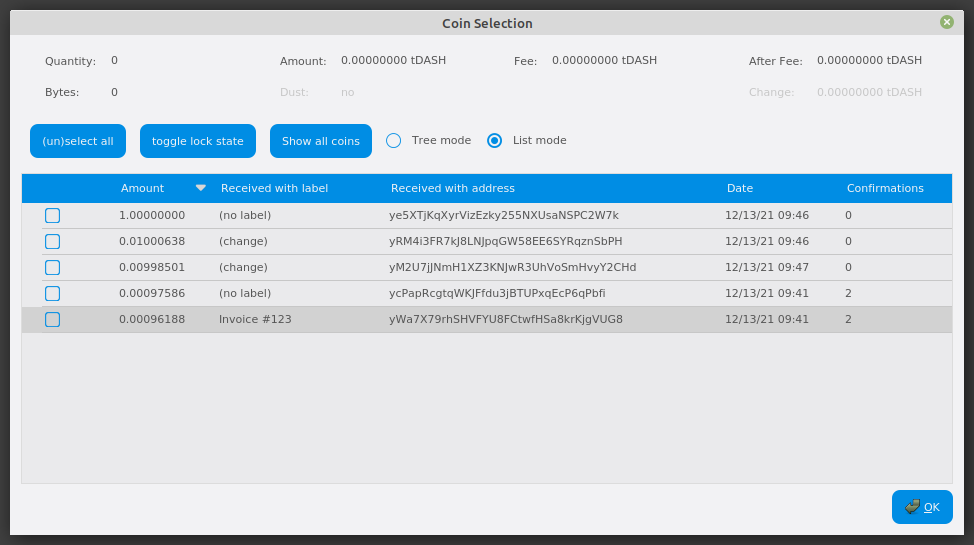

   Coin Selection window in Dash Core wallet, showing two masternodes
   (testnet)

Right click on the transaction(s) you do not want to spend, then select
**Lock unspent**. A small lock will appear next to the transaction. You
can click the **Toggle lock state** button to invert the locked/unlocked
state of all UTXOs. When you are ready to continue, click **OK**. You
can now safely create transactions with your remaining funds without
affecting the locked UTXOs.

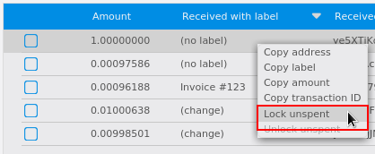

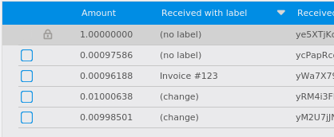

   Locking UTXOs in Dash Core wallet

.. _dashcore-testnet:

Running Dash Testnet
====================

It is recommended to run Dash Core on testnet for your experimentations. 
To start on testnet via the command line, do the following:

For Linux::

  ./dash-qt -testnet

For Mac (run from Applications/Dash-Qt.app/Contents/MacOS)::

  Dash-Qt -testnet

Note: You may need to allow an app from an unknown developer before running this. 
Cmd+Click on the application and click **Open**.

Now, open Mac Terminal and run::

  cd /Applications/Dash-Qt.app/Contents/MacOS
  ./Dash-Qt -testnet

You may top up your testnet wallet by `accessing the faucet <http://faucet.testnet.networks.dash.org/>`_.

.. _dashcore-hd:

HD Wallets
==========

.. versionadded:: v20.1.0
   
   HD wallets are now created by default.

Dash Core includes an implementation of BIP39/BIP44 compatible hierarchical
deterministic (HD) key generation.

.. _dashcore-hd-upgrade:

Upgrade to HD
-------------

.. warning::

  A new :ref:`backup <dashcore-backup>` must be created after upgrading to an HD
  wallet.

Dash Core includes the ability upgrade a non-hierarchical deterministic (HD)
wallet to an HD wallet via the ``upgradetohd`` command. The command can be run
by either opening the console from **Window > Console** or issuing the following
RPC command from ``dash-cli``::

  upgradetohd "" "" <walletpassphrase>

If your wallet is already encrypted you must enter the passphrase as the third
parameter to the command. If your wallet is not already encrypted, specifying a
wallet passphrase will trigger wallet encryption.

To see full details for the command, run the following from either the console
or ``dash-cli``::

  help upgradetohd

View HD wallet information
--------------------------

Open the console from **Window > Console** or issue the following RPC command
from ``dash-cli`` to view the mnemonic seed::

  dumphdinfo

Dash Core will display the HD seed in both hexadecimal and BIP39 mnemonic
formats. It will also display the mnemonic passphrase if one was used when
creating the wallet.

.. _dashcore-hd-restore:

Restore HD wallet
-----------------

To restore an existing HD wallet, or define your own separately generated
mnemonic and/or passphrase, create a new blank wallet with following command::

  createwallet "enter wallet name" false true "optional wallet password"

Add the HD wallet details to the newly created wallet by running::

  upgradetohd "enter mnemonic" "optional mnemonic passphrase" "optional wallet passphrase"

The HD wallet will be restored and your balance will appear once sync is
complete.

Note that the wallet passphrase is different to the mnemonic passphrase, which
is often also referred to as the "25th word" or "extension word". The wallet
passphrase encrypts the wallet file itself, while the mnemonic passphrase is
used to specify different derivation branches from the same mnemonic seed.

.. _dashcore-hd-default:

Enable HD Wallet Creation By Default
------------------------------------

.. versionadded:: v20.1.0
   
  HD wallets are now created by default without requiring the steps listed below.

Prior to Dash Core v20.1.0, it was necessary to complete theses steps to make HD
wallet the default. We will use the Windows GUI wallet in this example, but the
commands are similar if using ``dash-qt`` or ``dashd`` on other operating
systems. Enter the following command to configure Dash Core to generate HD
wallets by default::

  dash-qt.exe -usehd

To make this configuration persist between restarts, add ``usehd=1`` to the
``dash.conf`` file.

.. _dashcore-multisig:

Multisignature
==============

This section presents a worked example to demonstrate multisig
functionality in Dash Core. While the transactions may no longer be visible
on the current testnet blockchain and some address formats or RPC
responses may differ slightly from the version shown here, the principle
and commands are the same. The example demonstrates how to set up a
2-of-3 multisig address and create a transaction. The example parties
involved are a buyer, a seller and an arbiter. This example is based on:

- https://gist.github.com/jashmenn/9811198
- https://gist.github.com/gavinandresen/3966071

Step 1: Create three addresses
------------------------------

Seller::

  seller@testnet03:~$ ./dash-cli getnewaddress
  yfw6wPY5eo6sWxcU93ej3fRD9VXzppEYkm
  
  seller@testnet03:~$ ./dash-cli getaddressinfo yfw6wPY5eo6sWxcU93ej3fRD9VXzppEYkm
  {
    "address": "yfw6wPY5eo6sWxcU93ej3fRD9VXzppEYkm",
    "scriptPubKey": "76a914d728be76cd74b5d148eba2a49246b80dac12f73e88ac",
    "ismine": true,
    "solvable": true,
    "desc": "pkh([d728be76]02a862b412ff9e3afd01a2873a02622897f6df92e3fc85597788b898309fec882e)#7y7rcew8",
    "iswatchonly": false,
    "isscript": false,
    "pubkey": "02a862b412ff9e3afd01a2873a02622897f6df92e3fc85597788b898309fec882e",
    "iscompressed": true,
    "ischange": false,
    "timestamp": 1,
    "labels": [
      "seller"
    ]
  }
  
  seller@testnet03:~$ ./dash-cli dumpprivkey yfw6wPY5eo6sWxcU93ej3fRD9VXzppEYkm
  cVQVgBr8sW4FTPYz16BSCo1PcAfDhpJArgMPdLxKZQWcVFwMXRXx

Buyer::

  buyer@testnet03:~$ ./dash-cli getnewaddress
  yUtJQSYvqoicEpUiMiaiSy16Fimpjz6Kjj
  
  buyer@testnet03:~$ ./dash-cli getaddressinfo yUtJQSYvqoicEpUiMiaiSy16Fimpjz6Kjj
  {
    "address": "yUtJQSYvqoicEpUiMiaiSy16Fimpjz6Kjj",
    "scriptPubKey": "76a9145df7af25fa0654c90f359034ac756de71f5f25dc88ac",
    "ismine": true,
    "solvable": true,
    "desc": "pkh([5df7af25]0315617694c9d93f0ce92769e050a6868ffc74d229077379c0af8bfb193c3d351c)#795y6m9z",
    "iswatchonly": false,
    "isscript": false,
    "pubkey": "0315617694c9d93f0ce92769e050a6868ffc74d229077379c0af8bfb193c3d351c",
    "iscompressed": true,
    "ischange": false,
    "timestamp": 1,
    "labels": [
      "buyer"
    ]
  }
  
  buyer@testnet03:~$ ./dash-cli dumpprivkey yUtJQSYvqoicEpUiMiaiSy16Fimpjz6Kjj
  cP9DFmEDb11waWbQ8eG1YUoZCGe59BBxJF3kk95PTMXuG9HzcxnU

Arbiter::

  arbiter@testnet03:~$ ./dash-cli getnewaddress
  ygR4183tHp46oRuEk4RL1Jz7SkNubE7osu
  
  arbiter@testnet03:~$ ./dash-cli getaddressinfo ygR4183tHp46oRuEk4RL1Jz7SkNubE7osu
  {
    "address": "ygR4183tHp46oRuEk4RL1Jz7SkNubE7osu",
    "scriptPubKey": "76a914dc71f0bcf448f9198cdbb1e6f5ca7ba96689fbe188ac",
    "ismine": true,
    "solvable": true,
    "desc": "pkh([dc71f0bc]0287ce6cf69b85593ce7db801874c9a2fb1b653dbe5dd9ebfa73e98b710af9e9ce)#3u5h82dc",
    "iswatchonly": false,
    "isscript": false,
    "pubkey": "0287ce6cf69b85593ce7db801874c9a2fb1b653dbe5dd9ebfa73e98b710af9e9ce",
    "iscompressed": true,
    "ischange": false,
    "timestamp": 1,
    "labels": [
      "arbiter"
    ]
  }
  
  arbiter@testnet03:~$ ./dash-cli dumpprivkey ygR4183tHp46oRuEk4RL1Jz7SkNubE7osu
  cUbDFL81a2w6urAGZf7ecGbdzM82pdHLeCaPXdDp71s96SzDV49M

This results in three keypairs (public/private)::

  seller:    02a862b412ff9e3afd01a2873a02622897f6df92e3fc85597788b898309fec882e / cVQVgBr8sW4FTPYz16BSCo1PcAfDhpJArgMPdLxKZQWcVFwMXRXx
  buyer:     0315617694c9d93f0ce92769e050a6868ffc74d229077379c0af8bfb193c3d351c / cP9DFmEDb11waWbQ8eG1YUoZCGe59BBxJF3kk95PTMXuG9HzcxnU
  arbiter:   0287ce6cf69b85593ce7db801874c9a2fb1b653dbe5dd9ebfa73e98b710af9e9ce / cUbDFL81a2w6urAGZf7ecGbdzM82pdHLeCaPXdDp71s96SzDV49M

Step 2: Create multisig address 
-------------------------------

The ``createmultisig`` command takes as variables the number n
signatures of m keys (supplied as json array) required. In this example,
2 of 3 keys are required to sign the transaction.

Note: The address can be created by anyone, as long as the public keys
and their sequence are known (resulting address and redeemScript are
identical, see below).

Seller::

  seller@testnet03:~$ ./dash-cli createmultisig 2 '["02a862b412ff9e3afd01a2873a02622897f6df92e3fc85597788b898309fec882e","0315617694c9d93f0ce92769e050a6868ffc74d229077379c0af8bfb193c3d351c","0287ce6cf69b85593ce7db801874c9a2fb1b653dbe5dd9ebfa73e98b710af9e9ce"]'
  {
    "address": "8gQdvLw7pF7jd8mjGU3nRNESdWi9gkHRZy",
    "redeemScript": "522102a862b412ff9e3afd01a2873a02622897f6df92e3fc85597788b898309fec882e210315617694c9d93f0ce92769e050a6868ffc74d229077379c0af8bfb193c3d351c210287ce6cf69b85593ce7db801874c9a2fb1b653dbe5dd9ebfa73e98b710af9e9ce53ae",
    "descriptor": "sh(multi(2,02a862b412ff9e3afd01a2873a02622897f6df92e3fc85597788b898309fec882e,0315617694c9d93f0ce92769e050a6868ffc74d229077379c0af8bfb193c3d351c,0287ce6cf69b85593ce7db801874c9a2fb1b653dbe5dd9ebfa73e98b710af9e9ce))#36ymhjhs"
  }

Buyer::

  buyer@testnet03:~$ ./dash-cli createmultisig 2 '["02a862b412ff9e3afd01a2873a02622897f6df92e3fc85597788b898309fec882e","0315617694c9d93f0ce92769e050a6868ffc74d229077379c0af8bfb193c3d351c","0287ce6cf69b85593ce7db801874c9a2fb1b653dbe5dd9ebfa73e98b710af9e9ce"]'
  {
    "address": "8gQdvLw7pF7jd8mjGU3nRNESdWi9gkHRZy",
    "redeemScript": "522102a862b412ff9e3afd01a2873a02622897f6df92e3fc85597788b898309fec882e210315617694c9d93f0ce92769e050a6868ffc74d229077379c0af8bfb193c3d351c210287ce6cf69b85593ce7db801874c9a2fb1b653dbe5dd9ebfa73e98b710af9e9ce53ae",
    "descriptor": "sh(multi(2,02a862b412ff9e3afd01a2873a02622897f6df92e3fc85597788b898309fec882e,0315617694c9d93f0ce92769e050a6868ffc74d229077379c0af8bfb193c3d351c,0287ce6cf69b85593ce7db801874c9a2fb1b653dbe5dd9ebfa73e98b710af9e9ce))#36ymhjhs"
  }

Arbiter::

  arbiter@testnet03:~$ ./dash-cli createmultisig 2 '["02a862b412ff9e3afd01a2873a02622897f6df92e3fc85597788b898309fec882e","0315617694c9d93f0ce92769e050a6868ffc74d229077379c0af8bfb193c3d351c","0287ce6cf69b85593ce7db801874c9a2fb1b653dbe5dd9ebfa73e98b710af9e9ce"]'
  {
    "address": "8gQdvLw7pF7jd8mjGU3nRNESdWi9gkHRZy",
    "redeemScript": "522102a862b412ff9e3afd01a2873a02622897f6df92e3fc85597788b898309fec882e210315617694c9d93f0ce92769e050a6868ffc74d229077379c0af8bfb193c3d351c210287ce6cf69b85593ce7db801874c9a2fb1b653dbe5dd9ebfa73e98b710af9e9ce53ae",
    "descriptor": "sh(multi(2,02a862b412ff9e3afd01a2873a02622897f6df92e3fc85597788b898309fec882e,0315617694c9d93f0ce92769e050a6868ffc74d229077379c0af8bfb193c3d351c,0287ce6cf69b85593ce7db801874c9a2fb1b653dbe5dd9ebfa73e98b710af9e9ce))#36ymhjhs"
  }

Step 3: Buyer funds the multisig address
----------------------------------------

This works the same as a usual transaction.

Buyer::

  buyer@testnet03:~$ ./dash-cli sendtoaddress 8gQdvLw7pF7jd8mjGU3nRNESdWi9gkHRZy 0.25
  48e6f8f0108549bf932e4d6833fe707d7edafe490788c2ebde688635a995538e

The seller/arbiter can trace the transaction by its txid in the block
explorer. Or from the console as follows.

Buyer::

  seller@testnet03:~$ ./dash-cli getrawtransaction 48e6f8f0108549bf932e4d6833fe707d7edafe490788c2ebde688635a995538e 1
  {
    "hex" : "02000000068ad5c86eae519b0ba11f8314d5cdf50c872331e7c7efa2eece2107d669cc8926010000006a473044022060e3e8a5194adc690a1d39db181214c56596bdcfef67a5deb2c0932112a56c20022043acb1cb88eb590076ac41ec345c491cab8368befd2513bc7d8cebf378559737012103207b3ed8ce5b61e1dbd1b967e9dc5729d096274e41f43ec3dcff897012425e2dfeffffff2d6d9c0d3dafb66744da94676f4e7f76461241e60dc9cba3bcaa9ac6033b052e000000006a47304402207abaa4b6b4c7fdbd41d1885303dd3f0ae6b350ec5af19546f3fe616cbc5b5b7802201868fdda71c29364c52e6359868c22376a1091b19f6e1184de93d95eb61f3289012103e531f14fdace3f41ce041c366413aaabf26ed837ea6483d4a4f36af376c93b42feffffff1bd67d51fb6c6552c7241a6631a0c08c69517f06f84c4921a3130d74fe722475000000006a47304402203dcbbb063efe24b93c4a37b4efcbc22b2def077610810e1659a236922857393502202b034ab74554b79ca34e21d10a7b9dbf2517f1a79e028a6ed11cd4a28a684376012103622883e8029d188581291e26783991a450b2e38a8b832a5924171e961d8fc7affefffffff2c54c61c55079f0e63eed06c0b3c261e640d985690cefb487370b714ef4ca8c000000006a4730440220462da4ec78ab804fc66844615019979273c20b6c3dbd73e58def7539ac47817102201572a458013e29753b87a390ab06eb7ca71789136f8b8183e19897f30bd49847012103900531aa50569ad35a555726d703b8455e53567e3788369d68f47210e771b61bfeffffff435365937ffb7cc39acc1a8a4678a9273fe0c1384a37565f3748293e717333c7000000006a4730440220233497587ae0377eae2aee5c879893bf6eba0a463c67ac2f995370249730d8390220176e9e818e256c653888046a150bdde0f2e99dcc56c4b339a8615af56695b85f0121035c0a7d6e4e95d2e2802f1c8d8cf37b1597b7b67b4e1a277745b982ae4485156afeffffffcc0aa97c5b5e1ab12d808108285a38e54bd2fe98fe9489cb78bb1fde6b740fff000000006a4730440220731f21d1e766e6408e404fcfc317d507cc03ad09b9d63e76abac83b9b512ad5a022073b73bccd272e4d52a4fe0533887c3a7280a9f440ec78c54e484e1c0e8051e6d012103207b3ed8ce5b61e1dbd1b967e9dc5729d096274e41f43ec3dcff897012425e2dfeffffff02a1910f00000000001976a9147ab95aa3133061fbe7ad020cc638b82451c9acdc88ac40787d010000000017a91415c85c2472f5941b60a49462a2cfd0d17ab49d1c8768500f00",
    "txid" : "48e6f8f0108549bf932e4d6833fe707d7edafe490788c2ebde688635a995538e",
    "version" : 2,
    "locktime" : 1003624,
  [...]
    "vout" : [
        {
          "value": 0.25000000,
          "valueSat": 25000000,
          "n": 1,
          "scriptPubKey": {
            "asm": "OP_HASH160 15c85c2472f5941b60a49462a2cfd0d17ab49d1c OP_EQUAL",
            "hex": "a91415c85c2472f5941b60a49462a2cfd0d17ab49d1c87",
            "reqSigs": 1,
            "type": "scripthash",
            "addresses": [
              "8gQdvLw7pF7jd8mjGU3nRNESdWi9gkHRZy"
            ]
          }
        }
  [...]
      ],
    "blockhash": "000000bd679c0934333da72d25b85df9a120e2a166d945a8ace514ccd894e809",
    "height": 1003625,
    "confirmations": 9,
    "time": 1712596571,
    "blocktime": 1712596571,
    "instantlock": true,
    "instantlock_internal": true,
    "chainlock": true
  }

Step 4: Spending the multisig
-----------------------------

Now we assume the deal is complete, the buyer got the goods and everyone
is happy. Now the seller wants to get his Dash. As a 2-of-3 multisig was
used, the transaction must be signed by 2 parties (seller + buyer or
arbiter). The seller creates a transaction (we will reuse his public
address from above).

Seller::

  seller@testnet03:~$ ./dash-cli createrawtransaction '[{"txid":"48e6f8f0108549bf932e4d6833fe707d7edafe490788c2ebde688635a995538e","vout":1}]' '{"yfw6wPY5eo6sWxcU93ej3fRD9VXzppEYkm":0.249}'
  02000000018e5395a9358668deebc2880749feda7e7d70fe33684d2e93bf498510f0f8e6480100000000ffffffff01a0f17b01000000001976a914d728be76cd74b5d148eba2a49246b80dac12f73e88ac00000000

And partially signs it, using the redeemScript, scriptPubKey and his
private key

Seller::

  seller@testnet03:~$ ./dash-cli signrawtransactionwithkey '02000000018e5395a9358668deebc2880749feda7e7d70fe33684d2e93bf498510f0f8e6480100000000ffffffff01a0f17b01000000001976a914d728be76cd74b5d148eba2a49246b80dac12f73e88ac00000000' '["cVQVgBr8sW4FTPYz16BSCo1PcAfDhpJArgMPdLxKZQWcVFwMXRXx"]' '[{"txid":"a8b3bf5bcace91a8dbbddbf9b7eb027efb9bd001792f043ecf7b558aaa3cb951","vout":0,"scriptPubKey":"a91415c85c2472f5941b60a49462a2cfd0d17ab49d1c87","redeemScript":"522102a862b412ff9e3afd01a2873a02622897f6df92e3fc85597788b898309fec882e210315617694c9d93f0ce92769e050a6868ffc74d229077379c0af8bfb193c3d351c210287ce6cf69b85593ce7db801874c9a2fb1b653dbe5dd9ebfa73e98b710af9e9ce53ae"}]'
  {
    "hex": "02000000018e5395a9358668deebc2880749feda7e7d70fe33684d2e93bf498510f0f8e64801000000b50047304402207574d2af348ba67768849fa630dc42af546a382ecc85e941574b04dd419edd3002201c5704eb32d1df724c258e8bc4d6aa607abe4c01b9a295c3fdfca1763a328edd01004c69522102a862b412ff9e3afd01a2873a02622897f6df92e3fc85597788b898309fec882e210315617694c9d93f0ce92769e050a6868ffc74d229077379c0af8bfb193c3d351c210287ce6cf69b85593ce7db801874c9a2fb1b653dbe5dd9ebfa73e98b710af9e9ce53aeffffffff01a0f17b01000000001976a914d728be76cd74b5d148eba2a49246b80dac12f73e88ac00000000",
    "complete": false,
    "errors": [
      {
        "txid": "48e6f8f0108549bf932e4d6833fe707d7edafe490788c2ebde688635a995538e",
        "vout": 1,
        "scriptSig": "0047304402207574d2af348ba67768849fa630dc42af546a382ecc85e941574b04dd419edd3002201c5704eb32d1df724c258e8bc4d6aa607abe4c01b9a295c3fdfca1763a328edd01004c69522102a862b412ff9e3afd01a2873a02622897f6df92e3fc85597788b898309fec882e210315617694c9d93f0ce92769e050a6868ffc74d229077379c0af8bfb193c3d351c210287ce6cf69b85593ce7db801874c9a2fb1b653dbe5dd9ebfa73e98b710af9e9ce53ae",
        "sequence": 4294967295,
        "error": "CHECK(MULTI)SIG failing with non-zero signature (possibly need more signatures)"
      }
    ]
  }

Note that the output hex is getting longer, but complete flag is "false"
as the transaction needs another signature. So now either the buyer or
the arbiter can complete the signature of the transaction, using the
output from above and their private key. Let's assume the buyer is
completing the signature.

Buyer::

  buyer@testnet03:~$ ./dash-cli signrawtransactionwithkey '02000000018e5395a9358668deebc2880749feda7e7d70fe33684d2e93bf498510f0f8e64801000000b50047304402207574d2af348ba67768849fa630dc42af546a382ecc85e941574b04dd419edd3002201c5704eb32d1df724c258e8bc4d6aa607abe4c01b9a295c3fdfca1763a328edd01004c69522102a862b412ff9e3afd01a2873a02622897f6df92e3fc85597788b898309fec882e210315617694c9d93f0ce92769e050a6868ffc74d229077379c0af8bfb193c3d351c210287ce6cf69b85593ce7db801874c9a2fb1b653dbe5dd9ebfa73e98b710af9e9ce53aeffffffff01a0f17b01000000001976a914d728be76cd74b5d148eba2a49246b80dac12f73e88ac00000000' '["cP9DFmEDb11waWbQ8eG1YUoZCGe59BBxJF3kk95PTMXuG9HzcxnU"]' '[{"txid":"a8b3bf5bcace91a8dbbddbf9b7eb027efb9bd001792f043ecf7b558aaa3cb951","vout":0,"scriptPubKey":"a91415c85c2472f5941b60a49462a2cfd0d17ab49d1c87","redeemScript":"522102a862b412ff9e3afd01a2873a02622897f6df92e3fc85597788b898309fec882e210315617694c9d93f0ce92769e050a6868ffc74d229077379c0af8bfb193c3d351c210287ce6cf69b85593ce7db801874c9a2fb1b653dbe5dd9ebfa73e98b710af9e9ce53ae"}]'
  {
    "hex": "02000000018e5395a9358668deebc2880749feda7e7d70fe33684d2e93bf498510f0f8e64801000000fc0047304402207574d2af348ba67768849fa630dc42af546a382ecc85e941574b04dd419edd3002201c5704eb32d1df724c258e8bc4d6aa607abe4c01b9a295c3fdfca1763a328edd014730440220764019282400fab0e3bb431b04fada7daca528054e903f13d08deadee01d7c5a02204c7e4e484820e16af0951bc48371c3d0175de4114cee11dc86707b2489432b15014c69522102a862b412ff9e3afd01a2873a02622897f6df92e3fc85597788b898309fec882e210315617694c9d93f0ce92769e050a6868ffc74d229077379c0af8bfb193c3d351c210287ce6cf69b85593ce7db801874c9a2fb1b653dbe5dd9ebfa73e98b710af9e9ce53aeffffffff01a0f17b01000000001976a914d728be76cd74b5d148eba2a49246b80dac12f73e88ac00000000",
    "complete": true
  }

The signature is complete now, and either of the parties can transmit
the transaction to the network.

Buyer::

  buyer@testnet03:~$ ./dash-cli sendrawtransaction 02000000018e5395a9358668deebc2880749feda7e7d70fe33684d2e93bf498510f0f8e64801000000fc0047304402207574d2af348ba67768849fa630dc42af546a382ecc85e941574b04dd419edd3002201c5704eb32d1df724c258e8bc4d6aa607abe4c01b9a295c3fdfca1763a328edd014730440220764019282400fab0e3bb431b04fada7daca528054e903f13d08deadee01d7c5a02204c7e4e484820e16af0951bc48371c3d0175de4114cee11dc86707b2489432b15014c69522102a862b412ff9e3afd01a2873a02622897f6df92e3fc85597788b898309fec882e210315617694c9d93f0ce92769e050a6868ffc74d229077379c0af8bfb193c3d351c210287ce6cf69b85593ce7db801874c9a2fb1b653dbe5dd9ebfa73e98b710af9e9ce53aeffffffff01a0f17b01000000001976a914d728be76cd74b5d148eba2a49246b80dac12f73e88ac00000000
  d6b27fb30be3d79588900c3f2fb433f8a68fdae70bfa9d6dbad5dd33ed25ba2c

Again, this transaction can be traced in a block explorer. And the
seller is happy to receive his coins at his public address as follows.

Seller::

  seller@testnet03:~$ dash-cli listtransactions "*" 1
  [
    {
      "involvesWatchonly": true,
      "address": "yfw6wPY5eo6sWxcU93ej3fRD9VXzppEYkm",
      "category": "receive",
      "amount": 0.24900000,
      "label": "seller",
      "vout": 0,
      "confirmations": 1,
      "instantlock": true,
      "instantlock_internal": true,
      "chainlock": true,
      "blockhash": "000000f25253e46db14c5a0316321ea45e0d7c747d00398fc06becd71e93be44",
      "blockheight": 1003642,
      "blockindex": 4,
      "blocktime": 1712598497,
      "txid": "d6b27fb30be3d79588900c3f2fb433f8a68fdae70bfa9d6dbad5dd33ed25ba2c",
      "walletconflicts": [
      ],
      "time": 1712598489,
      "timereceived": 1712598489
    }
  ]

.. _dashcore-daemon:

Daemon
======

Dash can be run as a background process (or daemon) on Linux systems.
This is particularly useful if you are running Dash as a server instead
of as a GUI node. This guide assumes you have installed Dash Core for
Linux as described in the :ref:`dashcore-installation-linux`.

#. Create a user and group to run the daemon::

     sudo useradd -m dash -s /bin/bash

#. Create a data directory for Dash in the new user's home directory::

     sudo -u dash mkdir -p /home/dash/.dashcore

#. Create a configuration file in the new Dash data directory::

     sudo -u dash nano /home/dash/.dashcore/dash.conf

#. Paste the following basic configuration to your ``dash.conf`` file,
   replacing the password with a long and random password::

     listen=1
     server=1
     daemon=1

#. Register the ``dashd`` daemon as a system service by creating the following file::

     sudo nano /etc/systemd/system/dashd.service

#. Paste the following daemon configuration into the file::

     [Unit]
     Description=Dash Core Daemon
     After=syslog.target network-online.target
  
     [Service]
     Type=forking
     User=dash
     Group=dash
     OOMScoreAdjust=-1000
     ExecStart=/usr/local/bin/dashd -pid=/home/dash/.dashcore/dashd.pid
     TimeoutStartSec=10m
     ExecStop=/usr/local/bin/dash-cli stop
     TimeoutStopSec=120
     Restart=on-failure
     RestartSec=120
     StartLimitInterval=300
     StartLimitBurst=3
  
     [Install]
     WantedBy=multi-user.target

#. Register and start the daemon with systemd::

     sudo systemctl daemon-reload
     sudo systemctl enable dashd
     sudo systemctl start dashd

Dash is now installed as a system daemon. View the status as follows::

  systemctl status dashd

View logs as follows::

  sudo journalctl -u dashd

Tor
===

`Tor <https://www.torproject.org/>`__ is free and open-source software
for enabling anonymous communication. The name derived from the acronym
for the original software project name "The Onion Router". Tor directs
Internet traffic through a free, worldwide, volunteer overlay network
consisting of more than seven thousand relays to conceal a user's
location and usage from anyone conducting network surveillance or
traffic analysis.

Dash Core GUI
-------------

Dash Core traffic can be directed to pass through Tor by specifying a
running Tor service as a proxy. First install Tor by visiting
https://www.torproject.org/download/ and downloading the appropriate Tor
Browser bundle for your system. Set up the Tor browser by following the
documentation on `Installation
<https://tb-manual.torproject.org/installation/>`__ and `Running Tor
Browser for the First Time
<https://tb-manual.torproject.org/running-tor-browser/>`__. 

Once Tor Browser is running, you have two options to configure Dash Core
to use Tor for network traffic.

1. **Using the GUI:** Start Dash Core and go to **Settings > Options >
   Network** and enable the **Connect through SOCKS5 proxy** setting.
   Specify ``127.0.0.1`` for the **Proxy IP** and ``9150`` for the
   **Port**. Click **OK** and restart Dash Core.

2. **Using dash.conf:** Ensure Dash Core is not running and edit
   your ``dash.conf`` settings file. Add the line
   ``proxy=127.0.0.1:9150``, save the file and start Dash Core.

You are now connected through the Tor network. You will need to remember
to start the Tor Browser each time before you start Dash Core or you will
not be able to sync.

Tor onion service
-----------------

Tor onion services allows other users to connect to your Dash node using
an onion address, providing further anonymity by concealing your IP
address. Follow these steps to set up an onion service under Ubuntu
Linux:

#. Install tor::

     sudo apt install tor

#. Add the following line to the ``torrc`` file::

     sudo bash -c "echo -e 'ControlPort 9051\nCookieAuthentication 1\nCookieAuthFileGroupReadable 1' >> /etc/tor/torrc"

#. Restart Tor::

     sudo systemctl restart tor

#. Determine the group Tor is running under (usually the last entry in
   your groups file)::

     tail /etc/group

   The group is usually ``debian-tor`` under Debian-based Linux
   distributions.

#. Add the user running Dash to the Tor group::

     sudo usermod -aG debian-tor dash

#. Add the following two lines to ``dash.conf``::

     proxy=127.0.0.1:9050
     torcontrol=127.0.0.1:9051

#. Restart Dash and monitor ``debug.log`` for onion informatoin::

     grep -i onion ~/.dashcore/debug.log

   You should see a line similar to the following::

     2020-06-29 03:43:57 tor: Got service ID knup3fvr6fyvypu7, advertising service knup3fvr6fyvypu7.onion:19999

Your onion service is now available at the shown address.

Multiple wallets
================

Since version 18.0.0, Dash Core has included the ability work with multiple
wallets from the **File** menu in addition to the previously available options.

.. warning::
  Wallet-related RPCs require using the ``-rpcwallet`` option when more than
  one wallet file is loaded. This is to ensure the RPC command is executed
  using the correct wallet. See the :ref:`Core developer documentation <core:api-rpc-multi-wallet-support>`
  for additional information.

Open a wallet
-------------

To open a wallet, click **File -> Open Wallet** and then click the name of
wallet file.

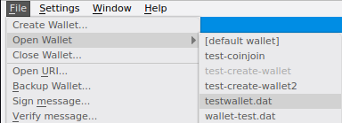

   Open wallet

Select the active wallet
------------------------

When multiple wallets are open, a wallet selection dropbox is shown to the left
of the Dash logo on the tab bar. Click the dropdown box and select a wallet to
set it as the active wallet.

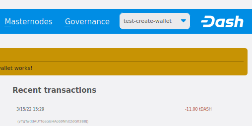

   Wallet selection dropdown box

Close a wallet
--------------

To close a wallet, set it as the active wallet using the wallet selection
dropdown box. Next, click **File -> Close Wallet...** and then click **Yes** on the
Close wallet confirmation screen.

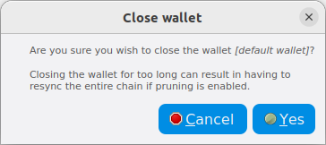

   Close wallet confirmation

.. note::

  If the only open wallet is closed, wallet-related items on the tab bar will be disabled.

Close all wallets
-----------------

To close all wallets, click **File -> Close All Wallets...** and then click **Yes** on the
Close all wallets confirmation screen.

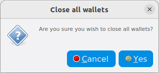

   Close wallet confirmation

Once all wallets are closed, wallet-related items on the tab bar will be disabled.

Alternative methods
-------------------

It is also possible to select between different Dash wallets when starting
Dash Core by specifying the ``wallet`` argument, or even run multiple
instances of Dash Core simultaneously by specifying separate data
directories using the ``datadir`` argument.

To begin, install the Dash Core wallet for your system according to the
:ref:`installation instructions <dashcore-installation>`. When you get
to the step **Running Dash Core for the first time**, you can decide
whether you want to maintain separate ``wallet.dat`` files in the
default location (simpler if you do not need to run the wallets
simultaneously), or specify entirely separate data directories such as
e.g. ``C:\Dash1`` (simpler if you do want to run the wallets
simultaneously).

Separate wallet.dat files
~~~~~~~~~~~~~~~~~~~~~~~~~

For this scenario, we will create two shortcuts on the desktop, each
using a different wallet file. Navigate to the binary file used to start
Dash Core (typically locatd at ``C:\Program Files\DashCore\dash-qt.exe``
or similar) and create two shortcuts on the desktop. Then open the
**Properties** window for each of these shortcuts.

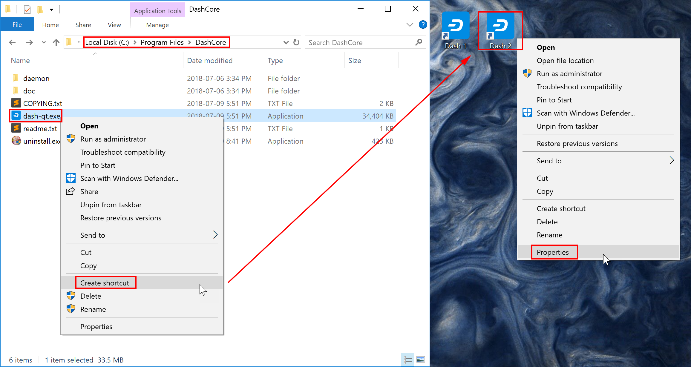

   Creating desktop shortcuts using Windows 10

Modify the **Target** property of each shortcut to point to a different
wallet file by specifying the ``wallet`` argument when starting the
wallet. If you do not specify a ``wallet`` argument, ``wallet.dat`` will
be used by default. The specified wallet file will be created if it does
not exist. The following example demonstrates two wallets named
``workwallet.dat`` and ``homewallet.dat``:

- Wallet Target 1: ``"C:\Program Files\DashCore\dash-qt.exe" -wallet=workwallet.dat``
- Wallet Target 2: ``"C:\Program Files\DashCore\dash-qt.exe" -wallet=homewallet.dat``

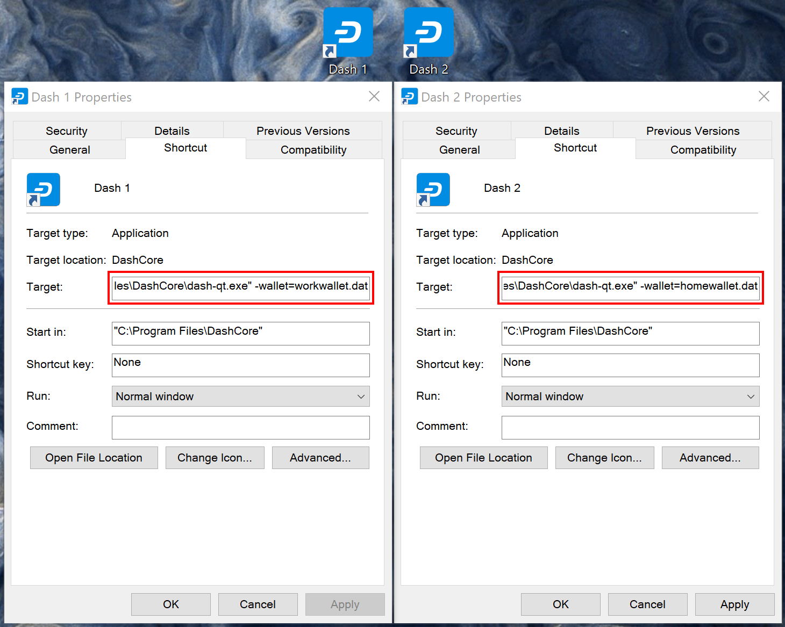

   Specifying separate wallet files

You can now use the two icons to quickly and easily open different
wallets from your desktop. Note that you cannot open both wallets
simultaneously. To do this, you will need two separate data directories,
as described below.

Separate data directories
~~~~~~~~~~~~~~~~~~~~~~~~~

Start Dash Core and allow it to synchronize with the network, then close
Dash Core again. You can now create two directories at e.g. ``C:\Dash1``
and ``C:\Dash2`` and copy the ``blocks`` and ``chainstate`` directories
from the synchronized data directory into the new directories. Each of
these will serve as a separate data directory, allowing you to run two
instances of Dash Core simultaneously. Create two (or more) shortcuts on
your desktop as described above, then specify arguments for ``datadir``
as shown below:

- Datadir Target 1: ``"C:\Program Files\DashCore\dash-qt.exe" -datadir=C:\Dash1 -listen=0``
- Datadir Target 2: ``"C:\Program Files\DashCore\dash-qt.exe" -datadir=C:\Dash2 -listen=0``

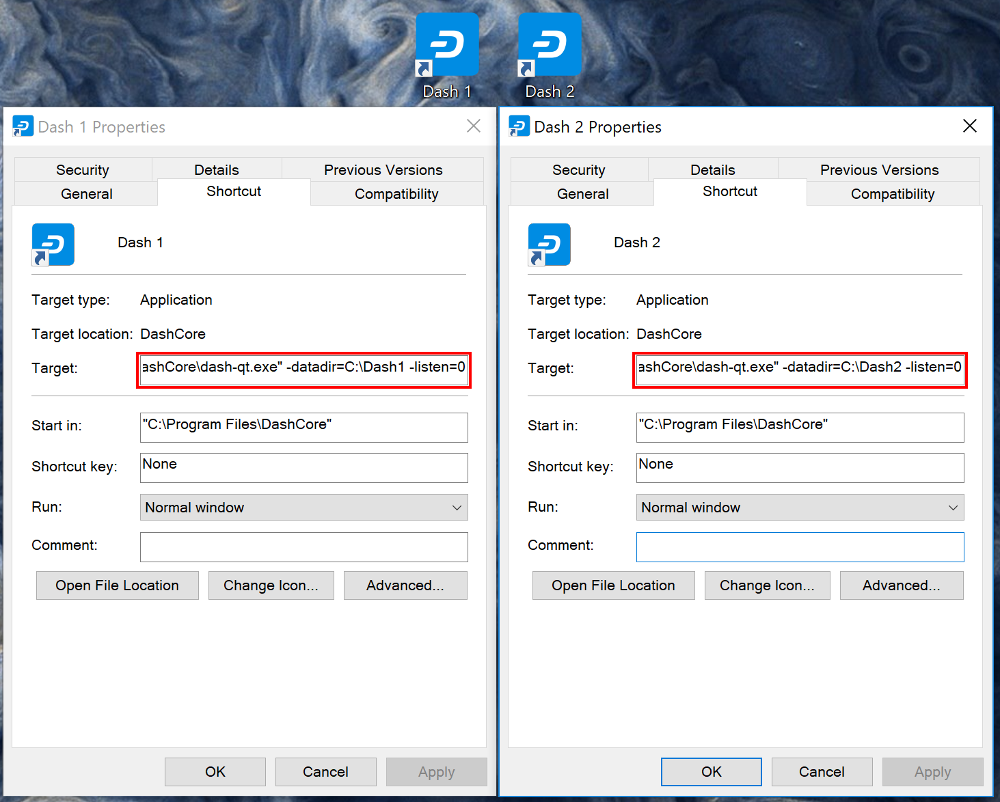

   Specifying separate datadirs

You can now use the two icons to quickly and easily open different
wallets simultaneously from your desktop. Both wallets maintain separate
and full copies of the blockchain, which may use a lot of drive space.
For more efficient use of drive space, consider using an SPV or "light"
wallet such as :ref:`Dash Electrum <dash-electrum-wallet>` to maintain
multiple separate wallets without keeping a full copy of the blockchain.

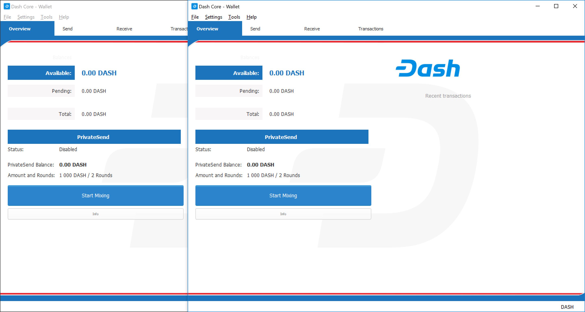

   Two instances of Dash Core running simultaneously

KeePass
=======

.. warning::
  KeePass support was removed in Dash Core 18.0.0. Details can still be
  found in `previous versions of this documentation 
  <https://docs.dash.org/en/0.17.0/wallets/dashcore/advanced.html#keepass>`_.
