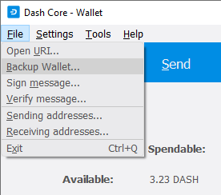
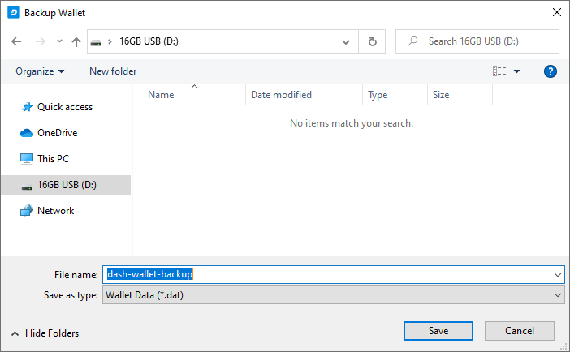
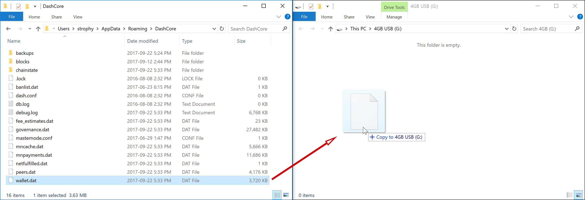
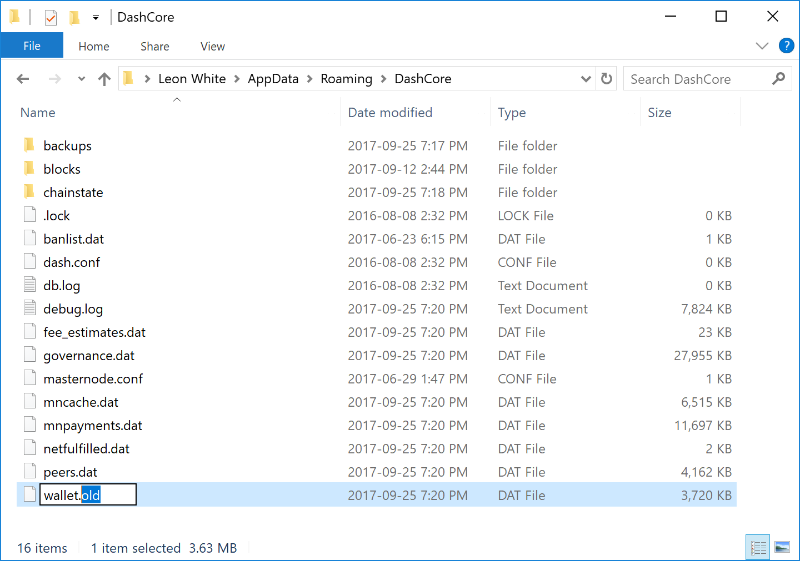
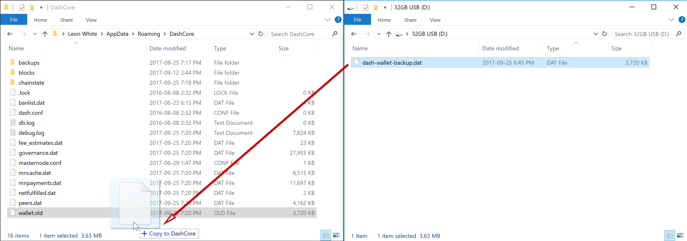
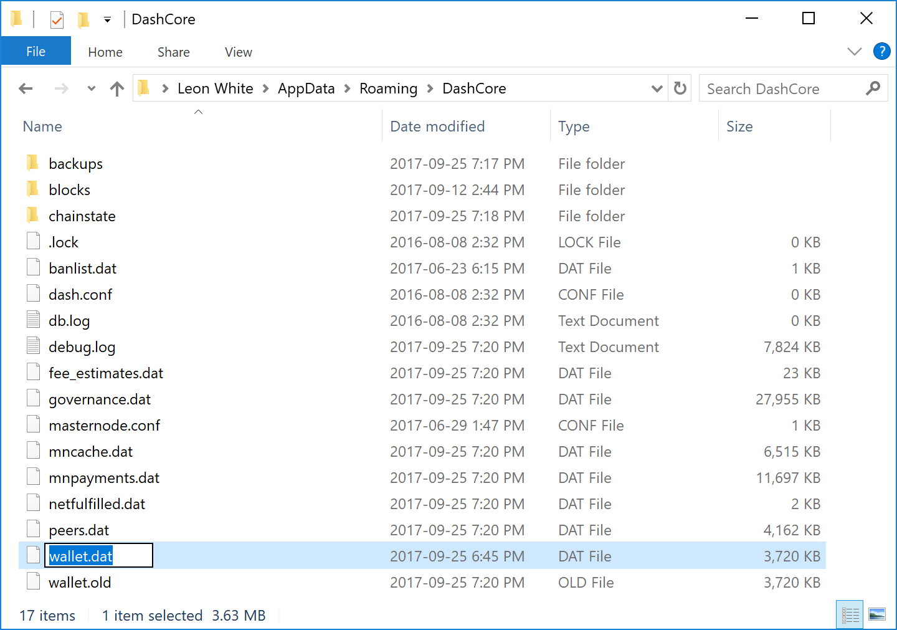

.. meta::
   :description: How to safely back up and restore the Dash Core wallet
   :keywords: dash, core, wallet, backup, restore, wallet.dat

.. _dashcore-backup:

=========================
Wallet backup and restore
=========================

Backup
======

This documentation describes how to safely back up your wallet file for safe
storage in case your computer or laptop is damaged or lost. Dash Core stores all
data necessary to control your Dash addresses in a single file called
*wallet.dat*. This wallet is in the Berkeley DB format and stores the pairs of
private/public cryptographic keys used to manage your balances on the Dash
blockchain. For HD wallets, the mnemonic, passphrase, and seed are also stored
in *wallet.dat*. Dash Core makes most of these operations transparent and even
generates automatic backups of your wallet file in case it is corrupted, but the
user is responsible for ensuring that these backups are stored in a safe place.
**If you lose access to your wallet file, you will permanently lose access to
your Dash.**

It is important to consider that if you have not encrypted your wallet
using the **Settings > Encrypt Wallet** menu item, anyone with access to
the backed up wallet.dat file will immediately have full access to your
Dash. If you do choose to encrypt your wallet, do not store the password
in the same place as the wallet.dat file, particularly if you are saving
the backup to the cloud.

Backup from Dash Core
---------------------

Firstly, never copy your wallet.dat file while Dash Core is open. Always
use the **File > Backup Wallet** menu if the wallet is open. When you
select this menu item, a dialog box will appear to specify where the
file should be saved. Enter a name for the file, select a location and
click **Save**. The example below shows saving the file to a USB stick.
Keep this file in a physically separate location to your computer.

   Backing up the Dash Core wallet from the File menu

Backup by copying wallet.dat
----------------------------

**If Dash Core is not running**, you can also backup your wallet by
simply copying the *wallet.dat* file to another location. This file is
located in the *DashCore* data folder. You were given the option to
specify the location of this folder during installation, but by default
the folder is in the following locations on different operating systems:

- **Windows**

  ::
  
    C:\Users\YourUserName\Appdata\Roaming\DashCore
  
  You can access this folder directly by **Windows Key + R** and typing
  ``%APPDATA%\DashCore``

- **Linux**
  
  ::

    /home/YourUserName/.dashcore

  You can access this folder directly by typing ``cd ~/.dashcore`` at
  the terminal or ``~/.dashcore`` in the path bar using the **Go > Enter
  Location...** menu item in Files

- **macOS**

  ::

    /Users/YourUserName/Library/Application Support/DashCore
  
  You can access this folder by typing ``cd ~/Library/Application
  Support/DashCore`` at the terminal or ``~/Library/Application
  Support/DashCore`` in dialog at the **Go > Go To Folder** menu item in
  Finder

Ensure Dash Core is not running, then simply copy the *wallet.dat* file
from this folder to another folder in the normal way for your operating
system. The example below shows copying the file to a USB stick using
simple drag and drop while holding down **Ctrl** on a Windows system. On
most operating systems, you can also right click on the file and select
**Copy**, then select **Paste** in the target folder. Keep this file in
a physically separate location to your computer. Be careful to copy (not
move) the file!

   Backing up wallet.dat by copying to another folder

Automatic backups
-----------------

Every time you open Dash Core, it will automatically create a backup
copy of *wallet.dat* in the *dashcore/backups* folder. Up to 10
backups can be kept here by default, and the oldest backup will be
deleted as each additional new backup is created. You can modify the
number of backups kept here using the ``-createwalletbackups=n``
parameter at the command line or in *dash.conf*. Setting this value to 0
completely disables backups.

You can view the automatic backups folder by browsing to *DashCore*
folder at the location specified above for *wallet.dat* and opening the
backups folder, or by selecting **File > Show Automatic Backups** from
the menu in Dash Core. Since these files are not active when Dash Core
is running, you can safely copy them at any time. They are also a handy
backup if the original files in the DashCore folder become corrupted due
to improper shutdown of the Dash Core app.

HD wallet information
---------------------

Dash Core includes an implementation of BIP39/BIP44 compatible hierarchical
deterministic (HD) key generation. HD wallets are created by default since Dash
Core v20.1; however, it is still possible to import private keys into the
wallet. Since imported keys are not associated with the HD-derived keys, **it is
still critical to back up wallet.dat for HD wallets.**

If the HD wallet mnemonic from Dash Core is imported into another HD-compatible
wallet, the new wallet will have access to any funds associated with the
HD-derived keys.

Restore
=======

To restore a backup, install Dash Core on the target system (or stop it,
if already installed) and rename the existing *wallet.dat* file in the
*DashCore* folder.

   Renaming the old wallet.dat file to wallet.old in the DashCore folder

Then copy the backup wallet file to the *DashCore* folder and ensure it
is named *wallet.dat*. Now, when you start Dash Core again, it will load
the new wallet. Do not replace *wallet.dat* while Dash Core is running,
since this will result in data corruption!

   Copying the backup file into the DashCore folder and renaming it to
   wallet.dat

Backup storage considerations
=============================

Any backup depends to some extent on the existence of software capable
of reading the data at some future point in time. As such, it is good
practice to store a copy of the software used to create the backup
together with the backup file itself. In this case, this would be a copy
of the version of Dash Core you used to create the backup.

The *wallet.dat* file itself should be encrypted using a password set
from the **Settings > Encrypt Wallet** menu item. However, this only
prevents someone with access to the file from creating transactions, not
from opening the file. You could additionally store the file in another
encrypted container, such as a USB stick using `BitLocker <https://docs.microsoft.com/en-us/windows/security/information-protection/bitlocker/bitlocker-to-go-faq>`_ 
in Windows, `LUKS <https://help.ubuntu.com/community/EncryptedFilesystemsOnRemovableStorage>`_ 
in Linux or `FileVault <https://support.apple.com/en-us/HT204837>`_ on
macOS. It is also possible to create `disk images <https://support.apple.com/guide/disk-utility/create-a-disk-image-dskutl11888/mac>`_ 
or `zip files <https://www.howtogeek.com/203590/how-to-create-secure-encrypted-zip-or-7z-archives-on-any-operating-system/>`_ 
with password encryption - the choice is yours. For further reading on
encrypted containers, see `here <https://theintercept.com/2015/04/27/encrypting-laptop-like-mean/>`_.

Where you store this file is then up to you. It could be in your home,
in a safe deposit box at a bank, a waterproof or fireproof container, or
on cloud storage such as Google Drive, Dropbox or iCloud. Consider where
you will store any passwords needed to restore access to the wallet (in
your head, on paper, in a password manager, etc.) and who may need
access to the password in the future.

Finally it is important to understand that *wallet.dat* itself is a
relatively dangerous way to store large amounts of funds - it is simply
a database file storing private keys. While the convenience of storing a
wallet file directly is fine for smaller holdings, it is more secure to
to store large amounts of Dash on a single predefined address in a way
that you are guaranteed access through any software supporting the
protocol, rather than a specific implementation of that protocol. If you
are interested in this, read more about paper wallets, where the private
key can be printed directly or also encrypted using BIP38 for safe
storage.

Verifying backups
=================

There is no fixed procedure to verify your backup, but you should test
restoring it at least once to make sure it works. If you have a simple
copy of the file, try to restore it to your current *DashCore* folder
and start Dash Core to make sure it opens without any errors. If you
decided to store the file in an encrypted zip file, make sure you can
unzip it and that it opens correctly in Dash Core. In short, make sure
that you (or the person you are trusting to eventually go through this
process for you) can actually reverse your backup process to get access
to your Dash, instead of relying on the fact that this process should
theoretically be reversible.
