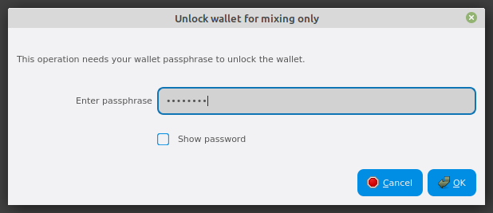
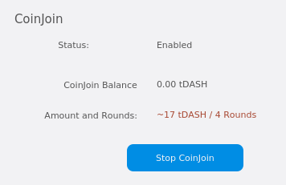
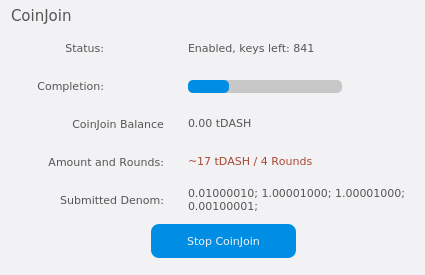
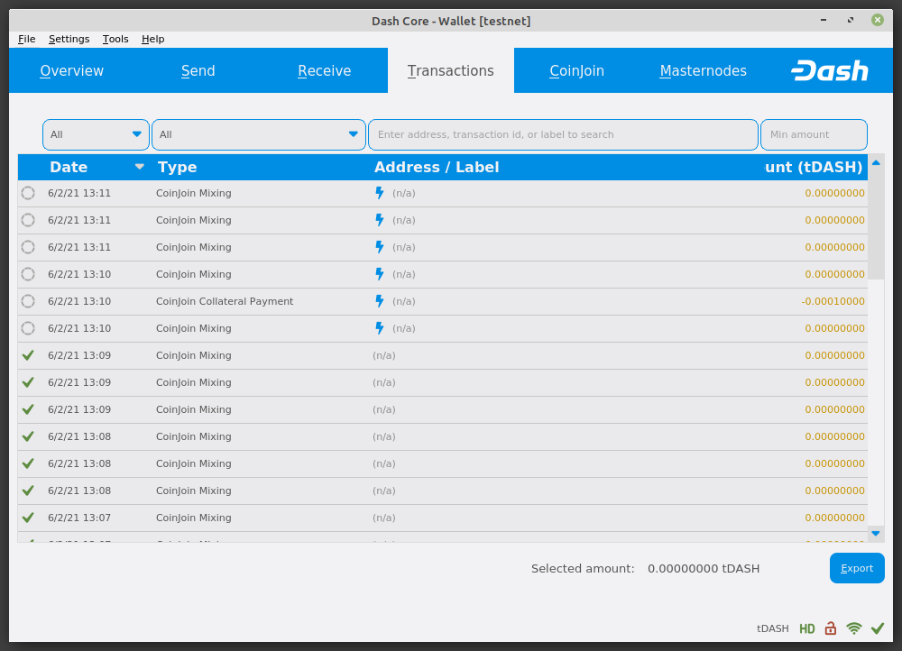
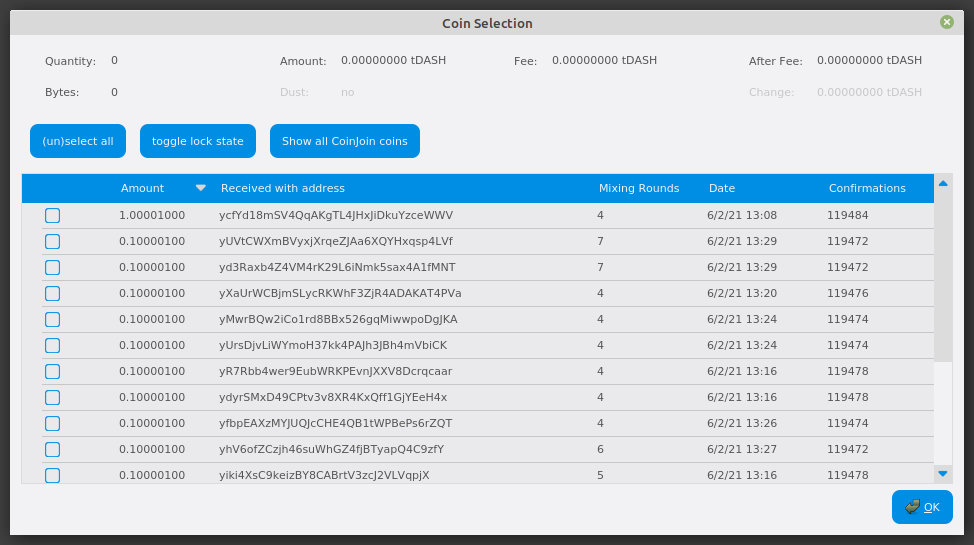
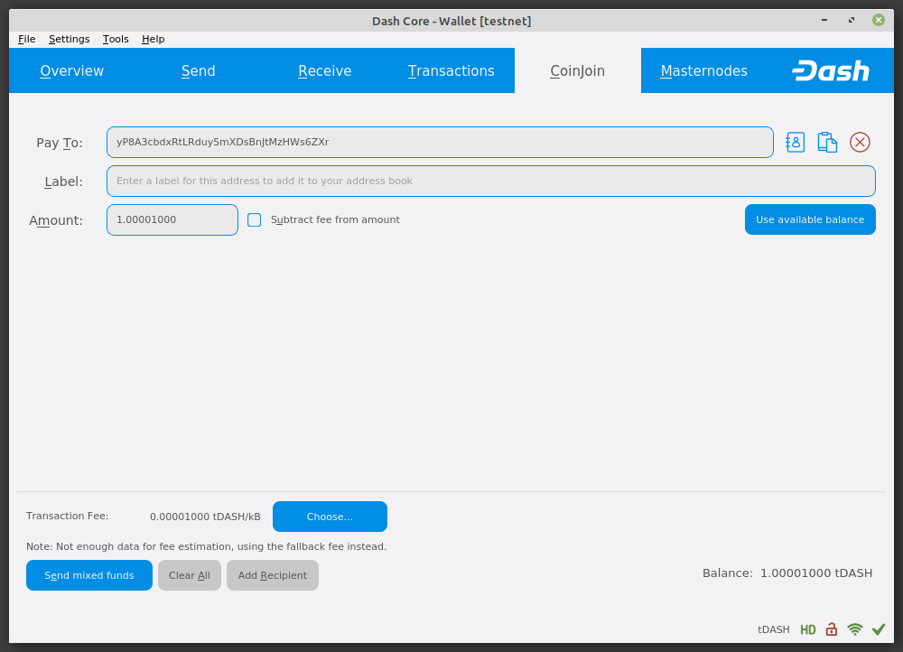

.. meta::
   :description: Using InstantSend and CoinJoin with Dash
   :keywords: dash, core, mobile, wallet, coinjoin, privatesend, instantsend

.. _dashcore-coinjoin-instantsend:

========================
CoinJoin and InstantSend
========================

CoinJoin
========

This documentation describes how to use the CoinJoin feature to
create CoinJoin transactions with your Dash for consumer grade privacy.

Background
----------

CoinJoin is a trustless (i.e. non-custodial) method of running a
sequence of transactions such that an observer has
difficulty tracing transaction history. The current implementation of
CoinJoin in the Dash Core wallet allows any amount of Dash to be
processed. CoinJoin is also available in the :ref:`Dash Electrum
<dash-electrum-wallet>` wallet.

Knowledge of the exact number of rounds of CoinJoin has a
quantifiable effect on the confidence an adversary may have when
attempting to guess transaction history. For this reason, the
recommended (and default) number of rounds of CoinJoin is set to
four, and some inputs may pass through additional rounds to further
improve privacy.

You can read more about CoinJoin theory and processes :ref:`here
<coinjoin>`.

Configuration
-------------

1. Open your Dash Core wallet, go to **Settings** and select
   **Options**. Go to the **CoinJoin** tab.

   .. image:: img/options-coinjoin.png
      :width: 300px

2. Next to **Mixing rounds**, enter a value between 2-16.
   Each round of CoinJoin performs one CoinJoin transaction, known as
   a denomination. Higher numbers of rounds increase your overall level
   of privacy while decreasing the chance of detection via node
   collusion. 16 is the highest number of rounds currently available.

   NOTE: To prevent system abuse, an average of one in ten rounds
   incurs a fee of .0001 DASH.

3. Enter a **Target balance**. This value provides a lower
   boundary on the final amount of funds to be processed. Depending on
   how the client splits your wallet balance, you may end up with
   denominated inputs whose sum total is slightly greater than the
   target amount.

4. Click **OK** to save settings.

5. CoinJoin is disabled by default when you open the wallet. It will
   only start after you set the number of rounds and number of Dash to
   process under settings and click **Start CoinJoin** on the **Overview**
   tab of your wallet.

Several advanced options are also available on this screen for users that
require more control: 

* **Inputs per denomination** values allow limiting how many inputs are created. This can be helpful if you end up with too many small denominations.
* **Parallel sessions** sets how many separate masternodes should be used in parallel if multi-session mixing is enabled.

Starting CoinJoin
-----------------

The CoinJoin process is initiated by clicking the **Start CoinJoin**
button on the **Overview** tab of the Dash Core wallet. CoinJoin is
possible once the following conditions have been met:

- The wallet contains sufficient non-denominated funds to create the minimum
  required denominated values.
- The user has not disabled CoinJoin in the Options dialog.
- The target value for processed funds in the Options dialog is greater
  than zero.

If your wallet is encrypted (highly recommended), you will be asked to
enter your wallet passphrase. Enable the **Only for mixing via
CoinJoin** checkbox to unlock the wallet for CoinJoin only.

   Entering a password for CoinJoin processing only

This will unlock your wallet, and the CoinJoin process will begin.
The wallet will remain unlocked until CoinJoin processing is
complete, at which point it will be locked automatically.

   CoinJoin interface after clicking the **Start CoinJoin** button.
   Note the **Status** is **Enabled**.

CoinJoin will begin creating transactions and your CoinJoin
balance will gradually increase. This process can take some time, so be
patient. You can monitor the process in more detail as described in the
following section.

Any of the following actions will interrupt the process. Because the
transactions are atomic (they either take place completely, or do not
take place at all), it is possible to safely interrupt CoinJoin at
any time.

- Clicking the **Stop CoinJoin** button on the Overview tab
- Closing the client before CoinJoin is completed
- Sending CoinJoin funds from the wallet before CoinJoin rounds
  are completed
- Disabling CoinJoin before the process is complete

Monitoring CoinJoin
-------------------

If you want to monitor CoinJoin in more detail, you need to enable
some advanced features of the wallet. Go to **Settings**, select
**Options** and go to the **Wallet** tab. Check the **Enable advanced
interface** checkbox. This will allow you to monitor
progress and see which individual operations CoinJoin is carrying out
in the background.

   Monitoring CoinJoin progress

Since CoinJoin creates a lot of new address keys to send and receive the denominations, you may
receive a warning when the number of remaining keys runs low. This is nothing to be worried about,
since the wallet will simply create more keys as necessary. However, for non-HD wallets these keys
will not exist in any previous backups of your wallet. For this reason, it is important to backup
your wallet again after the process is complete if using a non-HD wallet. When using an HD wallet,
all keys will be derived from the wallet mnemonic so extra backups during CoinJoin are not
necessary. You can check the status bar for the "HD" icon to determine if you are using an HD wallet
or not.

You can also monitor CoinJoin progress by viewing the transactions
created by the process on the **Transactions** tab.

   Transactions created by CoinJoin on the Transactions tab

The following table describes the CoinJoin-related transactions displayed in
the Type column of the **Transactions** tab:

+------------------------------------+--------------------------------------------+
| Transaction Type                   | Transaction Description                    |
+====================================+============================================+
| CoinJoin Make Collateral Inputs    | Wallet funds were moved to collateral      |
|                                    | inputs that will be used to make           |
|                                    | collateral payments. This is done to       |
|                                    | minimize traceability of collaterals.      |
+------------------------------------+--------------------------------------------+
| CoinJoin Create Denominations      | Wallet funds were broken into              |
|                                    | CoinJoin denominations (Step 1             |
|                                    | :ref:`here <coinjoin>`)                    |
+------------------------------------+--------------------------------------------+
| CoinJoin Mixing                    | A transaction was sent to a masternode     |
|                                    | in order to participate in a CoinJoin      |
|                                    | session (Step 3 :ref:`here <coinjoin>`)    |
+------------------------------------+--------------------------------------------+
| CoinJoin Collateral Payment        | The CoinJoin session collateral was        |
|                                    | claimed. This fee is charged in ~10%       |
|                                    | of sessions to prevent spam attacks.       |
+------------------------------------+--------------------------------------------+
| CoinJoin Send                      | Denominated funds were used to send a      |
|                                    | payment to someone. Note: Unlike the       |
|                                    | previous 4 transaction types, this is not  |
|                                    | a CoinJoin transaction.                    |
+------------------------------------+--------------------------------------------+

You can also use the coin control feature to view which addresses hold
denominations ready to be used for CoinJoin transactions. Go to the
**Send** tab of your wallet and click **Inputs** to view the possible
input addresses for your transactions. You can see how each address
holds given denominations of Dash, and how many rounds have been
completed. This is to ensure that an efficient combination of addresses
can be used as inputs in CoinJoin transactions without too much
change, since an amount in a CoinJoin transaction must be rounded up
to completely spend all inputs. The current minimum balance for an input
used in a CoinJoin transaction is 0.00100010 DASH.

   Coin Selection dialog showing addresses holding CoinJoin balances
   in different denominations

Paying with CoinJoin
-----------------------

You can only use CoinJoin for payments once you have processed enough
Dash to make up the amount you are trying to send. Because the process
takes time, it must be done in advance before you create the send
transaction. A CoinJoin transaction is effectively the same as any
other transaction on the blockchain, but it draws only from input
addresses where the denomination has previously been processed to ensure
privacy of funds. Because several input addresses are usually required
to make up the amount you are trying to send, a CoinJoin transaction
will usually take up more space (in kilobytes) on the blockchain, and
therefore will be charged a slightly higher fee.

To send a payment using CoinJoin, go to the **CoinJoin** tab of
the Dash Core wallet. The balance displayed is your CoinJoin balance
instead of the total balance as shown on the **Send** tab. You can then
enter the **Pay To** address, **Label**, **Amount** and click
**Send mixed funds**. Your payment will be rounded up to completely spend the
lowest possible denomination of denominated balance available (currently
to the nearest 0.001 DASH). You will be prompted to enter your password
and receive a detailed breakdown of the fee structure for CoinJoin
before sending.

   Dash Core ready to send a CoinJoin transaction. Note use of the
   CoinJoin tab and the amount to be sent is less than the available
   CoinJoin balance

Inputs
------

Like all Dash transactions, CoinJoin transactions are composed of a
number of inputs and one or more outputs. CoinJoin transactions do
not use change addresses, so any remaining Dash will be spent on the
transaction fee.

Due to the probabilistic nature of the CoinJoin process, increasing
the number of inputs in a transaction may marginally reduce privacy. For
this reason, using CoinJoin is not recommended for users requiring a
high level of privacy. While it is not possible to link a CoinJoin
transaction to a single source address with absolute certainty, using
more inputs may make a transaction more vulnerable to different
potential linking attacks. There are a number of `chain analysis
companies <https://www.dash.org/regulatory#kyc>`__ that possess tools
that can provide transaction risk scoring services for transactions on
the Dash blockchain, including CoinJoin transactions.

You can reduce the number of inputs in a CoinJoin transaction by
defining the transaction amount in such a way that it consumes your
available input denominations more efficiently, or by processing more
Dash to ensure enough appropriately denominated inputs are available.
Use the :ref:`Coin Control <coin-control>` function in the CoinJoin
tab to view and select or deselect CoinJoin UTXOs currently available
for use as transaction inputs.

InstantSend
===========

Introduction
------------

This documentation describes how to use InstantSend to instantly send
funds to any other Dash user around the world. Since the release of
InstantSend based on Long Living Masternode Quorums (`LLMQ-IS <https://github.com/dashpay/dips/blob/master/dip-0010.md>`__)
in Dash 0.14, the Dash network itself will attempt to generate an
InstantSend lock for almost every transaction processed by the network,
according to :ref:`these rules <is-broadcast>`. Unlike the prior
implementation of InstantSend, which required a higher fee, LLMQ-IS
locks transactions without any action taken by the user. For this
reason, only the recipient needs to monitor the network for the
transaction lock in order to be able to receive funds and process
transactions with immediate settlement.

Dash InstantSend is supported by many wallets and vendors, including
(but not limited to) the following:

- Dash Core Wallet
- Dash Android Wallet
- Dash iOS Wallet
- My Dash Wallet
- Kraken
- Bitrefill
- and many more...

You can read more about InstantSend theory and processes :ref:`here
<instantsend>`.

InstantSend Transactions
------------------------

Since Dash 0.14, all user-facing interface options to create an
InstantSend transaction have been removed, because all transactions are
effectively InstantSend transactions. As before, the recipient is
responsible for monitoring the network for the InstantSend lock and
implementing user-facing logic and interfaces to continue with
transaction processing after payment has been recieved. See the
:ref:`InstantSend Integration <integration-instantsend>` documentation
for more information on how to monitor for InstantSend locks.
