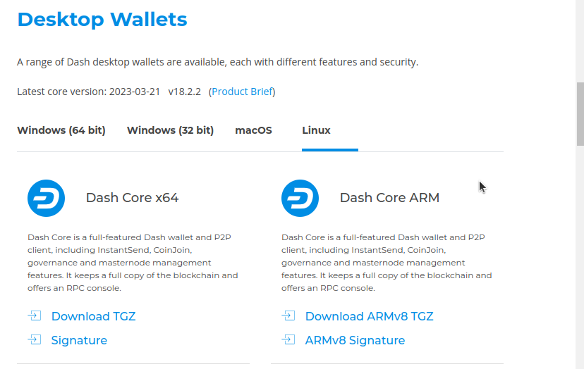
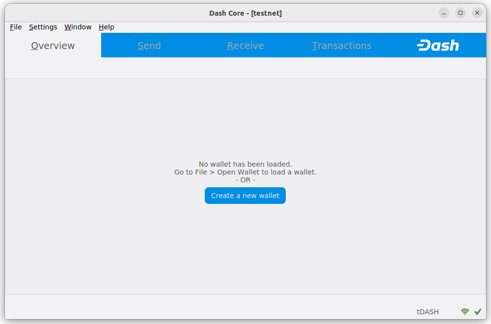

.. meta::
   :description: How to download, install and encrypt the Dash Core wallet in Linux
   :keywords: dash, core, wallet, linux, ubuntu, installation

.. _dashcore-installation-linux:

Linux Installation Guide
========================

This guide describes how to download, verify, install and encrypt the
Dash Core wallet for Linux. The guide is written for Ubuntu 20.04 LTS,
but the steps should be similar for other Linux distributions.

Downloading the Dash Core wallet
--------------------------------

Visit https://www.dash.org/downloads/ to download the latest Dash Core
wallet. In most cases, the website will properly detect which version
you need. Click the Dash Core button to download the package
directly.

   The website properly detects the wallet appropriate for your system

If detection does not work, you will need to manually choose your operating
system and whether you need an `x64 <https://en.wikipedia.org/wiki/X86-64>`__
(64 bit x86) or ARM version. If you are unsure about your version of Linux, you
can check in Ubuntu using the Terminal::

   uname -m

If the response is ``x86_64``, download **Dash Core x64**. If the response is
``aarch64``, download **Dash Core ARM**. Once you know which version you need,
download the Dash Core TGZ file to your computer from
https://www.dash.org/downloads/ and save it to your Downloads folder.

.. note::
   Since Dash Core 18.0, downloads are not available for 32-bit Linux installations.

Verifying Dash Core
-------------------

This step is optional, but recommended to verify the authenticity of the
file you downloaded. This is done by checking its detached signature 
against the public key published by the Dash Core development team. 
To download the detached signature, click the **Signature** button on the 
wallet download page and save it to the same folder as the downloaded
binary.

All releases of Dash since 0.16.0 are signed using GPG with the following key:

- Pasta (pasta) with the key ``5252 7BED ABE8 7984``, `verifiable on Keybase
  <https://keybase.io/pasta>`__ (`download <https://keybase.io/pasta/pgp_keys.asc>`__)

Open a terminal, import the key and verify the authenticity of your
download as follows::

  curl https://keybase.io/pasta/pgp_keys.asc | gpg --import
  gpg --verify dashcore-20.1.1-x86_64-linux-gnu.tar.gz.asc

   Downloading the PGP key and verifying the signed binary

If you see the message ``Good signature from ...`` then you have an
authentic copy of Dash Core for Linux.

.. note::
   
   If you have your own key configured, you can eliminate warnings from the
   verification output by signing the imported key before verifying::
   
      gpg --quick-lsign-key "29590362EC878A81FD3C202B52527BEDABE87984"
      gpg --verify dashcore-20.1.1-x86_64-linux-gnu.tar.gz.asc

Extracting Dash Core
----------------------

Dash Core for Linux is distributed as a compressed archive and not an
installer. This is because this same archive also contains other files
built for running a masternode on a server, for example. In this guide,
we will extract the executable file with a graphical user interface
(GUI) designed for use by end users as a wallet.

Extract Dash Core as follows::

  tar xzf dashcore-20.1.1-x86_64-linux-gnu.tar.gz

This will create a folder named ``dashcore-20.1.1`` in the current working
directory. We will now install the executable binaries to
``/usr/local/bin`` using the ``install`` command::

  sudo install -m 0755 -o root -g root -t /usr/local/bin dashcore-20.1.1/bin/*

Start Dash Core from the terminal with the following command::
  
  dash-qt

The first time the program is launched, you will be offered a choice of
where you want to store your blockchain and wallet data. Choose a
location with enough free space, as the blockchain can reach 45GB+ in
size. It is recommended to use the default data folder if possible.

   Choosing the Dash Core data folder

Dash Core will then start up. This will take a little longer than usual
the first time you run it, since Dash Core needs to generate
cryptographic data to secure your wallet.

   Starting Dash Core

Synchronizing Dash Core to the Dash network
-------------------------------------------

Once Dash Core is successfully installed and started, you will see the
wallet overview screen. You will notice that the wallet is “out of
sync”, and the status bar at the bottom of the window will show the
synchronization progress.

   Dash Core begins synchronizing with the Dash network

During this process, Dash Core will download a full copy of the Dash
blockchain from other nodes to your device. Depending on your internet
connection, this may take a long time. If you see the message “No block
source available”, check your internet connection. When synchronization
is complete, you will see a small green tick in the lower right corner.

   Dash Core synchronization is complete

You can now :ref:`create a wallet <dashcore-wallet-create>` to send and receive
funds.

Setting up a desktop entry
--------------------------

You can set up an `XDG Desktop Entry
<https://specifications.freedesktop.org/desktop-entry-spec/desktop-entry-spec-latest.html>`__
in order to be able to launch Dash Core from your KDE or Gnome desktop
environment. To do so, create a file named
``~/.local/share/applications/dash.desktop`` and add the following
content::

  [Desktop Entry]
  Version=1.5
  Name=Dash Core
  Comment=Dash Core is used to interact with the Dash blockchain
  Exec=/usr/local/bin/dash-qt
  Icon=dash-icon
  Terminal=false
  Type=Application

Ensure the file is executable::

  chmod +x ~/.local/share/applications/dash.desktop

An appropriate icon can optionally be downloaded from the Dash `Brand
Guidelines <https://www.dash.org/brand-guidelines/>`__ page::

  wget https://media.dash.org/wp-content/uploads/dash-d-rounded-square-250.png
  xdg-icon-resource install --size 256 dash-d-rounded-square-250.png dash-icon

.. _dashcore-wallet-create:

Creating your Dash Wallet
-------------------------

.. versionadded:: v20.1.0
   
   HD wallets are now created by default.

If no wallet files are loaded, you will get this prompt in the Overview tab. To
create a wallet, click the **Create a new wallet** button or click **File** ->
**Create Wallet**. HD wallets are created by default. See the
:hoverxref:`advanced topics section <dashcore-hd>` for information about HD
wallets.

You will be prompted to create a new wallet with a custom wallet name. By
default, your wallet will be encrypted. You may choose to uncheck the box and
encrypt the wallet later. We have included instructions on how to encrypt your
wallet in the following section.

If you do choose to encrypt now, you will be asked to enter and verify a password.

   Enter a password

Following that, you will get a standard warning.

   Confirm you want to encrypt your wallet

The following section will detail the steps you need to follow if you 
choose to encrypt your Dash wallet later.

.. _dashcore-wallet-encrypt:

Encrypting your Dash wallet
---------------------------

To encrypt your wallet, click **Settings** > **Encrypt wallet**.

   Encrypting the Dash wallet with a password

You will be asked to enter and verify a password.

   Entering a password

   Confirm you want to encrypt your wallet

When the encryption process is complete, you will see a warning that
past backups of your wallet will no longer be usable, and be asked to
shut down Dash Core. When you restart Dash Core, you will see a small
green lock in the lower right corner.

   Fully encrypted and synchronized Dash Core wallet
