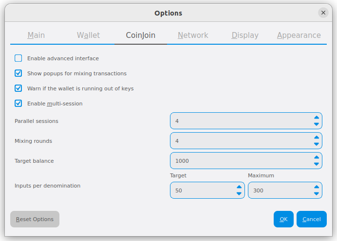

.. meta::
   :description: Description of dialogs and interfaces in the Dash Core wallet
   :keywords: dash, core, wallet, interface, dialog, synchronisation, tools options

.. _dashcore-interface:

=========
Interface
=========

The Dash Core Wallet is an application that runs on your computer and
allows you to make transactions on the Dash network. Most transactions
are for sending or receiving Dash, but it is also possible to create
signed messages or control a masternode, for example. The Dash Core Wallet
interface is described in detail in the following sections.

The Main Window
===============

   The Dash Core Wallet

The Dash Core window is broken up into several areas:

-  The menu bar
-  The tab bar
-  The main area
-  The status bar

The Menu Bar
------------

The menu bar provides access to all functions of Dash Core. There are
four menus available:

File
  The File menu is used to manage your wallet and messages.
Settings
  The Settings menu provides access to wallet encryption options and
  general software settings.
Window
  The Window menu provides access to your wallet addresses, information on the
  network and other advanced functions.
Help
  The Help menu links to documentation, guides and legal statements
  relating to Dash Core.
   
The Tab Bar
-----------

The tab bar is used to quickly switch between the main areas of the Dash
Core. The content in the main area of Dash Core changes depending on
which tab you have selected. The following tabs are available:

The Overview tab
~~~~~~~~~~~~~~~~

The overview tab offers quick access to your balance and most recent
transactions, as well as the CoinJoin feature.

   The Overview tab

The left part of the main area is divided into two areas. The upper area
shows your balances, which may be divided into **Spendable** and
**Watch-only** balances if you have loaded watch addresses:

Available
  This shows your current liquid balance. This is the amount of Dash
  you can spend now.

Pending
  This shows funds waiting for a transaction to complete.

Immature
  This shows funds from masternode or mining payments which have not
  yet reached the required number of confirmations.
   
Total
  This is simply your available and pending funds added together.

The lower area shows the CoinJoin status and allows you to process
your funds using CoinJoin on the Dash masternode network.

The right part of the screen shows your recent transactions. Recent
incoming transactions appear green, prefixed by a + sign. Recent
outgoing transactions appear red, prefixed by a - sign. For more details
on your transaction history, see the **Transactions** tab.

**Discreet mode**

.. versionadded:: v20.1.0

  Discreet mode enables hiding value and transaction information on the Overview
  tab.

To toggle discreet mode off and on, click **Settings > Discreet mode**. With
discreet mode enabled, your Overview tab will appear as shown below.

   The Overview tab with discreet mode enabled

The Send Tab
~~~~~~~~~~~~

The Send tab allows you to send funds to another address on the Dash
network. It contains fields to enter the recipient’s address, a label
for the address, and the amount of Dash you wish to send. Options
related to the transaction fee are also available. A quick view of your
total balance is also available in the lower right corner.

.. figure:: img/send.png

   The Send tab

The Receive Tab
~~~~~~~~~~~~~~~

The Receive tab allows you to create addresses to receive Dash. You can
create a request for a specific amount of Dash or include a specific
message, and send it to another user as a link or QR code.

.. figure:: img/receive.png

   The Receive tab

The Transactions Tab
~~~~~~~~~~~~~~~~~~~~

The Transactions tab shows the entire transaction history for all
addresses associated with your wallet. This appears as a table showing
the time, type, label and amount of Dash for each transaction. You can
also export the transaction history as a CSV file by clicking the Export
button in the bottom right corner of the window.

The icons in the leftmost column indicate the status of the transaction.
A tick indicates that the recommended number of confirmations has been
passed, while a circular progress indicator indicates the number of
confirmations. A lightning bolt indicates a transaction with an existing
InstantSend lock.

   The Transactions tab

The CoinJoin Tab
~~~~~~~~~~~~~~~~

The CoinJoin tab allows you to send funds to another address on the
Dash network with enhanced privacy. It contains fields to enter the
recipient’s address, a label for the address, and the amount of Dash you
wish to send. Options related to the transaction fee are also available.
A quick view of your total CoinJoin balance is also available in the
lower right corner.

   The CoinJoin tab

The Masternodes Tab
~~~~~~~~~~~~~~~~~~~

The Masternodes tab shows an overview of the masternodes currently
registered on the Dash network. You can filter the data by entering a
value in the Filter List field, or display only masternodes with owner
keys stored in the loaded wallet.

   The Masternodes tab

The Governance Tab
~~~~~~~~~~~~~~~~~~

The Governance tab shows an overview of the governance proposals currently
active on the Dash network. You can filter the data by entering a
value in the Filter List field.

   The Governance tab

The Status Bar
--------------

The status bar shows a synchronization progress bar and a row of status
icons which indicate the status of your connection to the Dash network.

The Synchronization Bar
~~~~~~~~~~~~~~~~~~~~~~~

This bar shows the synchronization status of Dash Core with the Dash
network. Each time you open Dash Core, it will begin downloading the
blocks which have been created on the blockchain in the time since you
last opened the app. These blocks are downloaded from other Dash users
and masternodes. If you have never opened the app before, this could
mean several years’ worth of blocks need downloading. The following
statuses are possible:

No block source available
  This occurs if your internet connection is down, or if the ports
  required by Dash Core are blocked by a firewall.
Synchronizing with network
  Dash Core is downloading blocks from the network.
Synchronizing governance objects
  Dash Core is synchronizing P2P governance data.

Once synchronization is complete, the progress bar will disappear and a
tick will appear on the right of the status bar.

The Status Icons
~~~~~~~~~~~~~~~~

This icon appears when your wallet is running in hierarchical
deterministic (HD) mode. See :ref:`here <dashcore-hd>` for documentation
on HD mode.

..  image:: img/locks.png
   :scale: 50 %
   :align: left

The lock icons indicate the status of your wallet: either
locked or unlocked. You need to unlock your wallet to send funds or
perform certain other actions.

These icons indicate the quality of your connection to the Dash network.
If you cannot connect because of network problems, you will see only
gray bars. More bars indicate more connections to your peers on the
network.

These icons show the synchronization status of Dash Core with the
network. Once synchronization is complete, the icon will become a green
tick.

The Options Dialog
==================

This documentation describes the functionality of the Dash Core Options
dialog, available under the **Settings > Options** menu in Dash Core.

Main tab
--------

The Main tab of the Options dialog contains settings related to startup
and performance of the Dash Core app.

   The Main tab of the Dash Core Options dialog

Start Dash Core on system login
  This option causes Dash Core to start automatically when the current
  user logs in. On most computers there is only one main user account
  which is logged in automatically when the computer turns on, so this
  option is effectively the same as starting Dash Core together with the
  operating system.

Hide tray icon
  When this option is enabled, Dash Core will not display an icon in the
  system tray. This option cannot be selected at the same time as
  **Minimize to the tray instead of the taskbar**.

Minimize to the tray instead of the taskbar
  When this option is enabled and the Dash Core window is minimized, it
  will no longer appear in your taskbar as a running task. Instead, Dash
  Core will keep running in the background and can be re-opened from the
  Dash icon in the system tray (the area next to your system clock). This
  option cannot be selected at the same time as **Hide tray icon**.

Minimize on close
  When this option is enabled, clicking the X button in the top right
  corner of the window will cause Dash Core to minimize rather than close.
  To completely close the app, select **File > Exit**.

Prune block storage to
  This option enables pruning of blocks and specifies the amount of storage to
  use for block storage. Enabling pruning significantly reduces the disk space
  required to store transactions. All blocks are still fully validated.
  Reverting this setting requires re-downloading the entire blockchain.

Size of database cache
  This option specifies the size of the database cache in memory. A higher
  value will result in increased performance when adding new blocks at the
  cost of higher memory usage. The default value is 300MB and it should
  not be set lower than this level.

Number of script verification threads
  This option sets the number of script verification threads, ranging from
  -4 to 16. `Script verification <https://en.bitcoin.it/wiki/Script>`__ is
  the process of following instructions recorded in the blockchain to
  ensure the transactions are valid. 0 means automatic and will allow
  script verification to scale to the number of cores available on your
  processor. Setting a positive number specifies that Dash Core should use
  that number of processor cores, while setting a negative number will
  leave that number of processor cores free.

Wallet tab
----------

The Wallet tab of the Options dialog contains settings related to how
addresses are managed in the Dash Core app. The first time you run Dash
Core, it will generate a new wallet containing 1000 unique Dash
addresses. This tab allows you to configure how these addresses are used
as inputs with the Coin Control, CoinJoin and Masternode features.

   The Wallet tab of the Dash Core Options dialog

Enable coin control features
  Your Dash Core wallet balance is actually the sum total of all
  addresses holding balance that are associated with your wallet. When
  you spend Dash, Dash Core will withdraw from as many inputs as
  necessary to make up the desired amount of Dash to be transferred.
  This behavior may be undesirable if you want to keep a certain balance
  on one address. Enabling this option will add a button labelled
  **Inputs** on the **Send** tab. This provides access to the **Coin
  Selection** dialog, which can be used to lock, unlock and prioritize
  different addresses in your wallet. See :ref:`here <coin-control>` for
  a more detailed explanation of Coin Control.

Show Masternodes tab
  Enabling this option causes Dash Core to display an additional
  Masternodes tab to the right of the Transactions tab. This option
  requires you to restart the Dash Core app. The Masternodes tab can be
  used to view details of masternodes registered on the Dash blockchain.

Show Governance tab
  Enabling this option causes Dash Core to display an additional Governance tab.
  This option requires you to restart the Dash Core app. The Governance tab can
  be used to view details of governance proposals active on the Dash network.

Spend unconfirmed change
  When this option is enabled, the Dash Core wallet permits you to
  immediately spend change from previous transactions that has been
  transferred internally between addresses associated with the same
  wallet. This is possible even if the transaction has not yet been
  confirmed because the wallet knows it will eventually be confirmed since
  it created the internal transaction itself. Leaving this option enabled
  allows you to create new transactions even if previous transactions have
  not yet been confirmed.

Enable CoinJoin features
  Enabling this option displays the CoinJoin tab in the main Dash
  Core window and the Options dialog, and allows you to process and
  spend your balance using CoinJoin.

CoinJoin tab
------------

The CoinJoin tab contains options relating to how CoinJoin
functions in Dash Core.

   The CoinJoin tab of the Dash Core Options dialog

Enable advanced interface
  Enabling this option changes the interface on the Overview
  tab of the Dash Core wallet to include more information, such as the
  remaining keys, percentage completion and current operation. See
  :ref:`here <dashcore-coinjoin-instantsend>` for a full explanation
  of how to use CoinJoin.

Show popups for mixing transactions
  Enabling this option will display notifications as the CoinJoin
  transactions are created.

Warn if the wallet is running out of keys
  Enabling this option will cause Dash Core to display a warning when
  your original set of 1000 addresses is running out, which may affect
  CoinJoin processing. When 900 addresses are used, your wallet must
  create more addresses. It can only do this if you have automatic
  backups enabled. Consequently, users who have backups disabled will
  also have CoinJoin disabled.

Enable multi-session
  Normally CoinJoin processing is completed in several consecutive
  rounds, each using a single masternode. Enabling this option allows
  multi-session, which means you can use multiple masternode servers at
  the same time, greatly increasing the speed of the CoinJoin process at
  the cost of creating more addresses and thus requiring more frequent
  wallet backups.

Mixing rounds
  Use this option to control the number of rounds of CoinJoin to be
  processed for your chosen balance. Each round of processing uses a new
  masternode. The higher the number of rounds, the more difficult it
  becomes to trace the Dash to its original address. This is at the
  expense of more time required for processing and potentially higher
  fees.

Target balance
  This option allows you to specify how much Dash should be kept on
  balance in a ready-to-use processed state, meaning it has already
  passed through the CoinJoin process. The available amount is shown as
  the balance on the CoinJoin tab.

Network tab
-----------

This tab includes options related to your Dash network connection.

   The Network tab of the Dash Core Options dialog

Map port using UPnP
  This option causes Dash Core to automatically attempt to open and map
  the client port on your router using
  `UPnP <https://en.wikipedia.org/wiki/Universal_Plug_and_Play>`__
  (Universal Plug and Play). This feature is supported by most modern home
  routers and will allow you to connect to the Dash network without making
  any special settings on your router.

Allow incoming connections
  This option causes your client to accept external connections. Since
  Dash is a peer-to-peer network and Dash Core is considered a full client
  because it stores a copy of the blockchain on your device, enabling this
  option helps other clients synchronize the blockchain and network
  through your node.

Connect through SOCKS5 proxy (default proxy)
  These options allow users on an intranet requiring a proxy to reach the
  broader internet to specify the address of their proxy server to relay
  requests to the internet. Contact your system administrator or check out
  the network settings in your web browser if you are unable to connect
  and suspect a proxy may be the source of the problem.

Use separate SOCKS5 proxy to reach peers via Tor hidden services
  These options allow you to specify an additional proxy server designed
  to help you connect to peers on the Tor network. This is an advanced
  option for increased privacy and requires a Tor proxy on your network.
  For more information about Tor, see
  `here <https://www.torproject.org/>`__.

Display tab
-----------

This tab contains options relating to the display of the Dash Core app
window.

   The Display tab of the Dash Core Options dialog

User interface language
  Select your preferred language from this drop-down menu. Changing the
  language requires you to restart the Dash Core app.

Unit to show amounts in
  This allows you to change the default unit of currency in Dash Core from
  DASH to mDASH, µDASH or duffs. Each unit shifts the decimal separator
  three places to the right. Duffs are the smallest unit into which Dash
  may be separated.

Decimal digits
  This option allows you to select how many decimal digits will be
  displayed in the user interface. This does not affect internal
  accounting of your inputs and balance.

Third party transaction URLs
  This option allows you to specify and external website to inspect a
  particular address or transaction on the blockchain. Several blockchain
  explorers are available for this. To use this feature, enter the URL of
  your favorite blockchain explorer, replacing the %s with the transaction
  ID. You will then be able to access this blockchain explorer directly
  from Dash Core using the context menu of any given transaction.   

Appearance tab
--------------

This tab contains options relating to the visual appearance of the Dash
Core app window.

   The Appearance tab of the Dash Core Options dialog

Theme
  You can use this option to select a different theme governing the
  appearance of the Dash Core window. All functionality is identical under
  the different themes.

Font Family
  This option allows you to select a different font to display text in
  the window.

Font Scale and Weight
  These options control the size and weight of fonts in the window.

The Tools Dialog
================

This documentation describes the functionality of the Dash Core Tools
dialog, available under the **Tools** menu in Dash Core.

Information tab
---------------

   The Information tab of the Dash Core Tools dialog

General
  This section displays information on the name and version of the client
  and database, and the location of the current application data
  directory.

Network
  This section displays information and statistics on the network to which
  you are connected.

Block chain
  This section shows the current status of the blockchain.

Memory pool
  This section shows the status of the memory pool, which contains
  transactions that could not yet be written to a block. This includes
  both transactions created since the last block and transactions which
  could not be entered in the last block because it was full.

Open debug log file
  This button opens debug.log from the application data directory. This
  file contains output from Dash Core which may help to diagnose errors.

Console tab
-----------

The Console tab provides an interface with the Dash Core RPC (remote procedure
call) console. This is equivalent to the ``dash-cli`` command on headless
versions of Dash, such as ``dashd`` running on a masternode. Click the red ``×``
icon to clear the console, and see the detailed :ref:`documentation
<core:api-rpc>` on RPC commands to learn about the possible commands you can
issue.

   The Console tab of the Dash Core Tools dialog

Network Traffic tab
-------------------

The Network Traffic tab shows a graph of traffic sent and received to
peers on the network over time. You can adjust the time period using the
slider or **Reset** the graph.

   The Network Traffic tab of the Dash Core Tools dialog

Peers tab
---------

The Peers tab shows a list of other full nodes connected to your Dash
Core client. The IP address, version and ping time are visible.
Selecting a peer shows additional information on the data exchanged with
that peer.

   The Peers tab of the Dash Core Tools dialog

Wallet Repair tab
-----------------

The Wallet Repair tab offers a range of startup commands to restore a
wallet to a functional state. Selecting any of these commands will
restart Dash Core with the specified command-line option.

   The Wallet Repair tab of the Dash Core Tools dialog

Rescan blockchain files 1
  Rescans the already downloaded blockchain for any transactions affecting
  accounts contained in the wallet. This may be necessary if you replace
  your wallet.dat file with a different wallet or a backup - the wallet
  logic will not know about these transactions, so a rescan is necessary
  to determine balances.

Rescan blockchain files 2
  Performs the same operation as *Rescan blockchain files 1* but scans from the
  genesis block instead of the wallet creation time.

Recover transactions
  The recover transactions commands can be used to remove unconfirmed
  transactions from the memory pool. Your wallet will restart and rescan
  the blockchain, recovering existing transactions and removing
  unconfirmed transactions. Transactions may become stuck in an
  unconfirmed state if there is a conflict in protocol versions on the
  network during CoinJoin processing, for example, or if a
  transaction is sent with insufficient fees when blocks are full.

Upgrade wallet format
  This command is available for very old wallets where an upgrade to the
  wallet version is required in addition to an update to the wallet
  software. You can view your current wallet version by running the
  ``getwalletinfo`` command in the console.

Rebuild index
  Discards the current blockchain and chainstate indexes (the database of
  unspent transaction outputs) and rebuilds it from existing block files.
  This can be useful to recover missing or stuck balances.

.. note::
  The wallet salvage option was moved to the standalone dash-wallet
  command-line application in Dash Core v18.0. Running dash-wallet
  with the ``salvage`` command assumes the wallet file provide by
  the ``-wallet`` parameter  is corrupted and cannot be read. It
  makes a copy of the wallet file as <wallet name>.<date>.bak and
  scans it to attempt to recover any private keys.

  Example: ``dash-wallet -wallet=mywallet/wallet.dat salvage``
