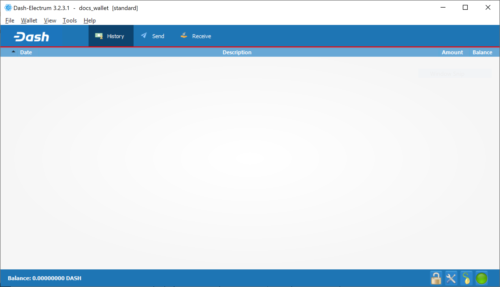

.. _dash-electrum-wallet:

Dash Electrum Wallet
====================

Dash Electrum is a light wallet which uses powerful external servers to
index the blockchain, while still securing the keys on your personal
computer. Transactions are verified on the Dash blockchain using a
technique called Secure Payment Verification (SPV), which only requires
the block headers and not the full block. This means that wallet startup
is almost instant, while still keeping your funds secure and mobile.
Dash Electrum also supports advanced InstantSend, CoinJoin and
masternode features.

Dash Electrum is a fork of the Electrum wallet for Bitcoin. While this
documentation focuses on using Dash Electrum, full documentation of all
Bitcoin Electrum features (mostly identical in Dash Electrum) is
available at the `official documentation site
<https://docs.electrum.org>`_.

.. toctree::
   :includehidden:
   :maxdepth: 1

   installation.rst
   send-receive.rst
   security.rst
   faq.rst
   advanced.rst

   Dash Electrum Wallet