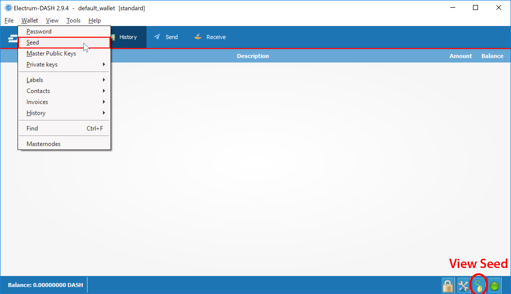
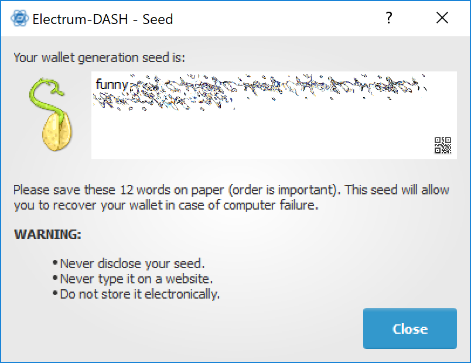
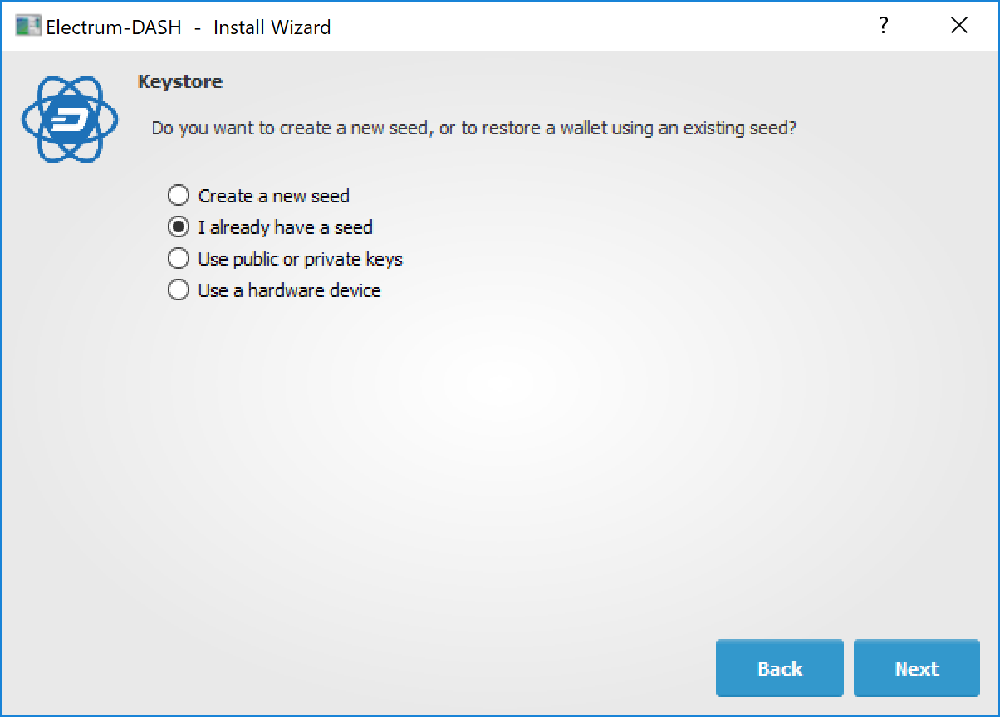
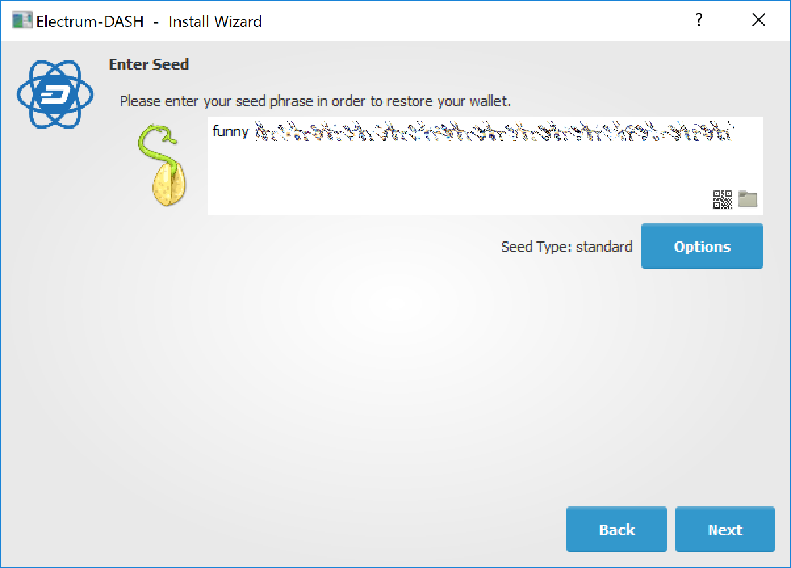
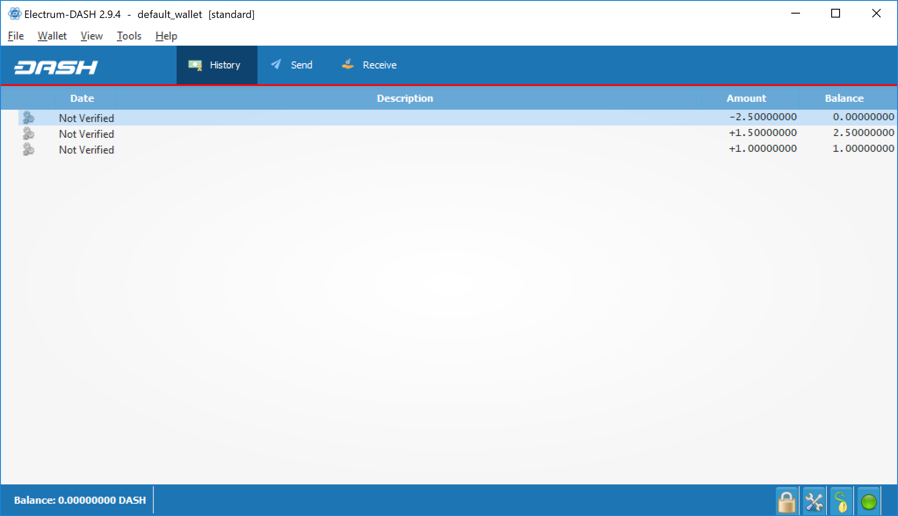

.. meta::
   :description: Security, backup and safety when using the Dash Electrum wallet
   :keywords: dash, wallet, electrum, safety, password, backup, security, restore

.. _electrum-security:

Wallet security
===============

Change password
---------------

To change the wallet's password, select the **Wallet > Password** option
from the main menu, or click on the lock icon in the lower right of the
main window. Enter and confirm a new secure password. Should you forget
your wallets' password, all is not lost. Your wallet can be restored in
its entirety using the backup procedure described here.

.. _electrum-backup:

Backup
------

In Dash Electrum, a seed is a complete backup of all addresses and
transactions. Access your wallet's seed through the seed icon in the
lower right of the main screen, or the **Wallet > Seed** main menu
option. When prompted, enter the secure password you chose when setting
up the Dash Electrum wallet.

   Displaying the wallet recovery seed in Dash Electrum

Hand-copy the twelve words found in the box to a piece of paper and
store it in a safe location. Remember, anyone who finds your seed can
spend all of the funds in your wallet.

   Viewing the recovery seed

Alternatively, a backup file can be saved using the **File > Save Copy**
main menu option. This file stores the wallet's encrypted seed along
with any imported addresses. Restoring this backup will require the
wallet password. 

Restore
-------

The only thing needed to recover a Dash Electrum wallet on another
computer is its seed. You can test wallet recovery with your current
installation of Dash Electrum by selecting the **File > New/Restore**
menu item. A dialog will appear asking you to name your new wallet.
Enter a name, select **Standard wallet** as the wallet type and then
choose **I already have a seed**.

   Restoring a wallet from an existing seed

Next, copy the twelve word seed into the text field.

   Entering the recovery seed

If your seed was entered correctly, Dash Electrum gives you the option
to add a password for your wallet. After restoring your wallet, Dash
Electrum will list any existing transactions from this wallet. This
process may take a few minutes, and the transactions may appear as **Not
Verified**. This problem disappears after restarting the program.

   Unverified transactions after recovery

To restore a wallet file without using the recovery seed, copy the file
to the application data folder according to your operating system:

- **Linux:** Open Files, select **Go > Go to folder**, copy the path
  ``~/.electrum-dash`` and paste it into the dialog box.

- **macOS:** Open Finder, select **Go > Go to Folder**, copy the path
  ``~/.electrum-dash`` and paste it into the dialog box.

- **Windows:** Open Explorer, copy the path ``%APPDATA%\Electrum-DASH``
  and paste it in to the address bar.
