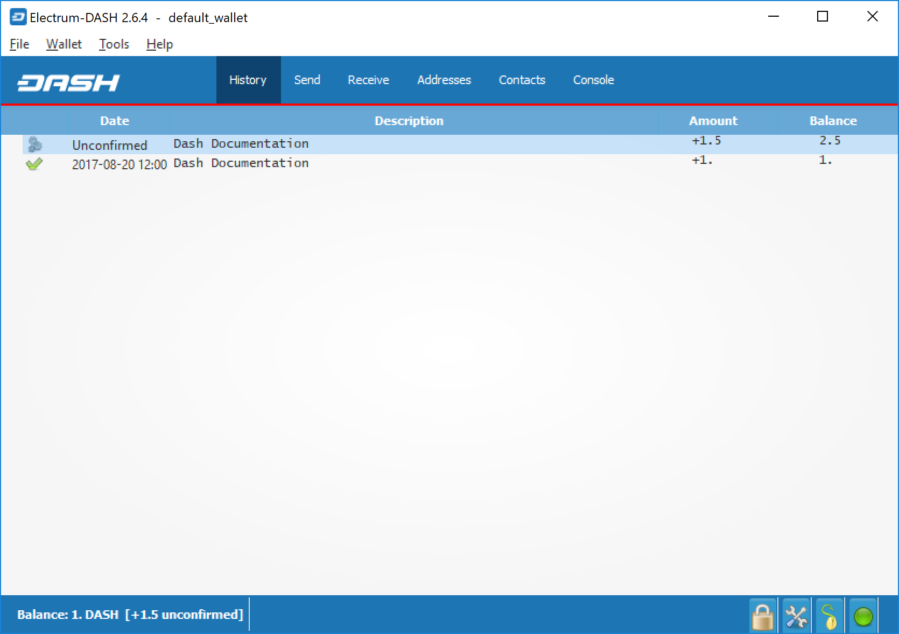

.. meta::
   :description: Guide to sending and receiving Dash using the Dash Electrum wallet
   :keywords: dash, wallet, electrum, send, receive, transaction

.. _electrum-send-receive:

=====================
Sending and receiving
=====================

You may own Dash stored in another software wallet, or on an exchange
such as Bittrex or Kraken, or simply want to send or receive funds as a
wage or business transaction. Funds can be transferred between these
source and the Electrum wallet using Dash addresses. Your wallet
contains multiple addresses, and will generate new addresses as
necessary. Since the Dash blockchain is transparent to the public, it is
considered best practice to use a new address for each transaction in
order to maintain your privacy.

Sending
=======

Click the **Send** tab to make a payment. Enter the destination address
in the **Pay to** field, either manually or by pasting from the
clipboard. Optionally enter a **Description** for to appear in your
transaction history, followed by the **Amount** to be sent. The total
amount of the transaction is the sum of the sent amount and transaction
fee, which is calculated automatically. Dash Electrum issues a warning
if the total transaction amount exceeds the wallet balance.

   Transaction ready to send in Dash Electrum wallet

The wallet will request your password, then broadcast the transaction to
the network and display a confirmation dialog with your transaction ID.

   Password prompt and transaction confirmation in Dash Electrum wallet

Receiving
=========

You can view your receiving addresses by clicking the **Receive** tab.
Double-click the **Receiving address**, then copy it to the clipboard by
clicking the Copy to clipboard icon. If you intend to use the address
repeatedly, you can also enter a description click Save to store the
address in the Requests list. Clicking an address in the list will
display the stored information in the top area, together with a QR code
containing the same information.

   Transaction ready to send in Dash Electrum wallet

Enter this address in the software sending the funds, send it to the
person transferring funds to you or scan it directly from your mobile
wallet. Once the transaction is complete, the balance will appear in the
lower left corner of your wallet, and the indicator in the **Requests**
table will change from **Pending** to **Paid**.

   Successfully received payment in Dash Electrum wallet

Once you have used an address, you can either continue using it or click
**New** to generate a new address.

Monitoring transactions
=======================

The **History** tab lists all current and pending transactions. A
transaction to an address in your wallet will appear in the list soon
after it is made. Initially, this transaction will be marked as
**Unconfirmed**, followed by a clock indicator on the left. As the Dash
network processes the transaction, the status will update in the
transaction history list. The network confirms transactions with a new
block roughly every 2.5 minutes, and a transaction is considered
confirmed (and therefore spendable) after six confirmations. These
processed transactions are denoted with a green checkmark and the
timestamp at which the transaction was made.

   Dash Electrum wallet History tab immediately after receiving a
   transaction and after confirmation is complete

To view additional transaction details, right click a transaction on the
**History** tab and select **Details** from the context menu. You can
also use this menu to copy the transaction ID to the clipboard (this can
be used as proof that a given transaction occurred), edit the
transaction description for your records or view the transaction on an
external block explorer.

   Transaction details in Dash Electrum wallet
