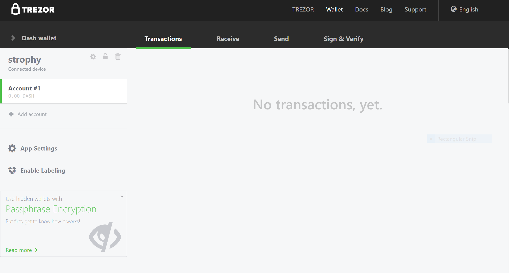
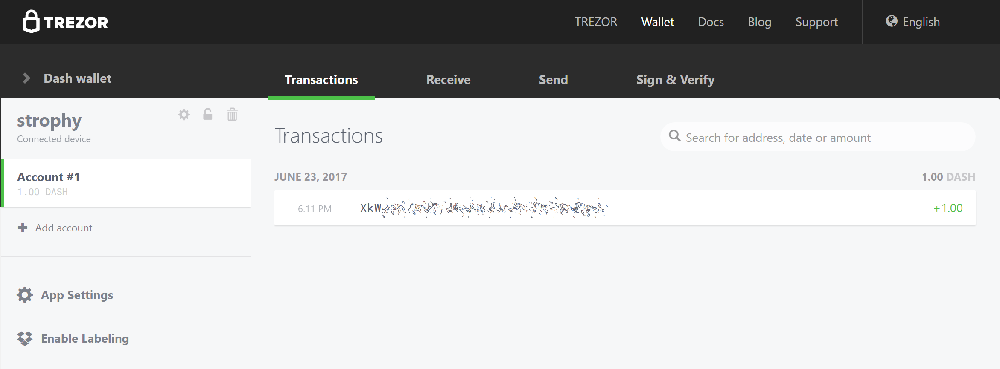
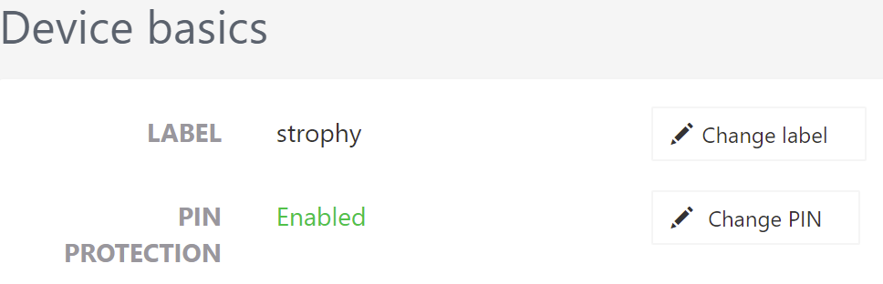
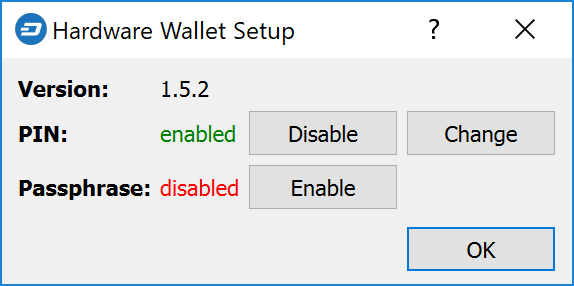
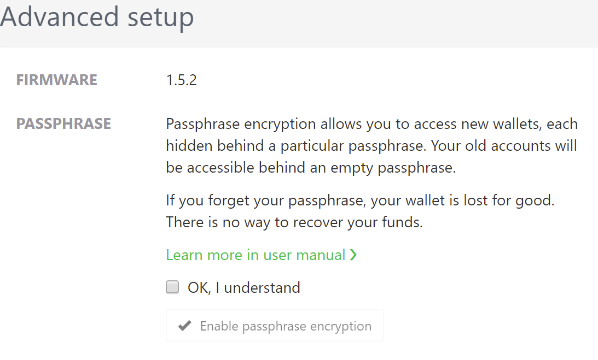
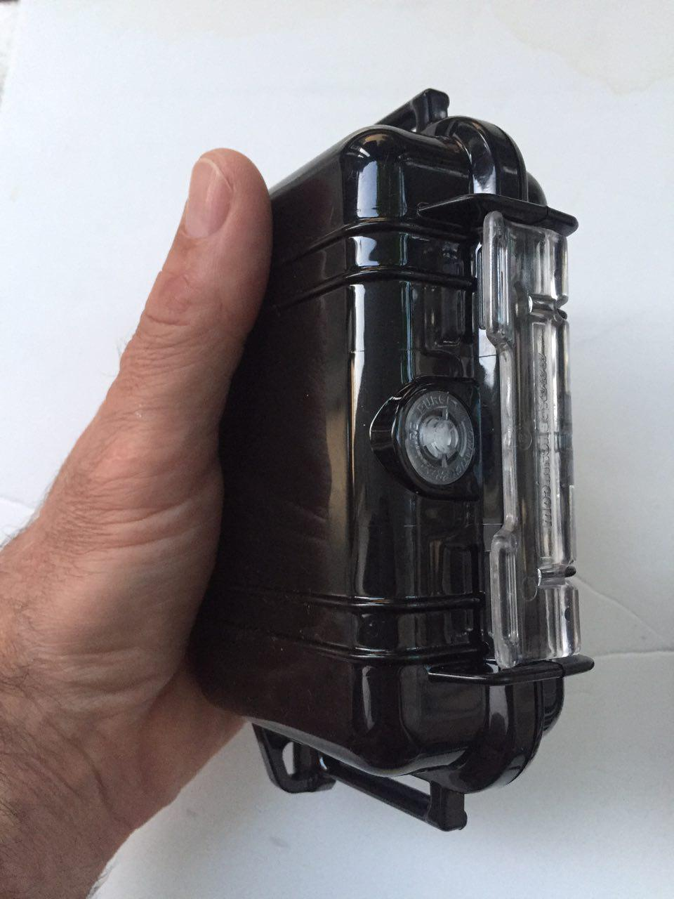
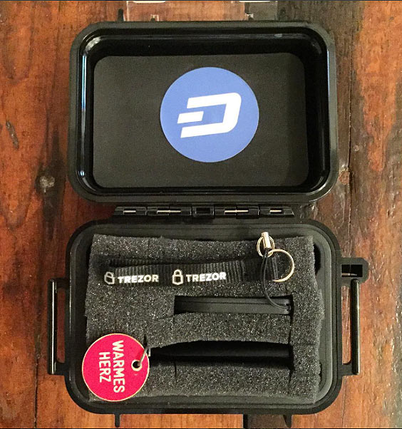

.. meta::
   :description: How to use Dash cryptocurrency with hardware wallets
   :keywords: dash, hardware, wallet, ledger, keepkey, trezor, secure, private key

.. _dash-hardware-wallet:

Introduction
============

Hardware wallets offer you the security of storing your keys in secure
device while still allowing you to make simple transactions through a
web interface. Three major manufacturers of hardware wallets currently
exist, with Dash supported on all of them.

.. _hardware-trezor:

Trezor
======

Developed by Czech startup `SatoshiLabs <https://satoshilabs.com>`_, the
$99 device is essentially a USB dongle designed to add an extra
authentication layer to all outbound bitcoin transactions. Trezor has
supported Dash since January 2017 with the release of firmware version
1.4.2.

By virtue of its design, Trezor can be used to sign transactions on
'unsafe' computers and is impervious to keyloggers and many other
vectors of attack, so even if your host PC is compromised, the attacker
has no way of getting your private key. That's also where the device
gets its name, as 'trezor' translates into 'vault' in most Slavic
languages, including Czech. A kind of 'vault' for your private bitcoin
key, Trezor claims to use a number of clever tricks to maintain security
even on compromised and unsafe machines.

.. attention::
  Only the `Model One <https://trezor.io/trezor-model-one>`_ and
  `Model T <https://trezor.io/trezor-model-t>`_ support Dash.
  The Trezor Safe 3 does not support Dash.

- Site: https://trezor.io
- Review: https://dashnews.org/trezor-hardware-wallet-review/
- Shop: https://shop.trezor.io
- Wallet: https://trezor.io/trezor-suite

It is also possible to operate a Dash masternode using your Trezor. See
here for details.

Getting Started
---------------

Once you have bought your Trezor from https://shop.trezor.io or an
`authorized reseller <https://trezor.io/resellers/>`_, you will need a
wallet to use it with. Trezor supports the following Dash wallets:

- `Trezor Wallet <https://wallet.trezor.io>`_ (`documentation
  <https://doc.satoshilabs.com/trezor-apps/trezorwallet.html>`__)
- `Dash Electrum Wallet <https://electrum.dash.org>`__
  (:ref:`documentation <dash-electrum-wallet>`)
- `Dash Masternode Tool <https://github.com/Bertrand256/dash-masternode-
  tool>`_ (`documentation <https://github.com/Bertrand256/dash-
  masternode-tool/blob/master/README.md>`__)

This documentation describes how to get started using the official
Trezor web wallet at `https://wallet.trezor.io
<https://wallet.trezor.io>`__. Always confirm the URL is correct and SSL
encryption is enabled when working with the Trezor Wallet. Follow these
steps when setting up your Trezor for the first time:

#. Inspect the packaging for tampering. There should be two seals and
   the flaps should be glued shut. It should be impossible to remove the
   device without totally destroying the packaging.

#. Go to https://trezor.io/start/ and watch the video to introduce the
   concepts of a shifting PIN layout and recovery seed.

#. Go to https://wallet.trezor.io/ to begin the setup process.

#. If not already installed, install the Trezor Bridge application from
   https://wallet.trezor.io/#/bridge

#. Connect the Trezor to your computer when prompted.

#. If this is the first time you connect your Trezor, you will be
   prompted to install firmware. Click the **Install** button, wait for
   the download and confirm on the device.

#. When complete, the device will display a fingerprint. Verify that
   this matches the fingerprint shown on the screen. Note that this is
   hexadecimal and therefore not case-sensitive.

#. After verification is complete, disconnect and reconnect your device.
   Enter a device label on the screen that appears.

#. Enter and confirm a PIN by clicking on the squares according to the
   mapping shown on the device.

#. Your Trezor device will now display a sequence of 24 words on the
   screen. This is your recovery seed. Write the words down in the order
   they appear on the recovery card. Never store your recovery seed in
   any digital format, including photos or text.

#. Verify the seed against what you have written down and store it in a
   safe place.

#. You will be asked to enter your PIN again.

#. The Trezor Wallet will appear with a message that your device is
   ready for use. Your device name will appear on the device.

#. Switch to the Dash wallet using the menu at the top left. You can now
   use your Trezor to send and receive Dash.

   Trezor Web Wallet for Dash ready for first use

Receiving Dash
--------------

We will now create a Dash receiving address and attempt to receive 1.0
DASH.

1. In the Trezor Dash wallet, click **Account #1**, then click Receive. 
2. A Dash address will appear. Click **Show full address** to verify the
   address on the Trezor device.

  .. image:: img/trezor-address.jpg
     :width: 100px

3. Send 1 DASH to this address using an exchange or another wallet.
4. Once the transaction is confirmed, it will appear on the
   **Transactions** tab of your Trezor Wallet.

   Trezor Web Wallet after receiving Dash

Sending Dash
------------

We will now send the Dash (minus transaction costs) to an external
address.

1. In the Trezor Dash wallet, click **Account #1**, then click **Send**.
2. Enter the Dash address and amount in the fields.

  .. image:: img/trezor-send.png
     :width: 400px

3. Enter your PIN.
4. Confirm the address on the device, then confirm the action.

  .. image:: img/trezor-confirm.jpg
     :width: 100px

5. The transaction will be transmitted to the network and the recipient
   receives the funds.

.. figure:: img/trezor-balance.png
   :width: 400px

   Trezor Web Wallet after sending Dash

Advanced Functions
------------------

Changing the PIN/Passphrase
^^^^^^^^^^^^^^^^^^^^^^^^^^^

Your PIN is your primary form of security when using your hardware
wallet. It is considered secure because the layout of the PIN keypad
changes each time you use it. If you suspect your PIN has been
compromised, change it using the following instructions. For extra
security, or if you believe you may be subjected to duress at some point
in the future, you can add a passphrase to reveal further wallets which
only appear when you enter your passphrase. Since the passphrase acts as
a cryptographic salt, there is no "correct" passphrase - a different
wallet will be displayed for each passphrase you enter. Be absolutely
sure you understand passphrases before using them. For more information,
see `here <https://blog.trezor.io/passphrase-the-ultimate-protection-for-your-accounts-3a311990925b>`_.

Changing your PIN
"""""""""""""""""

You can change your Trezor PIN from both the `Trezor wallet
<https://wallet.trezor.io>`_ and `DMT <https://github.com/Bertrand256
/dash-masternode-tool/releases>`_.

**From Trezor:** Go to https://wallet.trezor.io and click the cog icon
next to your username. Then click **Change PIN**. You will need to
confirm you want to change your PIN on the hardware device, then enter
your existing PIN and the new PIN twice.

**From DMT:** Open DMT and click **Tools > Hardware Wallet
PIN/Passphrase configuration**. The following window will appear. Click
**Change**. You will need to confirm you want to change your PIN on the
hardware device, then enter your existing PIN and the new PIN twice.

Adding a passphrase
"""""""""""""""""""

You can add a passphrase to your Trezor from both the Trezor wallet and
DMT. Before you add a passphrase, you should be fully aware of how it
functions as a "25th word" to your seed, and the risks of forgetting
your passphrase. Note that you do not need to enter a passphrase - blank
is perfectly acceptable and will reveal your normal wallet.

**From Trezor:** Click **Advanced**, confirm you understand the risks
and click **Enable passphrase encryption**. This enables a prompt to
enter a passphrase each time you use your Trezor.

**From DMT:** Open DMT and click **Tools > Hardware Wallet
PIN/Passphrase configuration**. The following window will appear. Click
**Enable**. This enables a prompt to enter a passphrase each time you
use your Trezor.

Changing the Homescreen
^^^^^^^^^^^^^^^^^^^^^^^

Your Trezor allows you to change the homescreen image from the default
Trezor logo. A range of existing images can be selected, you can
generate one yourself using the `Trezor Homescreen Editor
<https://trezor.github.io/homescreen-editor/>`_, or you can create and
upload your own 128x64px black and white image. To change your
homescreen image:

#. Go to https://wallet.trezor.io and open your wallet
#. Click the small cog icon next to your device name
#. Click the **Homescreen** tab
#. Select the new homescreen, then click the **Set as homescreen** 
   button at the top
#. Confirm the change on the Trezor device

A few sample images are available for Dash:

.. image:: img/trezor-home-2.png
   :width: 128px

.. image:: img/trezor-home-3.png
   :width: 128px

Storage Suggestions
^^^^^^^^^^^^^^^^^^^

While losing a Trezor is not a security threat (unless someone knows
your PIN and/or passphrase), it is a moderately expensive device that
can be damaged by pressure or water, for example. For this reason, Dash
community member tungfa has shared photos of a custom-made Trezor case.
The following materials are required:

- `Pelican Case 1010 Micro Case <https://www.pelican.com/us/en/product/cases/micro/1010>`_
- Foam
- Trezor + Cable
- USB Stick (for wallet.dat files + blockchains of all portfolios)
- Notepad

.. image:: img/trezor-parts.jpg
   :width: 400px

KeepKey
=======

The $129 KeepKey hardware wallet features a large screen and 100% open
source firmware to guarantee the security of your private keys. KeepKey
has supported Dash since firmware version 4.2.10, released on March 28,
2017, and added support for InstantSend in firmware version 5.7.2,
released on September 5, 2018. Follow these instructions to begin using
Dash on your KeepKey device.

- Site: https://shapeshift.com/keepkey
- Review: https://coincentral.com/keepkey-wallet-review/
- Shop: https://keepkey.myshopify.com/
- Product video: https://vimeo.com/289712840

It is also possible to operate a Dash masternode using your KeepKey. See
here for details.

Ledger
======

Founded in 2014, French startup `Ledger <https://www.ledger.com>`_
markets enterprise and consumer blockchain security solutions, including
the €58 `Ledger Nano S <https://shop.ledger.com/products/ledger-nano-s>`_
and upcoming `Ledger Blue <https://shop.ledger.com/products/ledger-blue>`_. 
Ledger Nano S has supported Dash since November 2016 and firmware
version 1.2. Follow `these instructions 
<https://support.ledger.com/hc/en-us/articles/115005308185-Dash-DASH->`_
to add Dash support to the device.

- Site: https://www.ledger.com
- Review: https://dashnews.org/ledger-nano-s-review/
- Shop: https://shop.ledger.com/collections/all-products

Product video:

.. raw:: html

    

        <iframe src="https://www.youtube-nocookie.com/embed/MFLuRLcu61s?modestbranding=1&rel=0" frameborder="0" allowfullscreen style="position: absolute; top: 0; left: 0; width: 100%; height: 100%;"></iframe>
    

It is also possible to operate a Dash masternode using your Ledger. See
here for details.
