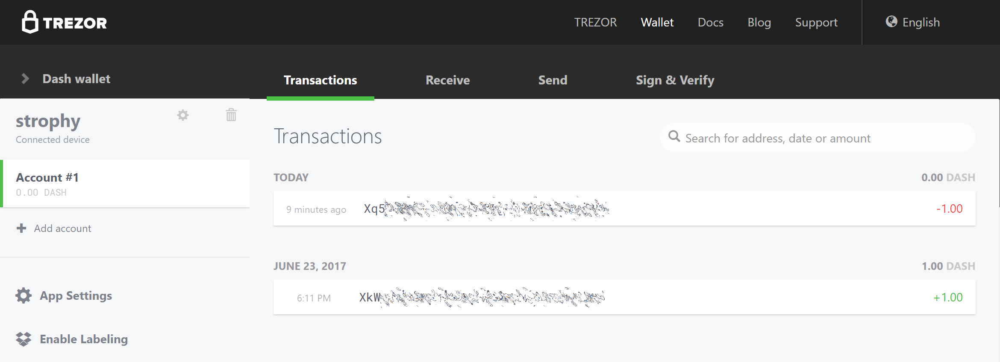

.. _hardware-wallets:

Hardware Wallets
================

A hardware wallet is a type of device which stores private keys for a
blockchain in a secure hardware device, instead of in a database file
such as wallet.dat used with common software wallets. This offers major
security advantages over software wallets, as well as practical benefits
over paper wallets. To date, there is no verifiable evidence of hardware
wallets being compromised by viruses, and they are also immune to
keylogger attacks that could be used to steal passwords to unlock the
private keys used with software wallets.

Hardware wallets function by storing your private keys in a protected
area of a microcontroller. It is impossible for the private key to leave
the device in plain text - only the signed output of the cryptographic
hash is ever transmitted to the device interacting with the blockchain,
such as your computer or smartphone. Most hardware wallets feature a
screen which allows you to independently confirm the address you are
sending to is correct.

This section lists the most common commercial hardware wallets supporting
Dash, although some other enthusiast projects may also be available.

.. toctree::
   :maxdepth: 1

   hardware.rst

   Trezor Web Wallet

.. _third-party-wallets:
