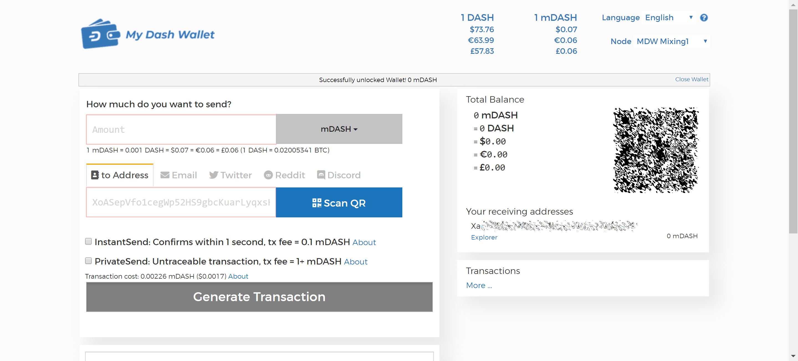

.. _web-wallets:

Web Wallets
===========

Web wallets are services which keep a Dash balance for you, while
maintaining control of the private keys on your behalf. Any Dash stored
on :ref:`exchanges <exchanges>` falls under this category, but there are
also some services able to store Dash for you through simple
Google/Facebook login systems. Be extremely careful with web storage, as
your Dash is only as secure as the reputation of the company storing it
for you. A particular exception is MyDashWallet.org, which provides a
secure web interface to the Dash blockchain while leaving you with full
control of your private keys.

.. toctree::
   :maxdepth: 1

   web.rst

   My Dash Wallet
