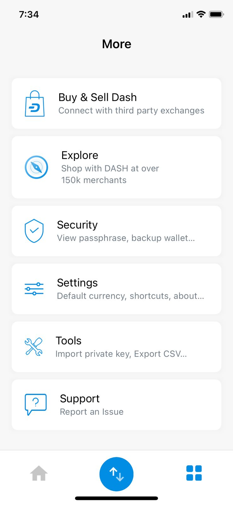
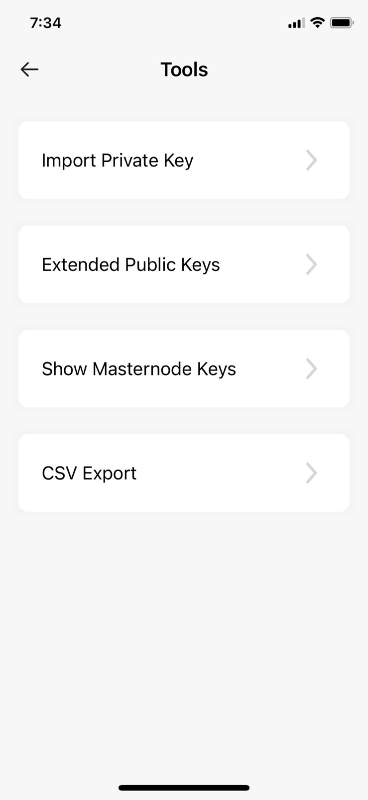
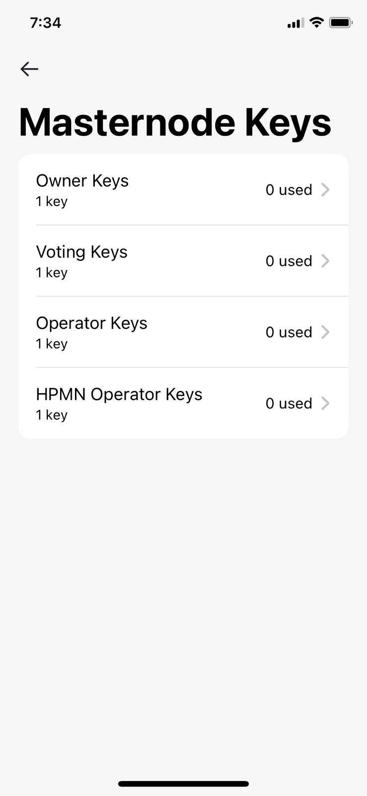
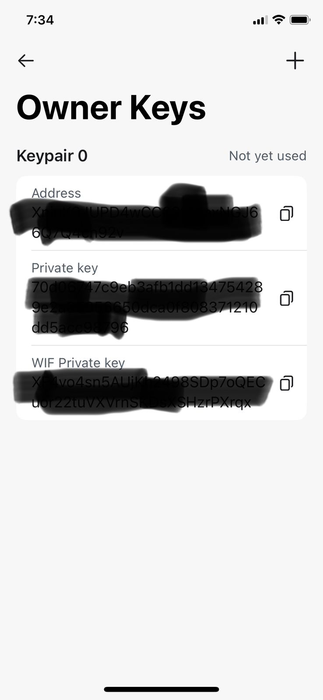
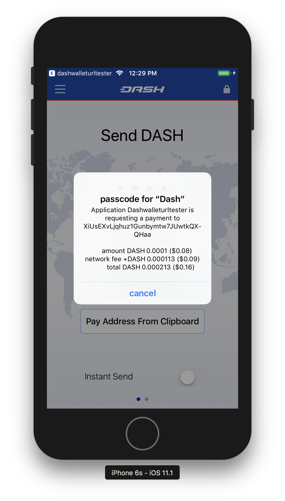

.. meta::
   :description: URL scheme, master public key and requesting payment in Dash on your iOS device
   :keywords: dash, mobile, wallet, ios, send, receive, payment, url, public key

.. _dash-ios-advanced-functions:

==================
Advanced functions
==================

Masternode keys
===============

Certain masternode keys may be generated and stored in Dash Wallet. To access
these keys, tap the **Menu button** and select **Tools**. Tap **Masternode
Keys** and enter your PIN to open the Masternode Keys screen. From here, tap on
any of the listed key types to view existing keys or generate new ones. The
screen will show all used keys and the first unused one. To generate additional
keys, tap the **+** button.

*Viewing and generating masternode keys*

URL Scheme
==========

iOS allows apps to communicate with one another through URL schemes. The
Dash Wallet for iOS implements the dashwallet:// scheme, allowing you to
call the wallet to complete a transaction denominated in Dash. This page
documents the methods available using the URL scheme.

Payment
-------

Payment request URL format::

  dashwallet://pay=<address>&amount=<amount>&sender=<sender>

Notes:

- ``sender`` is both your callback URL and the name of the app that you
  show to the user. This is to prevent 3rd party apps from phishing.

The user will see something similar to this:

   Payment request in iOS

If the user enters the correct passcode, then the transaction is sent
and the user is returned to the sender app following the callback URL.

Callback URL format::

  <sender>://callback=payack&address=<example:XiUsEXvLjqhuz1Gunbymtw7JUwtkQXQHaa>&txid=<example:09855ac1c57725d8be2c03b53f72d1cb00ecb7b927bc9e7f5aed95cb3a985d76>

Master public key
-----------------

Master public key request format::

  dashwallet://request=masterPublicKey&account=0&sender=<sender>

Note: account is optional and corresponds to BIP32/BIP44 account, most
of the time this should be 0. If account is not specified, we use
account 0. This will send back both the extended public key at
``44’/5’/<account>’`` and ``<account>’``

Callback::

  <sender>://callback=masterPublicKey&masterPublicKeyBIP32=<example:xpub68GSYNiJZ7k1beEHGmkMUjPsawFvhM7adhbXgnaY1zj5iucUgKPJNDh5iCB8KV2A9FFAGKcGZp5JtQ1XNmT7j2ErRnf8eb4Mt4wjLG6uRcN>&masterPublicKeyBIP44=<example:xpub6DTuSViCnkd1jcgoiQLcghtTAAntBX4zWhfwNMSsmcD94JATNaWZ1tC4NEv6bxcD1YA4474S2BzCDsBA97sM52jiJcmFPBiXcH9JzZSLQJm>&account=0&source=dashwallet

Get address for payment
-----------------------

``dashwallet://request=address&sender=<sender>``

Callback::

  <sender>://callback=address&address=<example:XjkMY3GiK5aHwbpg9Uaw7QCPk3QE63Nh5i>&source=dashwallet
